<!--
Copyright 2018 Province of British Columbia
 
Licensed under the Apache License, Version 2.0 (the "License");
you may not use this file except in compliance with the License.
You may obtain a copy of the License at
 
http://www.apache.org/licenses/LICENSE-2.0
 
Unless required by applicable law or agreed to in writing, software distributed under the License is distributed on an "AS IS" BASIS,
WITHOUT WARRANTIES OR CONDITIONS OF ANY KIND, either express or implied.
See the License for the specific language governing permissions and limitations under the License.-->


# Introduction

Accurate estimates of timber volume projected through time and across landscapes are needed to make effective strategic forest management decisions. These estimates, and estimates on the state of many other ecological processes of interest to decision makers (e.g., carbon capture, wildlife habitat) rely on accurate projections of forest structure and timber volume from models. A common concern of decision makers is the level of uncertainty behind model projections that occur both over time and across large landscapes (i.e., stand yield model + forest inventory).  For example, the Chief Forester of British Columbia (BC) is a statutory decision maker responsible for establishing the allowable annual cut (AAC) in timber supply units across the province. This desicision relies heavily on information provided by forest inventory data and stand yield models. Not accounting for uncertainty in AAC decisions can potentially result in decreased confidence in AAC targets.   

There are many sources of uncertainty in timber volume projections and these sources may propagate through time in complex ways. Recently, Robinson et al. (2016) recommended a simple way to measure this uncertainty. Their approach was to calibrate model projections against observed timber volumes measured from scaling and cruising operations following harvesting. In particular, the value of the Robinson et al. (2016) approach is two fold: i.) simulated future timber volumes can be adjusted using this calibration, and ii.) uncertainty of timber volume projections can be estimated by calculating error statistics. Robinson et al. (2016) modelled not only the mean response of the relationship between the projected volume and the observed scale volume but also the variance (sigma). These two statistics specify the distributional parameters (mean and scale) of the prediction uncertainty. Using these distributional parameters, the distribution of possible yields for an individual harvest unit can be reconstructed and sampled. In the case of AAC targets, the harvest volume distributions for each harvest unit can then be summed to arrive at a distribution for the total volume harvested. This provides an estimate of the variance (i.e., prediction interval) around the total volume estimate or the AAC. The distributional parameters can also be conditional on stand characteristics which would help explain how uncertainty in yield projection can change between harvest units. Understanding which stand characteristics provide greater or lesser uncertainty in yields can be invaluable for strategic decision makers in priotizing where and when to harvest to minimize uncertainty.    

An important assumption of Robinson et al.'s (2016) approach is that the individual harvest units need to be independant of one another, so that error estimates are not biased when summing the error of individual distributions. While this assumption was not formally tested by the authors, they highlighted that if individual harvest units were positively correlated then they would jointly contribute more to the uncertainty than their summation would suggest, and conversely contribute less to uncertainty if they were negatively correlated. In short, the spatial correlation of volume esitmates from timber units needs to be accounted for to accurately represent uncertainty in estimates across large landscapes.

Robinson et al.'s (2016) approach has not been applied in the province of BC because of challenges with spatially tracking observed scaled volumes. Scaled volume is tracked by the harvest billing system (HBS) which focuses on measuring harvest volumes for accounting of provincal revenue. This tracking is accomplished at a spatial unit known as a timber mark. The timber mark is a unique identifer stamped or marked on the end of each harvested log to associate the log with the specific authority to harvest and move timber. Timber marks are typically assigned to multiple harvested units that may be not be spatially contiguous nor contain a single harvest date. Thus, linking HBS and forest inventory data has been difficult due to the complicated spatial and temporal boundaries of timber marks. In particular, estimating the net area harvested (i.e., netting out roads, wildlife tree patches, etc.) and its spatial boundary can be difficult to determine for historical cutblocks.

Here I develop a calibration model for BC that can be used to provide valuable information about timber projection uncertainty. First, I develop an approach to link timber mark boundaries from the HBS to harvested forest stands, I then build on Robinson et al.'s (2016) approach by developing a calibration model that accounts for spatial correlation of timber volume estimates between harvested forest stands. I then further build on this approach by relating uncertainty estimates to stand characetirics, and highlight what stand types have greater uncertainty in their timber volume yields. The calibration model developed here will support adaptive forest management in BC, by identifying factors leading to greater or lesser uncertainty around strategic decisions. For example, such a model may inform a more robust AAC decision, by helping the Cheif Forster understand situations where uncertainty in yields could lead to over or under estimates in AAC. The proposed calibration model will also be used in the caribou and landuse simulator (CLUS) model to provide an estimate of volume yield uncertainty in the quantification of impacts from caribou conservation activities on harvest flows. 

# Methods


### Linking Timber Mark Boundaries to Forest Stands

Linking the timber mark boundaries with the VRI (needed to link to a growth and yield model) involved the following: (see [code](https://github.com/bcgov/clus/blob/master/SQL/develop_vri2011table.sql))

1. Subset and estimate the spatial boundaries of the timber marks

The spatial boundaries of the timber mark were estimated using the compilation of two spatial data sets: i) [forest tenure cutblock polygons](https://catalogue.data.gov.bc.ca/dataset/forest-tenure-cutblock-polygons-fta-4-0) (aka. ftn_c_b_pl_polygon) and ii) [consolidated cutblock polygons](https://catalogue.data.gov.bc.ca/dataset/harvested-areas-of-bc-consolidated-cutblocks-) (a.k.a cns_cut_bl_polygon). While the forest tenure polygons provided the spatial boundary of the timber mark, these boundaries include retention areas which can be quite large. Thus, the consolidate cutblock polygons dataset was used to remove these non-harvested areas within a timber mark area.

Using the forest tenure cutblock polygons, all timber marks comprised of harvest units that were spatially contiguous and had disturbance start dates between 2012-01-01 and 2016-12-31 were selected. This ensured timber marks would be roughly at the scale of a harvest unit or cutblock and would temporally link to the forest inventory. Further, timber marks with scaled dead wood were removed since the naive projections do not include standing dead timber. Lastly, timber marks were removed if they did not contain geometries reported by RESULTS (the most accurate form of reporting cutblock information). This ensured a more accurate net spatial description of the timber mark boundary (i.e., retention patches were removed). Despite the accuracy of the RESULTS, there remain a number of issues with identifying non-harvest areas in the consolidated cutblock polygons. Thus, timber marks were removed when the estimated timber mark area was not within $\pm$ 20% of the planned net area.This subset of the forest tenure cutblock polygons was then joined with consolidated cutblock polygons to provide a spatial boundary that exluded non harvest areas. 

2. Intersect the timber mark spatial boundaries with the VRI

The resulting spatial boundaries that excluded non-harvested areas were then spatialy intersected with the 2011 VRI to provide the necessary forest attribute information require to link to the growth and yield model. Only the dominant layer (layer rank 1) of the forest inventory was used, thereby simplifying the growth and yield proejction. As a result of this intersection, 1264 of the timber marks had a portion of their total area that failed to provide the neccessary forest inventory information (i.e., areas that lack the publically available forest inventory such as Tree Farm Licenses). 

The following is a histogram of the percentage of the total timber mark area missing information:


```
## type is 0
```

```
## Warning: attribute variables are assumed to be spatially constant
## throughout all geometries
```

```
## [1] TRUE
```

```
## [1] TRUE
```

```
## [1] 0
```

```
## [1] TRUE
```

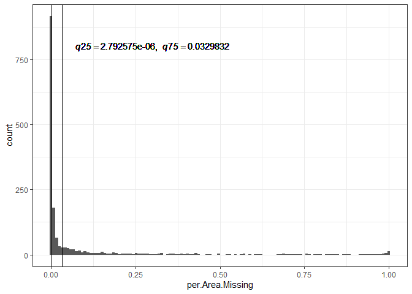

This histogram shows that 75% of timber marks were missing forest inventory attribution for only 1.4% of their total area. After visually checking, two issues arose: i) the spatial boundaries of these timber marks extend into non-forested area as reported by the VRI; and ii) there wasn't enough information to parameterize the growth and yield model (outside the domain of the inputs, e.g., recently disturbed). In the case of the non-forested areas, these could be small spatial errors in the VRI and were thus important sources of uncertainty. However, from a practical view, these relatively small areas would contribute little to the total projected volume estimate. Thus, timber marks with greater than 3 percent of their total area containing inadequate forest inventory information were removed from the analysis.


```
## Reading layer `centroid_timber_mkrs2' from data source `C:\Users\klochhea\clus\R\Params\centroid_timber_mkrs2.shp' using driver `ESRI Shapefile'
## Simple feature collection with 828 features and 25 fields
## geometry type:  POINT
## dimension:      XY
## bbox:           xmin: 595907.3 ymin: 391311.3 xmax: 1833585 ymax: 1385545
## epsg (SRID):    NA
## proj4string:    +proj=aea +lat_1=50 +lat_2=58.5 +lat_0=45 +lon_0=-126 +x_0=1000000 +y_0=0 +ellps=GRS80 +units=m +no_defs
```

```
## Loading file from cache...
```

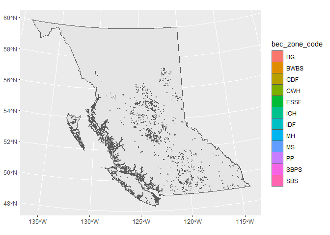


### Growth and yield meta-model

In BC, forested stands from natural orgins are typically projected through time using [Variable Density Yield projection](https://www2.gov.bc.ca/gov/content/industry/forestry/managing-our-forest-resources/forest-inventory/growth-and-yield-modelling/variable-density-yield-projection-vdyp) (VDYP). VDYP is a stand-level empirical growth and yield model that uses VRI attribution as inputs into its sub-models. Using the 2018 vintage of the VRI, each polygon was projected for 350 years using 10 year time steps. The result of this process was a dataset with over 3.5 million yield curves which took 3 days to complete on a intel xeon, 3.5 ghz processor with 64 GB of RAM. Both the input (VRI information) and outputs (yields over time) were uploaded into a PostgreSQL database for further processing. Using the layer 1 rank information (the dominant layer),  yield curve groups (yc_grp) or anlaysis units were constructed using: BEC zone, site index (2 m interval), height class (5 classes as per the VRI) and crown closure class (5 classes as per the VRI). Each yc_grp was then aggregated by area weighting the respective individual polygon level yield curves. The result was a provincial database of composite yield curves that directly links to the VRI through the layer 1 rank attribution described above.

### HBS volumes vs projected meta-model volumes

Each VRI polygon that intersected the timber mark boundary and contained a projected volume was summed to estimate the total projected timber volume for the timber mark. This projected timber volume represented the naive projection commonly used in forest estate modeling.  


```
## 
## Call:
## lm(formula = obs_vol ~ proj_vol, data = calb_data)
## 
## Residuals:
##    Min     1Q Median     3Q    Max 
## -41840  -2111   -925   1896  44645 
## 
## Coefficients:
##              Estimate Std. Error t value Pr(>|t|)    
## (Intercept) 1.279e+03  4.880e+02   2.621   0.0091 ** 
## proj_vol    7.195e-01  1.602e-02  44.917   <2e-16 ***
## ---
## Signif. codes:  0 '***' 0.001 '**' 0.01 '*' 0.05 '.' 0.1 ' ' 1
## 
## Residual standard error: 7640 on 384 degrees of freedom
## Multiple R-squared:  0.8401,	Adjusted R-squared:  0.8397 
## F-statistic:  2017 on 1 and 384 DF,  p-value: < 2.2e-16
```

```
## Warning in predict.lm(model1, data = calb_data, interval = "prediction"): predictions on current data refer to _future_ responses
```

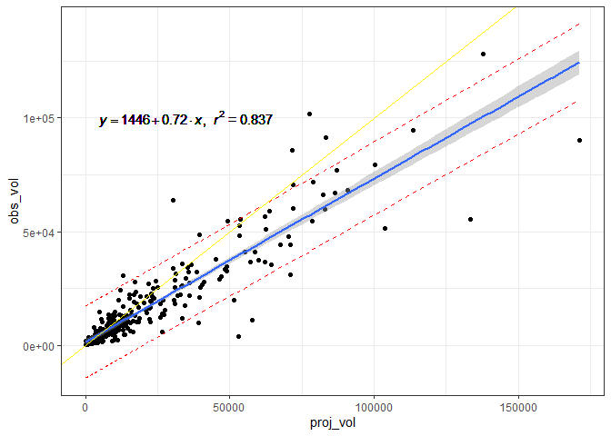

### Modelling assumptions

The following assumptions of the calibration model need to be tested: i) the response is gamma distributed, ii) the model fits the data and iii) the residuals are independant.

From the histogram below the gamma and log normal distributions appear to be candidates distributions to model the response.


```r
#library(fitdistrplus)
#param.1 <- MASS::fitdistr(calb_data4$obs_vol, "normal")
#param.2 <- MASS::fitdistr(calb_data4$obs_vol, "lognormal")
#param.3 <- fitdistr(calb_data4$obs_vol, "gamma", start = list(shape = 1.2, scale = 0.0001), lower = 0.01)

hist(calb_data2$obs_vol, prob = T, ylim = c(0, 0.00007))
curve(dgamma(x, 1.2, 0.0001), add=TRUE, col = 'red')
curve(dnorm(x, 15138, 19838), add=TRUE)
curve(dlnorm(x, 8.79, 1.41), add=TRUE, col = 'blue')
```

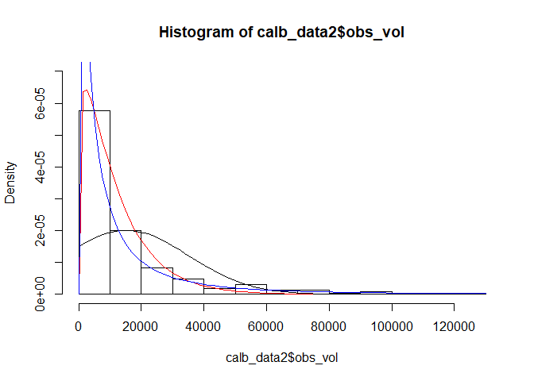

# Results

### Calibration model

In Robinson et al. (2016) a gamma model was used to model both the  mean and  variance of the response distribution. Gamma models are advantageous because they are highly flexible in the positive domain and allow the modeling of heteroskedastic variance. Below we try a few gamma models by incorporating forest attributes as predictors of both the mean and variance. The results suggest a gamma model is better fit over a log normal model. Also, the VRI height and elevation are important predictors of the response variance. However, these models assume independance which needs to be tested.


```r
# get the bec zone that makes up the majority of the timber mark 
pv_timber_mrk<-merge(timbr_mrks, totalArea)
pv_timber_mrk[,wt:=as.numeric(area/totarea)]
pv_timber_mrk2<-pv_timber_mrk[, lapply(.SD, function(x) {wtd.mean (x, wt)}), by =timber_mrk, .SDcols=c("proj_height_1", "site_index", "crown_closure", "proj_age_1", "pcnt_dead")]
setnames(pv_timber_mrk2, "timber_mrk" , "timber_mark" )
calb_data3<-merge(calb_data2, pv_timber_mrk2, by = "timber_mark")
calb_data4<-na.omit(calb_data3)

## Fit and compare some models
test.0 <- gamlss(obs_vol ~ proj_vol,
                 sigma.formula = ~ 1,
                 mu.link = "log",
                 sigma.link = "log",
                 family = GA(),
                 data = calb_data4)
```

```
## GAMLSS-RS iteration 1: Global Deviance = 6575.296 
## GAMLSS-RS iteration 2: Global Deviance = 6575.295
```

```r
test.0 <- gamlss(obs_vol ~ proj_vol,
                 sigma.formula = ~ 1,
                 mu.link = "log",
                 sigma.link = "log",
                 family = LOGNO(),
                 data = calb_data4)
```

```
## GAMLSS-RS iteration 1: Global Deviance = 6619.346 
## GAMLSS-RS iteration 2: Global Deviance = 6619.346
```

```r
test.1 <- gamlss(obs_vol ~ log(proj_vol),
                 sigma.formula = ~ 1,
                 sigma.link = "log",
                 family = GA(),
                 data = calb_data4)
```

```
## GAMLSS-RS iteration 1: Global Deviance = 6202.212 
## GAMLSS-RS iteration 2: Global Deviance = 6202.212
```

```r
test.1 <- gamlss(obs_vol ~ log(proj_vol),
                 sigma.formula = ~ 1,
                 mu.link = "log",
                 sigma.link = "log",
                 family = LOGNO(),
                 data = calb_data4)
```

```
## GAMLSS-RS iteration 1: Global Deviance = 6191.291 
## GAMLSS-RS iteration 2: Global Deviance = 6191.291
```

```r
test.2 <- gamlss(obs_vol ~ log(proj_vol),
                 sigma.formula = ~ proj_vol,
                 sigma.link = "log",
                 family = GA(),
                 data = calb_data4)
```

```
## GAMLSS-RS iteration 1: Global Deviance = 6189.939 
## GAMLSS-RS iteration 2: Global Deviance = 6189.888 
## GAMLSS-RS iteration 3: Global Deviance = 6189.888
```

```r
test.3 <- gamlss(obs_vol ~ log(proj_vol),
                 sigma.formula = ~ log(proj_vol),
                 sigma.link = "log",
                 family = GA(),
                 data = calb_data4)
```

```
## GAMLSS-RS iteration 1: Global Deviance = 6177.096 
## GAMLSS-RS iteration 2: Global Deviance = 6176.263 
## GAMLSS-RS iteration 3: Global Deviance = 6176.263
```

```r
test.4.ga <- gamlss(obs_vol ~ log(proj_vol),
                 sigma.formula = ~ log(proj_vol) + proj_height_1 + elv,
                 sigma.link = "log",
                 family = GA(),
                 data = calb_data4)
```

```
## GAMLSS-RS iteration 1: Global Deviance = 6159.374 
## GAMLSS-RS iteration 2: Global Deviance = 6154.384 
## GAMLSS-RS iteration 3: Global Deviance = 6154.33 
## GAMLSS-RS iteration 4: Global Deviance = 6154.33
```

```r
test.4.ln <- gamlss(obs_vol ~ log(proj_vol),
                 sigma.formula = ~ log(proj_vol) + proj_height_1 + elv,
                 sigma.link = "log",
                 family = LOGNO(),
                 data = calb_data4)
```

```
## GAMLSS-RS iteration 1: Global Deviance = 6167.102 
## GAMLSS-RS iteration 2: Global Deviance = 6165.816 
## GAMLSS-RS iteration 3: Global Deviance = 6165.81 
## GAMLSS-RS iteration 4: Global Deviance = 6165.81
```

```r
LR.test(test.4.ln, test.4.ga)
```

```
##  Likelihood Ratio Test for nested GAMLSS models. 
##  (No check whether the models are nested is performed). 
##  
##        Null model: deviance= 6165.809 with  6 deg. of freedom 
##  Altenative model: deviance= 6154.33 with  6 deg. of freedom 
##  
##  LRT = 11.47978 with 0 deg. of freedom and p-value= 0
```

```r
chosen<-test.4.ga
summary(chosen)
```

```
## ******************************************************************
## Family:  c("GA", "Gamma") 
## 
## Call:  
## gamlss(formula = obs_vol ~ log(proj_vol), sigma.formula = ~log(proj_vol) +  
##     proj_height_1 + elv, family = GA(), data = calb_data4,  
##     sigma.link = "log") 
## 
## Fitting method: RS() 
## 
## ------------------------------------------------------------------
## Mu link function:  log
## Mu Coefficients:
##               Estimate Std. Error t value Pr(>|t|)    
## (Intercept)    0.36896    0.17341   2.128   0.0341 *  
## log(proj_vol)  0.94208    0.01821  51.729   <2e-16 ***
## ---
## Signif. codes:  0 '***' 0.001 '**' 0.01 '*' 0.05 '.' 0.1 ' ' 1
## 
## ------------------------------------------------------------------
## Sigma link function:  log
## Sigma Coefficients:
##                 Estimate Std. Error t value Pr(>|t|)    
## (Intercept)    1.481e+00  3.152e-01   4.700 3.87e-06 ***
## log(proj_vol) -9.359e-02  2.680e-02  -3.492 0.000547 ***
## proj_height_1 -4.046e-02  8.568e-03  -4.722 3.50e-06 ***
## elv           -3.828e-04  2.616e-05 -14.632  < 2e-16 ***
## ---
## Signif. codes:  0 '***' 0.001 '**' 0.01 '*' 0.05 '.' 0.1 ' ' 1
## 
## ------------------------------------------------------------------
## No. of observations in the fit:  326 
## Degrees of Freedom for the fit:  6
##       Residual Deg. of Freedom:  320 
##                       at cycle:  4 
##  
## Global Deviance:     6154.33 
##             AIC:     6166.33 
##             SBC:     6189.051 
## ******************************************************************
```

```r
plot(chosen)
```

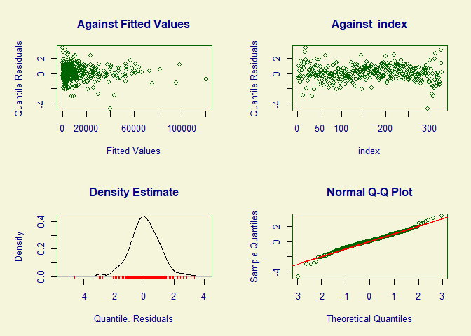

```
## ******************************************************************
## 	      Summary of the Quantile Residuals
##                            mean   =  0.03095719 
##                        variance   =  1.024686 
##                coef. of skewness  =  -0.2270175 
##                coef. of kurtosis  =  4.557427 
## Filliben correlation coefficient  =  0.9914084 
## ******************************************************************
```

### Testing for autocorrelation

An assumption of the uncertainty model is that the errors are independant. This assumption is required in order to sum across many predictions and achieve an unbiased total. Here I test for autocorrelation in the residuals.


```r
ind.1<- predictAll(chosen, newdata = calb_data4)
ind.2<-cbind(calb_data4, ind.1$mu)
ind.2$res<-ind.2$obs_vol - ind.2$V2

#get distances
dists <- as.matrix(dist(cbind(ind.2$X, ind.2$Y)))
dists.inv <- 1/dists 
diag(dists.inv) <- 0
#dists[1:50, 1:50] # check what they look like - units are in metres

#auto.2$res<-auto.2$res+runif(326, 1, 10000)
Moran.I(ind.2$res, dists.inv)
```

```
## $observed
## [1] 0.0231245
## 
## $expected
## [1] -0.003076923
## 
## $sd
## [1] 0.01465897
## 
## $p.value
## [1] 0.07387307
```

```r
#observed is significantly greater than expected  - positively correlated. Thus, jointly contribute more to the uncertainty then their sum would suggest.

xyspatial=SpatialPoints(cbind(ind.2$X,ind.2$Y))
porspatial=data.frame(ind.2$res)
spatialdata=SpatialPointsDataFrame(xyspatial,porspatial)

vario2 <- variogram(ind.2$res~1, spatialdata, cutoff = 3000)
plot(vario2)
```

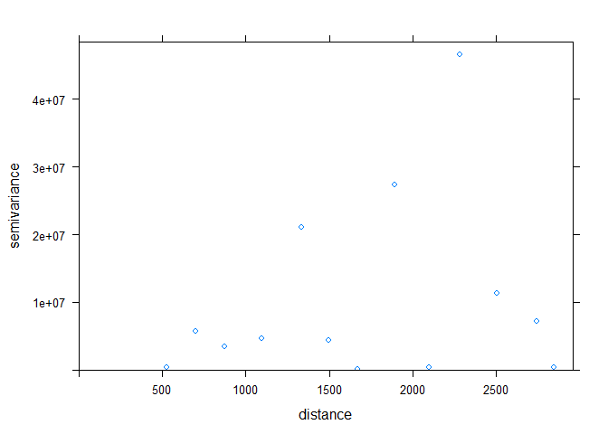<!-- -->

```r
bubble(spatialdata, "ind.2.res", col = c("blue", "orange"), main = "Residuals", xlab = "X-coordinates", 
    ylab = "Y-coordinates")
```

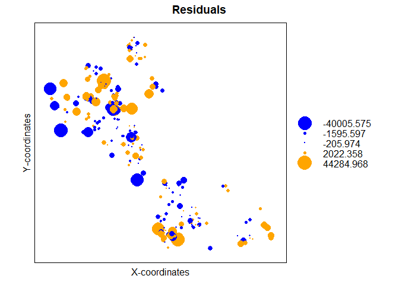<!-- -->

The results from the Moran's I suggest that the residuals are independant (Moran's I = 0.0231, p = 0.0739). After building a variogram there doesn't seem to be a strong spatial effect.  However, the bubble map shows some spatial clustering -namely in the far east corner and around the kamloops area. Also the p value for Moran's I is providing enough evidence against the null hypothesis to warrant a check to see if the model can be further improved by taking into account any spatial autocorrelation.

### Autocorrelated model

To account for the spatial autocorrelation in the model we construct a mixed effect model with on random component. This model specifies the structure of the covariance matrix using a spatial lag between observations. Thus, the off diagonal elements of the variance-covariance matrix will be estimated using a spatial covariance structure that is parameterized from a model assuming independance. The steps to fit this model follow an estimated generalized least squares approach:

1.) Fit a gamma model for the mu and sigma components using fixed effects that assumes i.i.d. covariance structure.

2.) Specify the pattern of the error covariance structure to a spatial lag that assumes a spherical variogram model. Since there is only one group of dependance this random effect is viewed as 'nuisance' and will only be used to get good estimates for the standard errors of the coefficients of the fixed component of the model and the mean of y given values for the x's. Note this is different from predicting a spatially random variable where the random effect is of interest - however, this could not accomplished given the samples used in this study are not well spaced.

3.) Find estimates for the parameters of the covariance matrix. REML is used since the fixed effects part is already estimated and reduces the search to only the covariance parameters.

4.) Re-fit the fixed effects gamma model using the newly parameterized covariance matrix. 

5.) Iterate through 1-4 until convergence criterion has been met

The result of this model is a Moran's I of 0.0229, p = 0.0754, which suggests some of remaining spatial autocorrelation is being accounted. The range of the spherical variogram is 2718 m, with a nugget effect of 0.34. The AIC of this spatial model is smaller (6159.75 versus 6166.3) than the model assuming independance. Thus, it appears the spatial model may be the prefered model.  


```r
calb_data4$dummy<-1
chosen.a <- gamlss(obs_vol ~log(proj_vol) + re(random=~1|dummy, correlation = corSpher(2500, form = ~ X + Y, nugget = T), opt="optim", method = "REML"),
                   sigma.formula = ~ log(proj_vol) + proj_height_1 + elv ,
                   sigma.link = "log",
                   family = GA(), data = calb_data4, control = gamlss.control(c.crit = 0.005), method=CG())
```

```
## GAMLSS-CG iteration 1: Global Deviance = 6460.426 
## GAMLSS-CG iteration 2: Global Deviance = 6276.441 
## GAMLSS-CG iteration 3: Global Deviance = 6185.328 
## GAMLSS-CG iteration 4: Global Deviance = 6158.253 
## GAMLSS-CG iteration 5: Global Deviance = 6154.696 
## GAMLSS-CG iteration 6: Global Deviance = 6154.51 
## GAMLSS-CG iteration 7: Global Deviance = 6154.425 
## GAMLSS-CG iteration 8: Global Deviance = 6154.424
```

```r
summary(chosen.a)
```

```
## ******************************************************************
## Family:  c("GA", "Gamma") 
## 
## Call:  gamlss(formula = obs_vol ~ log(proj_vol) + re(random = ~1 |  
##     dummy, correlation = corSpher(2500, form = ~X +  
##     Y, nugget = T), opt = "optim", method = "REML"),  
##     sigma.formula = ~log(proj_vol) + proj_height_1 +  
##         elv, family = GA(), data = calb_data4, method = CG(),  
##     control = gamlss.control(c.crit = 0.005), sigma.link = "log") 
## 
## Fitting method: CG() 
## 
## ------------------------------------------------------------------
## Mu link function:  log
## Mu Coefficients:
##               Estimate Std. Error t value Pr(>|t|)    
## (Intercept)    0.29024    0.17452   1.663   0.0973 .  
## log(proj_vol)  0.94162    0.01832  51.393   <2e-16 ***
## ---
## Signif. codes:  0 '***' 0.001 '**' 0.01 '*' 0.05 '.' 0.1 ' ' 1
## 
## ------------------------------------------------------------------
## Sigma link function:  log
## Sigma Coefficients:
##                 Estimate Std. Error t value Pr(>|t|)    
## (Intercept)    1.480e+00  3.155e-01   4.692 4.00e-06 ***
## log(proj_vol) -9.373e-02  2.681e-02  -3.496 0.000538 ***
## proj_height_1 -4.025e-02  8.593e-03  -4.684 4.16e-06 ***
## elv           -3.855e-04  2.624e-05 -14.693  < 2e-16 ***
## ---
## Signif. codes:  0 '***' 0.001 '**' 0.01 '*' 0.05 '.' 0.1 ' ' 1
## 
## ------------------------------------------------------------------
## NOTE: Additive smoothing terms exist in the formulas: 
##  i) Std. Error for smoothers are for the linear effect only. 
## ii) Std. Error for the linear terms maybe are not accurate. 
## ------------------------------------------------------------------
## No. of observations in the fit:  326 
## Degrees of Freedom for the fit:  2.661641
##       Residual Deg. of Freedom:  323.3384 
##                       at cycle:  8 
##  
## Global Deviance:     6154.424 
##             AIC:     6159.747 
##             SBC:     6169.827 
## ******************************************************************
```

```r
plot(chosen.a)
```

<!-- -->

```
## ******************************************************************
## 	      Summary of the Quantile Residuals
##                            mean   =  0.01614593 
##                        variance   =  1.020245 
##                coef. of skewness  =  -0.2154011 
##                coef. of kurtosis  =  4.571487 
## Filliben correlation coefficient  =  0.9913511 
## ******************************************************************
```

```r
auto.1<- predictAll(chosen.a, newdata = calb_data4)
```

```
## new prediction
```

```r
auto.2<-cbind(calb_data4, auto.1$mu)
auto.2$res<-auto.2$obs_vol - auto.2$V2

Moran.I(auto.2$res, dists.inv)
```

```
## $observed
## [1] 0.02298711
## 
## $expected
## [1] -0.003076923
## 
## $sd
## [1] 0.01465747
## 
## $p.value
## [1] 0.07536956
```

```r
#There is more evidence for the null hypothesis

xyspatial.auto=SpatialPoints(cbind(auto.2$X,auto.2$Y))
porspatial.auto=data.frame(auto.2$res)
spatialdata.auto=SpatialPointsDataFrame(xyspatial.auto,porspatial.auto)
vario2 <- variogram(auto.2$res~1, spatialdata, cutoff = 5000)
plot(vario2)
```

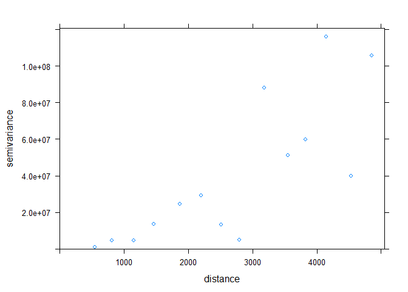<!-- -->

```r
#look at the residuals -- less clustering going on
par(mfrow = c(2,1))
bubble(spatialdata.auto, "auto.2.res", col = c("blue", "orange"), main = "Residuals", xlab = "X-coordinates", 
    ylab = "Y-coordinates")
```

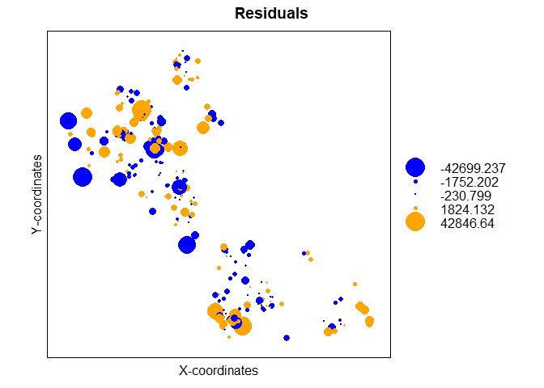<!-- -->

```r
bubble(spatialdata, "ind.2.res", col = c("blue", "orange"), main = "Residuals", xlab = "X-coordinates", 
    ylab = "Y-coordinates")
```

<!-- -->

```r
#chosen.a$mu.coefSmo[[1]]$coefficients$random
#See how the coefficents change. Note the significance on the intercept. Intercept significance is different.
chosen.a$mu.coefSmo
```

```
## [[1]]
## Linear mixed-effects model fit by REML
##   Data: Data 
##   Log-restricted-likelihood: -215.2041
##   Fixed: fix.formula 
## (Intercept) 
##  0.09141427 
## 
## Random effects:
##  Formula: ~1 | dummy
##         (Intercept) Residual
## StdDev:   0.1555838 1.053427
## 
## Correlation Structure: Spherical spatial correlation
##  Formula: ~X + Y | dummy 
##  Parameter estimate(s):
##        range       nugget 
## 2718.7336282    0.3412695 
## Variance function:
##  Structure: fixed weights
##  Formula: ~W.var 
## Number of Observations: 326
## Number of Groups: 1
```

```r
summary(chosen.a)
```

```
## ******************************************************************
## Family:  c("GA", "Gamma") 
## 
## Call:  gamlss(formula = obs_vol ~ log(proj_vol) + re(random = ~1 |  
##     dummy, correlation = corSpher(2500, form = ~X +  
##     Y, nugget = T), opt = "optim", method = "REML"),  
##     sigma.formula = ~log(proj_vol) + proj_height_1 +  
##         elv, family = GA(), data = calb_data4, method = CG(),  
##     control = gamlss.control(c.crit = 0.005), sigma.link = "log") 
## 
## Fitting method: CG() 
## 
## ------------------------------------------------------------------
## Mu link function:  log
## Mu Coefficients:
##               Estimate Std. Error t value Pr(>|t|)    
## (Intercept)    0.29024    0.17452   1.663   0.0973 .  
## log(proj_vol)  0.94162    0.01832  51.393   <2e-16 ***
## ---
## Signif. codes:  0 '***' 0.001 '**' 0.01 '*' 0.05 '.' 0.1 ' ' 1
## 
## ------------------------------------------------------------------
## Sigma link function:  log
## Sigma Coefficients:
##                 Estimate Std. Error t value Pr(>|t|)    
## (Intercept)    1.480e+00  3.155e-01   4.692 4.00e-06 ***
## log(proj_vol) -9.373e-02  2.681e-02  -3.496 0.000538 ***
## proj_height_1 -4.025e-02  8.593e-03  -4.684 4.16e-06 ***
## elv           -3.855e-04  2.624e-05 -14.693  < 2e-16 ***
## ---
## Signif. codes:  0 '***' 0.001 '**' 0.01 '*' 0.05 '.' 0.1 ' ' 1
## 
## ------------------------------------------------------------------
## NOTE: Additive smoothing terms exist in the formulas: 
##  i) Std. Error for smoothers are for the linear effect only. 
## ii) Std. Error for the linear terms maybe are not accurate. 
## ------------------------------------------------------------------
## No. of observations in the fit:  326 
## Degrees of Freedom for the fit:  2.661641
##       Residual Deg. of Freedom:  323.3384 
##                       at cycle:  8 
##  
## Global Deviance:     6154.424 
##             AIC:     6159.747 
##             SBC:     6169.827 
## ******************************************************************
```

```r
summary(chosen)
```

```
## ******************************************************************
## Family:  c("GA", "Gamma") 
## 
## Call:  
## gamlss(formula = obs_vol ~ log(proj_vol), sigma.formula = ~log(proj_vol) +  
##     proj_height_1 + elv, family = GA(), data = calb_data4,  
##     sigma.link = "log") 
## 
## Fitting method: RS() 
## 
## ------------------------------------------------------------------
## Mu link function:  log
## Mu Coefficients:
##               Estimate Std. Error t value Pr(>|t|)    
## (Intercept)    0.36896    0.17341   2.128   0.0341 *  
## log(proj_vol)  0.94208    0.01821  51.729   <2e-16 ***
## ---
## Signif. codes:  0 '***' 0.001 '**' 0.01 '*' 0.05 '.' 0.1 ' ' 1
## 
## ------------------------------------------------------------------
## Sigma link function:  log
## Sigma Coefficients:
##                 Estimate Std. Error t value Pr(>|t|)    
## (Intercept)    1.481e+00  3.152e-01   4.700 3.87e-06 ***
## log(proj_vol) -9.359e-02  2.680e-02  -3.492 0.000547 ***
## proj_height_1 -4.046e-02  8.568e-03  -4.722 3.50e-06 ***
## elv           -3.828e-04  2.616e-05 -14.632  < 2e-16 ***
## ---
## Signif. codes:  0 '***' 0.001 '**' 0.01 '*' 0.05 '.' 0.1 ' ' 1
## 
## ------------------------------------------------------------------
## No. of observations in the fit:  326 
## Degrees of Freedom for the fit:  6
##       Residual Deg. of Freedom:  320 
##                       at cycle:  4 
##  
## Global Deviance:     6154.33 
##             AIC:     6166.33 
##             SBC:     6189.051 
## ******************************************************************
```

```r
#Note the AIC is much smaller than the model assuming independance
AIC(chosen.a)
```

```
## [1] 6159.747
```

```r
AIC(chosen)
```

```
## [1] 6166.33
```

```r
#Much residuals slightly larger with autocorrelated model -- more uncertainty that the indepdnant more would suggest
#sum(auto.2$res**2)-sum(ind.2$res**2)

#Assuming indepdnance model
test.iid.data<-ind.2[,c("obs_vol", "proj_vol", "X", "Y", "proj_age_1", "proj_height_1", "elv")] 
test.iid.0<- predictAll(chosen, newdata = test.iid.data) 
test.iid.data$mu<-test.iid.0$mu 
test.iid.data$sigma<-test.iid.0$sigma 
  
#sum(test.iid.data$obs_vol)
#sum(test.iid.data$proj_vol)
#sum(test.iid.data$mu)
#sqrt(sum((test.iid.data$mu*test.iid.data$sigma)**2))

#est param
#sqrt(sum((test.iid.data$mu*test.iid.data$sigma)**2))/sum(test.iid.data$mu)
summed<-rGA(20000, mu = sum(test.iid.data$mu), sigma = sqrt(sum((test.iid.data$mu*test.iid.data$sigma)**2))/sum(test.iid.data$mu) )
#quantile(summed, c(0.05, 0.5, 0.95))

#-------
#Autocorrelated model
test.auto.data<-auto.2[,c("obs_vol", "proj_vol", "X", "Y", "proj_age_1", "proj_height_1", "dummy", "elv")] 
test.auto.0<- predictAll(chosen.a, newdata = test.auto.data) 
```

```
## new prediction
```

```r
test.auto.data$mu<-test.auto.0$mu 
test.auto.data$sigma<-test.auto.0$sigma 
  
#sum(test.auto.data$obs_vol)
#sum(test.auto.data$proj_vol)
#sum(test.auto.data$mu)
#sqrt(sum((test.auto.data$mu*test.auto.data$sigma)**2))

#-------
summed.auto<-rGA(20000, mu = sum(test.auto.data$mu), 
                 sigma = sqrt(sum((test.auto.data$mu*test.auto.data$sigma)**2))/sum(test.auto.data$mu))
#quantile(summed.auto, c(0.025, 0.05, 0.5, 0.95, 0.975))
```

Now to compare the model assuming independance and the spatial model. Here we see that the spatial model is less biased than the model that assumes independance. The mean of the spatial model is much closer to the observed total.


```
## `stat_bin()` using `bins = 30`. Pick better value with `binwidth`.
```

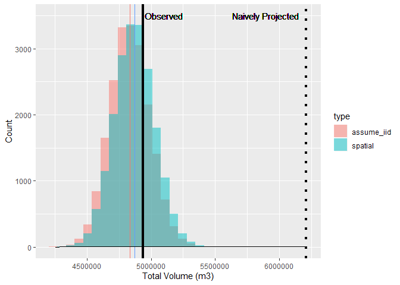<!-- -->

## Compare obs vs predicted distributions

Here we compare the cummulative dsitributions to see any deviations between the predicted and response surfaces. They are very similar - a few deviations most notably at larger predictions of the response.

```r
#ECDF
auto.2$surf<-"obs"
obs.1<-cbind(test.auto.data$obs_vol,auto.2$surf)
auto.2$surf<-"prd"
proj.1<-cbind(test.iid.data$mu,auto.2$surf)

data.78<-rbind(obs.1, proj.1)
data.78<-data.table(data.78)
data.78$V1<-as.numeric(data.78$V1)
ggplot(data.78, aes(V1, color = V2)) + 
stat_ecdf(alpha = 0.5, position = 'identity')
```

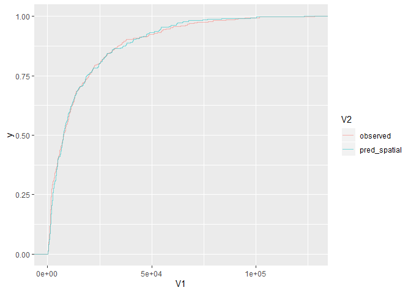<!-- -->


### Fixed effects

Now that the spatial model has passed the modelling assumptions. Let explore the effects that were modelled. In the spatial calibration model the naively projected volume, VRI height and elevation were used.


```
## new prediction
```

```
## new prediction
```

```
## new prediction
```

```
## new prediction
```

```
## new prediction
```

```
## Warning: Removed 26 rows containing missing values (geom_path).
```

```
## Warning: Removed 10 rows containing missing values (geom_path).
```

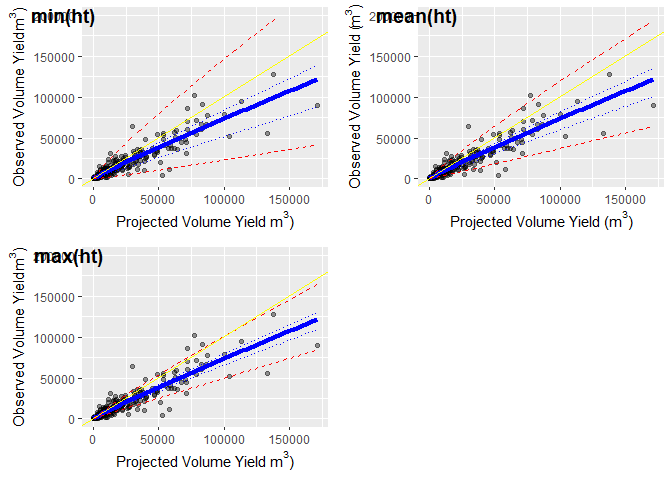<!-- -->


## Results Summary

* Larger projected volumes inherently have more uncertainty. 

* VRI projected height is negatively related to uncertainty.

* Elevation is negatively related to uncertainty.

# Discussion

First, the results from this modelling exercise suggest that the spatial model that accounts for the correlation between residuals is a better model. Using a spherical variogram model allowed individual observations to be weighted more effectively so that the effect of dependance was reduced. This provided a model that produced an estimated total volume that was closer to the observed total volume which is important for determining forestry decisions like AAC targets. 

Next, the effects of the predictor variables in the spatial model showed that the meta-model of vdyp was over predicting total volume in harvet units that had larger volumes. It should be noted that this effect cannot be seperated into errors individually generated by VDYP nor the VRI, but rather their combined effect. The management impications for timber supply models and AAC analysis would be: i) in the strategic design of landscapes, developing more aggregated or larger harvest blocks is often of interest to reduce the fragmentation of the landscape - however the realized volume from these larger blocks was shown to be considerably less than one would expect from a naive projection using the VRI and the meta-model of vdyp, ii) further there is greater uncertainty in the AAC if the harvest units were much larger in size, iii) the uncertainty in AAC targets can also be greater for harvest units that are lower in elevation and harvest units with forest structure that is smaller in terms of tree height. 

I would speculate:

* Larger harvest units may translate into a larger volume harvested and thus greater uncertainty. These larger units could also mean a greater number of different stands would be incorporated into the harvesting profile. Increasing the number of stands in a harvest profile may increase the probability of including polygons within the VRI that are erroneous. Conversely, for harvest units that are realtively smaller but still result in large volumes (i.e., highly productive areas) the total volume could be overestimated given the meta-model of vdyp was not taking into account the vertical structure that is likely to form through the development of the stand. Thus, the meta-model may project stands that are highly productive and are perceived to have growing space, but in fact they do not have the growing space because it is being occupied by vertical layers assumed that are assume to not exist. In other words, not accounting for the multi-layered structure of highly productive could lead to greater uncertainty.

* Lower elevation stands are likely to support mixed species which the meta model of vdyp and vdyp have a hard time predicting. Mixed species (and vertical layers as mentioned above) are porjected as individual species (orlayers) and then aggregated, thus removing the true intimate nature of how these species would grow.

* Harvest units that have smaller tree heights are uncertain because the meta model of vdyp typically uses plots of older mature stands near rotation age to calibrate its algorithums. These smaller height stands may not be well represented?

# Exercises

To demonstrate possible spatial effects of clustering use the calibration model in [forestryCLUS](https://github.com/bcgov/clus/tree/master/R/SpaDES-modules/forestryCLUS). 

# APPENDIX: Comparing the sum of distributional parameters to simulating via monte carlo

In Robinson et al. (2016), each of the response distributions were summed after sampling 10000 samples from each of the response distributions. However, this is computationally slow ( adds ~ 30 seconds for 326 harvest units). Instead of sampling each individual response distribution -- we can sum the means and sigmas because the individual responses are independant. Here is a comparison between mathematically estimating the total response distribution versus simulating it with many samples. By mathematically estimating the total response distribution, there is a large cost savings (~25 seconds) which when amplified over a simulation model with a 100 year time horizon and annual time step would result in ~ 42 minutes saved per simulation run. 


```
## `stat_bin()` using `bins = 30`. Pick better value with `binwidth`.
```

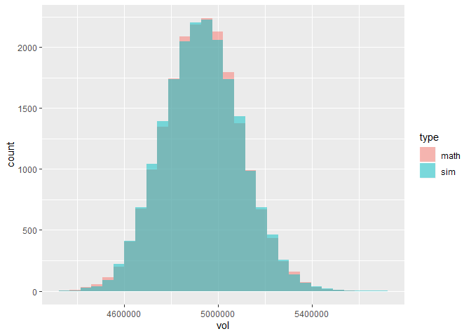<!-- -->

# References

Robinson, A.P., McLarin, M. and Moss, I., 2016. A simple way to incorporate uncertainty and risk into forest harvest scheduling. Forest Ecology and Management, 359, pp.11-18.
