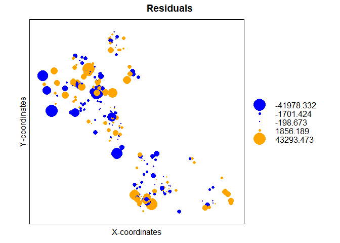

<!--
Copyright 2018 Province of British Columbia
 
Licensed under the Apache License, Version 2.0 (the "License");
you may not use this file except in compliance with the License.
You may obtain a copy of the License at
 
http://www.apache.org/licenses/LICENSE-2.0
 
Unless required by applicable law or agreed to in writing, software distributed under the License is distributed on an "AS IS" BASIS,
WITHOUT WARRANTIES OR CONDITIONS OF ANY KIND, either express or implied.
See the License for the specific language governing permissions and limitations under the License.-->


# Introduction

Estimates of timber volume projected through time and across landscapes are need to assess the sustainability of forestry decisions. The economic value of timber and many ecological processes of interest to decision makers (e.g., biomass, carbon, wildlife habitat) are all driven by projections of forest structure which are often characterized by timber volume. A common concern by forestry decision makers is the level of uncertainty behind these projections across large landscapes. 

There are many sources of uncertainty in timber volume projections and these sources propagate through time in complex ways which may provide barriers for confidentaly making forest management decisions. Past research has highlighted how sources of uncertainty related to errors in forest attributes reported in the forest inventory would propogate with errors in growth and yield models and thus, impact harvest scheduling. Recently, Robinson et al. (2016) recommended a simple way to incorpate this uncertainty into forestry decision making. Their approach relied on observed timber volumes measured from scaling and cruising operations following harvesting. In particular, the value of the Robinson et al. (2016) approach is two fold: i.) a calibration of the future timber volumes for use when simulating the forestry decisions and ii.) the ability to simulate the uncertainty of timber volume projection and thus calculate error statistics useful to decision makers. Robinson et al. (2016) modelled the distributional parameters of a prediction by specifying a seperate model for the mean and scale. These parameters were then used to reconstruct the response distribution for an individual harvest unit which can be summed to arrive at a distribution for the total volume harvested. Thereby allowing the construction of a prediction interval on the total volume harvested.

An important assumption of this approach is that the individual harvest units need to be independant of one another, in order to be able to sum the individual distributions. While this assumption was not formally tested, the authors highlight that if the individual harvest units were positively correlated then they would jointly contribute more to the uncertainty than their summation would suggest and conversely contribute less to uncertainty, if they were negatively correlated. This is an important point that could be leverage to develop harvest schedules that result in reduced uncertainty.

Currently, this approach has not been applied in the province of BC given issues with spatially tracking observed scaled volumes. The tracking of observed scaled volume is accomplished via the harvest billing system (HBS) which focuses on harvest volumes, needed for provincal revenue accounting, at a spatial unit known as a timber mark. The timber mark is a unique identifer stamped or marked on the end of each log to associate the log with the specific authority to harvest and move timber. Timber marks are assigned to harvested units that may be not be spatially contiguous nor contain a single harvest date. Thus, linking HBS and forest inventory data has been difficult due to issues with temporal and spatial accuracy in estimating the spatial boundaries of the timber marks. In particular, estimating the net area harvested (i.e., netting out roads, wildlife tree patches, etc) and its spatial boundary can be difficult to determine for historical cutblocks.

In the following sections, the spatial (timber mark boundaries) and temporal (harvest date, inventory projection) data are manipulated to develop a calibration model that can be used to provide valuable information about timber projection uncertainty. It is believed that this calibration will support adaptive forest management by enhancing the link between strategic decisions and their implementation. The specific objectives were: i) to calibrate projected volume yields from an aggregated growth and yield model (hereafter termed the meta-model) with observed volume yields reported in the harvest billing system and ii) determine how uncertainty in total harvested volumes can be minimized. The proposed calibration model will be used in the caribou and landuse model (CLUS) to provide an estimate of volume yield uncertainty which will help provide some context surrounding the quantification of impacts from caribou conservation activities on harvest flows. 

# Methods


## Linking timber mark boundaries with VRI

Linking the timber mark boundaries with the VRI (needed to link to a growth and yield model) involved the following: (see [code](https://github.com/bcgov/clus/blob/master/SQL/develop_vri2011table.sql))

1. Subset and estimate the spatial boundaries of the timber marks

The spatial boundaries of the timber mark were estimated using the compilation of two spatial data sets: i) [forest tenure cutblock polygons](https://catalogue.data.gov.bc.ca/dataset/forest-tenure-cutblock-polygons-fta-4-0) (aka. ftn_c_b_pl_polygon) and ii) [consolidated cutblock polygons](https://catalogue.data.gov.bc.ca/dataset/harvested-areas-of-bc-consolidated-cutblocks-) (a.k.a cns_cut_bl_polygon). While the forest tenure polygons provided the spatial boundary of the timber mark, these boundaries include retention areas which can be quite large. Thus, the consolidate cutblock polygons dataset was used to remove these non-harvested areas within a timber mark area.

Using the forest tenure cutblock polygons, all timber marks comprised of harvest units that were spatially contiguous and had disturbance start dates between 2012-01-01 and 2016-12-31 were selected. This ensured timber marks would be roughly at the scale of a harvest unit or cutblock and would temporally link to the forest inventory. Further, timber marks with scaled dead wood were removed since the naive projections do not include standing dead timber. Lastly, timber marks were removed if they did not contained geometries reported by RESULTS (the most accurate form of reporting cutblock information). This ensured a more accurate net spatial description of the timber mark boundary (i.e., retention patches were removed). Despite the accuracy of the RESULTS, there remain a number of issues with identifying non-harvest areas in the consolidated cutblock polygons. Thus, timber marks were removed when the estimated timber mark area was not within $\pm$ 20% of the planned net area.This subset of the forest tenure cutblock polygons was then joined with consolidated cutblock polygons to provide a spatial boundary that exluded non harvest areas. 

2. Intersect the timber mark spatial boundaries with the VRI

The resulting spatial boundaries that excluded non-harvested areas were then spatialy intersected with the 2011 VRI to provide the necessary forest attribute information require to link to the growth and yield model. Only the dominant layer (layer rank 1) of the forest inventory was used, thereby simplifying the growth and yield proejction. As a result of this intersection, 1264 of the timber marks had a portion of their total area that failed to provide the neccessary forest inventory information (i.e., areas that lack the publically available forest inventory such as Tree Farm Licenses). 

The following is a histogram of the percentage of the total timber mark area missing information:


```
## type is 0
```

```
## Warning: attribute variables are assumed to be spatially constant
## throughout all geometries
```

```
## [1] TRUE
```

```
## [1] TRUE
```

```
## [1] 0
```

```
## [1] TRUE
```


This histogram shows that 75% of timber marks were missing forest inventory attribution for only 1.4% of their total area. After visually checking, two issues arose: i) the spatial boundaries of these timber marks extend into non-forested area as reported by the VRI; and ii) there wasn't enough information to parameterize the growth and yield model (outside the domain of the inputs, e.g., recently disturbed). In the case of the non-forested areas, these could be small spatial errors in the VRI and were thus important sources of uncertainty. However, from a practical view, these relatively small areas would contribute little to the total projected volume estimate. Thus, timber marks with greater than 3 percent of their total area containing inadequate forest inventory information were removed from the analysis.


```
## Reading layer `centroid_timber_mkrs2' from data source `C:\Users\klochhea\clus\R\Params\centroid_timber_mkrs2.shp' using driver `ESRI Shapefile'
## Simple feature collection with 828 features and 25 fields
## geometry type:  POINT
## dimension:      XY
## bbox:           xmin: 595907.3 ymin: 391311.3 xmax: 1833585 ymax: 1385545
## epsg (SRID):    NA
## proj4string:    +proj=aea +lat_1=50 +lat_2=58.5 +lat_0=45 +lon_0=-126 +x_0=1000000 +y_0=0 +ellps=GRS80 +units=m +no_defs
```

```
## Loading file from cache...
```


## Growth and yield meta-model

In BC, forested stands from natural orgins are typically projected through time using [Variable Density Yield projection](https://www2.gov.bc.ca/gov/content/industry/forestry/managing-our-forest-resources/forest-inventory/growth-and-yield-modelling/variable-density-yield-projection-vdyp) (VDYP). VDYP is a stand-level empirical growth and yield model that uses VRI attribution as inputs into its sub-models. Using the 2018 vintage of the VRI, each polygon was projected for 350 years using 10 year time steps. The result of this process was a dataset with over 3.5 million yield curves which took 3 days to complete on a intel xeon, 3.5 ghz processor with 64 GB of RAM. Both the input (VRI information) and outputs (yields over time) were uploaded into a PostgreSQL database for further processing. Using the layer 1 rank information (the dominant layer),  yield curve groups (yc_grp) or anlaysis units were constructed using: BEC zone, site index (2 m interval), height class (5 classes as per the VRI) and crown closure class (5 classes as per the VRI). Each yc_grp was then aggregated by area weighting the respective individual polygon level yield curves. The result was a provincial database of composite yield curves that directly links to the VRI through the layer 1 rank attribution described above.

## HBS volumes vs projected meta-model volumes

Each VRI polygon that intersected the timber mark boundary and contained a projected volume was summed to estimate the total projected timber volume for the timber mark. This projected timber volume represented the naive projection commonly used in forest estate modeling.  


```
## 
## Call:
## lm(formula = obs_vol ~ proj_vol, data = calb_data)
## 
## Residuals:
##    Min     1Q Median     3Q    Max 
## -41840  -2111   -925   1896  44645 
## 
## Coefficients:
##              Estimate Std. Error t value Pr(>|t|)    
## (Intercept) 1.279e+03  4.880e+02   2.621   0.0091 ** 
## proj_vol    7.195e-01  1.602e-02  44.917   <2e-16 ***
## ---
## Signif. codes:  0 '***' 0.001 '**' 0.01 '*' 0.05 '.' 0.1 ' ' 1
## 
## Residual standard error: 7640 on 384 degrees of freedom
## Multiple R-squared:  0.8401,	Adjusted R-squared:  0.8397 
## F-statistic:  2017 on 1 and 384 DF,  p-value: < 2.2e-16
```

```
## Warning in predict.lm(model1, data = calb_data, interval = "prediction"): predictions on current data refer to _future_ responses
```


### Modelling assumptions

The following assumptions of the calibration model need to be tested: i) the response is gamma distributed, ii) the model fits the data and iii) the residuals are independant.

From the histogram below the gamma and log normal distributions appear to be candidates.


```r
#library(fitdistrplus)
#param.1 <- MASS::fitdistr(calb_data4$obs_vol, "normal")
#param.2 <- MASS::fitdistr(calb_data4$obs_vol, "lognormal")
#param.3 <- fitdistr(calb_data4$obs_vol, "gamma", start = list(shape = 1.2, scale = 0.0001), lower = 0.01)

hist(calb_data2$obs_vol, prob = T, ylim = c(0, 0.00007))
curve(dgamma(x, 1.2, 0.0001), add=TRUE, col = 'red')
curve(dnorm(x, 15138, 19838), add=TRUE)
curve(dlnorm(x, 8.79, 1.41), add=TRUE, col = 'blue')
```


## Calibration model

In Robinson et al. (2016) a gamma model was used to model both the  mean and  variance of the response distribution. Gamma models are advantageous because they are highly flexible in the positive domain and allow the modeling of heteroskedastic variance. Below we try a few gamma models by incorporating forest attributes as predictors of both the mean and variance. The results suggest a gamma model is better fit over a log normal model. Also, the VRI height is a important predictor of the response variance. However, these models assume no spatial correlation which needs to be tested.


```r
# get the bec zone that makes up the majority of the timber mark 
pv_timber_mrk<-merge(timbr_mrks, totalArea)
pv_timber_mrk[,wt:=as.numeric(area/totarea)]
pv_timber_mrk2<-pv_timber_mrk[, lapply(.SD, function(x) {wtd.mean (x, wt)}), by =timber_mrk, .SDcols=c("proj_height_1", "site_index", "crown_closure", "proj_age_1", "pcnt_dead")]
setnames(pv_timber_mrk2, "timber_mrk" , "timber_mark" )
calb_data3<-merge(calb_data2, pv_timber_mrk2, by = "timber_mark")
calb_data4<-na.omit(calb_data3)

## Fit and compare some models
test.0 <- gamlss(obs_vol ~ proj_vol,
                 sigma.formula = ~ 1,
                 mu.link = "log",
                 sigma.link = "log",
                 family = GA(),
                 data = calb_data4)
```

```
## GAMLSS-RS iteration 1: Global Deviance = 6575.296 
## GAMLSS-RS iteration 2: Global Deviance = 6575.295
```

```r
test.0 <- gamlss(obs_vol ~ proj_vol,
                 sigma.formula = ~ 1,
                 mu.link = "log",
                 sigma.link = "log",
                 family = LOGNO(),
                 data = calb_data4)
```

```
## GAMLSS-RS iteration 1: Global Deviance = 6619.346 
## GAMLSS-RS iteration 2: Global Deviance = 6619.346
```

```r
test.1 <- gamlss(obs_vol ~ log(proj_vol),
                 sigma.formula = ~ 1,
                 sigma.link = "log",
                 family = GA(),
                 data = calb_data4)
```

```
## GAMLSS-RS iteration 1: Global Deviance = 6202.212 
## GAMLSS-RS iteration 2: Global Deviance = 6202.212
```

```r
test.1 <- gamlss(obs_vol ~ log(proj_vol),
                 sigma.formula = ~ 1,
                 mu.link = "log",
                 sigma.link = "log",
                 family = LOGNO(),
                 data = calb_data4)
```

```
## GAMLSS-RS iteration 1: Global Deviance = 6191.291 
## GAMLSS-RS iteration 2: Global Deviance = 6191.291
```

```r
test.2 <- gamlss(obs_vol ~ log(proj_vol),
                 sigma.formula = ~ proj_vol,
                 sigma.link = "log",
                 family = GA(),
                 data = calb_data4)
```

```
## GAMLSS-RS iteration 1: Global Deviance = 6189.939 
## GAMLSS-RS iteration 2: Global Deviance = 6189.888 
## GAMLSS-RS iteration 3: Global Deviance = 6189.888
```

```r
test.3 <- gamlss(obs_vol ~ log(proj_vol),
                 sigma.formula = ~ log(proj_vol),
                 sigma.link = "log",
                 family = GA(),
                 data = calb_data4)
```

```
## GAMLSS-RS iteration 1: Global Deviance = 6177.096 
## GAMLSS-RS iteration 2: Global Deviance = 6176.263 
## GAMLSS-RS iteration 3: Global Deviance = 6176.263
```

```r
test.4.ga <- gamlss(obs_vol ~ log(proj_vol),
                 sigma.formula = ~ log(proj_vol) + proj_height_1,
                 sigma.link = "log",
                 family = GA(),
                 data = calb_data4)
```

```
## GAMLSS-RS iteration 1: Global Deviance = 6164.436 
## GAMLSS-RS iteration 2: Global Deviance = 6160.383 
## GAMLSS-RS iteration 3: Global Deviance = 6160.331 
## GAMLSS-RS iteration 4: Global Deviance = 6160.33 
## GAMLSS-RS iteration 5: Global Deviance = 6160.33
```

```r
test.4.ln <- gamlss(obs_vol ~ log(proj_vol),
                 sigma.formula = ~ log(proj_vol) + proj_height_1,
                 sigma.link = "log",
                 family = LOGNO(),
                 data = calb_data4)
```

```
## GAMLSS-RS iteration 1: Global Deviance = 6172.645 
## GAMLSS-RS iteration 2: Global Deviance = 6171.256 
## GAMLSS-RS iteration 3: Global Deviance = 6171.246 
## GAMLSS-RS iteration 4: Global Deviance = 6171.246
```

```r
LR.test(test.4.ln, test.4.ga)
```

```
##  Likelihood Ratio Test for nested GAMLSS models. 
##  (No check whether the models are nested is performed). 
##  
##        Null model: deviance= 6171.246 with  5 deg. of freedom 
##  Altenative model: deviance= 6160.33 with  5 deg. of freedom 
##  
##  LRT = 10.91638 with 0 deg. of freedom and p-value= 0
```

```r
chosen<-test.4.ga
summary(chosen)
```

```
## ******************************************************************
## Family:  c("GA", "Gamma") 
## 
## Call:  
## gamlss(formula = obs_vol ~ log(proj_vol), sigma.formula = ~log(proj_vol) +  
##     proj_height_1, family = GA(), data = calb_data4,  
##     sigma.link = "log") 
## 
## Fitting method: RS() 
## 
## ------------------------------------------------------------------
## Mu link function:  log
## Mu Coefficients:
##               Estimate Std. Error t value Pr(>|t|)    
## (Intercept)    0.42131    0.17332   2.431   0.0156 *  
## log(proj_vol)  0.93590    0.01802  51.941   <2e-16 ***
## ---
## Signif. codes:  0 '***' 0.001 '**' 0.01 '*' 0.05 '.' 0.1 ' ' 1
## 
## ------------------------------------------------------------------
## Sigma link function:  log
## Sigma Coefficients:
##                Estimate Std. Error t value Pr(>|t|)    
## (Intercept)    0.940247   0.288509   3.259  0.00124 ** 
## log(proj_vol) -0.103767   0.026065  -3.981 8.49e-05 ***
## proj_height_1 -0.031565   0.007977  -3.957 9.35e-05 ***
## ---
## Signif. codes:  0 '***' 0.001 '**' 0.01 '*' 0.05 '.' 0.1 ' ' 1
## 
## ------------------------------------------------------------------
## No. of observations in the fit:  326 
## Degrees of Freedom for the fit:  5
##       Residual Deg. of Freedom:  321 
##                       at cycle:  5 
##  
## Global Deviance:     6160.33 
##             AIC:     6170.33 
##             SBC:     6189.264 
## ******************************************************************
```

```r
plot(chosen)
```


```
## ******************************************************************
## 	      Summary of the Quantile Residuals
##                            mean   =  0.03552316 
##                        variance   =  1.026839 
##                coef. of skewness  =  -0.2489788 
##                coef. of kurtosis  =  4.700384 
## Filliben correlation coefficient  =  0.9903119 
## ******************************************************************
```

### Testing for autocorrelation

An assumption of the uncertainty model is that the errors are independant - in order to be able to sum across many predictions and achieve the appropriate total. Here I test for autocorrelation in the residuals.


```r
ind.1<- predictAll(chosen, newdata = calb_data4)
ind.2<-cbind(calb_data4, ind.1$mu)
ind.2$res<-ind.2$obs_vol - ind.2$V2

#get distances
dists <- as.matrix(dist(cbind(ind.2$X, ind.2$Y)))
dists.inv <- 1/dists 
diag(dists.inv) <- 0
#dists[1:50, 1:50] # check what they look like - units are in metres

#auto.2$res<-auto.2$res+runif(326, 1, 10000)
Moran.I(ind.2$res, dists.inv)
```

```
## $observed
## [1] 0.02392329
## 
## $expected
## [1] -0.003076923
## 
## $sd
## [1] 0.0146632
## 
## $p.value
## [1] 0.06556897
```

```r
#observed is significantly greater than expected  - positively correlated. Thus, jointly contribute more to the uncertainty then their sum would suggest.

xyspatial=SpatialPoints(cbind(ind.2$X,ind.2$Y))
porspatial=data.frame(ind.2$res)
spatialdata=SpatialPointsDataFrame(xyspatial,porspatial)

vario2 <- variogram(ind.2$res~1, spatialdata, cutoff = 3000)
plot(vario2)
```

<!-- -->

```r
bubble(spatialdata, "ind.2.res", col = c("blue", "orange"), main = "Residuals", xlab = "X-coordinates", 
    ylab = "Y-coordinates")
```

<!-- -->

The results from the Moran's I suggest that the residuals are independant (Moran's I = 0.0239, p = 0.06556). After building a variogram there doesn't seem to be a strong spatial effect.  However, the bubble map shows some spatial clustering -namely in the far east corner and around the kamloops area. Also the p value for Moran's I is providing enough evidence against the null hypothesis to warrant a check to see if the model can be further improved by taking into account any spatial autocorrelation.

### Autocorrelated model

To account for the spatial autocorrelation in the model we construct a random effect with mean zero and covariance structure modelled using a spatial lag between observations. Thus, the off diagonal elements of the variance-covariance matrix will be estimated using a spatial covariance structure that is parameterized from a model assuming independance. The steps to fit this model included:

1.) Fit a gamma model for the mu and sigma.

2.) Use the residuals from this model to construct a spatially varying random variable that is normally distributed with mean 0 and covariance

3.) Specifiy the structure of this covariance matrix to follow a spatial lag that uses a spherical model of the X and Y locations

4.) Re-fit the gamma model with the spatially varying random variable

5.) Iterate through 1-4 until convergence criterion has been met

The result of this model is a Moran's I of 0.0235, p = 0.69, the bubble map shows less clustering, and the AIC of this spatial model is less (6162 versus 6170) than the model assuming independance. Thus, it appears the spatial model may be the prefered model. Lets see how well the predictions look. 


```r
calb_data4$dummy<-1
chosen.a <- gamlss(obs_vol ~log(proj_vol) + re(random=~1|dummy, correlation = corSpher(2500, form = ~ X + Y, nugget = T), opt="optim", method = "REML"),
                   sigma.formula = ~ log(proj_vol) + proj_height_1 ,
                   sigma.link = "log",
                   family = GA(), data = calb_data4, control = gamlss.control(c.crit = 0.005), method=CG())
```

```
## GAMLSS-CG iteration 1: Global Deviance = 6460.797 
## GAMLSS-CG iteration 2: Global Deviance = 6277.629 
## GAMLSS-CG iteration 3: Global Deviance = 6188.318 
## GAMLSS-CG iteration 4: Global Deviance = 6163.268 
## GAMLSS-CG iteration 5: Global Deviance = 6160.616 
## GAMLSS-CG iteration 6: Global Deviance = 6160.5 
## GAMLSS-CG iteration 7: Global Deviance = 6160.425 
## GAMLSS-CG iteration 8: Global Deviance = 6160.425
```

```r
plot(chosen.a)
```

<!-- -->

```
## ******************************************************************
## 	      Summary of the Quantile Residuals
##                            mean   =  0.02020054 
##                        variance   =  1.022391 
##                coef. of skewness  =  -0.2373847 
##                coef. of kurtosis  =  4.712213 
## Filliben correlation coefficient  =  0.9902542 
## ******************************************************************
```

```r
auto.1<- predictAll(chosen.a, newdata = calb_data4)
```

```
## new prediction
```

```r
auto.2<-cbind(calb_data4, auto.1$mu)
auto.2$res<-auto.2$obs_vol - auto.2$V2

Moran.I(auto.2$res, dists.inv)
```

```
## $observed
## [1] 0.02358247
## 
## $expected
## [1] -0.003076923
## 
## $sd
## [1] 0.0146623
## 
## $p.value
## [1] 0.06902936
```

```r
#There is more evidence for the null hypothesis

xyspatial.auto=SpatialPoints(cbind(auto.2$X,auto.2$Y))
porspatial.auto=data.frame(auto.2$res)
spatialdata.auto=SpatialPointsDataFrame(xyspatial.auto,porspatial.auto)
vario2 <- variogram(auto.2$res~1, spatialdata, cutoff = 2500)
plot(vario2)
```

<!-- -->

```r
#look at the residuals -- less clustering going on
par(mfrow = c(2,1))
bubble(spatialdata.auto, "auto.2.res", col = c("blue", "orange"), main = "Residuals", xlab = "X-coordinates", 
    ylab = "Y-coordinates")
```

<!-- -->

```r
bubble(spatialdata, "ind.2.res", col = c("blue", "orange"), main = "Residuals", xlab = "X-coordinates", 
    ylab = "Y-coordinates")
```

<!-- -->

```r
#See how the coefficents change. Note the significance on the intercept. Intercept significance is different.
chosen.a$mu.coefSmo
```

```
## [[1]]
## Linear mixed-effects model fit by REML
##   Data: Data 
##   Log-restricted-likelihood: -218.1298
##   Fixed: fix.formula 
## (Intercept) 
##   0.0923571 
## 
## Random effects:
##  Formula: ~1 | dummy
##         (Intercept) Residual
## StdDev:   0.1558284 1.055083
## 
## Correlation Structure: Spherical spatial correlation
##  Formula: ~X + Y | dummy 
##  Parameter estimate(s):
##       range      nugget 
## 2546.990517    0.248219 
## Variance function:
##  Structure: fixed weights
##  Formula: ~W.var 
## Number of Observations: 326
## Number of Groups: 1
```

```r
summary(chosen.a)
```

```
## ******************************************************************
## Family:  c("GA", "Gamma") 
## 
## Call:  gamlss(formula = obs_vol ~ log(proj_vol) + re(random = ~1 |  
##     dummy, correlation = corSpher(2500, form = ~X +  
##     Y, nugget = T), opt = "optim", method = "REML"),  
##     sigma.formula = ~log(proj_vol) + proj_height_1,  
##     family = GA(), data = calb_data4, method = CG(),  
##     control = gamlss.control(c.crit = 0.005), sigma.link = "log") 
## 
## Fitting method: CG() 
## 
## ------------------------------------------------------------------
## Mu link function:  log
## Mu Coefficients:
##               Estimate Std. Error t value Pr(>|t|)    
## (Intercept)    0.34289    0.17413   1.969   0.0498 *  
## log(proj_vol)  0.93533    0.01809  51.693   <2e-16 ***
## ---
## Signif. codes:  0 '***' 0.001 '**' 0.01 '*' 0.05 '.' 0.1 ' ' 1
## 
## ------------------------------------------------------------------
## Sigma link function:  log
## Sigma Coefficients:
##                Estimate Std. Error t value Pr(>|t|)    
## (Intercept)    0.935690   0.288695   3.241 0.001314 ** 
## log(proj_vol) -0.104113   0.026058  -3.995 7.99e-05 ***
## proj_height_1 -0.031257   0.008005  -3.904 0.000115 ***
## ---
## Signif. codes:  0 '***' 0.001 '**' 0.01 '*' 0.05 '.' 0.1 ' ' 1
## 
## ------------------------------------------------------------------
## NOTE: Additive smoothing terms exist in the formulas: 
##  i) Std. Error for smoothers are for the linear effect only. 
## ii) Std. Error for the linear terms maybe are not accurate. 
## ------------------------------------------------------------------
## No. of observations in the fit:  326 
## Degrees of Freedom for the fit:  1.260361
##       Residual Deg. of Freedom:  324.7396 
##                       at cycle:  8 
##  
## Global Deviance:     6160.425 
##             AIC:     6162.946 
##             SBC:     6167.718 
## ******************************************************************
```

```r
summary(chosen)
```

```
## ******************************************************************
## Family:  c("GA", "Gamma") 
## 
## Call:  
## gamlss(formula = obs_vol ~ log(proj_vol), sigma.formula = ~log(proj_vol) +  
##     proj_height_1, family = GA(), data = calb_data4,  
##     sigma.link = "log") 
## 
## Fitting method: RS() 
## 
## ------------------------------------------------------------------
## Mu link function:  log
## Mu Coefficients:
##               Estimate Std. Error t value Pr(>|t|)    
## (Intercept)    0.42131    0.17332   2.431   0.0156 *  
## log(proj_vol)  0.93590    0.01802  51.941   <2e-16 ***
## ---
## Signif. codes:  0 '***' 0.001 '**' 0.01 '*' 0.05 '.' 0.1 ' ' 1
## 
## ------------------------------------------------------------------
## Sigma link function:  log
## Sigma Coefficients:
##                Estimate Std. Error t value Pr(>|t|)    
## (Intercept)    0.940247   0.288509   3.259  0.00124 ** 
## log(proj_vol) -0.103767   0.026065  -3.981 8.49e-05 ***
## proj_height_1 -0.031565   0.007977  -3.957 9.35e-05 ***
## ---
## Signif. codes:  0 '***' 0.001 '**' 0.01 '*' 0.05 '.' 0.1 ' ' 1
## 
## ------------------------------------------------------------------
## No. of observations in the fit:  326 
## Degrees of Freedom for the fit:  5
##       Residual Deg. of Freedom:  321 
##                       at cycle:  5 
##  
## Global Deviance:     6160.33 
##             AIC:     6170.33 
##             SBC:     6189.264 
## ******************************************************************
```

```r
#Note the AIC is much smaller than the model assuming independance
AIC(chosen.a)
```

```
## [1] 6162.946
```

```r
AIC(chosen)
```

```
## [1] 6170.33
```

```r
#Much residuals slightly larger with autocorrelated model -- more uncertainty that the indepdnant more would suggest
#sum(auto.2$res**2)-sum(ind.2$res**2)
```

### Comparing the sum of distributional parameters to simulating via monte carlo

In Robinson et al. (2016), each of the response distributions were summed after sampling 10000 samples from each of the response distributions. However, this is computationally slow ( adds ~ 30 seconds for 326 harvest units). Instead of sampling each individual response distribution -- we can sum the means and sigmas because the individual responses are independant. Here is a comparison between mathematically estimating the total response distribution versus simulating it with many samples.


```
## new prediction
```

```
##    2.5%      5%     50%     95%   97.5% 
## 4573680 4619069 4870291 5127085 5177916
```

```
## `stat_bin()` using `bins = 30`. Pick better value with `binwidth`.
```

<!-- -->

Now lets compare the model assuming independance and the spatial model. Here we see that the spatial model is less biased than the model that assumes independance. The mean of the spatial model is much closer to the observed total.


```
## `stat_bin()` using `bins = 30`. Pick better value with `binwidth`.
```

<!-- -->

### Compare obs vs predicted distributions

Here we compare the cummulative dsitributions to see any deviations between the predicted and response surfaces. They are very similar - a few deviations most notably at larger predictions of the response.

```r
#ECDF
auto.2$surf<-"obs"
obs.1<-cbind(test.auto.data$obs_vol,auto.2$surf)
auto.2$surf<-"prd"
proj.1<-cbind(test.iid.data$mu,auto.2$surf)

data.78<-rbind(obs.1, proj.1)
data.78<-data.table(data.78)
data.78$V1<-as.numeric(data.78$V1)
ggplot(data.78, aes(V1, color = V2)) + 
stat_ecdf(alpha = 0.5, position = 'identity')
```

<!-- -->


### Effects

Now that the spatial model has passed the modelling assumptions. Let explore the effects that were modelled. In the spatial calibration model the naively projected volume and the VRI height.


```
## new prediction
```

```
## new prediction
```

```
## new prediction
```

```
## Warning: Removed 17 rows containing missing values (geom_path).
```

<!-- -->


# Conclusions

* Larger projected volumes inherently have more uncertainty. 

* VRI projected height is negatively related to uncertainty.

## Exercises

To demonstrate possible spatial effects of clustering use the calibration model in [forestryCLUS](https://github.com/bcgov/clus/tree/master/R/SpaDES-modules/forestryCLUS). 

# References

Robinson, A.P., McLarin, M. and Moss, I., 2016. A simple way to incorporate uncertainty and risk into forest harvest scheduling. Forest Ecology and Management, 359, pp.11-18.
