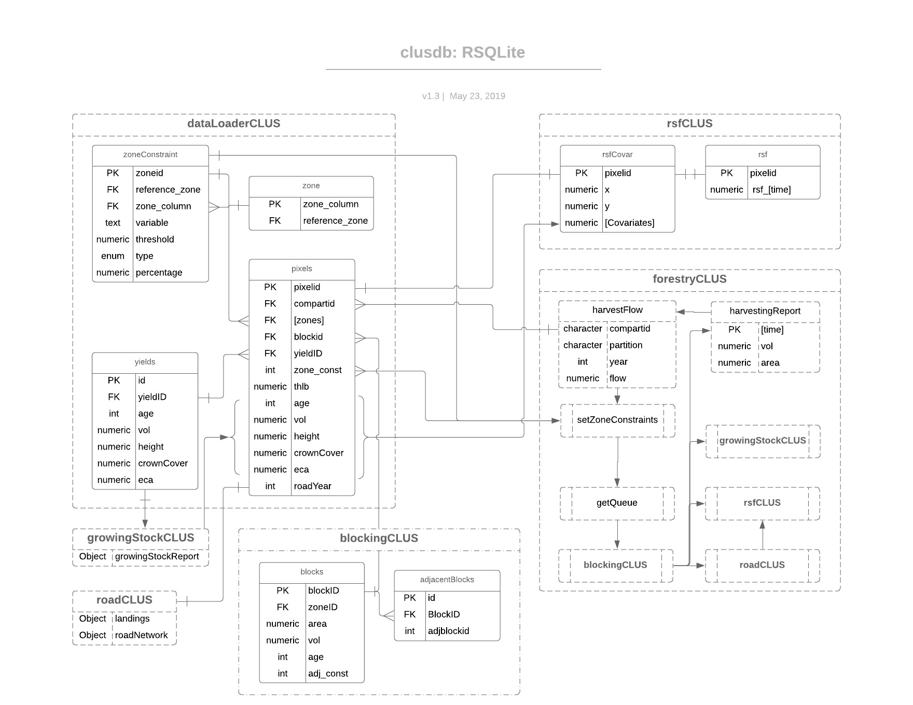

## dataloaderCLUS 

### What it does

Downloads, retrieves and manipulates data and information about the current state of the forest. The inputs require a connection to a PostgreSQL database that stores provincial scale information. The resulting outputs are formally entered into a SQLite database, named clusdb. This database is used by other modules as inputs to update and store states and other information through the duration of the simulation. This module has two functions: 1) build and save a clusdb or 2) connect to pre-existing clusdb. 

#### Management levers

* Add the state of the forest (e.g., current or historical)
* Add spatial boundaries for zone constraints
* Add any information required during the simulation (e.g., dead pine percentages, deciduous percentages, quadratic mean diameter, etc)

### Input Parameters

* *dbName*,*dbHost*, *dbName*, *dbPort*, *dbPassword*. Connection credentials to a PostgreSQL provincial database
* *nameBoundaryFile*.  Spatial vector file of the area of interest (e.g., TSA).
* *nameBoundaryColumn*. Name of the column within the boundary file that has the boundary name. 
* *nameBoundary*. Name of the boundary - a spatial polygon within the boundary file. (e.g., a TSA name to query a TSA spatial polygon file, or a group of herds or TSAs).
* *nameBoundaryGeom*. Name of the geom column in the boundary file.
* *save_clusdb*. Save the db to a file? Default = FALSE.
* *useCLUSdb*. Use an exising db? Add the directory to where the database is being stored. Default = FALSE
* *nameCompartmentRaster*. Name of the raster that represents a compartment or supply block. 
* *nameCompartmentTable*. Name of the table that represents a compartment or supply block value attribute look up.
* *nameMaskHarvestLandbaseRaster*. Administrative boundary related to operability of the the timber harvesting landbase. Default = 1
* *nameAgeRaster*. Name of the raster containing pixel age. Note this references the yield table. Thus, could be initially 0 if the yield curves reflect the age at 0 on the curve
* *nameSiteIndexRaster*. Name of the raster site index used in uncertainty model of yields,
* *nameCrownClosureRaster*. Name of the raster containing crown closure. Note this could be a raster using [VCF](http://glcf.umd.edu/data/vcf/)?
* *nameHeightRaster*. Name of the raster containing pixel height. Default = 12. e.g., Canopy height model
* *nameZoneTable*. Name of the table documenting the zone types
* *nameZoneRasters*. Administrative boundaries containing zones of management objectives. Input as a vector -e.g. c("rast.vqo", "rast.wha")
* *nameYieldsRaster*. Name of the raster with the primary key for yield tables
* *nameYieldsTransitionRaster*. Name of the raster with the primary key for yield tables that transition following harvesting
* *nameYieldTable*. Name of the table containing yields curves
* *nameOwnershipRaster*. Name of the raster that specifies the ownership. Default = 1.
* *nameForestInventoryTable*. An alternative to rasters of age, height, site index, age, etc. Name of the forest inventory table.
* *nameForestInventoryRaster*. Name of the raster with the primary key linking to the forest inventory table
* *nameForestInventoryKey*. Name of the primary key that links the forest inventory table to the raster
* *nameForestInventoryAge*. Name of the forest inventory age
* *nameForestInventoryHeight*.Name of the forest inventory height
* *nameForestInventoryCrownClosure*. Name of the forest inventory crown closure
* *nameForestInventorySiteIndex*. Name of the forest inventory site index
    
#### Data Needs

Any spatial or tabular data can be entered into the design of clusdb. The minimum amount of data needed to run the simulation includes:

Rasters
----
* Age
* Height
* Site index
* Crown closure
* Yield curve primary key 
* Transition yield curve primary key
* Ownership
* Management zones
* Timber harvesting land-base

Tables
---
* Yield curves
* Zone constraints

### Outputs

The clusdb database.

<!-- -->

### Licence

    Copyright 2019 Province of British Columbia

    Licensed under the Apache License, Version 2.0 (the "License");
    you may not use this file except in compliance with the License.
    You may obtain a copy of the License at

       http://www.apache.org/licenses/LICENSE-2.0

    Unless required by applicable law or agreed to in writing, software
    distributed under the License is distributed on an "AS IS" BASIS,
    WITHOUT WARRANTIES OR CONDITIONS OF ANY KIND, either express or implied.
    See the License for the specific language governing permissions and
    limitations under the License.