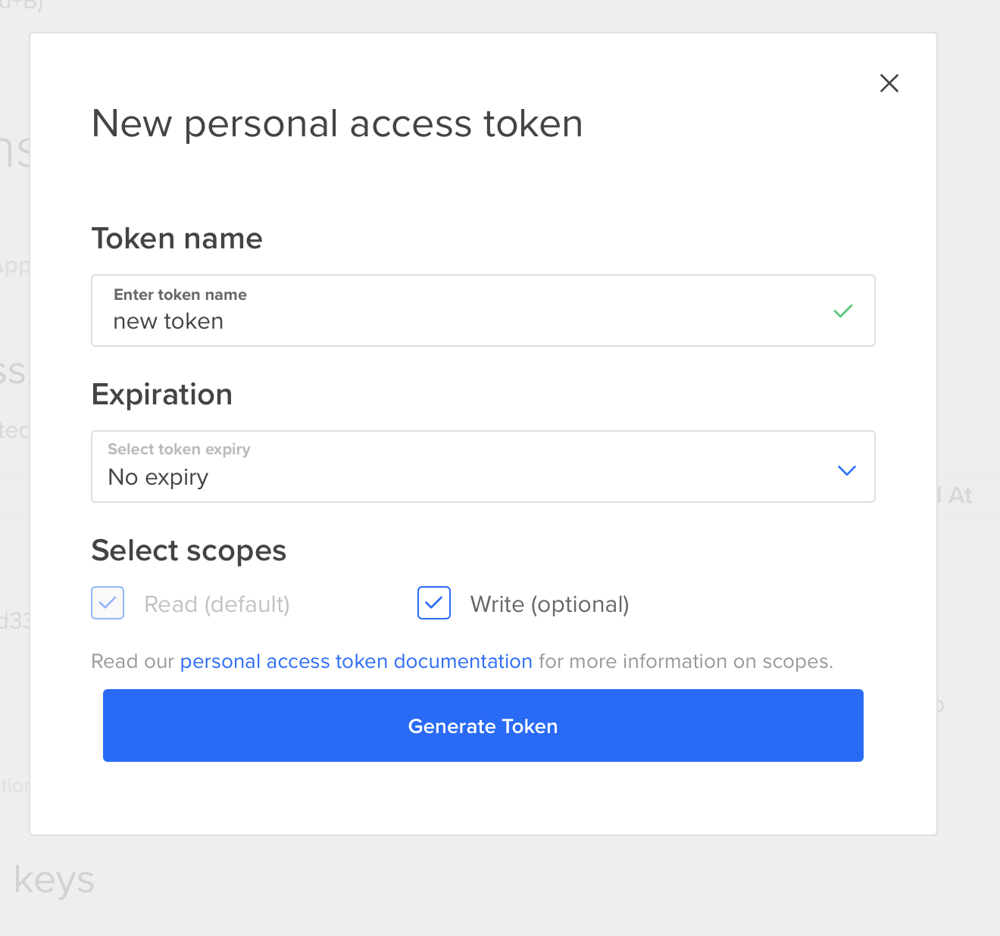
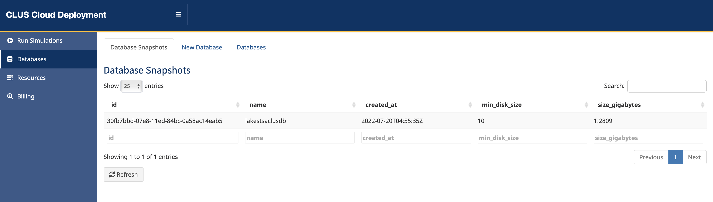
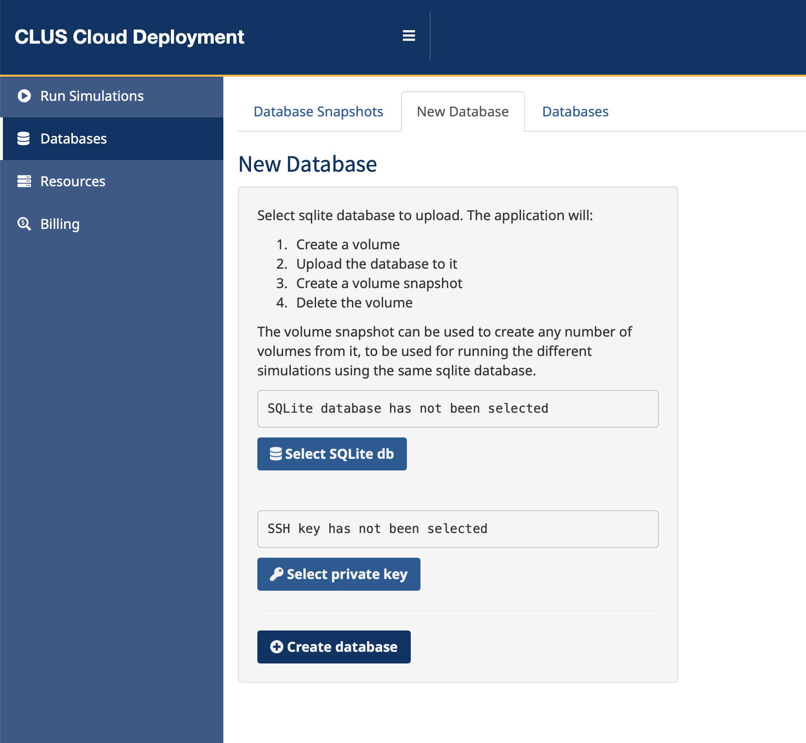
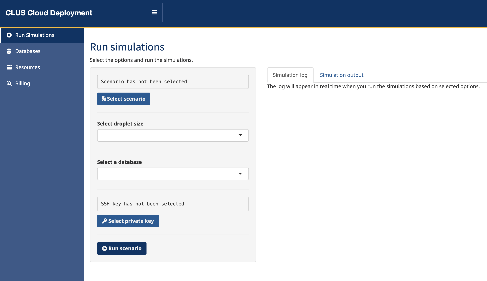
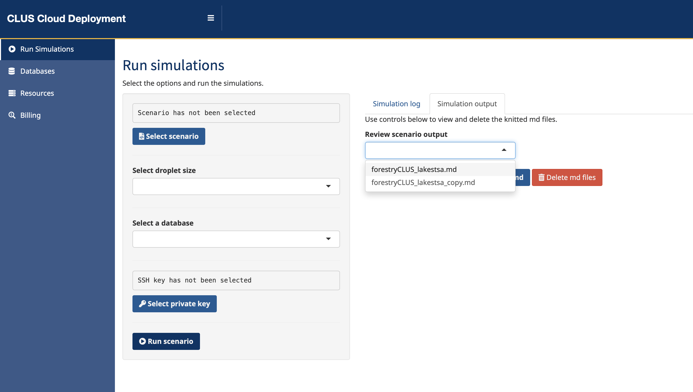

# CLUS Cloud Deployment

## About

CLUS Cloud Deployment (CCD) is a Shiny app that uses the power of cloud computing to offload the memory- and CPU-intensive simulations performed using CLUS package in a distributed manner.

The engine of the CCD is the `{analogsea}` R package (<https://pacha.dev/analogsea/index.html>), which is a wrapper around Digital Ocean REST API (<https://docs.digitalocean.com/reference/api/api-reference/>).

## Installation

CCD app is available as a part of the main CLUS repo (<https://github.com/bcgov/clus>), in the `R/apps/clus_cloud` directory relative to the root directory of the CLUS repo.

### Required R Packages

R packages required to run the app are imported as the first step in `app.R` file. The required packages are:

-   `{shiny}`
-   `{httr}`
-   `{jsonlite}`
-   `{dplyr}`
-   `{magrittr}`
-   `{dplyr}`
-   `{analogsea}`
-   `{DBI}`
-   `{shinyFiles}`
-   `{shinydashboard}`
-   `{shinyjs}`
-   `{future}`
-   `{future.callr}`
-   `{rlist}`
-   `{fs}`
-   `{stringr}`
-   `{glue}`
-   `{ssh}`
-   `{ipc}`
-   `{purrr}`
-   `{filelock}`

and they need to be installed on the host running the app.

## Authentication

In order to use the application to manage cloud resources on Digital Ocean platform and run the simulations, there are steps that need to be taken to authenticate the user and the application.

**IMPORTANT:** Each end user running the simulations has to perform these authentication steps in order to use the app.

### Digital Ocean Personal Access Token

The first step and prerequisite is to authenticate the application to the Digital Ocean using the token. The token needs to be obtained from the [Digital Ocean control panel](https://cloud.digitalocean.com). Navigate to the "API" link in the right navigation sidebar and activate the "Token/Keys" tab in the main panel.

Click `Generate New Token` button. In the popup, give token a name, select the desired expiry period, make sure that `Write` scope is checked, and click `Generate Token` button.

When the token is created, it will be visible in the list of tokens. Copy the new token (it won't be shown again for security reasons). It now needs to be added in `.Renviron` file in the root directory of the CLUS repo, with the key name `DO_PAT`. The format of this assignment in `.Renviron` is:

    DO_PAT=actual_token_pasted_here

This will authenticate the application with Digital Ocean so that new resources (droplets, volumes, snapshots) can be created and deleted as necessary.

### SSH Public-Private Key Pair

There is another layer of authentication, and that is the SSH key that the application will use to SSH to the droplets to be able to perform actions like formatting and mounting the volumes, issuing shell commands and finally executing R commands to run the simulations.

In [Digital Ocean control panel](https://cloud.digitalocean.com), navigate to "Settings" link in the right sidebar and activate the Security tab in the main panel. Click the `Add SSH Key` button and follow the instructions in the popup to create a new SSH key and add it to the Digital Ocean.

You will need to select the private key from this key pair when using the application (uploading new databases and running the simulations).

### Database Connection

In a typical use case, the scenario `Rmd` files write the output of the simulations to the database. The connection details (host, port, username, password, database name) need to be stored in the `.Renviron` file in the root directory of the main CLUS repo with the following key names:

-   `DB_HOST`

-   `DB_PORT`

-   `DB_NAME`

-   `DB_USER`

-   `DB_PASS`

If default database port is used for connection, the `DB_PORT` variable does not have to be set.

The format of this assignment in `.Renviron` is:

    DB_HOST="ACTUAL_DATABASE_HOST_IP_ADDRESS"
    DB_PORT="ACTUAL_DATABASE_PORT"
    DB_NAME="ACTUAL_DATABASE_NAME"
    DB_USER="ACTUAL_USERNAME"
    DB_PASS="ACTUAL_PASS"

These values are loaded as environment variables when the `R` session starts, and can be retrieved in the application code with `base::Sys.getenv()` function.

Since these variables are set in `.Renviron` file on the host machine running the Shiny app, they need to be passed to to the `Rmd` file that will be knitted on the droplet. This is done by executing shell commands on the created droplet which set the environment in the Linux session in which the `knitr::knit` will run so that they will be available to the scenario `Rmd` files. For that reason, each scenario `Rmd` file needs to be modified to fetch these variables by using `base::Sys.getenv` function, and then used to connect to the database to write the results. For example:

    ...

    # Get the environmment variables
    db_host <- Sys.getenv('DB_HOST')
    db_port <- Sys.getenv('DB_PORT')
    db_name <- Sys.getenv('DB_NAME')
    db_user <- Sys.getenv('DB_USER')
    db_pass <- Sys.getenv('DB_PASS')

    ...

    # Use these values to connect to the database
    uploaderCLUS = list(
      aoiName = 'xyz', # name of the schema that gets uploaded to postgres
      dbInfo  = list(
        db_host,
        db_user,
        db_pass,
        db_name
      )
    )

    ...

## Managing Databases

One of the prerequisites for running the simulations is to have `sqlite` databases that contain the simulation parameters used in scenarios. These databases can be managed in the **Databases** tab in the main app navigation in the sidebar.

The **Databases** tab contains three tab panels:

-   **Database Snapshots**

-   **New Database**

-   **Databases**

### Database Snapshots

The app uses Digital Ocean volume snapshots to store the databases. At run time, these snapshots are used to create, attach and mount actual volumes containing databases to the servers (Digital Ocean droplets) where the simulations are run. Since multiple scenarios are being run at the same time, we cannot use a single volume because of Digital Ocean limitation that one volume can be attached to only one droplet.

**Database Snapshots** screen is used to manage existing database snapshots that exist as Digital Ocean volume snapshots. At this moment, it only retrieves the list of currently existing snapshots (typically one per area of interest) when the `Refresh` button is clicked.

In the future, this screen can also include buttons to manage the snapshots (e.g. `Delete` button in each DataTables row for each individual snapshot.

### New Database

This screen is used to create a new database snapshot.

The user needs to select the `sqlite` database from the local file system, as well as the private key that will be used for SSH authentication while working with Digital Ocean resources.

Clicking the `Create database` button kicks off the process which consists of the following steps:

1.  Create a basic droplet that will handle the DO resources (volume and its snapshot).

2.  Create a new DO volume and perform the following actions on it:

    -   Attach it to the droplet created in previous step.

    -   Issue the shell command to format the volume.

    -   Mount the volume as a mount point on the droplet file system.

3.  Upload the `sqlite` database from the local file system to the droplet into the mounted volume.

4.  Detach the volume from the droplet.

5.  Delete the droplet.

6.  Create volume snapshot from the volume.

7.  Delete the volume.

### Databases

**Databases** screen is used to manage existing Digital Ocean volumes. At this moment, it only retrieves the list of any currently existing volumes when the `Refresh` button is clicked.

Normally, clicking the `Refresh` button would return any results only while running the simulations, because the volumes are deleted once the simulations are completed. However, it might also show some "dangling" volumes that were created during the simulations that had an error during the run and didn't fully complete to reach the stage of deleting the used volumes.

In the future, this screen can also include buttons to manage the volumes (e.g. `Delete` button in each DataTables row for each individual snapshot). For the time being, this needs to be performed in the [Digital Ocean control panel](https://cloud.digitalocean.com).

## Running the Simulations

This is the central point of the application.

### Selecting the Options

The user needs to select the following options before running the simulations:

-   **Scenarios** - One or more scenarios to run the simulations against. The limitation when selecting more than one scenario is that they all have to be within the same directory.

-   **Droplet size** - Size in terms of RAM available to the system. The selection has been limited to a mimimum of 16GB of RAM, as less RAM could lead to the system running out of memory and causing the whole process to fail.

-   **Database** - A list of available snapshots which contain the `sqlite` databases. The selection of the database should correspond to the area of interest for which the scenarios have been selected.

-   **Private SSH key** - A private SSH key that corresponds to the key pair created as described in the Authentication section of this document.

### Running the Process

When the options are selected, clicking the `Run scenario` button will kick off the process. Simulations are run asynchronously, with the help of `{future}` and `{future.callr}` R packages. This has several benefits:

-   The simulations can be run in parallel, reducing the overall time to get the results.

-   The application can report in real time about the current stage each simulation is at (with the help of `{ipc}` R package), as well as about the overall progress.

-   The app UI is not blocked.

The overall process consists of the following steps:

1.  Parse the given input options.

2.  Use `lapply` function to iterate over selected scenarios by applying the `run_simulation` function for each scenario, where each iteration starts a new `{future}` asynchronous process.

3.  Observe changes in simulation log file (using `shiny::reactivePoll` function) to report on progress for each simulation, as well as the overall process.

### Asynchronous Processes

Each scenario is processed in a background R process by calling the `run_simulation` function. The following steps are performed in this function:

1.  Fetch environment variables (DO_PAT for authentication with Digital Ocean, and database credentials).

2.  Create the droplet.

3.  Create the volume from the snapshot containing the relevant `sqlite` database with scenario parameters.

4.  Attach the volume to the droplet.

5.  SSH to the droplet, clone the main CLUS repo, mount the volume to the droplet and create a symbolic link in the working directory to the mounted volume containing the database.

6.  Run the simulation by executing `knitr::knit` R command.

7.  Detach and delete the volume.

8.  Download knitted `md` file for the preview of the results.

9.  Delete the droplet.

### Simulation Log

Each simulation logs its progress to the simulation log file. The log file is created in the temporary folder (using `tempfile` R function. This file is observed for changes in the main application thread, and is used to report on the progress of each simulation in the DataTables object in Simulation Log tab of the main panel.

### Previewing Results

The simulation is run by knitting the scenario `Rmd` file. The result of the knitting is an `md` file which is downloaded from the droplet before it is destroyed. This `md` file contains some useful information about the run itself, and can be used to review the simulation output.

When multiple simulations are run at the same time, each of them creates an output `md` file.

These files can be previewed from the **Run Simulations** screen. To preview the simulation output, do the following:

1.  Open **Run Simulations** screen from the main navigation in the right sidebar.
2.  Activate **Simulation output** tab in the main panel.
3.  Click the `Refresh md list` button to populate the dropdown with available `md` files.
4.  Selected the desired file.
5.  Click `Preview selected md` button to preview the file.

When the `md` files for scenarios being ran already exist (from the previous runs), they will be overwritten with the new ones on subsequent runs. Alternatively, if they are no longer needed, you can delete these files by clicking the `Delete md files` button on the same screen.

## Managing Other Resources

**Resources** screen is used to manage existing Digital Ocean droplets. At this moment, it only retrieves the list of any currently existing droplets when the `Refresh` button is clicked.

Normally, clicking the `Refresh` button would return any results only while running the simulations or uploading new databases, because the droplets are deleted once these operations are completed. However, it might also show some "dangling" droplets that were created during the simulations or database uploads that had an error during the run and didn't fully complete to reach the stage of deleting the used droplets.

In the future, this screen can also include buttons to manage the droplets (e.g. `Delete` button in each DataTables row for each individual droplets). For the time being, this needs to be performed in the [Digital Ocean control panel](https://cloud.digitalocean.com).

## Billing

This section is intended to run the reports on the cost for each individual scenario or area of interest.

At this moment this function is not available as we need create a persistent storage to be able store the cost at the scenario run-time, before the droplets are destroyed.

## Core Team

Tyler Muhly, Team Lead, Strategic Analysis, Forest Analysis and Inventory Branch, Office of the Chief Forester, Ministry of Forests, Lands, Natural Resource Operations and Rural Development

Kyle Lochhead, Ecological Modeling Specialist, Forest Analysis and Inventory Branch, Office of the Chief Forester, Ministry of Forests, Lands, Natural Resource Operations and Rural Development

## Contributors

Sasha Bogdanovic, Ruby Industries Inc.

## License

Copyright 2020-2021 Province of British Columbia

Licensed under the Apache License, Version 2.0 (the "License"); you may not use this file except in compliance with the License. You may obtain a copy of the License at

<http://www.apache.org/licenses/LICENSE-2.0>

Unless required by applicable law or agreed to in writing, software distributed under the License is distributed on an "AS IS" BASIS, WITHOUT WARRANTIES OR CONDITIONS OF ANY KIND, either express or implied. See the License for the specific language governing permissions and limitations under the License.
