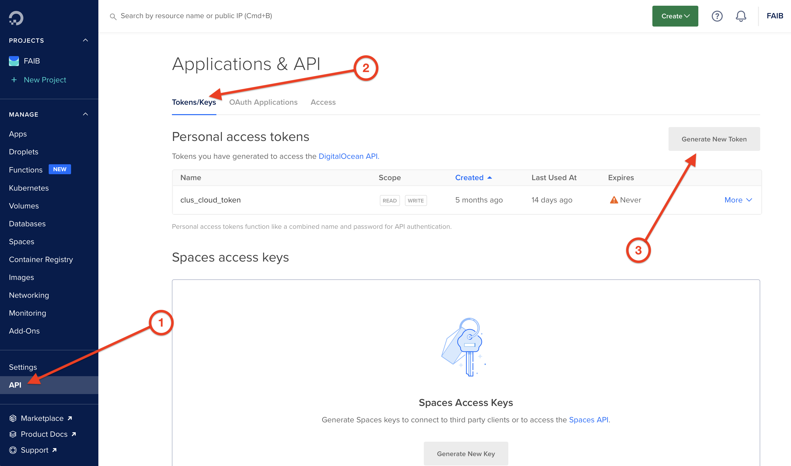
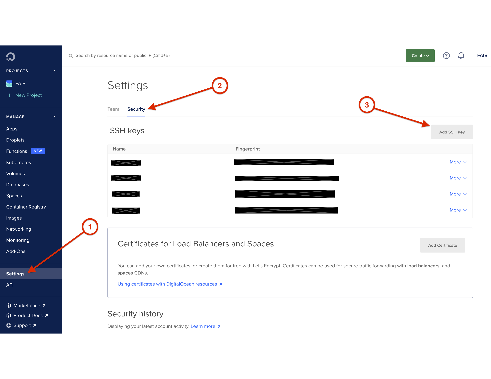

# FLEX Cloud Deployment

## About

FLEX Cloud Deployment (FCD) is a Shiny app that uses the power of cloud computing to offload the memory- and CPU-intensive simulations performed using FLEX package in a distributed manner.

The engine of the FCD is the `{analogsea}` R package (<https://pacha.dev/analogsea/index.html>), which is a wrapper around Digital Ocean REST API (<https://docs.digitalocean.com/reference/api/api-reference/>).

## Installation

FCD app is available as a part of the main FLEX repo (<https://github.com/bcgov/flex>), in the `R/apps/flex_cloud` directory relative to the root directory of the FLEX repo.

### Required R Packages

R packages required to run the app are imported as the first step in `app.R` file. The required packages are:

-   `{shiny}`
-   `{httr}`
-   `{jsonlite}`
-   `{dplyr}`
-   `{magrittr}`
-   `{dplyr}`
-   `{analogsea}`
-   `{DBI}`
-   `{shinyFiles}`
-   `{shinydashboard}`
-   `{shinyjs}`
-   `{future}`
-   `{future.callr}`
-   `{rlist}`
-   `{fs}`
-   `{stringr}`
-   `{glue}`
-   `{ssh}`
-   `{ipc}`
-   `{purrr}`
-   `{filelock}`
-   `{ColinFay/glouton}`

and they need to be installed on the host running the app.

## Authentication

In order to use the application to manage cloud resources on Digital Ocean platform and run the simulations, there are steps that need to be taken to authenticate the user and the application.

**IMPORTANT:** Each end user running the simulations has to perform these authentication steps in order to use the app.

### Digital Ocean Personal Access Token

The first step and prerequesitite is to authenticate the application to the Digital Ocean using the token. The token needs to be obtained from the [Digital Ocean control panel](https://cloud.digitalocean.com). Navigate to the "API" link in the right navigation sidebar and activate the "Token/Keys" tab in the main panel.

Click `Generate New Token` button. In the popup, give token a name, select the desired expiry period, make sure that `Write` scope is checked, and click `Generate Token` button.

When the token is created, it will be visible in the list of tokens. Copy the new token (it won't be shown again for security reasons). It now needs to be added in `.Renviron` file in the root directory of the FLEX repo, with the key name `DO_PAT`. The format of this assignment in `.Renviron` is:

    DO_PAT=actual_token_pasted_here

This will authenticate the application with Digital Ocean so that new resources (droplets, volumes, snapshots) can be created and deleted as necessary.

### SSH Public-Private Key Pair

There is another layer of authentication, and that is the SSH key that the application will use to SSH to the droplets to be able to perform actions like formatting and mounting the volumes, issuing shell commands and finally executing R commands to run the simulations.

In [Digital Ocean control panel](https://cloud.digitalocean.com), navigate to "Settings" link in the right sidebar and activate the Security tab in the main panel. Click the `Add SSH Key` button and follow the instructions in the popup to create a new SSH key and add it to the Digital Ocean.

You will need to select the private key from this key pair when using the application (uploading new databases and running the simulations).

## Managing Persisted Scenarios

## Running the Simulations

This is the central point of the application.

### Selecting the Options

The user needs to select the following options before running the simulations:

...

### Running the simulations

When the options are selected, clicking the `Run scenario` button will kick off the process. Simulations are run asynchronously, with the help of `{future}` and `{future.callr}` R packages. This has several benefits:

-   The simulations can be run in parallel, reducing the overall time to get the results.

-   The application can report in real time about the current stage each simulation is at (with the help of `{ipc}` R package), as well as about the overall progress.

-   The app UI is not blocked.

The overall process consists of the following steps:

1.  Parse the given input options.

2.  Use `lapply` function to iterate over selected scenarios by applying the `run_simulation` function for each scenario, where each iteration starts a new `{future}` asynchronous process.

3.  Observe changes in simulation log file (using `shiny::reactivePoll` function) to report on progress for each simulation, as well as the overall process.

### Asynchronous Processes

Each scenario is processed in a background R process by calling the `run_simulation` function. The following steps are performed in this function:

1.  Fetch environment variables (DO_PAT for authentication with Digital Ocean, and any other).

2.  Create the droplet.

3.  Create the volume from the snapshot containing the relevant `.tif` file.

4.  Attach the volume to the droplet.

5.  SSH to the droplet, clone the main `castor` repo, mount the volume to the droplet and create a symbolic link in the working directory to the mounted volume containing the database.

6.  Run the simulation by executing `knitr::knit` R command.

7.  Detach and delete the volume.

8.  Download knitted `md` file for the preview of the results.

9.  Download generated output files to be used for the simulation analysis.

10. Visualize the results.

11.  Delete the droplet.

### Simulation Log

Each simulation logs its progress to the simulation log file. The log file is created in the temporary folder (using `tempfile` R function. This file is observed for changes in the main application thread, and is used to report on the progress of each simulation in the DataTables object in Simulation Log tab of the main panel.

### Previewing Results

## Managing Other Resources

**Resources** screen is used to manage existing Digital Ocean droplets. At this moment, it only retrieves the list of any currently existing droplets when the `Refresh` button is clicked.

Normally, clicking the `Refresh` button would return any results only while running the simulations or uploading new databases, because the droplets are deleted once these operations are completed. However, it might also show some "dangling" droplets that were created during the simulations or database uploads that had an error during the run and didn't fully complete to reach the stage of deleting the used droplets.

In the future, this screen can also include buttons to manage the droplets (e.g. `Delete` button in each DataTables row for each individual droplets). For the time being, this needs to be performed in the [Digital Ocean control panel](https://cloud.digitalocean.com).

## Billing

This section is intended to run the reports on the cost for each individual scenario or area of interest.

At this moment this function is not available as we need create a persistent storage to be able store the cost at the scenario run-time, before the droplets are destroyed.

## Core Team

Joanna Burgar, Carnivore Conservation Biologist, Ecosystems Branch, Ministry of Water, Land and Resource Stewardship

Tyler Muhly, Team Lead, Strategic Analysis, Forest Analysis and Inventory Branch, Office of the Chief Forester, Ministry of Forests, Lands, Natural Resource Operations and Rural Development

## Contributors

Sasha Bogdanovic, Ruby Industries Inc.

## License

Copyright 2020-2021 Province of British Columbia

Licensed under the Apache License, Version 2.0 (the "License"); you may not use this file except in compliance with the License. You may obtain a copy of the License at

<http://www.apache.org/licenses/LICENSE-2.0>

Unless required by applicable law or agreed to in writing, software distributed under the License is distributed on an "AS IS" BASIS, WITHOUT WARRANTIES OR CONDITIONS OF ANY KIND, either express or implied. See the License for the specific language governing permissions and limitations under the License.
