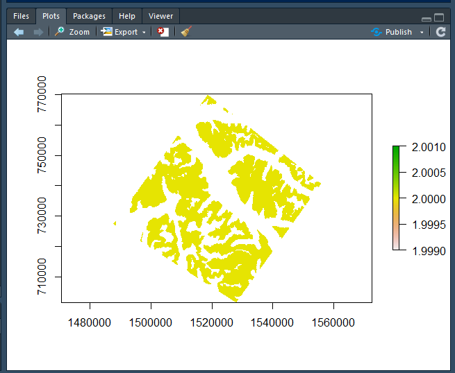
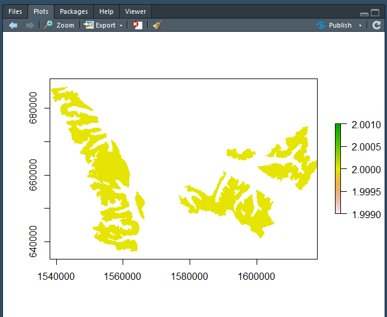
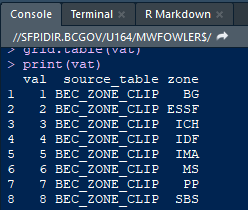

******

[Top]  
<!-- -------------------------------------------------------------------------------------------------------------------------------- -->
<!-- -------------------------------------------------------------------------------------------------------------------------------- -->  

# This documenation is still in progress    

# Overview

## Description
A series of R functions have been written that allow access to the PostGIS raster functions and will return a raster layer oject in R. 

## Installation

The functions reside in an .R file.  You would reference this file from your R script and then call the functions.

(Right Click and Copy Link - Paste into Windows Explorer)  

<a href="file:\\spatialfiles2.bcgov\work\FOR\VIC\HTS\ANA\Workarea\mwfowler\CLUS\Scripts\R">\\\\spatialfiles2.bcgov\\work\\FOR\\VIC\\HTS\\ANA\\Workarea\\mwfowler\\CLUS\\Scripts\\R</a>     

<strong>FAIB_RASTER_FUNCTIONS.R</strong>

******  
[Top](#TOP)  

<!-- -------------------------------------------------------------------------------------------------------------------------------- -->
<!-- -------------------------------------------------------------------------------------------------------------------------------- -->
# R Raster Functions  
******  

## RASTER_FROM_VECTOR

#### Description:  
This function convert an existing Postgres feature class table to a Raster.  

The output raster will align with BC Raster Grid standard and be in BC Albers (SRID:3005) projection. 

#### Implementation:  

```r
RASTER_FROM_VECTOR <- function(drawPoly, srcVect, whereClause="*", vatFld=NULL, vat=NULL, mask=FALSE, conn=NULL)
```


#### Parameters:  

<table class="table table-striped table-bordered table-hover" style="font-size: 14px; margin-left: auto; margin-right: auto;">
 <thead>
  <tr>
   <th style="text-align:left;background-color: #e6e6e6;text-align: center;font-size: 16px;"> Name </th>
   <th style="text-align:left;background-color: #e6e6e6;text-align: center;font-size: 16px;"> Type </th>
   <th style="text-align:left;background-color: #e6e6e6;text-align: center;font-size: 16px;"> Default </th>
   <th style="text-align:left;background-color: #e6e6e6;text-align: center;font-size: 16px;"> Description </th>
  </tr>
 </thead>
<tbody>
  <tr grouplength="2"><td colspan="4" style="border-bottom: 1px solid;"><strong>Required Parameters</strong></td></tr>
<tr>
   <td style="text-align:left; padding-left: 2em;font-weight: bold;" indentlevel="1"> drawPoly </td>
   <td style="text-align:left;"> WKT Polygon - Text </td>
   <td style="text-align:left;"> N/A </td>
   <td style="text-align:left;"> The area of interest represented as a WKT Polygon </td>
  </tr>
  <tr>
   <td style="text-align:left; padding-left: 2em;font-weight: bold;" indentlevel="1"> srcVect </td>
   <td style="text-align:left;"> Text </td>
   <td style="text-align:left;"> N/A </td>
   <td style="text-align:left;"> The source vector table to generate the raster from </td>
  </tr>
  <tr grouplength="5"><td colspan="4" style="border-bottom: 1px solid;"><strong>Optional Parameters</strong></td></tr>
<tr>
   <td style="text-align:left; padding-left: 2em;font-weight: bold;" indentlevel="1"> whereClause </td>
   <td style="text-align:left;"> Text </td>
   <td style="text-align:left;"> '*' </td>
   <td style="text-align:left;"> The where clause to filter the results by.  Applies to source vector </td>
  </tr>
  <tr>
   <td style="text-align:left; padding-left: 2em;font-weight: bold;" indentlevel="1"> vatFld </td>
   <td style="text-align:left;"> Text </td>
   <td style="text-align:left;"> NULL </td>
   <td style="text-align:left;"> The field to generate the raster from.  If Character a VAT will be generated on the fly or should join to supplied VAT parameter.  The generated VAT name will always beFAIB_RFV_TEMPRAST_VAT </td>
  </tr>
  <tr>
   <td style="text-align:left; padding-left: 2em;font-weight: bold;" indentlevel="1"> vat </td>
   <td style="text-align:left;"> Text </td>
   <td style="text-align:left;"> NULL </td>
   <td style="text-align:left;"> A Vat to apply to the output raster.  Must have VAL field that will define output raster values and must join to vatFld parameter </td>
  </tr>
  <tr>
   <td style="text-align:left; padding-left: 2em;font-weight: bold;" indentlevel="1"> mask </td>
   <td style="text-align:left;"> Boolean </td>
   <td style="text-align:left;"> FALSE </td>
   <td style="text-align:left;"> Whether to mask the output or retain all output values </td>
  </tr>
  <tr>
   <td style="text-align:left; padding-left: 2em;font-weight: bold;" indentlevel="1"> conn </td>
   <td style="text-align:left;"> PostgreSQLConnection </td>
   <td style="text-align:left;"> NULL </td>
   <td style="text-align:left;"> Connection Object.  If null, it defaults to connecting to the CLUS database </td>
  </tr>
</tbody>
</table>

#### Usage & Examples:   

Create a raster from a vector table using a character field (zone) field to define output values.  A VAT will be created on the fly to map the outupt raster values. 
 


```r
library(DBI)
library(RPostgreSQL)  
library(sp) 
pgConn<-GetPostgresConn("postgres", "postgres", "postgres", "localhost")

txtPoly = 'POLYGON((-118.473196412943 51.6955188330737,-118.982643618749 51.3438924145354,-118.444851411751 51.0748582423647,-117.985076049477 51.3973510159727,-118.473196412943 51.6955188330737))'

ras <- RASTER_FROM_VECTOR(txtPoly,  "BEC_ZONE_CLIP", whereClause="ZONE IN (''ESSF'') ", vatFld='ZONE', mask=FALSE, conn=pgConn)
plot(ras)
```

  


```r
library(DBI)
library(RPostgreSQL)  
library(sp) 
pgConn<-GetPostgresConn("postgres", "postgres", "postgres", "localhost")
geom <- dbGetQuery(pgConn, 'SELECT ST_ASTEXT(ST_UNION(ST_TRANSFORM(WKB_GEOMETRY, 4326))) FROM TSA_CLIP WHERE TSA_NUMBER_INT = 45')

ras <- RASTER_FROM_VECTOR(geom,  "BEC_ZONE_CLIP", whereClause="ZONE IN (''ESSF'') ", vatFld='ZONE', mask=FALSE, conn=pgConn)
plot(ras)
```

  


```r
vat <-dbGetQuery(pgConn, "SELECT * FROM FAIB_RFV_TEMPRAST_VAT")
print(vat)
```

      


[Top](#TOP)    

******
<!-- -------------------------------------------------------------------------------------------------------------------------------- -->
<!-- -------------------------------------------------------------------------------------------------------------------------------- -->
