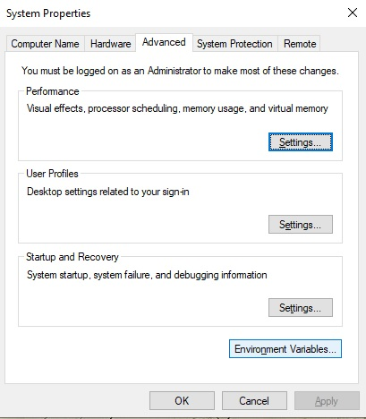
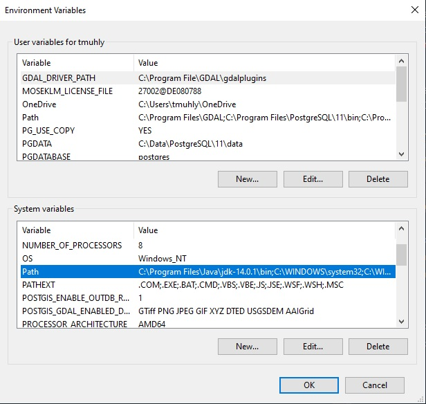
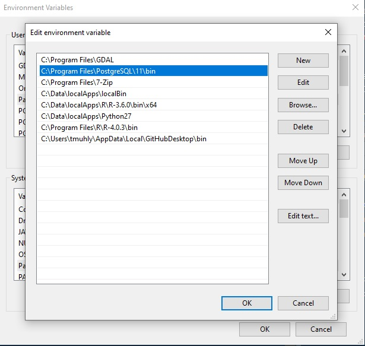
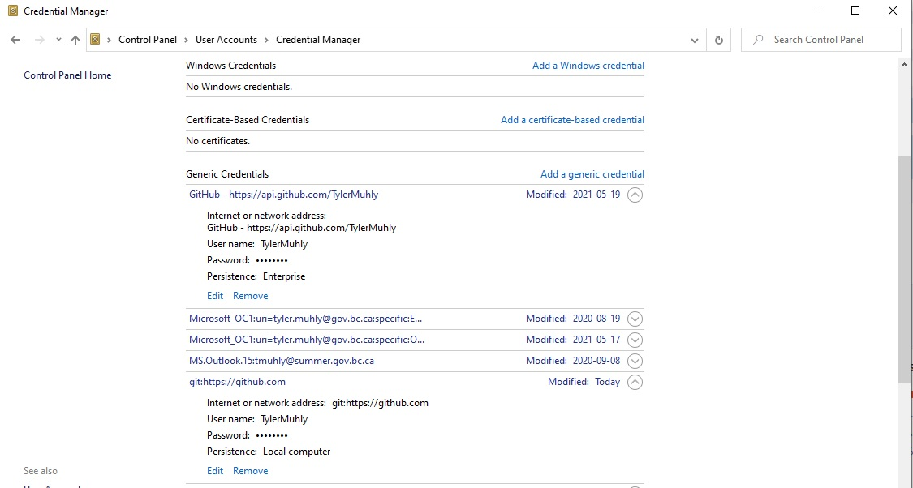
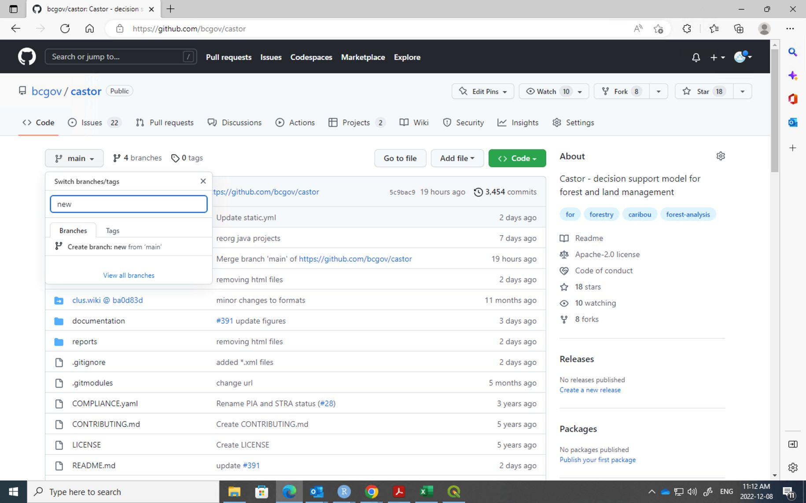
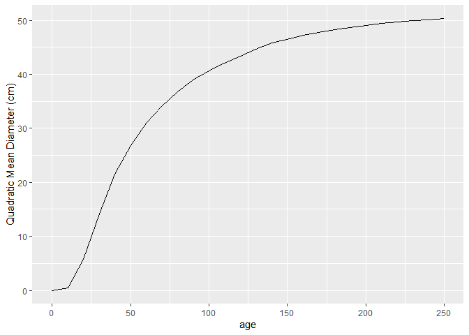
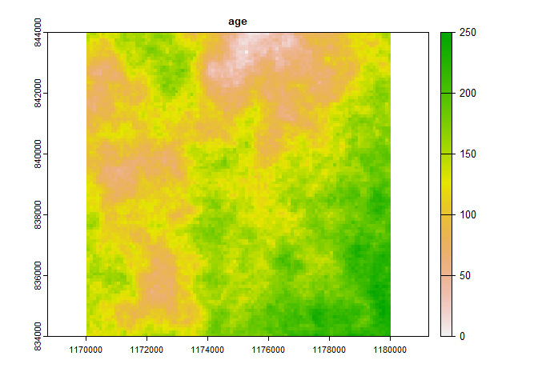
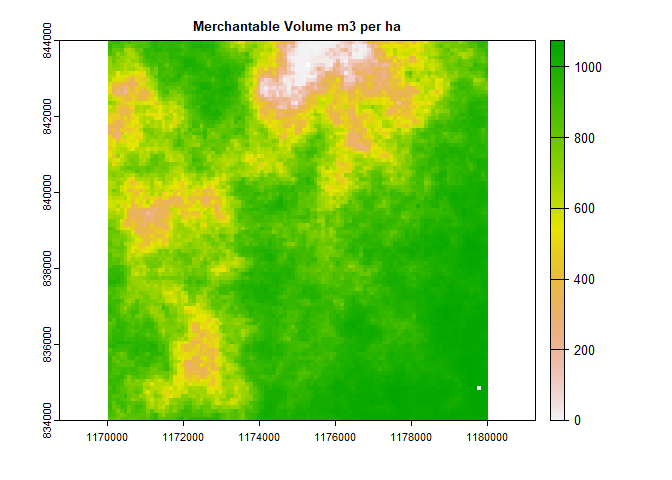
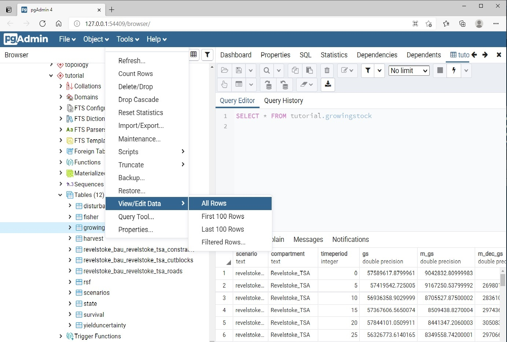
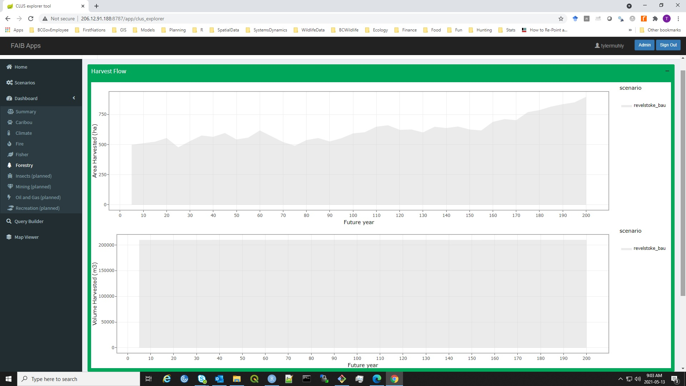

# Forest and Land Use Simulator (Castor) Quick Start Tutorial

The Castor quick-start tutorial provides step-by-step instructions on
how to use Castor It is designed to familiarize you with creating and
running a simple forest harvest scenario analysis with Castor It takes
you through all the steps needed to set-up and run Castor from scratch.

For an overview of how the Castor model works, we recommend reading our
[wiki](https://github.com/bcgov/castor/wiki). The wiki provides an
introduction to the framework and components of Castor that may
facilitate understanding this tutorial.

## 1. Download Software

Castor is primarily built using the [R programming
language](https://www.r-project.org/), and thus requires you to install
R software. You can download program R for Windows
[here](https://cran.r-project.org/bin/windows/base/). Program R has a
very simple graphical user interface, and therefore we also recommend
that you download the free version of
[RStudio](https://rstudio.com/products/rstudio/download/). RStudio is an
integrated development environment for working with R code. It provides
various windows and tabs for interacting with and running R code,
downloading and loading R packages, interfacing with GitHub (more on
that below), and managing R
[‘objects’](https://www.datacamp.com/community/tutorials/data-types-in-r).
We also recommend you download [‘git’
software](https://gitforwindows.org/) to interface and work with the
model code.

To work with our databases, you will need to download
[PostgreSQL](https://www.postgresql.org/download/) and
[pgAdmin](https://www.pgadmin.org/) software. This software will allow
you to connect to and work with PostgreSQL databases, which are the key
data structure used by Castor.

To manage and work with spatial data, you will also need to download
[OSGeo4W](https://trac.osgeo.org/osgeo4w/). This contains QGIS,
GDAL/OGR, and GRASS open source software programs that are needed to do
some spatial data manipulation.

If you are a government employee, you may want to download these
software as approved by your information technology department.

In summary, the first step of working with Castor is to download the
following software (or check that it is already installed on your
computer):

-   [program R](https://cran.r-project.org/bin/windows/base/)
-   [RStudio](https://rstudio.com/products/rstudio/download/)
-   [git](https://gitforwindows.org/)
-   [PostgreSQL](https://www.postgresql.org/download/)
-   [pgAdmin](https://www.pgadmin.org/)
-   [OSGeo4W](https://trac.osgeo.org/osgeo4w/)

### 1.1 R Packages

When working with R you will soon find that you need to download various
[packages](https://rstudio.com/products/rpackages/). Packages are
essentially bundles of specialized, self-contained code functions to
manipulate, analyze or visualize information. Packages are written by R
developers and stored on the [Comprehensive R Archive Network (CRAN)
repository](https://cran.r-project.org/web/packages/available_packages_by_name.html).
These packages must meet certain QA/QC standards, and are typically
reliable and stable.

Here we do not list all of the R Packages needed to use the Castor
model. There are many packages, they will vary depending on what aspects
of Castor are used, and they will likely evolve over time. Instead, here
we provide a brief description of how to download R packages from
RStudio.

Within the RStudio interface you will see in the bottom-right window a
“Packages” tab, with a button to “Install”, and beneath that a list of
packages downloaded in your package library. If you click on the
“Install” button it will open a window where you can enter the package
name to install it from CRAN. Once a package is downloaded, you don’t
need to download it again (unless an update is required).


Packages that you will need to run Castor are typically listed within
specific Castor model scripts, so you can download them as you need
them. Packages that you need to run a particular script are typically
called using the *library()* or *require()* commands at the start of the
script. You’ll find that you will get an error if you are missing a
package needed to run a specific function. In this case, check which
function is getting the error and download the necessary package.

### 1.2 System Variables

After you have downloaded the PGAdmin software, you will need to set a
system variable on your computer. Type “edit the system environment
variables” into the search bar in Windows, and press enter to open the”
System Properties” window. Click on the “Advanced” tab, and then the
“Environment Variables” button.



This will open a new window with “User variables” and “System variables”
boxes. Click on the “Path” variable in the “System variables” box and
click “Edit”.



You should see a list of file paths (e.g., *C:\Program Files\\.* ).
Click on the “New” button and enter the directory where the PostgreSQL
“bin” folder is located; in this example it is located at *C:\Program
Files\PostgreSQL\11\bin*. Enter the correct directory location and click
‘Ok’. This will add PostGreSQL to your environment variables and allow
you to run the software correctly.



## 2. Download the Model Code from GitHub

Once you are up and running with R Studio you can ‘clone’ the Castor
model code (i.e., make a local copy of it) so you can run and edit it
from your computer. We store the Castor model code in the [BC government
GitHub repositories](https://github.com/bcgov). If you are a BC
government employee, we recommend that you sign-up for a GitHub account,
and review the [BC government
policies](https://github.com/bcgov/BC-Policy-Framework-For-GitHub/blob/main/BC-Open-Source-Development-Employee-Guide/README.md)
on the use of GitHub. As part of this process you will be asked to
create two-factor authentication.

Once you have created and verified your account this, you will need to
request permission to have ‘admin’ access to the Castor repository.
Contact the Castor team with your GitHub ID to request this access. Once
this access is granted you should be able to read, clone, and push code
to the repository. Note that the GitHub password may only work
temporarily, in which case, after you have created an authenticated
GitHub account you will also need to set-up a [‘personal access token’
(PAT)](https://docs.github.com/en/github/authenticating-to-github/keeping-your-account-and-data-secure/creating-a-personal-access-token).
Follow [these
inrstuctions](https://docs.github.com/en/github/authenticating-to-github/keeping-your-account-and-data-secure/creating-a-personal-access-token)
to set up a PAT. Select the scopes, or permissions, you’d like to grant
this token as everything except *admin:org_hook*. Note that there is no
need to complete step 10 in the instructions.

You can now use your PAT token as the password to clone the Castor
repository from GitHub. Instead of manually entering your PAT for every
HTTPS Git operation, you can set the username and password using the
Windows Credential Manager. Open the Windows Credential Manager by
searching for “Credential Manager” on your Windows search bar. Once
open, click on “Windows Credential Manager”, then “Add a generic
credential”.



In the “Internet or network address” box enter
*<git:https://github.com>*, then add your username and the PAT as your
password. Repeat this process (i.e., create another credential), but
with *GitHub - <https://api.github.com/xxxxxx>* as the “Internet or
network address” (note: replace xxxxxx with your username). This will
tell your computer to use the PAT credentials when connecting to GitHub.

The Castor repository is located
[here](https://github.com/bcgov/castor.git). You will notice the GitHub
webpage contains a ‘folder’ structure with all the code. This can be
considered as a ‘main’ copy of the code for all of the repository users.
GitHub allows for multiple people to work with the code simultaneously,
with the GitHub version housing a stable and recent version of the code.
Cloning the repository enables you to work with a local copy of the
code.

To clone the Castor repository, open RStudio, click on the “File” tab in
the top left and then click “New Project”. This will open a new window:


In this window, select “Version Control” and then select “Git”. This
will open a window where you enter the Repository URL
(<https://github.com/bcgov/castor.git>), the name of the directory
(Castor) and specify the location where you want to save a copy of the
repository. We recommend copying the code to a local folder (not a
network folder). We also recommend that you do not clone the repository
to the root C: drive (i.e, \*“C:"*). Instead, clone the repository into
a sub-directory on your local drive, for example, *”C:\_repos"\* or
within your user profile (*“C:"*).


Once you create the repository, it will copy the code to the folder
directory you created. You will notice it has the same folder structure
as the website.

In your RStudio console, the bottom-right window “Files” tab shows the
directory for the code repository. We will describe later how to
navigate these folders to run Castor. In the next section we will
describe more how to use Git and GitHub.

## 3. Version Control and Working with GitHub

In the top-right window of RStudio you will see a “Git” tab. If you
click on that you will see a series of buttons beneath it, including:
“Diff”, “Commit”, “Pull”, and “Push”. You will also see that above the
tab in the the top-right there is some text beside an “R-box” symbol.
This indicates the repository you are currently using. It should say
“castor”. You will also notice a symbol with two purple rectangles,
beside some text that says “main”. This indicates the ‘branch’ of the
repository that you are working in.


GitHub branches can be considered as ‘working copies’ of code (see image
below). Conceptually, they are used to ‘split off’ working code from the
main branch. This work flow is designed to minimize frequent small
changes to the ‘main’ copy of the code. However, this also requires you
to re-integrate your branch with the main branch (called a “Pull
Request”) when you want to incorporate your changes to the code into the
main branch. Typically you do this after you have made significant
changes to the code, have tested the code to make sure it functions
properly, and are reasonably confident that it will not conflict with
the main code.


For now, we will create a new branch of the main code for you to work
in. This will minimize the potential for creating errors in the model
code. Below we describe two different methods for creating a branch.
Note that you can also run git commands from the Windows command line,
but we do not cover those here.

One way you can create a new branch is by going to the [github
webpage](https://github.com/bcgov/castor), and under the *\<\>Code* tab,
click on the *‘main’* button, put in a name for your new branch, and
click on “Create branch: new_branch_name from main”.



Switch back to your RStudio window, and click on the “Git” tab in the
top-right window and then click the “Pull” button. This should pull the
new branch to your local repo.

Alternatively, you can create a new branch from RStudio. First, in the
“Git” tab in the top-right window, click on the symbol with two purple
rectangles. This will open a new window called “New Branch” where you
can enter a branch name (we recommend you use your last name for now).
Make sure to set the Remote as “origin” and check the “Sync branch with
remote” box if not already done.


You will now notice that the name of the new branch appears in the text
drop-down. Now you are working in a separate branch of the code. Any
changes you make to the code will only occur in the branch you created,
as long as it is the selected branch in the drop-down text box.

Now, in the “File” tab of the bottom-right window of RStudio, click on
the “README.md” file. This should open a script document in the top-left
window of RStudio, and you should see some text describing Castor. The
README.md file is a ‘front page’ for the Castor GitHub repository,
providing users some basic information about what Castor is, and how to
learn more.

Scroll down to the “Contributors” section of the README.md file and add
your name and contact details to the list of contributors. Save the
edits (you can click the floppy disk symbol in the top left of the
window), and then click on the “Git” tab in the top-right window of
RStudio. You should see the README.md file show up in the window under
“Path”.

Click on the “Commit” button and it opens a new window with three
windows in it. This window is used to commit changes to the code to the
repository. In the top-left you will see the file name under “Path”,
with a check box (under ‘staged’) and a blue box with ‘M’ in it under
“Status”. Beneath that window you will see a window with the ‘code’
(simple text in this case), and the code you added highlighted in green.
In the top-right is a window where you can add text to add a message to
the commit (e.g., a description of the changes you made to the code).


In this window, click the “Staged” box; this defines the files that you
want to change. Add a message (e.g., “added Dwight Schrute to list of
contributors”), then click the “Commit” button. Another window will open
with the command line git code that was run to make the commit, and the
result of the commit (e.g., “1 file changed, 1 insertion(+)”).

Close that box, then click the “Push” button. Another window will open,
again with command line git code that was run to push the commit to the
GitHub repository. This ‘saves’ the changes to your branch of the file
to the GitHub repository. Note that if other people are working in the
same branch of the repository, it is good to get in the habit of
clicking the “Pull” button (top right window of RStudio). This will
integrate changes to the code made by others into your code.

Since you are working in an independent branch, you will be committing
changes to your own version of the model code. However, at some point
you will likely want to integrate your code back to the “Main” branch,
or integrate changes made to the “Main” branch of code into your branch
of code. These are managed through “Pull Requests”. Pull Requests are
managed through the [Castor GitHub
website](https://github.com/bcgov/castor). You will see a tab called
“Pull Request” on the main page of the website. Click on this tab and
you will see a green button on the middle-right of the page labeled “New
pull request”.


Click on the “New pull request” button. This will open a new page with
“Comparing changes” at the top. Underneath that you will see two buttons
“base:main” and “compare:main” with an arrow between them pointing right
to left. Click on the “base” button and you will get a drop-down menu
with the name of the different branches. Select your branch and then
click the green “Create pull request” button. This will open a new page
where you can add a message to describe the pull request (e.g., “added
my name to the contributors list”). Click again on the the green “Create
pull request” button. This will send a request to the Castor team to
integrate changes to the code to the main. They will review and approve
those changes. Congratulations, you are now a contributor to Castor! You
now have a working understanding of how to use Git and GitHub to manage
edits to your Castor code.


### 3.1 GitHub Work Flow Description

Our general approach to using Git/GitHub version control is to: create a
new independent branch; regularly save and commit to that branch locally
and push/pull to the GitHub version; and integrate with the ‘main’
branch (a ‘pull request’) when larger pieces of work are completed.

To clarify this process, an independent branch is a working copy of the
code. As you work within this branch, you make changes to it independent
of the main, or any other branch. When you open, edit and then save a
script (e.g., a .Rmd or .R file) within your working branch, you are
overwriting the script file, similar to how you work with a local text
file, like a Word document. When you do a Git ‘commit’ of a script file,
you are saving a specific version of the file that you are working on
locally, similar to saving a text file with a different name then the
original (e.g., file_version2.doc), because you want to preserve the
original and new version. Each new “commit’ is therefore like saving a
specific version of the script. You can also save these commits
remotely, in the GitHub repository, by doing a”Push” after you commit.
This is similar to backing up a text file on an external hard drive. You
can also “Pull” from the GitHub, which will take the version of the file
on GitHub and update your local version with any changes. However, if
you are the only person working in a branch, a “Pull” is not necessary,
as there should be no changes, with the exception of when you do a “Pull
Request”. You do a “Pull Request” when you want to integrate the work of
others into your branch, and vice-versa. This is similar to saving edits
to scripts from other users into your version of the scripts, and saving
the changes you made into other peoples files. Pull requests don’t need
to be done as regularly as ‘commits’, and it is good practice to
complete Pull Requests when you have completed specific scripting tasks
(e.g., when you create a new script, change the process for how data is
analyzed within a script, etc.).

## 4. Set-up a Keyring

Castor uses networked PostgreSQL databases to store and manage data. To
keep these databases and the network secure, we do not post the database
access credentials (e.g., user names and passwords) in the Castor code.
Instead we use the [R package
“keyring”](https://cran.r-project.org/web/packages/keyring/keyring.pdf)
to store credentials locally in the Windows “Credentials Manager” and
use the “keyring” function to call those credentials from R scripts.

We have developed an R markdown document for setting up a keyring. In
the Castor repository, navigate to R-\>
functions-\>[keyring_init.Rmd](https://github.com/bcgov/castor/blob/main/R/functions/keyring_init.Rmd)
and open the file. Follow the instructions in the document to set-up the
keyring on your local computer. Prior to creating the keyring, you will
need to contact the Castor core team (<Kyle.Lochhead@gov.bc.ca> or
<Elizabeth.Kleynhans@gov.bc.ca> or <Tyler.Muhly@gov.bc.ca>) to obtain a
user name and password credentials for accessing the PostgreSQL
databases. Note that these are different then the credentials used to
set-up GitHub. GitHub and PostrgeSQL are independent components of the
Castor framework.

Once you are set-up with keyring, you can also use the credentials
information to connect to the PostgreSQL databases using PGAdmin
software. You may want to connect to the databases using PGAdmin to
familiarize yourself with the data. For example, in the ‘Castor’
database on our government network computer, within the “public” schema,
there is a table called “pgdbs_data_list”. This table describes all the
data in the PostgreSQL databases. In addition, within the
‘documentation’ folder of Castor, there is a “data_management_guide.Rmd”
that describes the “pgdbs_data_list” table and instructions on how to
add and update the table, in the event that you need to do so.

## 5. Castor SQLite Database

The simulator modules within the Castor model do not run directly off of
the PostgreSQL database. Instead Castor has a module called *dataCastor*
that consolidates data from the PostgreSQL database into a portable
SQLite database. The SQLite database contains all the data needed to run
the simulator modules for a defined area of interest. This approach
provides a lot of flexibility, as it creates a self-contained,
relatively low memory database that can be shared among users. One way
to think about the Castor data structure, is that the PostgreSQL
database serves as the central repository for stable, provincial-scale
datasets, such as for example, the forest inventory. The *dataCastor*
compiles a specified subset of this data for an area of interest and
group the information into an SQLite database.

### 5.1 Getting Aquainted with a Castor SQLite database

In this section you will use the *dataCastor* module to create a simple
SQLite database. The purpose of this simple database is to get
acquainted with how to connect to the castor SQLite database and how it
is structured so that you can preform queries to get information.

To start, go to the the *dataCastor* module located in the
“R-\>SpaDES-modules” folder. Within the folder you will find a single
dataCastor.R file and dataCastor.Rmd. The .R file is the script that
contains the functions that manipulate the data. This script should only
be changed if there is a need to modify or add to the fundamental
process of creating the SQLite database. The .Rmd file is used to define
the scenario specific parameters that get implemented in the .R file.
Thus, the two scripts work together, where the .Rmd is the more flexible
script where you define the modifiable parameters that get implemented
by the .R script. The. Rmd can be copied and modified as needed, for
specific scenarios, whereas the .R file should have only one copy and is
rarely changed.

Within the .Rmd you will notice features of the SpaDES module structure.
It starts with a text description of the .Rmd. Beneath that is a code
“chunk” (*r module_usage*). Within this chunk are listed the modules,
parameters and objects needed to run the .R code.

You will notice some buttons on the top right-hand side of the code
chunk for running or modifying the script within the chunk. At the top
of the code chunk you will see the packages (*library()* commands) and
source code (*source()* command) needed to run the script, some commands
for setting the environment for using Java (*Sys.setenv()* command) and
the directory paths (*setPaths()* command) for the module inputs and
outputs.

Next you will see a list object called *times*. Since *dataCastor* is
not a dynamic simulation, and is a single event process to create a
database, you will see that the *start* and end *times* are equal to 0.

Beneath that you will see a list object called *parameters*. This is a
large list of parameters needed to run the *dataCastor* module.
Importantly, you will notice that within this list there is a unique
list of parameters for each module. Thus, the *parameters* list contains
a list of modules needed to run the analysis (in this case create the
SQLite database), that each have a list of the parameters needed to run
the module. This approach provides flexibility, as modules can be added
or removed from the list, as needed, rather than needing to keep track
of all of the parameters.

``` r
library(SpaDES)
```

    ## loading reproducible    1.2.10
    ## loading quickPlot       0.1.8
    ## loading SpaDES.core     1.0.10
    ## loading SpaDES.tools    0.3.10

    ## Default paths for SpaDES directories set to:
    ##   cachePath:  
    ##   inputPath:  D:\temp\RtmpInSZns/SpaDES/inputs
    ##   modulePath: D:\temp\RtmpInSZns/SpaDES/modules
    ##   outputPath: D:\temp\RtmpInSZns/SpaDES/outputs
    ## These can be changed using 'setPaths()'. See '?setPaths'.

``` r
library(SpaDES.core)
library(data.table)
library(dplyr)
```

    ## 
    ## Attaching package: 'dplyr'

    ## The following objects are masked from 'package:data.table':
    ## 
    ##     between, first, last

    ## The following objects are masked from 'package:stats':
    ## 
    ##     filter, lag

    ## The following objects are masked from 'package:base':
    ## 
    ##     intersect, setdiff, setequal, union

``` r
source(here::here("R/functions/R_Postgres.R"))
```

    ## Loading required package: RPostgreSQL

    ## Loading required package: DBI

    ## Linking to GEOS 3.10.2, GDAL 3.4.1, PROJ 7.2.1; sf_use_s2() is TRUE

    ## terra 1.7.3

    ## 
    ## Attaching package: 'terra'

    ## The following object is masked from 'package:data.table':
    ## 
    ##     shift

    ## The following object is masked from 'package:SpaDES.tools':
    ## 
    ##     wrap

    ## The following object is masked from 'package:SpaDES.core':
    ## 
    ##     time<-

    ## Loading required package: sp

    ## 
    ## Attaching package: 'raster'

    ## The following object is masked from 'package:dplyr':
    ## 
    ##     select

    ## Please note that rgdal will be retired during 2023,
    ## plan transition to sf/stars/terra functions using GDAL and PROJ
    ## at your earliest convenience.
    ## See https://r-spatial.org/r/2022/04/12/evolution.html and https://github.com/r-spatial/evolution
    ## rgdal: version: 1.6-4, (SVN revision 1196)
    ## Geospatial Data Abstraction Library extensions to R successfully loaded
    ## Loaded GDAL runtime: GDAL 3.4.1, released 2021/12/27
    ## Path to GDAL shared files: C:/Data/localApps/R/R-4.3.2/library/sf/gdal
    ## GDAL binary built with GEOS: TRUE 
    ## Loaded PROJ runtime: Rel. 7.2.1, January 1st, 2021, [PJ_VERSION: 721]
    ## Path to PROJ shared files: C:\Program Files\PostgreSQL\14\share\contrib\postgis-3.2\proj
    ## PROJ CDN enabled: FALSE
    ## Linking to sp version:1.6-0
    ## To mute warnings of possible GDAL/OSR exportToProj4() degradation,
    ## use options("rgdal_show_exportToProj4_warnings"="none") before loading sp or rgdal.

    ## 
    ## Attaching package: 'rgdal'

    ## The following object is masked from 'package:terra':
    ## 
    ##     project

    ## Loading required package: gsubfn

    ## Loading required package: proto

    ## Loading required package: RSQLite

    ## sqldf will default to using PostgreSQL

``` r
paths <- list(
  modulePath = paste0(here::here(),"/R/SpaDES-modules"),
  outputPath = paste0(here::here(),"/R/SpaDES-modules/dataCastor")
)

times <- list(start = 0, end = 0)
parameters <-  list(
  .progress = list(type = NA, interval = NA),
  .globals = list(),
  dataCastor = list(saveCastorDB = TRUE,
                    sqlite_dbname = 'simple',
                    randomLandscapeZoneNumber = 1,
                    randomLandscape = list(100,100,0, 100, 0, 100),
                    randomLandscapeZoneConstraint = data.table(zoneid = 1,  variable = 'age', threshold = 140, type = 'ge', percentage = 0)
                    )
  )

# Sample to add more "zones"
#rbindlist(list(data.table(zoneid = 1,  variable = 'age', threshold = 140, type = 'ge', percentage = 0),data.table(zoneid = 2,  variable = 'age', threshold = 140, type = 'ge', percentage = 0)))

scenario = data.table(name="test", description = "test")
objects <- list(scenario = scenario)

modules <- list("dataCastor")
inputs <- list()
outputs <- list()


mySim <- simInit(times = times, params = parameters, modules = modules,
                 objects = objects, paths= paths)
```

    ## Setting:
    ##   options(
    ##     spades.outputPath = 'C:/Users/klochhea/castor/R/SpaDES-modules/dataCastor'
    ##     spades.modulePath = 'C:/Users/klochhea/castor/R/SpaDES-modules'
    ##   )

    ## Paths set to:
    ##   options(
    ##     rasterTmpDir = 'C:/Users/klochhea/AppData/Local/Temp/RtmpG2m9lo/raster'
    ##     reproducible.cachePath = 'C:/Users/klochhea/AppData/Local/Temp/RtmpG2m9lo/Require/cache'
    ##     spades.inputPath = 'D:/temp/RtmpInSZns/SpaDES/inputs'
    ##     spades.outputPath = 'C:/Users/klochhea/castor/R/SpaDES-modules/dataCastor'
    ##     spades.modulePath = 'C:/Users/klochhea/castor/R/SpaDES-modules'
    ##   )

    ## Getting dependencies for 7 packages on CRAN

    ## ... 7 of these have recursive dependencies

    ## 

    ##  1 of 7

    ##  2 of 7

    ##  3 of 7

    ##  4 of 7

    ##  5 of 7

    ##  6 of 7

    ##  7 of 7

    ##  Done!

    ## defineParameter: 'seedRandomLandscape' is not of specified type 'integer'.

    ## defineParameter: 'maxAgeRandomLandscape' is not of specified type 'integer'.

    ## defineParameter: 'randomLandscapeZoneNumber' is not of specified type 'integer'.

    ## dataCastor: module code: scenario is declared in metadata inputObjects, but no default(s) is provided in .inputObjects

    ## dataCastor: module code: scenario is declared in metadata inputObjects, but is not used in the module

    ## dataCastor: module code: setTablesCastorDB: local variable 'ras.extent' assigned but may not be used

    ## dataCastor: module code: setTablesCastorDB: local variable 'yld.ids' assigned but may not be used

    ## dataCastor: module code: setTablesCastorDB: local variable 'zones_aoi' assigned but may not be used

    ## dataCastor: module code: setZoneConstraints : <anonymous>: parameter 'x' may not be used
    ## dataCastor: module code: setZoneConstraints : <anonymous>: parameter 'x' may not be used
    ## dataCastor: module code: setZoneConstraints : <anonymous>: parameter 'x' may not be used

    ## dataCastor: module code: setZonePrescriptions : <anonymous>: parameter 'x' may not be used

    ## Apr17 13:10:12 simInit: dtCstr Running .inputObjects for dataCastor

``` r
system.time({
mysimout<-spades(mySim)
})
```

    ## Warning in download.file(url, destfile = f, quiet = TRUE): URL
    ## 'https://cran.r-project.org/CRAN_mirrors.csv': Timeout of 60 seconds was reached

    ## Warning: failed to download mirrors file (cannot open URL
    ## 'https://cran.r-project.org/CRAN_mirrors.csv'); using local file
    ## 'C:/Data/localApps/R/R-4.3.2/doc/CRAN_mirrors.csv'

    ## Apr17 13:11:13 chckpn total elpsd: 0.002 secs | 0 checkpoint init 0

    ## Apr17 13:11:13 save   total elpsd: 0.0053 secs | 0 save init 0

    ## Apr17 13:11:13 prgrss total elpsd: 0.0078 secs | 0 progress init 0

    ## Apr17 13:11:13 load   total elpsd: 0.0098 secs | 0 load init 0

    ## Apr17 13:11:13 dtCstr total elpsd: 0.011 secs | 0 dataCastor init 1

    ## Apr17 13:11:13 dtCstr Build

    ## Apr17 13:11:13 dtCstr create castordb

    ## Apr17 13:11:13 dtCstr ...setting data tables

    ## Apr17 13:11:13 dtCstr .....compartment ids: default 1

    ## Apr17 13:11:13 dtCstr New output format of RFsimulate: S4 object of class 'RFsp';for a bare, but faster array format use 'RFoptions(spConform=FALSE)'.

    ## Apr17 13:11:14 dtCstr .....ownership: default 1

    ## Apr17 13:11:14 dtCstr .....zone ids: randomly created: 1

    ## Apr17 13:11:14 dtCstr .....thlb: default 1

    ## Apr17 13:11:14 dtCstr .....yield ids: default 1

    ## Apr17 13:11:14 dtCstr .....yield trans ids: default 1

    ## Apr17 13:11:14 dtCstr .....treed: default 1

    ## Apr17 13:11:14 dtCstr .....crown closure: default 60

    ## Apr17 13:11:14 dtCstr .....height: default 10

    ## Apr17 13:11:14 dtCstr .....siteindex: default NA

    ## Apr17 13:11:14 dtCstr ... setting ZoneConstraints table

    ## Apr17 13:11:14 dtCstr ... setting ZoneConstraints table using randomLandscapeZoneConstraint

    ## Apr17 13:11:14 dtCstr ...done

    ## Apr17 13:11:14 dtCstr ...update yields

    ## Apr17 13:11:14 dtCstr ...create indexes

    ## Apr17 13:11:14 dtCstr total elpsd: 1.7 secs | 0 dataCastor forestStateN

    ## Apr17 13:11:14 dtCstr total elpsd: 1.8 secs | 0 dataCastor removeCastor

    ## Apr17 13:11:14 dtCstr Saving castordb

    ## simList saved in
    ##  SpaDES.core:::.pkgEnv$.sim 
    ## It will be deleted at next spades() call.

    ##    user  system elapsed 
    ##    1.86    0.09   62.21

After running the above script a castor SQLite database will be located
in */R/SpaDES-modules/dataCastor* its name will be
‘simple_castordb.sqlite’ because the parameter *sqlite_dbname ==
‘simple’*. If you were to set the *sqlite_dbname* parameter to ‘Soo_TSA’
the castordb would be called ‘Soo_TSA_castordb.sqlite’. In dataCastor.R
you can see all the defined parameters following the SpaDES function
‘defineParameter()’ with their default values.

Now lets connect to the castordb.

``` r
library(DBI)
#Create a DBI connection using the RSQLite:SQLite() driver
con = dbConnect(RSQLite::SQLite(), dbname = "simple_castordb.sqlite")
#Take a look at the table names
dbGetQuery(con, "SELECT name FROM sqlite_master WHERE type='table';")
```

    ##               name
    ## 1           yields
    ## 2      raster_info
    ## 3             zone
    ## 4  zoneConstraints
    ## 5 zonePrescription
    ## 6           pixels

You should see several tables in this relational database. A description
of the relationships between tables can be found
[here](https://github.com/bcgov/castor/blob/main/R/SpaDES-modules/dataCastor/README.md).

The main table to consider is the *pixels* table which contains
information for each pixel labeled with a *pixelid* that corresponds to
the pixels location in the raster. The *pixelid* is the primary key for
the pixels table but there are often a number of foreign keys, for
example, a foreign key related to the *yields* table is aptly named
*yieldid*.

``` r
#Take a look at the pixels table
dbGetQuery(con, "SELECT * FROM pixels where age > 0 limit 1;")
```

    ##   pixelid compartid own yieldid yieldid_trans zone_const treed thlb elv age vol
    ## 1      54       all   1       1             1          0     1    1   0   6   0
    ##   cvol dist crownclosure height basalarea qmd siteindex dec_pcnt eca
    ## 1    0    0         1.68   1.62         0 0.3        NA        0   1
    ##   salvage_vol dual priority zone1
    ## 1           0   NA        0     1

The *yields* table contains all the required yield curves (age vs yield)
for the analysis. Note “yields” can be anything like basal area per ha,
equivalent clear cut area (eca), or something not labelled below but can
be inferred from the age of a specific stand/forest type like say fire
risk (ignition/ha) or carbon (t/ha).

``` r
library(ggplot2)
#Take a look at the yields table
yields<-dbGetQuery(con, "SELECT * FROM yields order by age")
ggplot2::ggplot(data = yields, aes(x = age, y = qmd)) + geom_line() + ylab("Quadratic Mean Diameter (cm)")
```



``` r
print(yields)
```

    ##    id yieldid age   tvol dec_pcnt height  qmd basalarea crownclosure  eca
    ## 1   1       1   0    0.0       NA    0.0  0.0       0.0          0.0 1.00
    ## 2   2       1  10    0.0       NA    2.7  0.5       0.0          2.8 1.00
    ## 3   3       1  20    0.0       NA    7.1  5.7       1.3         25.6 0.25
    ## 4   4       1  30   24.2       NA   11.4 14.1       8.1         64.7 0.10
    ## 5   5       1  40   98.6       NA   15.4 21.5      18.6         79.6 0.10
    ## 6   6       1  50  192.9       NA   18.9 26.8      28.6         82.5 0.10
    ## 7   7       1  60  292.4       NA   22.0 30.9      37.7         82.5 0.10
    ## 8   8       1  70  382.1       NA   24.7 34.0      45.1         82.0 0.10
    ## 9   9       1  80  482.8       NA   27.1 36.8      52.7         81.6 0.10
    ## 10 10       1  90  574.5       NA   29.2 39.0      58.9         81.2 0.10
    ## 11 11       1 100  648.0       NA   31.0 40.7      63.7         80.8 0.10
    ## 12 12       1 110  706.6       NA   32.5 42.1      67.4         80.3 0.10
    ## 13 13       1 120  771.6       NA   33.9 43.4      71.1         79.9 0.10
    ## 14 14       1 130  833.7       NA   35.0 44.7      74.6         79.5 0.10
    ## 15 15       1 140  885.8       NA   36.0 45.8      77.4         79.1 0.10
    ## 16 16       1 150  924.2       NA   36.9 46.5      79.3         78.6 0.10
    ## 17 17       1 160  956.2       NA   37.7 47.2      80.8         78.2 0.10
    ## 18 18       1 170  982.6       NA   38.3 47.8      82.1         77.8 0.10
    ## 19 19       1 180 1004.2       NA   38.9 48.3      83.1         77.4 0.10
    ## 20 20       1 190 1023.1       NA   39.3 48.7      83.9         76.9 0.10
    ## 21 21       1 200 1038.7       NA   39.7 49.1      84.5         76.5 0.10
    ## 22 22       1 210 1051.1       NA   40.1 49.4      84.9         76.1 0.10
    ## 23 23       1 220 1060.5       NA   40.4 49.7      85.2         75.7 0.10
    ## 24 24       1 230 1067.6       NA   40.6 49.9      85.3         75.2 0.10
    ## 25 25       1 240 1072.5       NA   40.8 50.1      85.4         74.8 0.10
    ## 26 26       1 250 1075.6       NA   41.0 50.3      85.4         74.4 0.10

The *raster_info* table contains the metadata used to build rasters and
connect the *pixels* table to the spatial location. The default entry is
a raster is named ‘ras’ but you can add multiple rasters as their
resolution or scale changes - for instance the climate projection
information is at a resolution of 800 m after downscaling to the PRISM
grid.

``` r
library(terra)
# Get the raster metadata
ras.info<-dbGetQuery(con, "SELECT * FROM raster_info where name = 'ras';")
print(ras.info)
```

    ##   name    xmin    xmax   ymin   ymax ncell nrow  crs
    ## 1  ras 1170000 1180000 834000 844000 10000  100 3005

``` r
#build a generic raster called 'ras'
ras<-rast(xmin= ras.info$xmin, xmax=ras.info$xmax, ymin=ras.info$ymin, ymax=ras.info$ymax, nrow = ras.info$nrow, ncol = ras.info$ncell/ras.info$nrow)
crs(ras) <-st_crs(as.integer(ras.info$crs))$wkt

#Assign it values to plot
ras[]<-dbGetQuery(con, "select age from pixels order by pixelid;")$age
plot(ras, main = 'age')
```



``` r
ras[]<-dbGetQuery(con, "select vol from pixels order by pixelid;")$vol
plot(ras, main = 'Merchantable Volume m3 per ha')
```


The tables *zone* and *zoneConstraints* are useful for setting landcover
objective or other types of constraints to timber harvesting. Take a
look at the zone table - notice there are only two columns the
zone_column and the reference_zone.

``` r
dbGetQuery(con, "SELECT * FROM zone")
```

    ##   zone_column reference_zone
    ## 1       zone1        default

The zone_column refers to the name of the column in the pixels table.
Adding more zones by the user to specify say wildlife habitat areas or
ungulate winter range just adds more columns to the pixels table that
are labelled as zone1, zone2, …, zone100

The reference refers to the name of the raster which was labelled by the
user (e.g., ‘wha_2024.tif’, ‘uwr_2022.tif’). Here reference column
contains a single entry ‘default’ because the simple database didn’t
describe a zone from a list of raster rather it made a default zone
where all pixels belong to the same zone and labelled this zone as
‘default’.

The zoneConstraints are essentially inequalities assigned to each zoneid
contained within a zone. Thus, a single zone raster (e.g., BEC zones)
can have multiple zonal constraints. These represent inequalities such
that a query must hold for a percentage of the total area. The
inequalities look like this: WHERE_CLAUSE \>= \| \<= percentage\*t_area

E.g., the WHERE_CLAUSE is: variable (age) type (ge; greater or equal to)
threshold (140 years) which must hold for percentage(0)\*total_area
(t_area).

``` r
dbGetQuery(con, "SELECT * FROM zoneConstraints")
```

    ##   id zoneid reference_zone zone_column ndt variable threshold type percentage
    ## 1  1      1        default       zone1   3      age       140   ge          0
    ##   denom multi_condition t_area start stop
    ## 1  <NA>            <NA>  10000     0  250

-   NOTE:
-   The zoneConstraints can begin and stop according to the user defined
    ‘start’ and ‘stop’ columns
-   The WHERE_CLAUSE can contain multiple conditions like: \`AGE \> 20
    AND basalarea \> 15’

During the simulation of timber harvesting in forestryCastor, these
zoneConstraints are used to build individual queries (one for each
ZoneConstraint) to determine the left hand side and right hand side of
the inequality. For a brief primer on how forestryCastor uses this
information —

Pixels are selected that occur within the zoneid and are sorted - ‘ORDER
BY’ the WHERE_CLAUSE using a ‘CASE’ statement. Pixels that meet the
WHERE_CLAUSE are first and those that don’t are last in the result set.
There are some other factors in the ‘ORDER BY’ like THLB or already
constrained pixels or AGE so as to minimize the impact of a constraint
on timber harvesting.

Once all the pixels are sorted there is a ‘LIMIT’ of what gets returned
in the result set. Thus, there will be pixels being returned that don’t
meet the WHERE_CLAUSE but will be considered “recruitment”. Note - that
this simple assignment of zonal constraints doesn’t consider the spatial
juxtaposition in the classification of recruitment.

As the level of complexity increase, more modules are added, there will
be more tables created in the castordb. For instance, blockingCastor
will add the *blocks* table which be related to the *pixels* table using
‘blockid’ as a foreign key in the *pixels* table and a primary key in
the *blocks* table. Similarily, *roads* table will be added as
roadCastor is included, etc

### 5.2 Creating a Castor SQLite Database from PostgreSQL

So far, a castordb was created using made-up information. Operationally,
castor models should be specific to actual planning units. To do this,
we have opted to develop and maintain a centralized database that houses
information and data in a form that is ready to go for any location in
the province of BC. The idea is that we run a .rmd to build the castordb
then reference this database for use in scenario analysis. This has some
benefits like: processing and manipulating the information outside of
the simulation which saves on the simulation side, storage of the data
and information into a relational database rather than a set of folders,
dissemination of the information to other users. However, any localized
postgres relational database will work as long as the your database
contains the [SQL
functions](https://github.com/bcgov/castor/blob/main/SQL/FAIB_RASTER_FUNCTIONS.sql)
used by castor.

Below we provide an example of the code chunk you can use to run the
script, with annotations that describe each parameter. Instead of
copying code its best navigate to the castor/R/scenarios/tutorial folder
and run the dataCastor_tutorial.Rmd. Below we will describe the key
parameters need to run *dataCastor* for building a castordb.

``` r
# R Packages need to run the script
library (SpaDES) 
library (SpaDES.core)
library (data.table)
library (keyring)
source (here::here("R/functions/R_Postgres.R")) # R functions needed to run the script
#Sys.setenv(JAVA_HOME='C:\\Program Files\\Java\\jdk-14.0.1') # Location of JAVA program; make sure the version is correct
paths <- list(modulePath = paste0 (here::here (), "/R/SpaDES-modules"),
              inputPath = paste0 (here::here (), "/R/scenarios/tutorial/inputs"),
              outputPath = paste0 (here::here (), "/R/scenarios/tutorial/outputs"))

times <- list (start = 0, end = 0) # sets start and end time parameters; here both = 0 since this is a database creation step
```

Within the parameters list, the *dataCastor* list contains the
parameters needed to define the analysis area of interest (i.e., spatial
area where you want to run simulations). These are annotated in the code
chunk above, and include *dbName*, *nameBoundaryFile*,
*nameBoundaryColumn*, *nameBoundary*, *nameBoundaryGeom*,
*nameCompartmentRaster*, *nameCompartmentTable* and
*nameMaskHarvestLandbaseRaster*. In combination, these parameters tell
*dataCastor* the area of the province where you want to complete your
simulation analysis. The module takes this information and proceeds to
‘clip’ the datasets needed for the simulation accordingly.

Note that you can include multiple areas of interest (i.e.,
*nameBoundary*) together within the same SQLite database by using the
concatenation
([c()](https://stat.ethz.ch/R-manual/R-patched/library/base/html/c.html))
function in R, e.g., c(“Revelstoke_TSA”, “Golden_TSA”).

The *sqlite_dbname* parameter is used to define the name of the output
SQLite database that will be saved by dataCastor. This should be named
something related to the analysis (e.g., the area of interest).

The next set of parameters are the *nameZoneRasters* and
*nameZoneTable*. In the Castor vernacular, ‘zones’ refer to areas where
a constraint is applied to a land use activity (e.g., a forest cover
constraint on harvest). Here you will see a concatenation of several
raster datasets. For forestry simulations, there are some key zones that
should be included in the database, these include:

-   rast.zone_cond_beo
-   rast.zone_cond_vqo
-   rast.zone_cond_wha
-   rast.zone_uwr_2021; NOTE: previous version is called
    rast.zone_cond_uwr
-   rast.zone_cond_fsw
-   rast.zone_cond_nharv
-   rast.zone_cond_cw

You will notice each of these are in the “rast” schema of the database
and have the “zone_cond” naming. These rasters were all created using
scripts within the
[Params](https://github.com/bcgov/castor/tree/main/R/Params) folder of
the repository. These scripts are intended to provide documentation of
how these constraints were created, and can be updated or modified as
needed. In these scripts you will see they take spatial polygonal data,
interpret a forest harvest constraint for that polygon, create a raster
integer identifier for unique ‘zones’ within the polygon, and create an
associated table that defines a constraint for each identifier, similar
to the process you followed in Section 6, above.

Several of the parameters were created in the
[prov_manage_objs.Rmd](https://github.com/bcgov/castor/blob/main/R/Params/prov_manage_objs.Rmd).
Specifically, biodiversity emphasis option (BEO) zones (i.e., landscape
units) are spatially defined as *rast.zone_cond_beo*, using the
[Biodiversity
Guidebook](https://www.for.gov.bc.ca/ftp/hfp/external/!publish/FPC%20archive/old%20web%20site%20contents/fpc/fpcguide/BIODIV/chap1.htm#bid),
visual quality constraints are spatially defined as
*rast.zone_cond_vqo*, fisheries sensitive watersheds and equivalent
clearcut area are spatially defined as *rast.zone_cond_fsw*, spatial “no
harvest” areas, including spatial old growth management areas (OGMAs)
and parks and protected areas, are spatially defined as
*rast.zone_cond_nharv* and community watershed areas are spatially
defined as *rast.zone_cond_cw*.

Wildlife-specific parameters, including wildlife habitat areas (WHAs)
and ungulate winter ranges (UWRs) are defined in separate scripts. WHAs
are spatially defined as *rast.zone_cond_wha* in the
[wha_cond_harvest.Rmd](https://github.com/bcgov/castor/blob/main/R/Params/wha_cond_harvest.Rmd).
UWRs are spatially defined as *rast.zone_uwr_2021* (NOTE: previous
version called *rast.zone_cond_uwr*) in the
[uwr_cond_harvest.Rmd](https://github.com/bcgov/castor/blob/main/R/Params/uwr_cond_harvest.Rmd).

The *nameZoneTable* is the table that defines all of the constraints for
the rasters included in *nameZoneRasters*. You will notice this is a
single table called *constraints* in the *zone* schema, rather than a
unique table for each raster. This is because the *zone.constraints*
table is an amalgamation of tables created for each raster. You may
remember this step from when you created *rast.raster_test*.

The next set of *dataCastor* parameters are related to forest inventory
and growth and yield data. The *nameForestInventoryRaster* parameter is
a raster with an integer identifier created from the *feature_id* field
of the forest inventory data, which therefore identifies each unique
polygon (i.e., forest stand) in the forest inventory. The raster is
created in the
[raster_data.Rmd](https://github.com/bcgov/castor/blob/main/R/Params/raster_data.Rmd)
in the “Params” folder, and you will notice it has the year of the
inventory in the raster name. Related, the *nameForestInventoryTable* is
the polygonal forest inventory data from which you will draw the forest
inventory data. Notably, the *nameForestInventoryKey* is the
*feature_id* that is used to link the raster to forest attributes, i.e.,
the integer identifier is consistent between the raster and polygonal
data. The *nameForestInventoryAge*, *nameForestInventoryHeight*,
*nameForestInventoryCrownClosure*, *nameForestInventoryTreed* and
*nameForestInventorySiteIndex* parameters are the column names in the
*nameForestInventoryTable* that contain the forest inventory information
that is extracted from the data, including age, height, crown closure,
treed and site index, respectively. These are extracted for each
hectare, for each feature_id, within the area of interest.

Growth and yield data is obtained from [variable density yield
projection
(VDYP)](https://www2.gov.bc.ca/gov/content/industry/forestry/managing-our-forest-resources/forest-inventory/growth-and-yield-modelling/variable-density-yield-projection-vdyp)
and [table interpolation program for stand yields
(TIPSY)](https://www2.gov.bc.ca/gov/content/industry/forestry/managing-our-forest-resources/forest-inventory/growth-and-yield-modelling/table-interpolation-program-for-stand-yields-tipsy)
stand development models. VDYP stand development model outputs are then
adapted for Castor in the
[vdyp_curves.Rmd](https://github.com/bcgov/castor/blob/main/R/Params/vdyp_curves.Rmd)
and consist of a *nameYieldTable* parameter that contains the yield
model outputs and a *nameYieldsRaster* parameter, which is a raster
identifier indicating the location where each unique stand model output
is applied. TIPSY stand development model outputs are adapted for Castor
in the
[tipsy_curves.Rmd](https://github.com/bcgov/castor/blob/main/R/Params/tipsy_curves.Rmd)
and consist of a *nameYieldTransitionTable* parameter that contains the
yield model outputs and a *nameYieldsTransitionRaster* parameter, which
is a raster identifier indicating the location where each unique stand
model output is applied.

``` r
parameters <-  list( # list of all parameters in the model, by module
  .progress = list(type = NA, interval = NA), # whether to include a progress meter; not needed
  .globals = list(), # any global parameters; not needed
  dataCastor = list ( # list of parameters specific to the dataCastor module  
                         dbName = 'castor', # name of the PostgreSQL database
                         sqlite_dbname = "bulkley", # name of sqlite database that you are outputting
                         saveCastorDB = TRUE, # save the SQLite database; make sure = T
                         nameBoundaryFile = "tsa_aac_bounds", # name of the polygon table in the Postgres database you want to use to define the analysis area
                         nameBoundaryColumn = "tsa_name", # name of the column in the polygon table for identifying analysis area
                         nameBoundary = "Bulkley_TSA", # name of the analysis area within the column and polygon table 
                         nameBoundaryGeom = 'wkb_geometry', # name of the spatial geometry column of the polygon table 
                         nameCompartmentRaster = "rast.tsa_aac_boundary", # name of the raster table in the Postgres database you want to use to define the analysis area; note the inclusion of "rast.", which indicates the data is in the rast schema of the database
                         nameCompartmentTable = "vat.tsa_aac_bounds_vat", # name of the value attribute table for identifying the associated names of the integer values in the raster table
                         nameMaskHarvestLandbaseRaster = 'rast.bc_thlb2022', # name of the raster table that contains the timber harvest land base (THLB) area; these are the areas available for the model to harvest, and they are periodically defined as part of timber supply reviews
                         nameZoneRasters = c("rast.zone_cond_nharv",
                                             "rast.zone_cond_beo", 
                                             "rast.zone_cond_vqo", 
                                             "rast.zone_wha_2021", 
                                             "rast.zone_uwr_2021",  
                                             "rast.zone_cond_nharv", 
                                             "rast.zone_cond_fsw", 
                                             "rast.zone_cond_cw",
                                             "rast.zone_cond_pri_old_deferral"
                          ), 
                          nameZoneTable = "zone.constraints", 
                          # natural and managed stands yield curves are the same    
                          nameYieldsRaster = "rast.ycid_vdyp_2020", 
                          nameYieldTable = "yc_vdyp_2020", 
                          nameYieldsTransitionRaster = "rast.ycid_tipsy_prov_2020", 
                          nameYieldTransitionTable = "tipsy_prov_2020",  
                          nameForestInventoryRaster = "rast.vri2022_id", 
                          nameForestInventoryKey = "feature_id", 
                          nameForestInventoryTable = "vri.veg_comp_lyr_r1_poly2022",
                          nameForestInventoryAge = "proj_age_1",  
                          nameForestInventoryHeight = "proj_height_1",
                          nameForestInventoryCrownClosure = "crown_closure",                                           nameForestInventoryTreed = "bclcs_level_2",
                          nameForestInventoryBasalArea= "basal_area",
                          nameForestInventoryQMD = "quad_diam_125",
                          nameForestInventorySiteIndex = "site_index"  
                    ),
  blockingCastor = list(blockMethod = 'pre', 
                      patchZone = 'rast.zone_cond_beo', 
                      patchVariation = 6,
                      nameCutblockRaster ="rast.cns_cutblk_2022", 
                      useLandingsArea = FALSE),
  roadCastor = list(roadMethod = 'mst',
                  nameCostSurfaceRas = 'rast.rd_cost_surface', 
                  nameRoads =  'rast.ce_road_2022'
                  ),
  uploadCastor = list(aoiName = 'tutorial',
                      dbInfo  = list(keyring::key_get("vmdbhost", keyring="postgreSQL"), 
                                     keyring::key_get("vmdbuser", keyring="postgreSQL"), 
                                     keyring::key_get("vmdbpass", keyring="postgreSQL"),  
                                     keyring::key_get("vmdbname", keyring="postgreSQL")))
  )
```

In addition to the *dataCastor* module, here we include the
*blockingCastor*, *roadCastor* and *uploaderCastor* modules so we can
pre-define harvest blocks and roads, and upload output data to a
PostgreSQL database hosted on a remote server.

We will use the *blockingCastor* module to pre-define homogenuous forest
harvest blocks based on similarity metrics of forest inventory stands
(see details in the documentation
[here](https://github.com/bcgov/castor/blob/main/reports/harvest/draft-Castor-blocking.md)).
Set the *blockMethod* parameter to ‘pre’ to use this method. The
*patchZone* parameter is a raster that defines areas with unique patch
size distributions. Here we use *rast.zone_cond_beo*, which represents
unique landscape units that have defined patch size distributions based
on natural disturbance types. The *patchVariation* parameter defines a
cut-off for aggregating neighbouring pixels into stands. We recommend
setting this to 6, as it roughly corresponds to a statistical
significance p-value of 0.05 (i.e., probability that the neighbouring
pixels are similar by random chance). The *nameCutblockRaster* parameter
identifies existing cutblock locations by their integer identifier
(created in the
[raster_data.Rmd](https://github.com/bcgov/castor/blob/main/R/Params/raster_data.Rmd)).
The *useLandingsArea* parameter can be used to pre-define the location
of forest harvest landings, when known. Otherwise, it will use the
centroid of each pre-defined block as the landing.

We will use the *roadCastor* module to define a road network to the
pre-defined harvest blocks. Set the *roadMethod* to ‘pre’ to create a
road network that links each harvest landing (here it is pre-defined by
*blockingCastor*) to the existing road network following a least-cost
path (see documentation
[here](https://github.com/bcgov/castor/blob/main/reports/roads/draft-Castor-roads.md)).
Later, when we run the simualtion, we will use the “mst” (minimum
spanning tree) method to simulate road development. The
*rast.rd_cost_surface* defines the least-cost path raster that the
module will use, and the *nameRoads* raster defines the raster of the
existing road network. This raster dataset also defines whether a road
is ‘permanent’ or not. In this case, permanent roads are roads with a
name in the cumulative effects roads dataset. Roads with names are key
roads in the province, and in particular, they are assumed to be roads
that are unlikely to be reclaimed or restored. In the raster dataset
these have a value of 0, whereas non-permanent roads have a value
greater than 0, indicating their distance from the nearest mill (as a
crow flies).

Finally, we will use the *uploaderCastor* module to upload some of the
output data to a PostgreSQL database. Here set the *aoiName* to
‘tutorial’; this sets the name of the schema that gets created in the
PostgreSQL database where the data gets stored. The *dbInfo* parameter
is a list of keyring parameters that you set-up in step 4.

``` r
scenario = data.table (name = "tutorial", 
                       description = "Using dataCastor for tutorial.")

#patchSizeDist <- data.table(ndt= c(1,1,1,1,1,1,
#                                  2,2,2,2,2,2,
#                                  3,3,3,3,3,3,
#                                  4,4,4,4,4,4,
#                                  5,5,5,5,5,5), 
#                           sizeClass = c(40,80,120,160,200,240), 
#                           freq = c(0.3,0.3,0.1,0.1,0.1, 0.1,
#                                    0.3,0.3,0.1,0.1,0.1, 0.1,
#                                    0.2, 0.3, 0.125, 0.125, 0.125, 0.125,
#                                    0.1,0.02,0.02,0.02,0.02,0.8,
#                                    0.3,0.3,0.1,0.1,0.1, 0.1))
modules <- list("dataCastor", 
                "blockingCastor",
                "roadCastor"
                #"uploadCastor"
                )
objects <- list(#patchSizeDist = patchSizeDist, 
                scenario = scenario
                )

inputs <- list()
outputs <- list()

mySim <- simInit(times = times, 
                 params = parameters, 
                 modules = modules,
                 objects = objects,
                 paths = paths)

mysimout<-spades(mySim)
```

The remaining parameters within the code chunk include objects that are
not directly related to a specific module, but are important components
of the SpaDES software. These were described above, but as a reminder,
the *scenario* object is a data.table that contains the name and
description of a simulation scenario. This information gets loaded to
the PostgreSQL database, and is useful for tracking alternative
scenarios. As this is a data creation step, the *scenario* object is not
that important here, but here we recommend calling the name “tutorial”
and the description as “Using dataCastor for tutorial.” The
*patchSizeDist* is also a data.table object and it contains information
on the frequency (*freq*) and size (*sizeClass*) of forest harvest
blocks by natural disturbance type (*ndt*). These are from the
[Biodiversity
Guidebook](https://www.for.gov.bc.ca/ftp/hfp/external/!publish/FPC%20archive/old%20web%20site%20contents/fpc/fpcguide/BIODIV/chap1.htm#bid),
and we recommend keeping them as-is, unless there is good justification
for changing them. The *objects* object is simply a list of the
data.table objects contained in the code chunk (i.e., *scenario* and
*patchSizeDist*). The *modules* object includes the list of modules used
in the code chunk. Here we use *dataCastor*, *blockingCastor*,
*roadCastor* and *uploaderCastor*, so you can confirm that these are
included in the list. The *inputs* and *outputs* list objects are empty,
as there are no additional inputs or outputs to the module outside of
the parameters described above. The *mySim* object is a SpaDES object
that contains the names of the *times*, *params*, *modules* and
*objects* objects for it to reference during the simulation. These
should be consistent with the naming within the code chunk.

Now that you’ve parameterized the module, you can run it! Click on the
green “Play” symbol on the top-right of the code chunk. The script
should start to run, and you will see output messages as some functions
of the script are run.

At the end of the analysis, you should see a .sqlite database object
created in the working directory. The database will have the name of the
*nameBoundary* parameter, in this case, *simple_castordb.sqlite*. You
will also notice some raster files, including *hu.tif*,
*tutorial_Bulkley_TSA_pre_0.tif* and *roads_0.tif*. These are
intermediary outputs from the modules (the same data is saved in .sqlite
database tables), and can be viewed to check for any errors, or deleted.
The *hu.tif* is the harvest units output from *blockingCastor*, and
*tutorial_Bulkley_TSA_pre_0.tif* and *roads_0.tif* are the simulated
roads outputs from *roadCastor*.

Note that if you run *dataCastor* more than once with the same
*nameBoundary* parameter, you will overwrite previous versions of the
database. Therefore, to avoid potential issues with overwriting files,
we recommend that you delete or move/archive the previous version of the
.sqlite database ouput before re-running *dataCastor*.

Below are some scripts (in the following code chunk) you can use to
query the .sqlite database and familiarize yourself with its contents.
First, connect to the database using the *dbConnect* function in the DBI
package. You can then list the tables using the *dbListTables*. You will
notice there are seven tables in the database including:

-   adjacentBlocks  
-   blocks  
-   pixels  
-   roadslist  
-   yields  
-   zone  
-   zoneConstraints

Below we will explore each of these to help with understanding the data
structure that you will use in the forestry simulation. You can load
each of these tables into your computer memory as an R object using the
*dbGetQuery* function.

The *adjacentBlocks* table is a table of each harvest block in the area
of interest (*blockid*) and the neighbouring blocks (*adjblockid*). This
table gets used if you use the adjacency constraint in *forestryCastor*.

The *blocks* table is a table that contains age, height, volume and
distance to ‘disturbance’ (only if using *disturbanceCalcCastor*) and
landing pixel location of each harvest block in the area of interest.
This table gets used and updated during the forestry simulation to
assess and quantify characteristics of harvest blocks, to establish the
forest harvest queue, and to identify landing locations.

The *pixels* table is the largest table in the database and contains a
lot of information. Specifically, it contains data on each pixel
(*pixelid*) in the province, although much of this data is NULL, as it
is outside of the study area. For pixels within the study area, the
*pixels* table identifies the harvest compartments (*compartid*), the
ownership (*own*), the growth and yield curve identifiers (*yieldid* and
*yieldid_trans*), zone constraint identifier (*zone_const*), forest
stand characteristics, where relevant, including whether it is forested
(*treed*), within the timber harvest land base (*thlb*), it’s elevation
(*elv*, but only if using *yieldUncertaintyCastor*), age (*age*), volume
(*vol*), it’s distance to ‘disturbance’ (*dist*, but only if using
*disturbanceCalcCastor*), crown closure (*crownclosure*), height
(*height*), site index (*siteindex*), percent deciduous (*dec_pcnt*),
equivalent clearcut area (*eca*), road year, which is the year the road
was built (*roadyear*, all values are 0 initially, since we don’t have
consistent road construction data), whether the roads is permanent or
not (*roadtype*, where all ‘permanent’ roads are 0, or else greater than
0), the last year the road was used to access harvested wood
(*roadstatus*, all values are 0 initially, since we don’t have road use
data), a column (*zone1*, *zone2*, *zone3*… etc.) for each zone
constraint area (i.e., one for each *nameZoneRasters*; see the *zone*
table below) that provides the unique identifier integer within that
zone constraint area that applies to that pixel, and the harvest block
identifier (*blockid*) that identifies which block the pixel belongs to.
This table gets queried and updated by Castor to report on or change the
state of the landscape. For example, *age* can be queried to report on
current age of the forest, and gets updated as forest harvest occurs.  
The *roadslist* table provides a table of each pixel with a forest
harvest block landing (*landing*), and a list of pixels that would need
to be converted to roads to ‘attach’ it to the existing road network
along the least-cost path. These are pre-populated if you run the
*roadCastor* module, and when a block gets harvested during a time step
of the simulation, the landing and roads linking the landing to the
existing road network get ‘built’. Those road pixels associated with the
landing then get a *roadyear* value in the *pixels* table, equivalent to
the year of the simulation. In addition, any road pixels that connect a
harvested landing during a time period to a permanent road get a
*roadstatus* value in the *pixels* table, equivalent to the year of the
simulation.

The *yields* table provides a table of the information associated with
each yield curve. This includes the volume and height for each yield
curve (*yieldid*) at 10 year intervals.

The *zone* table provides a table of the name of each raster associated
with each zone constraint column (*zone1*, *zone2*, *zone3*… etc.) in
the *pixels* table. This gets used to associate *nameZoneRasters* with
their spatial constraints.

The *zoneConstraints* table provides a table of all of the specific zone
constraint definitions that apply to the zone constraint rasters. The
*zoneid* column is the specific integer value within each
*nameZoneRasters* (i.e., the *reference_zone* and *zone* columns) where
a constraint is applied. The constraint consists of a natural
disturbance type class (*ndt*), the variable type that is being
constrained (*variable*), for example, age or height, the threshold of
the variable at which the constraint is applied (*threshold*), for
example, 150 years old, the type of threshold (*type*), i.e., greater
than or equal to (*ge*) or less than or equal to (*le*), the percentage
of the area for which the constraint needs to apply (*percentage*), the
SQL script for areas with multiple constraints (*multi_condition*) and
the total area (*t_area*) of the zone. Note that we do not use multiple
constraints here, but they could be used, for example, if you want to
constrain on the age and height of forest stands in the same area. You
can view constraints for a specific zone (e.g., the raster zone you
created, *rast.raster_test*), by using the WHERE clause in the SQL
script.

The forestry simulation essentially queries and updates the tables
within the SQlite database, which simplifies the data management
process. If you want to take a deep dive into how the data are used and
modified by the forestry simulation model, you can open up the
[forestryCastor](https://github.com/bcgov/castor/blob/main/R/SpaDES-modules/forestryCastor/forestryCastor.R)
module and look at the queries of the SQlite database.

In the next step we will begin to use the forestry simulator, first, by
creating a scenario with a sustained yield forest harvest flow.

## 6. Creating a simulation using several castor modules

In the following steps we will learn to use *growingstockCastor*,
*blockingCastor*, *forestryCastor*, and *roadCastor* to run forest
harvest simulations. First, we will provide an overview of the
*growingstockCastor* followed by the *blockingCastor*, *roadCastor*and
lastly *forestryCastor*. Then we will use these modules to create a
forest harvest flow under current management practice.

### Overview of the growingStockCastor Module

Similar to the *dataCastor* module, the *growingStockCastor.R* file
contains the script with the simulation model functions that pairs with
the .Rmd files, where you set the model parameters. We describe these
parameters in the
[README](https://github.com/bcgov/castor/tree/main/R/SpaDES-modules/growingStockCastor)
which can be found in the growingStockCastor file.

#### growingStockCastor Parameters

Here we use the *growingStockCastor* module to calculate and update the
stand characteristics from the appropriate growth and yield curves. You
only need to set one parameter within the module, *periodLength*, which
is the length of time, in years, that a time interval is in the
simulation. Here we set it to ‘10’, as we are simulating 2 intervals
over a 20 year period.

``` r
growingStockCastor = list (periodLength = 10)
```

### Overview of the blockingCastor Module

Navigate to the
[blockingCastor](https://github.com/bcgov/castor/tree/main/R/SpaDES-modules/blockingCastor)
module.

#### blockingCastor Parameters

Lets set the *blockmethod* to ‘pre’ which will use the graph based image
segmentation approach to form homogeneous harvesting units. We set the
*patchZone* to be the spatial zones from which different patch size
distributions will be targeted. In this example, lets use the raster
that contains the biodiversity guidebook recommendations where a patch
size distribution can be defined for each landscape unit and BEC
combination. Since we are using the ‘pre’ *blockMethod* we can assign a
*patchVariation* parameter that specifies how similar the harvest units
will be. This parameter defaults to 6 which is the distance threshold
from which to preform the “cut” of the graph. The distance being used a
multivariate distance metric (Mahalanobis Distance) which a smaller
number (e.g., 1) would result in more homogeneous harvest units but
likely unable to meet the targeted patch sizes, whereas, a larger number
(e.g., 10) would result in more heterogeneous harvest units and more
likely to meet the targeted patch size distributions.Lastly, we can add
in the historic harvest units using the *nameCutblockRaster* parameter –
setting this parameter adjusts the targeted patch size distributions to
account for the current practice.

``` r
blockingCastor = list(blockMethod ='pre', 
                      patchZone = 'rast.zone_cond_beo',
                      patchVariation = 6,
                      nameCutblockRaster ="rast.cns_cut_bl")
```

### Overview of the roadCastor Module

Navigate to the
[roadCastor](https://github.com/bcgov/castor/tree/main/R/SpaDES-modules/roadCastor)
module.

The module consists of three parameters: *roadMethod*,
*nameCostSurfaceRas* and *nameRoads*. You will notice that these are the
same parameter settings used in the *dataCastor_tutorial.Rmd*, with the
exception of using the “mst” *roadMethod*. Since we used the ‘pre’
*roadMethod* in *dataCastor*, the road network to all possible cutblock
landings has already been solved in the SQLite database. However, this
approach does not account for potential ‘future’ simulated roads, and
therefore is prone to overestimating the amount of roads simulated.
Therefore, when running the *forestryCastor* simulation, use the “mst”
(minimum spanning tree) method, which will simulate new roads that
follows a least-cost path that also efficiently connects multiple
landings. When a block is harvested the *roadCastor* module takes the
least-cost path and ‘converts’ the pixels in the path between that
blocks’ landing and the existing road network. It also sets the
‘roadyear’ value to the period in the simulation when the road was
created and ‘roadstatus’ to the period in the simulation when the road
was used to connect a landing to a permanent road.

#### roadCastor Parameters

``` r
roadCastor = list(roadMethod = 'mst',
                  nameCostSurfaceRas = 'rast.rd_cost_surface', 
                  nameRoads =  'rast.ce_road_2022'
                  )
```

### Overview of the forestryCastor Module

Navigate to the
[forestryCastor](https://github.com/bcgov/castor/tree/main/R/SpaDES-modules/forestryCastor)
module.

#### forestryCastor Parameters

Below is a copy of the code chunk in the *forestryCastor_tutorial.Rmd*.
Here we will review each parameter in some detail.

First you will notice some
[library()](https://www.rdocumentation.org/packages/base/versions/3.6.2/topics/library)
and
[source()](https://www.rdocumentation.org/packages/base/versions/3.6.2/topics/source)
function calls. Like in *dataCastor*, these load the R packages and
functions needed to run a simulation.

Next you will see some file paths for indicating where the modules
(*moduleDir*), inputs (*inputDir*), outputs (*outputDir*) and cache
(*cacheDir*) are located. Again, we use the
[here()](https://www.rdocumentation.org/packages/here/versions/0.1)
function to set relative paths. Be sure you have the correct directory
for the SpaDES modules. You can change the location of the other objects
if you like, but we recommend using them as-is.

You will likely recognize the *times* parameter from *dataCastor*. It is
an important parameter in the *forestryCastor* module since we are
simulating forest harvest over time. Here you need to provide the start
time as 0 and end time as 40, as we typically simulate forest harvest at
5 year intervals for 200 years; i.e., 40 intervals are needed to achieve
a 200 year simulation. However, feel free to change the number of
intervals, but make sure it is in consistent with the *harvestFlow*
parameter in *forestryCastor* and the *periodLength* parameter in
*growingStockCastor* (we will provide more explanation on that below).
Also remember that the longer the period and shorter the intervals, the
more time it will take to complete a simulation.

Next, again you will recognize the *parameters* list, which consists of
a list of modules and the lists of parameters within them. The
*dataCastor* module parameters list should be consistent with what you
used when running that module In Step 7, above. However, the
*forestryCastor* module only uses some of these directly. In particular,
the path to the SQLite database needs to be set (*useCastordb*). In
addition, you can modify the *nameZoneRasters* you want to include in a
given scenario (which we will do below). Otherwise, the parameters can
generally be ignored, as they will not impact the *forestryCastor*
simulation analysis.

Since we used the *blockingCastor* module as part of *dataCastor* to
pre-define the harvest blocks, we use the *blockingCastor* module within
*forestryCastor*. In this case, it is important to set the *blockMethod*
parameter to ‘pre’. This tells the *forestryCastor* module that the
blocks were pre-defined in the SQLite database. In this case, the other
parameters were used within the *dataCastor* step, and are not important
within *forestryCastor*. However, if you did not use the pre-blocking
method in *dataCastor*, you can use the ‘dynamic’ *blockMethod* in
*forestryCastor*. This creates harvest blocks ‘on-the-fly’ by randomly
spreading from selected pixels, following the size distribution from
natural disturbance types. Using the ‘dynamic’ method requires these
other parameters (i.e., the *patchZone* parameter and *patchSizeDist*
object) to be set. The *useSpreadProbRas* also needs to be set to TRUE,
so that the model will restrict the location of cutblocks (i.e., only
allow them to “spread”) to within the timber harvest land base (THLB).

The *forestryCastor* module consists of parameters for establishing the
priority for harvesting forest stands and zones in the model, reporting
of forest harvest constraints and setting an adjacency constraint. We
describe these in more detail below.

You can set the forest stand harvest priority criteria using the
*harvestBlockPriority* parameter. The parameter is a SQL query of the
‘pixels’ table within the SQLite database. It selects each unique
‘block’ (predefined using *blockingCastor*, or else it prioritizes at
the pixel scale) and orders them, according to the SQL query criteria.
Here we use ‘oldest first’ as the priority criteria using the “age DESC”
query (i.e., order blocks by descending age). You can use any data
incorporated in the ‘pixels’ table to establish the priority queue
(e.g., volume, height, salvage volume - when specified, or distance to
disturbance). You can also prioritize using multiple criteria, e.g.,
“age DESC, vol DESC” will order the blocks by age and then volume, and
thus prioritize the oldest blocks with the highest volume in the
priority queue. The model then essentially ‘harvests’ (sets the stand as
a cutblock, by setting age, height and volume to 0) the highest priority
stands at each time interval, up to to the total volume target of the
interval (the *flow* parameter, described below) by summing the volume
from each prioritized stand, according to the volume estimate from the
appropriate growth and yield model.

You also have the option to set a harvest priority criteria within
pre-defined management zones within the area of interest. Thus, you can
set harvest priority at two scales, at the scale of a single stand and
at the scale of groups of stands within some pre-defined areas. To do
this you will have needed to define these priority areas when running
the *dataCastor* by setting the *nameZonePriorityRaster* parameter. The
*nameZonePriorityRaster* is a raster that must have a zone priority
identifier for each pixel in the area of interest (otherwise that pixel
will never be harvested in the simulator). When creating the
*nameZonePriorityRaster* you can specify that the unique identifier for
the priority zones is equivalent to the order you want them harvested.
For example, if you have two zones called ‘east’ and ‘west’ and want to
prioritize harvest in the ‘west’ zone, then make the integer identifier
for ‘west’ = 1 and ‘east’ = 2. This way, you can establish the harvest
priority criteria with an SQL query of the integer identifier (e.g.,
“zone_column ASC”). Alternatively, you can prioritize based on forest
stand characteristics within the *nameZonePriorityRaster*. To use the
zone harvest priority criteria you need to set the *harvestZonePriority*
parameter as a SQL query with the criteria you want to prioritize by,
such as by age, volume or distance to disturbance (similar to the
stand-level query). For example, if you want to prioritize harvest to
the region with the oldest stands, then use “age DESC”. You will also
need to set the *harvestZonePriorityInterval* parameter, which defines
how frequently the model re-calculates the harvest priority queue. For
example, *harvestZonePriorityInterval* = 1 will re-calculate the zone
priority at each interval, in this case every 5 years. If using the zone
harvest priority parameters you also need to define the
*nameZonePriorityRaster* parameter in the *dataCastor* parameter list.
Here we do not prioritize harvest by zone, and thus you will notice
these parameters are “commented out”.

The *adjacencyConstraint* parameter in the *forestryCastor* module can
be used to simulate a ‘green-up’ requirement for adjacent harvest
blocks. The parameter is the minimum threshold of the height of the
stand in the adjacent blocks before a block is allowed to be harvested.
Here we set it to ‘3’, which is to say that the adjacent blocks must be
minimum 3 m in height before a block is harvested.

The *salvageRaster* parameter in the *forestryCastor* module can be used
to specify the location of dead stand volume in the area of interest.
This may be useful when needing to proritize the salvage harvest of dead
stands as part of the harvesting strategy. Here we specify the location
of a raster created from the forest inventory data on dead volume. This
does not need to be specified and the paramter can be ‘commented out’
using a \# if it is not needed.

\*\*\*\* OPTIONAL \*\*\*\* Finally, we use the *uploaderCastor* module
to output the results of the simulation to a PostgreSQL database on a
cloud server. Here you need to define the connection to the cloud server
(*dbInfo*), which consists of a list of the database host and name, and
the username and password. Again we use the
[“keyring”](https://cran.r-project.org/web/packages/keyring/keyring.pdf)
package to maintain database security. You also need to set the
*aoiName* parameter. This parameter is the name of the schema (i.e., a
namespace for containing a group of data tables) within the PostgreSQL
database where the results of the simulation will be saved. This can be
a new schema or a previously created one. Here we will use the
‘tutorial’ schema.

In addition to the list of parameters, there are several objects that
need to be created to run the *forestryCastor* simulation. This includes
the list of *modules* used in the analysis, a data.table that describes
the simulation *scenario*, a list of data.table’s that define the
harvest flow (*harvestFlow*), a data.table that defines the patch size
distribution for cutblocks (*patchSizeDist*), a list of the *objects*, a
list of the simulation file paths (*paths*), and the simInit object
(*mySim*) that defines all of these things for the SpaDES package to run
the simulation. You also define a data.frame object that identifies all
of the output ‘reports’ to save from the simulation analysis
(*outputs()*). In the *modules* object, here we list all of the modules
described above, including *dataCastor*, *growingStockCastor*,
*blockingCastor*, *forestryCastor*, *roadCastor*, and *uploaderCastor.*

In the *scenario* object, we provide two parameters, a *name* and a
*description* of the scenario being simulated in a given run of the
model. These should be unique to each set of parameters input into the
model. For example, if you are testing the effect of changing the
harvest priority parameter from oldest first to highest volume first,
these scenarios should have a different name and description. A scenario
with the same name will get copied over the previous scenario. For the
*name*, we suggest including the harvest unit name (e.g., TSA or TFL)
and some acronyms describing the scenario. We again note that there is a
63 character limit for tables in PostgreSQL, and some of the table
outputs from the scenario incorporate the scenario name, thus we
recommended keeping the name as short as possible. For each harvest unit
we typically simulate a business-as-usual scenario, which is
characterized in the *name* with the acronym ‘bau’. The ‘bau’ is
intended to represent a baseline scenario for the harvest unit,
essentially including all of the existing legal constraints, forest
inventory and growth and yield models as-is, and harvest parameters that
are sensible for the harvest unit (i.e., uses parameters similar to what
were used in the recent timber supply review analysis for the harvest
unit). The BAU scenario also has an even harvest volume flow, i.e., the
flow is set at the maximum volume that can be harvested without causing
a decline in harvest volume during the 200 year simulation period. An
alternative scenario might include a hypothetical constraint, and
therefore it would be useful to incorporate the constraint name and
perhaps some of the parameters into the scenario *name*, e.g.,
‘revelstoke_newzone_25p_agele15’ might describe a new zone with a
constraint threshold of maximum 25 percent of the area of forest stands
with an age less than or equal to 15 years old. The *description*
parameter can be used to provide much more detail on the scenario. Here
you can describe specifics of the parameters used in the analysis. As
standard practice, we describe the constraints (e.g., business as usual,
or including a hypothetical constraint), the target harvest flow
(typically the even-flow harvest rate from the bau scenario), adjacency
constraints, the harvest priority criteria, and any other relevant
information to the scenario.

The *harvestFlow* is a list of parameters describing the volume target
for the harvest unit. It can be used to set spatial partition targets
within multiple compartments in a harvest unit by creating a data.table
for each unique compartment. Note that if you are simulating multiple
compartments these will need to have been defined in *dataCastor* and
thus align with the compartments as defined in the SQLite database. The
*compartment* parameter is the name of each harvest unit in the
analysis, as defined in the SQLite database, as taken from the spatial
harvest unit boundaries defined in *dataCastor*. The *partition*
parameter is an SQL query that may be used to further specify forest
harvest criteria within the simulation. For example, you can use ’ vol
\> 150 ’ to limit harvest to stands that achieve a minimum volume of 150
m<sup>3</sup>/ha. This parameter could also be used to partition harvest
according to other information in the ‘pixels’, for example, to target
deciduous stands (’ dec_pcnt \> 50 ‘). The *period* parameter is used to
define the time period of the simulation. You will remember that we set
the *times* parameter as 40 intervals, and with the intent of simulating
a 200 year period, that is equivalent to a 5 year interval. The *period*
parameter specifies the sequence of years (the *seq()* function) of the
analysis, including the year start (the *from* parameter), the end year
(the *to* parameter), and the interval (the *by* parameter, which should
typically be ’1’). The *flow* parameter sets the harvest target for each
time interval. The model will harvest up to that amount at each
interval. Thus, if the interval is 5 years, it is the 5 year target. You
will likely want to consider harvest targets on an annual basis, so make
sure you convert the annual target to the appropriate interval (e.g., if
the annual target is 200,000m<sup>3</sup>/year, and the interval is 5
years, the *flow* is 1,000,000). Note that the first data.table
compartment in the *harvestFlow* list can’t have a *flow* of 0, or the
model will throw an error. If you don’t want the model to harvest in
that compartment set it to a very low number instead (e.g., 1). When you
need to partition the harvest of dead and live volume, i.e., for salvage
harvesting, then you can create two partitions in *harvestFlow* for each
*partition_type* of harvest volume, either ‘dead’ or ‘live’. You can do
this by creating two data.tables, and specifying one partition in each
table. You need to set each partition to either the ‘dead’ or ‘live’
type. Here, for the dead volume partition, we set the query to harvest
stands where the proportion of dead volume (salvage_vol) is greater than
or equal to 50% of the stand volume, and the stand must have a minimum
100 m<sup>3</sup>/ha (i.e., *(salvage_vol \> 100 and salvage_vol/(vol +
salvage_vol) \>= 0.5)*). We set the live volume partition to harvest
stands where the proportion of live volume (vol) is greater than 50% of
the stand volume, and the stand has a minimum 150 m<sup>3</sup>/ha
(i.e., *(vol \> 150 and salvage_vol/(vol + salvage_vol) \< 0.5)*). Here
we set the target for live volume as 210,000 m<sup>3</sup>/ha and dead
volume as 10,000 m<sup>3</sup>/ha.

Note that whenever you have more than one *compartment* or *partition*
in the simulation, the *partition* parameter SQL query should be fully
bracketed, e.g., *(vol \> 150)*. This ensures the partition is read
correctly by the model.

The *patchSizeDist* parameter provides the frequency distribution for
cutblock sizes, by natural disturbance type, following the [biodiversity
guidebook](https://www.for.gov.bc.ca/hfd/library/documents/bib19715.pdf).
You likely recall that the same parameter was used in *dataCastor*
within the *blockingCastor* module to create a range of pre-defined
harvest block sizes that follow the NDT distribution. Here it can be
ignored, but is included in case you want to create cutblocks on-the-fly
using the ‘dynamic’ method. Under this method, cutblocks are simulated
with a spread algorithm, limited by the *patchSizeDist* frequency
distribution.

The *objects* parameter is necessary for SpaDES to function properly by
declaring the objects it needs to track. If you do not list an object,
then it will be ignored in the simulation and result in a model error.
Here we list the *harvestFlow*, *patchSizeDist* and *scenario* objects
we described above.

Similarly, the *paths* parameter is necessary for SpaDES to know where
the model input data are located and where outputs should be stored.
Failure to include these may also result in an error.

The *mySim* object is another SpaDES object where various parameters and
components of the model must be declared for the SpaDES simulation to
function. Here you declare the name of the *times*, *params*, *objects*
and *paths* objects for the model.

The *outputs()* function is a SpaDES function for declaring the objects
within the simulation that get output to the *outputDir*. These are
created in the module .R scripts, for example, the “harvestReport” is
created in the forestryCastor.R script and the “growingStockReport” is
created in the growingStockCastor.R script. You will need to familiarize
yourself with the module scripts to understand what reports can be
output, but for now you can use “harvestReport” and
“growingStockReport”. The “harvestReport” outputs things like the amount
of volume harvested at each time interval in a scenario and compartment,
and the “growingStockReport” outputs the amount of growing stock at each
time interval in a scenario and compartment.

\*Note: the following can be found in
R/scenarios/tutorial/forestryCastor_tutorial.rmd

``` r
# R Packages need to run the script
library (SpaDES) 
library (SpaDES.core)
library (data.table)
library (keyring)
source (here::here("R/functions/R_Postgres.R")) # R functions needed to run the script
#Sys.setenv(JAVA_HOME='C:\\Program Files\\Java\\jdk-14.0.1') # Location of JAVA program; make sure the version is correct
paths <- list(modulePath = paste0 (here::here (), "/R/SpaDES-modules"),
              inputPath = paste0 (here::here (), "/R/scenarios/tutorial/inputs"),
              outputPath = paste0 (here::here (), "/R/scenarios/tutorial/outputs"))

times <- list (start = 0, end = 2) # sets start and end time parameters; here both = 0 since this is a database creation step
parameters <-  list( # list of all parameters in the model, by module
  .progress = list(type = NA, interval = NA), # whether to include a progress meter; not needed
  .globals = list(), # any global parameters; not needed
  dataCastor = list ( # list of parameters specific to the dataCastor module  
                         dbName = 'castor', # name of the PostgreSQL database
                         sqlite_dbname = "bulkley", # name of sqlite database that you are outputting
                         useCastorDB = paste0(here::here(), "/R/scenarios/tutorial/bulkley_castordb.sqlite"),
                         nameBoundaryFile = "tsa_aac_bounds", # name of the polygon table in the Postgres database you want to use to define the analysis area
                         nameBoundaryColumn = "tsa_name", # name of the column in the polygon table for identifying analysis area
                         nameBoundary = "Bulkley_TSA", # name of the analysis area within the column and polygon table 
                         nameBoundaryGeom = 'wkb_geometry', # name of the spatial geometry column of the polygon table 
                         nameCompartmentRaster = "rast.tsa_aac_boundary", # name of the raster table in the Postgres database you want to use to define the analysis area; note the inclusion of "rast.", which indicates the data is in the rast schema of the database
                         nameCompartmentTable = "vat.tsa_aac_bounds_vat", # name of the value attribute table for identifying the associated names of the integer values in the raster table
                         nameMaskHarvestLandbaseRaster = 'rast.bc_thlb2022', # name of the raster table that contains the timber harvest land base (THLB) area; these are the areas available for the model to harvest, and they are periodically defined as part of timber supply reviews
                         nameZoneRasters = c("rast.zone_cond_nharv",
                                             "rast.zone_cond_beo", 
                                             "rast.zone_cond_vqo", 
                                             "rast.zone_wha_2021", 
                                             "rast.zone_uwr_2021", 
                                             "rast.zone_cond_fsw", 
                                             "rast.zone_cond_cw",
                                             "rast.zone_cond_pri_old_deferral"
                          ), 
                          nameZoneTable = "zone.constraints", 
                          # natural and managed stands yield curves are the same    
                          nameYieldsRaster = "rast.ycid_vdyp_2020", 
                          nameYieldTable = "yc_vdyp_2020", 
                          nameYieldsTransitionRaster = "rast.ycid_tipsy_prov_2020", 
                          nameYieldTransitionTable = "tipsy_prov_2020",  
                          nameForestInventoryRaster = "rast.vri2022_id", 
                          nameForestInventoryKey = "feature_id", 
                          nameForestInventoryTable = "vri.veg_comp_lyr_r1_poly2022",
                          nameForestInventoryAge = "proj_age_1",  
                          nameForestInventoryHeight = "proj_height_1",
                          nameForestInventoryCrownClosure = "crown_closure",                                           nameForestInventoryTreed = "bclcs_level_2",
                          nameForestInventoryBasalArea= "basal_area",
                          nameForestInventoryQMD = "quad_diam_125",
                          nameForestInventorySiteIndex = "site_index"  
                    ),
  blockingCastor = list(blockMethod = 'pre', 
                      patchZone = 'rast.zone_cond_beo', 
                      patchVariation = 6,
                      nameCutblockRaster ="rast.cns_cutblk_2022"),
  roadCastor = list(roadMethod = 'mst',
                  nameCostSurfaceRas = 'rast.rd_cost_surface', 
                  nameRoads =  'rast.ce_road_2022'
                  ),
  forestryCastor = list(harvestBlockPriority = " age DESC ", 
                        activeZoneConstraint =c("rast.zone_cond_nharv",
                                             "rast.zone_wha_2021", 
                                             "rast.zone_cond_pri_old_deferral"),
                      adjacencyConstraint = 3),
  growingStockCastor = list (periodLength = 10),
  uploaderCastor = list(aoiName = 'tutorial', 
                      dbInfo  = list(keyring::key_get("vmdbhost", keyring="postgreSQL"), 
                                     keyring::key_get("vmdbuser", keyring="postgreSQL"), 
                                     keyring::key_get("vmdbpass", keyring="postgreSQL"),  
                                     keyring::key_get("vmdbname", keyring="postgreSQL"))
                  )
)
modules <- list("dataCastor", 
                "growingStockCastor", 
                "blockingCastor", 
                "forestryCastor" 
                #"roadCastor",  
                #"uploaderCastor"
                )
### SCENARIOS ###
scenario = data.table (name = "testing", 
                       description = "")

harvestFlow <- rbindlist(list(data.table(compartment ="Bulkley_TSA",
                                         partition = ' vol > 150 ', 
                                         period = rep( seq (from = 1, # run the 
                                                      to = 40, 
                                                      by = 1),
                                                    1), 
                                         flow = 1000000, # 100,000m^3^/year
                                         partition_type = 'live')))

patchSizeDist<- data.table(ndt= c(1,1,1,1,1,1,
                                  2,2,2,2,2,2,
                                  3,3,3,3,3,3,
                                  4,4,4,4,4,4,
                                  5,5,5,5,5,5), 
                           sizeClass = c(40,80,120,160,200,240), 
                           freq = c(0.3,0.3,0.1,0.1,0.1, 0.1,
                                    0.3,0.3,0.1,0.1,0.1, 0.1,
                                    0.2, 0.3, 0.125, 0.125, 0.125, 0.125,
                                    0.1,0.02,0.02,0.02,0.02,0.8,
                                    0.3,0.3,0.1,0.1,0.1, 0.1))
objects <- list(harvestFlow = harvestFlow, 
                patchSizeDist = patchSizeDist, 
                scenario = scenario)

mySim <- simInit(times = times, 
                 params = parameters, 
                 modules = modules,
                 objects = objects, 
                 paths = paths)
# outputs to keep; these are tables that get used in the uploader
outputs(mySim) <- data.frame (objectName = c("harvestReport",
                                             "growingStockReport",
                                             "zoneManagement"))
#Run the model 1 time
mysimout<-spades(mySim)
```

Now that your familiar with the elements of the *forestryCastor* module,
run some simulation scenarios so you can get familiar with its
functionality and model outputs.

## 8. Uploading to the cloud

As described above, the *uploaderCastor* module is where you define the
parameters for where simulation outputs are stored. We currently store
this output data in a PostgreSQL database deployed on a virtual machine
under a Compute Canada account. You can use the PGAdmin software to
connect to the database and navigate to the outputs. You will need to
obtain the credentials from the Castor team to make the connection.

If you can make the connection to the database, navigate to the
“tutorial” schema, and open it, then click and open the “Tables”. This
will open a directory list of the outputs saved by *uploaderCastor*. You
will see several tables, including “growing stock”, “harvest”,
“scenarios”, and “state”, which are all data tables, and some tables
that end with “\_constraint”, “\_cutblocks”, and “\_roads”, which are
raster outputs from each scenario, and thus have the scenario name and
harvest unit as their prefix (we won’t discuss the other tables here).


Navigate to the “growing stock” table, right click on it, click on
“View/Edit Data”, then “All Rows”. This will open the table in the lower
right of the PGAdmin viewer. This table provides information on how much
volume is available (gs), including within the timber harvest land base
(m_gs), and within the deciduous portion of the timber harvest land base
(m_dec_gs) for each time interval (timeperiod), timber harvest unit
(compartment) and scenario (scenario). This can be used to track the
‘stock’ of volume available to be harvested at each time interval.



Similarly, open the “harvest” table and explore the data. For each
scenario (scenario), time interval (timeperiod), and harvest unit
(compartment), this table provides the amount of volume (volume) of
timber harvested in m<sup>3</sup>. It also provides the area harvested
(area), and the area (transition_area) and volume (transition_volume)
harvested from ‘managed stands’, i.e., stands that have been previously
harvested and replanted. In addition, it provides the area-weighted age
of the harvested stands (age), and the area of THLB that is
unconstrained, available to harvest.

Finally, the “scenarios” table documents the scenario name and
description parameters for each simulated scenario, and the “state”
table describes the initial state of the simulated landscape, including
the area of road (i.e., pixels with a road), old (\>139 year old),
mature (41 to 139 year old) and early (\< 41 year old) seral forest and
THLB, by harvest unit (compartment).

Alternatively, much of this information can be accessed in summary form
using the [“Castor Explorer” web
application](https://github.com/bcgov/castor_explorer). Similar to the
“Castor Scenario” app, you can access it by going to the [FAIB apps
webpage](http://206.12.91.188:8787/login). Note if you haven’t already
done so, you will need to contact <Kyle.Lochhead@gov.bc.ca> for a
username and password. Once you log in, click on the “Castor Explorer
Tool” link. This will take you to a simple webpage with a list of tabs
on the left side of the page. Click on the “Dashboard” tab, and it will
open a list tabs specific to indicators tracked by the model (e.g.,
“Forestry” and “Caribou”). Click on the “Scenario” tab, and it will open
two boxes in the main window: “Area of interest” and “Scenarios”.


In the “Area of interest” box you can click the arrow on the right side
to select from a drop down list of the harvest units (e.g., TSAs and
TFLs) where simulations were run. These consist of the names of the
‘schemas’ in the PostgreSQL database, and you should see the “tutorial”
area of interest/schema. Select it, and you will see some check boxes
appear in the “Scenarios” box, and a “Current State” display will appear
on the right side of the main window.

The check boxes correspond to the scenario names that were simulated for
the harvest unit, by reading the “scenarios” table in the PostgreSQL
database. The “Current State” display shows the characteristics of the
landscape of the harvest unit, at the start of the simulation. It reads
the “state” table in the PostgreSQL database and provides information on
things such as the age structure of the forest, the amount THLB and
roaded area and the average volume/ha of available stands. Click on the
“revelstoke_bau” (or whichever scenario name that you used) text box to
mark it with a check, and then click the “forestry” tab on the left
side.


Here you will see a stack of green boxes with a title on the left side
and plus sign non the right side. Each of these boxes can be opened to
obtain a figure of a forest harvest characteristics of the simulation.
Click on the plus sign on the “Harvest Flow” box and you will get a
figure showing the area (top) and volume (bottom) of forest harvested at
each time interval. You will notice the BAU scenario harvest volume is a
flat line, indicating the maximum non-declining harvest yield.



Click on the various boxes to explore the outputs. The “Transition
Harvest” box illustrates the amount of volume harvested from managed
stands at each time interval. The “Available THLB” box illustrates how
much area of THLB is available and the “Growing Stock” illustrates how
much volume is available at each time interval. You can also explore
some of the other tabs, but note that some of these may not function, as
the information may not be output for the scenario. Also note that the
web application should be considered as a ‘beta version’, and requires
some improvements.

Also note that you can visualize some spatial outputs (i.e., rasters of
cutblocks, roads and constraint areas) from each scenario. To do this,
click on “Map Viewer” tab on the left hand side of the page. This will
open a “Map Query” box in the middle of the page with a drop down box.
From the drop down box you can select the raster outputs specific to the
scenarios you checked. These raster names correspond to the rasters
output from the simulation. Click on the raster ending with
“\_cutblocks” and click on “Load” and you will see a raster layer
colour-coded to the year that a block was last harvested.


Also note that there is a “Query Builder” tab on the left side of the
page, that you can use to build SQL queries of data in the PostgeSQL
database, by selecting the Table, Tables and Columns, and data summary
type.

The above provides you with some tools and examples of how to download
and illustrate the data to explore simulation scenarios. There is a high
degree of flexibility, in that you can use the tools provided in the web
app, download the data yourself and create your own figures and tables,
modify the web app to include different outputs and even design your own
output “reports” in the Castor modules.

## 9. Conclusion

Congratulations! You have completed the tutorial and are well on your
way to becoming an expert in the Castor model. Feel free to contact the
Castor team with questions or comments.

We are always looking for ways to improve the Castor framework, so
please contact us via our GitHub page with any issues or requests, or go
ahead and start a new branch and make some suggestions by editing the
code directly. Happy modeling!
