Castor Quick Start Tutorial
================
Tyler Muhly and Elizabeth Kleynhans
First published: 2020-02-12, Updated: 2026-03-04

<!--
Copyright 2025 Province of British Columbia
 &#10;Licensed under the Apache License, Version 2.0 (the "License");
you may not use this file except in compliance with the License.
You may obtain a copy of the License at
 &#10;http://www.apache.org/licenses/LICENSE-2.0
 &#10;Unless required by applicable law or agreed to in writing, software distributed under the License is distributed on an "AS IS" BASIS,
WITHOUT WARRANTIES OR CONDITIONS OF ANY KIND, either express or implied.
See the License for the specific language governing permissions and limitations under the License.
-->

# Forest and Land Use Simulator (Castor) Quick Start Tutorial

The Castor quick-start tutorial provides step-by-step instructions on
how to use Castor. It is designed to familiarize you with creating and
running a simple forest harvest scenario analysis using Castor. For an
overview of how the Castor model works, we recommend reading our
[wiki](https://github.com/bcgov/castor/wiki). The wiki provides an
introduction to the framework and components of Castor that may
facilitate understanding this tutorial.

## 1. Download Software

Castor is primarily built using the [R programming
language](https://www.r-project.org/), and thus requires you to install
R software. You can download program R for Windows
[here](https://cran.r-project.org/bin/windows/base/). Program R has a
very simple graphical user interface, and therefore we also recommend
that you download the free version of
[RStudio](https://rstudio.com/products/rstudio/download/). RStudio is an
integrated development environment (IDE) for working with R code. It
provides various windows and tabs for interacting with and running R
code, downloading and loading R packages, interfacing with GitHub (more
on that below), and managing R
[‘objects’](https://www.datacamp.com/community/tutorials/data-types-in-r).
We also recommend you download [‘git’
software](https://gitforwindows.org/) to interface and work with the
model code.

To work with the castor model, you will also need to download
[PostgreSQL](https://www.postgresql.org/download/). During the
installation of PostgreSQL you will likely be asked if you also want to
install pgAdmin 4 (you want to do this). However, if it is missing you
can download it separately from [pgAdmin](https://www.pgadmin.org/).
pgAdmin is useful software that will allow you to connect to and work
with your spatial layers stored in PostgreSQL databases, which are the
key data structure used by Castor. When installing PostgreSQL make note
of your chosen ‘Host name/address’, ‘Port’, ‘Username’, and ‘Password’.
You will need these to set up your keyring. Detailed steps for
installing PostgreSQL are provided below at [1.1 PostgreSQL and
PostgreSQL extensions](#postgres-setup).

To work with spatial data, you may also want to install OSGeo4W. OSGeo4W
provides a convenient bundle of open‑source geospatial tools, including
QGIS, GDAL/OGR, and GRASS GIS. QGIS (an open‑source alternative to
ArcGIS) is especially helpful for visually inspecting and exploring your
spatial layers. Many R packages that rely on GDAL/OGR now include these
libraries internally, so a separate installation is often unnecessary on
Windows if you are not going to use QGIS to quickly inspect layers.
However, Mac users still need to install GDAL/OGR manually, as these
tools are not bundled with macOS versions of the relevant R packages.

If you are a government employee, you may want to download these
software as approved by your information technology department. Contact
them to find out what is available

In summary, the first step of working with Castor is to download the
following software (or check that it is already installed on your
computer):

- [program R](https://cran.r-project.org/bin/windows/base/)
- [RStudio](https://rstudio.com/products/rstudio/download/)
- [git](https://gitforwindows.org/)
- [PostgreSQL](https://www.postgresql.org/download/)
- [pgAdmin](https://www.pgadmin.org/) (optional)
- [OSGeo4W](https://trac.osgeo.org/osgeo4w/) (optional)

## 1.1 PostgreSQL and PostgreSQL extensions

After downloading [PostgreSQL](https://www.postgresql.org/download/),
start the installation and accept the default installation location. At
the setup window select PostgreSQL Server, pgAdmin 4, Stack Builder, and
Command Line Tools, then select ‘Next’.


If you work for the BC government, we recommend that you do not accept
the default ‘Data Directory’ location. Rather create a new folder on
your C drive that you have administrator rights to so that your data
remains accessible to you. E.g. you could change the location to
`C:\Data\PostgreSQL\17\data`.

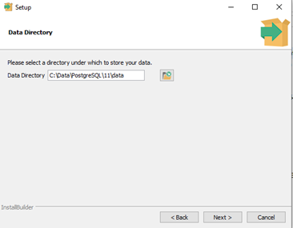

Next you will likely be asked to enter a password. The standard password
is: postgres. Also accept the standard port (5432), and accept the
standard locale. After doing this, start the install.

#### 1.1.1 Installation of PostGIS

After the PostgreSQL install has completed, the Stackbuilder will
appear. Start the StackBuilder application (to install PostGIS)

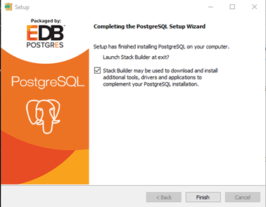

Launch StackBuilder and select the PostgreSQL 17 installation from the
drop down selection box.

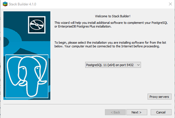

Expand the Spatial Extensions and select the PostGIS 2.5 bundle for 64
bit.

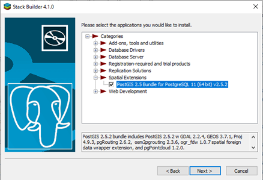

Then select next and next to install the download (Do not tick the ‘Skip
installation’ box). Agree to the license terms. Then select the PostGIS
component and install to the default location, probably
(`C:\Program Files\PostgreSQL\11`).

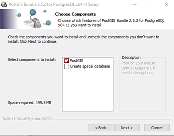

Next you may be asked something like ‘Raster drivers are disabled by
default. To change you need to set POSTGIS_GDAL_ENABLED_DRIVERS…’,
select ‘no’. Also hit ‘no’ if you are asked: ‘Raster out of db is
disabled by default. To enable …’

At this point PostGIS should be done installing.

The last thing you need to do is add the spatial extensions so that they
are available in postgreSQL. To do this open pgAdmin4. You may be
prompted to set a master password for pgAdmin, do that and remember it.

Once pgAdmin has started click on the PostgreSQL 17 server. It is on the
left hand side, in the file tree under ‘Servers’. You will be queried
for the password on the first login, enter the password that you set
during the install (e.g. postgres) and click ok.

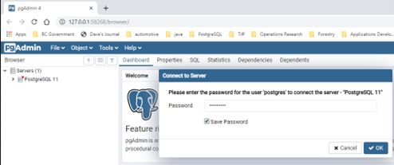

Click down the tree, opening ‘Databases’ followed by ‘postgres’ as seen
below. Then right mouse click on Extensions and select Create -\>
Extension. A box called “Create Extensions” will open.

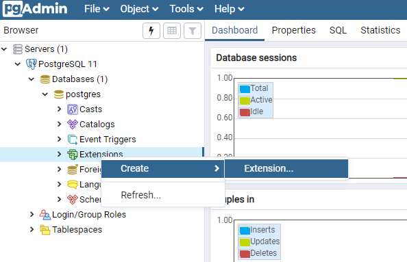

Click on the drop down arrow next to ‘Name’ and scroll down to or type
**postgis**. Select postgis and click ok.

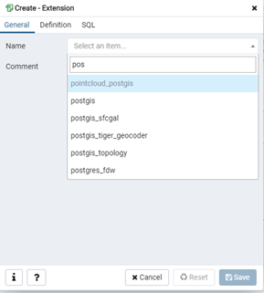

Repeat the process of creating an extension but this time add
**postgis_raster**. After doing this postgreSQL should be set up. By
adding these extensions you can write shapefiles and raster files to
your database, as outlined in many of the files in the ‘~/castor/params’
folder

### 1.2 R Packages

When working with R you will soon find that you need to download various
[packages](https://rstudio.com/products/rpackages/). Packages are
essentially bundles of specialized, self-contained code functions to
manipulate, analyze or visualize information. Packages are written by R
developers and stored on the [Comprehensive R Archive Network (CRAN)
repository](https://cran.r-project.org/web/packages/available_packages_by_name.html).
These packages must meet certain QA/QC standards, and are typically
reliable and stable.

Here we do not list all of the R Packages needed to use the Castor
model. There are many packages, they will vary depending on what aspects
of Castor are used, and they will likely evolve over time. Instead, here
we provide a brief description of how to download R packages from
RStudio.

Within the RStudio interface you will see in the bottom-right window a
“Packages” tab, with a button to “Install”, and beneath that a list of
packages downloaded in your package library. If you click on the
“Install” button it will open a window where you can enter the package
name to install it from CRAN. Once a package is downloaded, you don’t
need to download it again (unless an update is required).

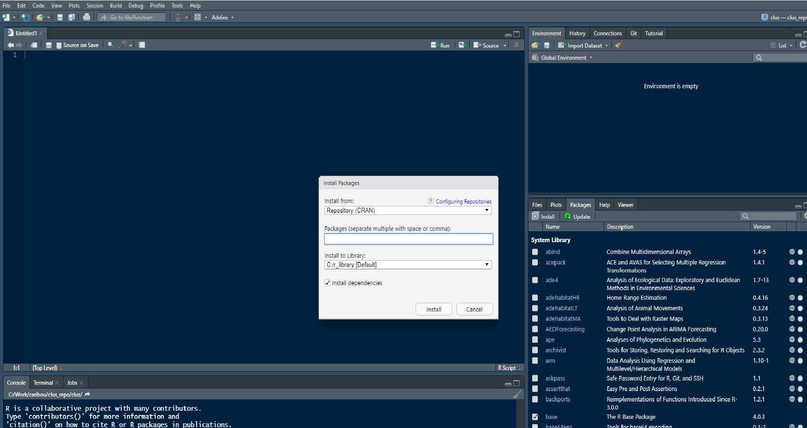

Packages that you will need to run Castor are typically listed within
specific Castor model scripts, so you can download them as you need
them. Packages that you need to run a particular script are typically
called using the *library()* or *require()* commands at the start of the
script. You’ll find that you will get an error if you are missing a
package needed to run a specific function. In this case, check which
function is getting the error and download the necessary package.

### 1.3 System Variables

After you have downloaded the PGAdmin software, you will need to set a
system variable on your computer. Type “edit the system environment
variables” into the search bar in Windows, and press enter to open the”
System Properties” window. Click on the “Advanced” tab, and then the
“Environment Variables” button.

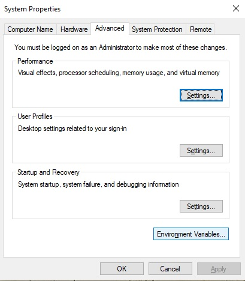

This will open a new window with “User variables” and “System variables”
boxes. Click on the “Path” variable in the “System variables” box and
click “Edit”.

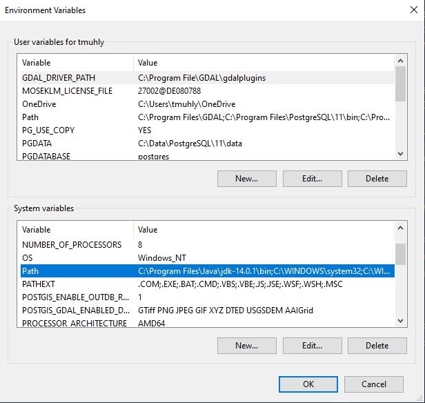

You should see a list of file paths (e.g., *C:\Program Files\\.* ).
Click on the “New” button and enter the directory where the PostgreSQL
“bin” folder is located; in this example it is located at *C:\Program
Files\PostgreSQL\11\bin*. Enter the correct directory location and click
‘Ok’. This will add PostGreSQL to your environment variables and allow
you to run the software correctly.

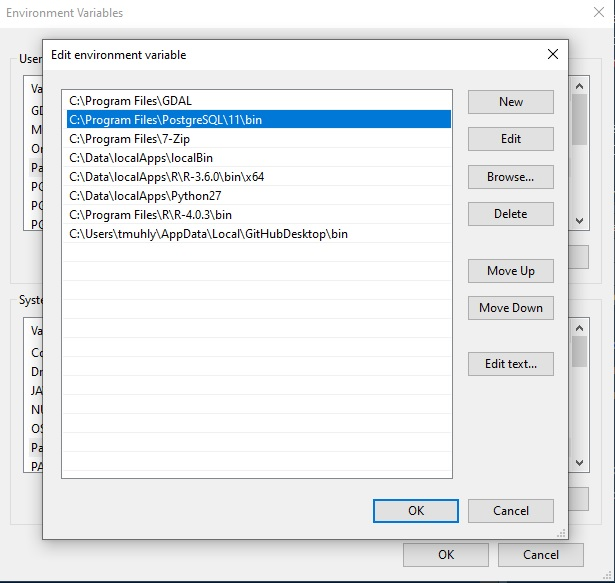

## 2. Download the Model Code from GitHub

Once you are up and running with R Studio you can ‘clone’ the Castor
model code (i.e., make a local copy of it) so you can run and edit it
from your computer. We store the Castor model code in the [BC government
GitHub repositories](https://github.com/bcgov). If you are a BC
government employee, we recommend that you sign-up for a GitHub account,
and review the [BC government
policies](https://github.com/bcgov/BC-Policy-Framework-For-GitHub/blob/main/BC-Open-Source-Development-Employee-Guide/README.md)
on the use of GitHub. As part of this process you will be asked to
create two-factor authentication. Note that the GitHub password may only
work temporarily, in which case, after you have created an authenticated
GitHub account you will also need to set-up a [‘personal access token’
(PAT)](https://docs.github.com/en/github/authenticating-to-github/keeping-your-account-and-data-secure/creating-a-personal-access-token).
Follow [these
inrstuctions](https://docs.github.com/en/github/authenticating-to-github/keeping-your-account-and-data-secure/creating-a-personal-access-token)
to set up a PAT. Select the scopes, or permissions, you’d like to grant
this token as everything except *admin:org_hook*. Note that there is no
need to complete step 10 in the instructions.

You can now use your PAT token as the password to clone the Castor
repository from GitHub. Instead of manually entering your PAT for every
HTTPS Git operation, you can set the username and password using the
Windows Credential Manager. Open the Windows Credential Manager by
searching for “Credential Manager” on your Windows search bar. Once
open, click on “Windows Credential Manager”, then “Add a generic
credential”.

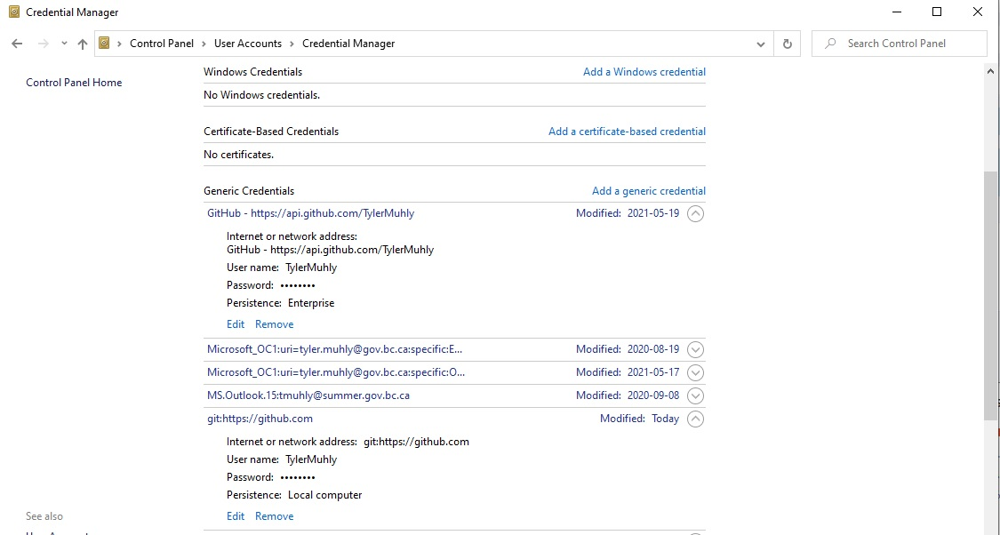

In the “Internet or network address” box enter
*<git:https://github.com>*, then add your username and the PAT as your
password. Repeat this process (i.e., create another credential), but
with *GitHub - <https://api.github.com/xxxxxx>* as the “Internet or
network address” (note: replace xxxxxx with your username). This will
tell your computer to use the PAT credentials when connecting to GitHub.

The castor repository is located
[here](https://github.com/bcgov/castor). The GitHub webpage displays the
Castor code using a familiar folder structure.

The GitHub version of the Castor repository can be thought of as the
*central* or *canonical* copy of the code. GitHub allows multiple people
to work with and contribute to the code simultaneously, while
maintaining a stable and version‑controlled record of changes. Cloning
the repository creates a local copy of the code on your computer,
allowing you to run the model, explore the code, and make local
modifications.

### 2.1 Cloning the Castor Repository

Castor can be cloned in several ways depending on your level of comfort
with Git and how much of the repository you need.  
Below we describe three methods, from the most straightforward
(recommended for new users) to more advanced and selective workflows:

- [2.1a Standard RStudio clone with submodule
  initialization](#21a-standard-rstudio-clone-with-submodule-initialization)
- [2.1b One-step clone including all
  submodules](#21b-one-step-clone-including-all-submodules)
- [2.1c Advanced: cloning only selected
  submodules](#21c-advanced-cloning-only-selected-submodules)

You can jump directly to any method using the links above.

#### 2.1a Standard RStudio Clone with Submodule Initialization

We recommend cloning the repository to a local folder (not a network or
synced drive). We also recommend avoiding cloning directly to the root
`C:\` drive. Instead, clone the repository into a subdirectory such as
`C:\work\git_repos\` or within your user profile directory
(e.g. `C:\username\`).

To clone the Castor repository, open **RStudio**, click on the **File**
menu in the top left, and then select **New Project**. This will open a
new window:

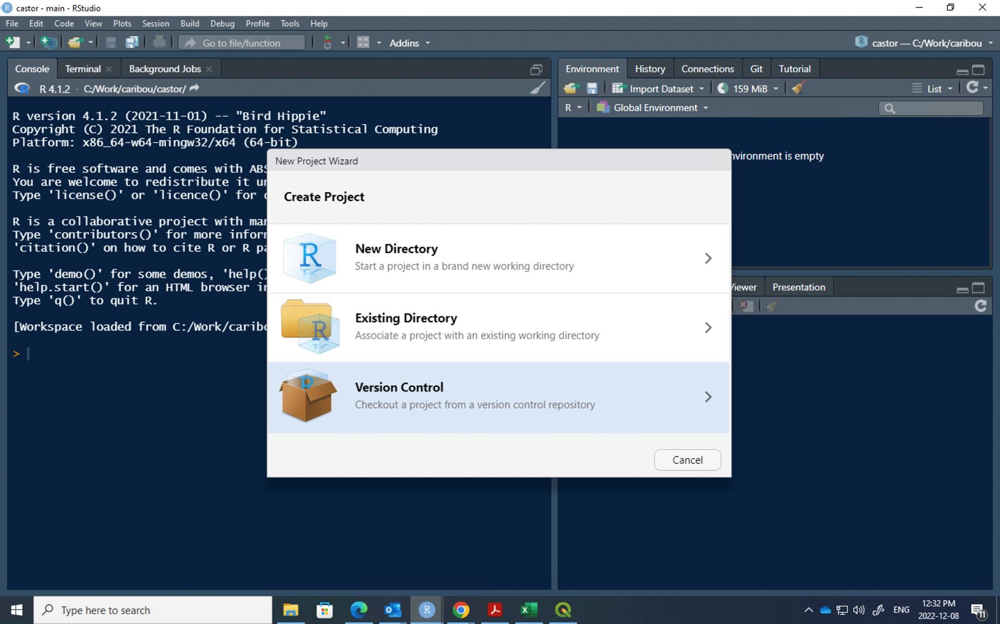

In this window, select **Version Control**, and then select **Git**.
This will open a window where you can enter the repository information.

Enter the following: - **Repository URL:**
`https://github.com/bcgov/castor.git` - **Project directory name:**
`castor` - **Create project as subdirectory of:** a local folder on your
computer

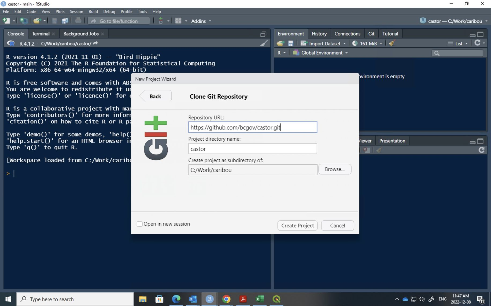

When you click Create Project, RStudio will clone the Castor repository
into the selected folder. You’ll see that the directory structure
matches the GitHub view. However, the subfolders inside the
**~\castor\modules\\** directory will initially appear empty. This is
expected.

#### Initializing the Castor Modules (Git Submodules)

The Castor repository uses Git submodules to manage each module
separately. This keeps the top‑level repository lightweight and ensures
each version of Castor points to specific versions of its modules. To
populate the module directories, open the Terminal pane in RStudio and
run:

``` bash
git submodule update --init --recursive
```

This command downloads and initializes all the module repositories
referenced by the version of Castor you have cloned and ensure each
module is checked out at the correct version (for version control). Once
this step is complete, the Castor project is fully cloned and ready to
use.

#### 2.1b One‑Step Clone Including All Submodules

Alternatively, you can clone Castor and all the submodules at once by
pasting this command into the terminal window:

``` bash
git clone --recurse-submodules https://github.com/bcgov/castor.git
```

This automatically retrieves the main repository along with every
submodule.

Note: The above bash command clones the repository into a new folder
named `castor/`, which is created in the terminal’s current working
directory. Before running the command, ensure your terminal is set to
the location where you want the Castor folder to be created.

#### 2.1c Advanced: Cloning Only Selected Submodules

By default, initializing Castor submodules downloads all modules listed
in the `modules/` directory. In some cases, users may only need a subset
of these modules for their workflow.

To download only selected modules, first clone the Castor repository as
described in
[2.1a](#21a-standard-rstudio-clone-with-submodule-initialization), but
do not initialize the submodules.

After cloning Castor, open the **Terminal** tab in RStudio and
initialize only the modules you need. For example, to download only the
`dataCastor` module:

``` bash
git submodule init modules/dataCastor
git submodule update modules/dataCastor
```

This will download only the specified module into the modules/
directory. You can repeat this process for additional modules as
required, replacing the path with the appropriate module name
(e.g. modules/otherModule).

## 3. Version Control and Working with GitHub

The Castor codebase is hosted on GitHub at  
<https://github.com/bcgov/castor>

GitHub is used to store, manage, and version the Castor code. Most users
will interact with GitHub only to download updates to the code, rather
than to modify or contribute code directly.

Within RStudio, you will see a **Git** tab in the top‑right pane. This
tab provides basic version‑control tools, including: - **Pull** –
download updates from GitHub - **Diff** – view differences between your
local files and the GitHub version - **Commit / Push** – record and
upload local changes (not generally recommended; see below)

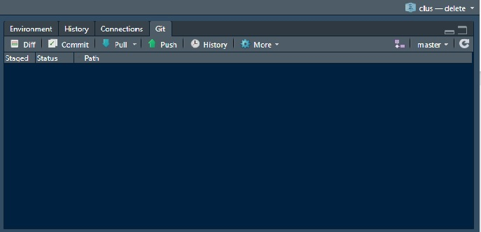

### 3.1 Recommended workflow

Once the Castor repository and its submodules have been cloned, most
users will not need to modify the Castor source code. Instead, analyses
should be performed by: - configuring input data, - adjusting model
parameters, and - running Castor using the existing scripts and modules.

Castor uses Git submodules to manage and version external dependencies.
Each Castor release points to specific, tested versions of these modules

### 3.2 Providing feedback or requesting changes

If you identify a bug, unclear behaviour, missing documentation, or a
potential improvement to the code, please communicate this to the Castor
team using one of the following approaches:

- **Open an issue on GitHub**  
  <https://github.com/bcgov/castor/issues>  
  This is the preferred option for reporting bugs or suggesting
  enhancements.

- **Contact the Castor team directly** (e.g. via email), particularly if
  the issue requires discussion before implementation.

If you have suggestions on how to improve code we will happily consider
this. If a change is approved, the Castor team will work with you to
determine the appropriate mechanism for incorporating it into the main
codebase.

### 3.3 Custom analysis code and workflows

Castor is designed so that most users can perform analyses without
modifying the core model code. In typical workflows, project‑specific
work is handled through one or more R Markdown (`.Rmd`) scripts, where
scenario parameters, spatial layers, and other inputs are specified by
the user. Core model functionality is implemented in `.R` scripts within
the Castor modules, and this code should not be altered.

To support flexibility while maintaining code stability and
reproducibility, we recommend that any user‑specific or project‑specific
code be kept separate from the Castor source code. Custom analysis
scripts should not modify core Castor functions or module code.

Custom scripts can be stored either outside the main Castor codebase, or
in a clearly separated directory alongside the Castor project, such as
`analysis/`, `scripts/`, or `workflows/`.

For example:

``` text
castor/
├─ modules/
├─ data/
├─ analysis/
│  ├─ run_scenario_A.Rmd
│  ├─ run_scenario_B.Rmd
```

## 4. Set up a keyring for database access

Castor uses locally managed PostgreSQL databases rather than a shared or
centrally hosted database. Each user is responsible for configuring and
managing their own PostgreSQL instance as needed for their analyses. To
avoid storing database usernames and passwords directly in the Castor
source code or configuration files, Castor uses the R package keyring to
manage database credentials securely on the user’s local machine (e.g.,
Windows Credential Manager or macOS Keychain). Although Castor no longer
relies on a shared network database, keyring is retained throughout the
codebase to:

- maintain secure handling of credentials,
- support automated and scripted workflows, and
- avoid the need to repeatedly hard‑code or re‑enter passwords across
  multiple scripts.

Using keyring allows Castor scripts and modules to retrieve credentials
at runtime without exposing them in plain text or committing sensitive
information to version control. As a result, setting up the keyring is
the recommended and simplest way to enable local database access when
using Castor. Before running Castor workflows for the first time, we
recommend users store their PostgreSQL connection details in the
keyring.

### 4.1 How to set up your keyring

An R Markdown helper document is provided in the Castor repository:
[functions/keyring_init.Rmd](https://github.com/bcgov/castor/tree/main/functions/keyring_init.Rmd)
Open and run this Rmd file in RStudio. It walks you through:

Creating a keyring (if one does not already exist) Adding your
PostgreSQL username and password Testing that Castor can retrieve these
credentials successfully

Note: These credentials are only for your local PostgreSQL database.
They are not the same as your GitHub credentials.

## 5. Castor Preprocessing Workflow

This section describes the standard workflow for preparing inputs to run
a Castor simulation. Inputs for this simulation are stored in a
postgreSQL database which castor accesses. Thus, we provide example
scripts using R for developing the required layers which then will be
uploaded to your postgreSQL database. These scripts should help you
understand the format that castor requires but you are welcome to insert
your own data. Also, all steps are script‑based to ensure transparency,
reproducibility, and flexibility across study areas and planning
objectives. For most examples we access data from the [BC Geographic
Warehouse](https://www2.gov.bc.ca/gov/content/data/finding-and-sharing/bc-geographic-warehouse)
as much as possible as this is freely available data and typically
available for any part of the province.

Castor inputs fall into four broad classes:

5.1. **Core spatial inputs**: Define the area of interest and spatial
structure 5.2. **Spatial constraints and scenarios**: Define management
rules and policy objectives around where and the amount of harvest that
can take place 5.3. **Growth and yield inputs**: Describe forest growth
within the area of interest 5.4. **Optional module-specific spatial
inputs**: Provide additional spatial information required by selected
Castor modules

Each class of input serves a distinct role in the model, and together
they fully define a Castor simulation.

### 5.1 Core Spatial Inputs

The first layer that is required for any castor analysis is a file
defining the boundaries of your study area. The study area boundary
defines the area being modeled and all other inputs are linked to,
clipped by, and interpreted within this spatial framework. The [Study
Area
Boundaries.Rmd](https://github.com/bcgov/castor/blob/main/functions/study_area_boundaries.Rmd)
provides an example workflow for defining your area of interest.

In addition to knowing where your study takes place you also need to
provide information about the landscape in that area. Key attributes
include which parts of you study area are forested, this can be obtained
from the VRI and which parts are and eligible for harvest i.e. the
timber harvesting land base (THLB). and how terrain and access vary
across space.

The
(Castor_input_layers.Rmd)\[<https://github.com/bcgov/castor/blob/main/functions/Castor_input_layers.Rmd>\]
provides an example script of where and how to get and load the required
information.

### 5.2 Land constraints

Land constraints are spatially‑defined management designations that
influence how forestry and land‑use activities can occur across the
landscape. These include areas established to protect visual quality,
wildlife habitat, biodiversity values, water resources, and other public
or ecological interests. Examples include visual quality objectives,
general wildlife measures, biodiversity emphasis options, ungulate
winter ranges, wildlife management areas, and community watersheds.
Within these designated areas, management activities may be restricted,
modified, or subject to additional conditions to ensure that ecological,
social, or resource values are maintained alongside timber production.

In Castor, land constraints are represented as spatial zones paired with
rules that limit or condition management actions within those areas.
These rules do not directly prescribe activities at specific locations;
instead, they define landscape‑level conditions—such as minimum retained
area, age thresholds, or exclusion from harvest—that the model must
satisfy over time.

In the ‘functions’ folder you can find examples of how to set these
constraints up for your landscape. The
[prov_manage_objs.Rmd](https://github.com/bcgov/castor/blob/main/functions/prov_manage_objs.Rmd)
demonstrates how to incorporate Aspatial Old Growth Retention, Fisheries
Sensitive Watersheds, Visual Quality Objectives and other no-harvest
constraints such as parks and protected areas, spatial old growth
management areas, and biodiversity, mining and tourism areas. The
[uwr_cond_harvest.Rmd](https://github.com/bcgov/castor/blob/main/functions/uwr_cond_harvest.Rmd)
and the
[wha_cond_harvest.Rmd](https://github.com/bcgov/castor/blob/main/functions/wha_cond_harvest.Rmd)
demonstrate how to include conditional harvest constraints for ungulate
winter range and wildlife habitat areas.

### 5.2 Growth and Yield Inputs

Castor does not simulate tree growth directly. Instead, growth is
represented using pre‑computed yield curves, indexed by stand age.

Two yield states are represented: - **Natural (unharvested) stands**:
[VDYP](https://www2.gov.bc.ca/gov/content/industry/forestry/managing-our-forest-resources/forest-inventory/growth-and-yield-modelling/variable-density-yield-projection-vdyp)
yield curves. - **Managed (harvested and regenerated) stands**:
[TASS](https://www2.gov.bc.ca/gov/content/industry/forestry/managing-our-forest-resources/forest-inventory/growth-and-yield-modelling/tree-and-stand-simulator-tass)/[TIPSY](https://www2.gov.bc.ca/gov/content/industry/forestry/managing-our-forest-resources/forest-inventory/growth-and-yield-modelling/table-interpolation-program-for-stand-yields-tipsy)
yield curves.

At the start of a simulation, each pixel is assigned a current yield
curve which could either be natural (VDYP) or managed (TASS/TIPSY)
depending on its harvest history.  
When a stand is harvested in Castor: - all pixels within that stand have
their ages resets to zero, and - the yield curve switches to the future
yield curve. For natural stands this means that its yield curve updates
from a natural stand yield curve to a managed stand yield curve
i.e. VDYP curve -\> TASS/TIPSY curve. However, if the pixel was already
on a managed stand yield curve because it had previously been harvested
and replanted then its future yield curve will be the same as before
i.e. it stays on the same yield curve (TASS/TIPSY curve -\> same
TASS/TIPSY curve) Yield curves therefore encode all growth and
regeneration assumptions used by the model.

The script
[growth_and_yield.Rmd](https://github.com/bcgov/castor/blob/main/functions/growth_and_yield.Rmd)
provides an example for getting VDYP and TASS/TIPSY output into the
format required by castor.

### 5.3 Optional module-specific spatial inputs

Various other modules require spatial layers as inputs for them to be
included in the castor simulation. In most cases we have created scripts
to be used as an example for how to create the required layers. Below we
will list the modules and there additional required layers:

**roadsCastor:** Needs a raster of the current road network and a cost
surface for building roads. See

#### 5.3.2 Creating your own constraint

Imagine you want to test the impact of creating various protections on
forestry. For example you may want to create a new ungulate winter range
and need to understand its impact. This new ungulate winter range will
require that over 90% of the forest in this area be over the age of 80
years. We’ll demonstrate how implement this constraint in the script
below.

Many of the model parameters in Castor are created in the
“castor-\>params” folder. In this folder there are several .Rmd files
with scripts and text describing how to create those parameters. You can
look in this folder to see how we defined various parameters used in
Castor. The spatial parameter scripts convert spatial polygons to raster
data with an associated table that defines the constraint to be applied
to the spatial area.

In the code chunk below we provide a similar script as an example that
you can use to learn the process. This script is to demonstrate how to
create zone constraints for a made up area in Revelstoke TSA. We
describe the script in detail below the code chunk.

``` r
# Load packages and source scripts
library (raster)
library (fasterize)
library (sf)
library (DBI)
library (here)
library(data.table)
library(dplyr)
library(bcdata)
library(units)
library(ggplot2)

source (paste0(here::here(), "/functions/R_Postgres.R"))

# 1. For demsontration I need to create a random polygon within the revelstoke TSA. Ill do this first. This chunk of code can be skipped if you already have an area that needs protection. In that case you can just load you are that you want to create constraints for

# get the revelstoke TSA. Knowing the boundary of your area of interest in not neccessary for creating constraints but I do it here to help us sample a random area to protect.

tsa <- bcdc_query_geodata("WHSE_ADMIN_BOUNDARIES.FADM_TSA_SV") |>
  filter(TSA_NUMBER_DESCRIPTION == "Revelstoke TSA") |>
  collect() |>
  st_transform(3005) |>     # BC Albers
  st_make_valid()

# sample a random point within the TSA
set.seed(100)  # for reproducibility

pt <- st_sample(tsa, size = 1) |> 
  st_sf()

# create a 10 000 ha reserve around the randomly sampled point

area_target <- set_units(10000, ha) |> set_units(m^2)
radius <- sqrt(as.numeric(area_target) / pi)
poly.data <- st_buffer(pt, dist = radius) |>
  st_intersection(tsa)

# look at the revelstoke TSA and the random area that will be protect. 
plot(st_geometry(tsa), col = "grey90")
plot(st_geometry(poly.data), col = "red", add = TRUE)
plot(st_geometry(pt), pch = 3, add = TRUE)

# Note from this point forward we do not bother with the TSA boundary again. It was only used to create our example area. 

# 2. Create provincial raster 
prov.rast <- raster::raster(
  nrows = 15744, ncols = 17216, xmn = 159587.5, xmx = 1881187.5, ymn = 173787.5, ymx = 1748187.5, 
  crs = "+proj=aea +lat_0=45 +lon_0=-126 +lat_1=50 +lat_2=58.5 +x_0=1000000 +y_0=0 +datum=NAD83 +units=m +no_defs", 
  resolution = c(100, 100), vals = 0)

# 3. Create an integer value attributed to each unique zone in the protected area polygon
poly.data$zone <- as.integer (1) # create a zone field with integer value of 1; may need to do for zoneid as well
# OR, alternatively, if you have more than one zone in the shapefile, use below
poly.data$zone <- as.integer (as.factor (poly.data$zone)) # if there is an existing zone field, create an integer to define each zone (factor)

# 4. Create a raster and upload to the postgres database
ras.data <-fasterize::fasterize (poly.data, prov.rast, field = "zone") # converts polygon to raster

writeRaster (ras.data, file = "raster_test.tif", format = "GTiff", overwrite = TRUE) # saves the raster to your local folder
system ("cmd.exe", input = paste0('raster2pgsql -s 3005 -d -I -C -M -N 2147483648  ', 
                                  here::here (), 
                                  '/functions/raster_test.tif -t 100x100 rast.raster_test | psql postgres://', keyring::key_get ('dbuser', keyring = 'postgreSQL'), ':', keyring::key_get ('dbpass', keyring = 'postgreSQL'), '@', keyring::key_get ('dbhost', keyring = 'postgreSQL'), ':5432/',keyring::key_get ('dbname', keyring = 'postgreSQL')), show.output.on.console = FALSE, invisible = TRUE)  # sends the 'input' script to command line to upload the raster to the database

# 5. Create Look-up Table of the zone integers
poly.data$zone_name <- as.character ("test_scenario")
lu.poly.data <- unique (data.table (cbind (poly.data$zone, poly.data$zone_name)))
lu.poly.data <- lu.poly.data [order(V1)]
setnames (lu.poly.data, c("V1", "V2"), c("raster_integer", "zone_name"))

conn <- DBI::dbConnect(
  RPostgres::Postgres(),
  host     = keyring::key_get("dbhost", keyring = "postgreSQL"),
  dbname   = keyring::key_get("dbname", keyring = "postgreSQL"),
  port     = 5432,
  user     = keyring::key_get("dbuser", keyring = "postgreSQL"),
  password = keyring::key_get("dbpass", keyring = "postgreSQL")
) # create connection to the postgreSQL database

DBI::dbWriteTable (conn, 
                   c("public", "vat_test"),
                   value = lu.poly.data, 
                   row.names = FALSE, 
                   overwrite = TRUE)

# 6. Create zone constraint table. 

#In this example, you create a zone constraint that requires 90% (percentage = 90) of the forest within the zone (zoneid = 1) to be greater than or equal (type = 'ge') to 80 (threshold = as.numeric(80)) years old (variable = 'age'). You also need to define several fields, including: reference_zone, which is the name of the raster in the PostgreSQL database that you want to apply the constraint (note that the 'rast.' schema is also included); zoneid, which is the integer id for the zone in the raster that you want to assign the constraint; variable, which is the variable in the database that defines the constraint (equivalent clearcut area ("eca"), disturbance ("dist") and "height" are other examples); threshold is the value at which to apply the threshold; type defines whether the threshold is greater than or equal to (i.e., 'ge') or less than or equal to (i.e., 'le'); percentage is the percent of the zone that must meet the variable threshold; ndt is the natural disturbance threshold to apply to the zone (here we use 0, as these are specific to certain constraint types); multi_condition is a field that can be used to develop several criteria for constraints, e.g., "crown_closure >= 30 & basal_area >= 30" would apply a constraint where both crown closure and basal area of the forest stand must be over 30 for the defined area threshold; denom is a field that allows you to define the area over which to apply a constraint, i.e., to set the area denominator as total area of the zone, or treed area within the zone; the default value (NA) sets the denominator to total area, whereas ' treed > 0 ' sets it to treed area; start and stop are fields that define when, in years, a zone constraint is applied, where here we use the default 0 and 250, which sets the constraint to occur for the first 250 years of a simulation (and thus over an entire 200 year simulation).
zone_test <- data.table (zoneid = as.integer(1), 
                         type = 'ge', 
                         variable = 'age', 
                         threshold = as.numeric(80), 
                         reference_zone = 'rast.raster_test', 
                         percentage = 90, 
                         ndt = as.integer(0), 
                         multi_condition = as.character(NA),
                         denom = as.character(NA),
                         start = as.integer(0),
                         stop = as.integer(250)
                         )

DBI::dbWriteTable (conn, c("zone", "zone_test"), # commit tables to pg
                   value = zone_test, 
                   row.names = FALSE, 
                   overwrite = TRUE) 
dbExecute (conn, paste0("ALTER TABLE zone.zone_test INHERIT zone.constraints"))
dbDisconnect (conn) # disconnect from the database
```

To run the script, you will need the raster, fasterize, sf, here,
data.table, DBI, dplyr, bcdata, units, and ggplot2 packages; these can
be downloaded via RStudio if you do not already have them. You will also
need to load our R_Postgres.R script, using the source () command. This
script contains specific functions created for querying PostgreSQL data
from R (the script is located in the “castor-\>functions” folder).

First, you will create a random area within the Revelstoke TSA that we
will pretend needs protecting.

Second, you create an ‘empty’ raster object (all pixels will have a 0
value) configured to the provincial standard. We use this for all
rasters to ensure that all of our data aligns spatially. Make sure you
do not to change the parameters of the raster (e.g., nrows, xmn, etc.).

Third, you create an integer value for each unique area or ‘zone’ within
the polygon (protected area) data. Here, we are using a single polygon
with a single ‘zone’, and therefore we create a ‘zone’ field where zone
= 1. We also provide an example for creating integer values for spatial
polygons with more than one unique ‘zone’. In this step we are creating
an integer value for each unique zone that will be the value attributed
to the raster. Thus, the raster represents the spatial location of each
zone.

Fourth, you will convert the polygon to a raster across the extent of
BC, using the provincial standard as a template. This is done to ensure
that each unique raster in the data is aligned with each other, and
raster data can then be ‘stacked’ to measure multiple raster values at
the same location. In this step, the raster is saved to a local drive,
and then a command line is called from R to upload the data to the
PostgreSQL using the *raster2pgsql* function. Within this function, *-s*
assigns the spatial reference system, which is *3005* (NAD83/BC Albers);
*-d* drops (deletes) any existing raster in the database with the same
name and creates a new one; *-I* creates an index for the raster data;
*-C* applies constraints to the raster to ensure it is registered
properly (e.g., correct pixel size); *-M* ‘vacuums’ the data, which
reclaims any obsolete or deleted data; *-N* applies a “NODATA” value to
where there is no data; *2147483648* defines the raster as a 32-bit
integer; *-t* defines the number of ‘tiles’ or rows in the database, and
here we use 100x100 to create a tile for each pixel; *rast.raster_test*
defines the schema and table name to save in the PostgreSQL database;
the *psql* statement defines the credentials for the database (fill in
the appropriate credentials).

Fifth, you create a ‘look-up table’ that links each raster integer zone
to a zone name. In the example here, we create a name for the ‘zone’.
Once the table is created, you upload it to the PostgreSQL database.

In the sixth and final step, you create a table that defines a forest
harvest constraint for each zone. In this example, you create a zone
constraint that requires 90% (percentage = 90) of the forest within the
zone (zoneid = 1) to be greater than or equal (type = ‘ge’) to 80
(threshold = as.numeric(80)) years old (variable = ‘age’). Within the
table, you need to define several fields, including: reference_zone,
which is the name of the raster in the PostgreSQL database that you want
to apply the constraint (note that the ‘rast.’ schema is also included);
zoneid, which is the integer id for the zone in the raster that you want
to assign the constraint; variable, which is the variable in the
database that defines the constraint (equivalent clearcut area (“eca”),
disturbance (“dist”) and “height” are other examples); threshold is the
value at which to apply the threshold; type defines whether the
threshold is greater than or equal to (i.e., ‘ge’) or less than or equal
to (i.e., ‘le’); percentage is the percent of the zone that must meet
the variable threshold; ndt is the natural disturbance threshold to
apply to the zone (here we use 0, as these are specific to certain
constraint types); multi_condition is a field that can be used to
develop several criteria for constraints, e.g., “crown_closure \>= 30 &
basal_area \>= 30” would apply a constraint where both crown closure and
basal area of the forest stand must be over 30 for the defined area
threshold; denom is a field that allows you to define the area over
which to apply a constraint, i.e., to set the area denominator as total
area of the zone, or treed area within the zone; the default value (NA)
sets the denominator to total area, whereas ’ treed \> 0 ’ sets it to
treed area; start and stop are fields that define when, in years, a zone
constraint is applied, where here we use the default 0 and 250, which
sets the constraint to occur for the first 250 years of a simulation
(and thus over an entire 200 year simulation).

Note that in this example we are creating a constraint for a single zone
(i.e., one row). For more complicated zoning schemes, constraints for
multiple rows (i.e., unique zoneid’s) may need to be created.

Once the table is created in R, you will save it to the database. Then,
you will send an SQL command to the PostgreSQL database using the
“dbExecute” function. This command will incorporate the new table into
the ‘constraints’ table in the database. You may have noticed all of the
constraint tables are uploaded to their own schema in the database
called zone. The constraints table in the zone schema contains all of
the constraints data (i.e., “inherits” the data) from all of the zones
that were created as a parameter. You will see later that this table is
used to define all zone constraints to be applied in the Castor model,
thus it is critical to ensure that any zone constraint you create gets
incorporated into this table.

### 5.4 Optional module-specific spatial inputs

## 6. Castor SQLite Database

The simulator modules within Castor do not operate directly on a
PostgreSQL database. Instead, Castor uses a dedicated preprocessing
module, dataCastor, to assemble all required inputs into a portable
SQLite database that is then used by the simulator modules.

### 6.1 Current workflow

In the current Castor workflow, users provide input data by loading the
required spatial and tabular layers into a locally managed PostgreSQL
database. The dataCastor module connects to this database, extracts the
datasets needed for a defined area of interest, and compiles them into a
single SQLite database containing all information required to run the
Castor simulations. This SQLite database is self‑contained and optimized
for simulation use, making it easy to move between machines, archive, or
reuse for repeated model runs without re‑querying PostgreSQL.

### 5.2 Historical context

Previously, Castor connected to a central, province‑wide PostgreSQL
database that stored authoritative datasets (e.g., forest inventory
layers). In that earlier design, dataCastor clipped and subsetted these
large datasets to an area of interest before creating the SQLite
database. While the underlying mechanism remains the same,
responsibility for data management has now shifted to individual users,
who supply their own datasets via their local PostgreSQL instances.

Although the intermediate PostgreSQL step may appear redundant for users
working with small study areas (where only area‑specific data are
uploaded), the use of dataCastor and the SQLite database provides
several ongoing benefits: - A consistent and reproducible data structure
for all Castor simulations - Clear separation between data preparation
and model execution - A compact, portable database format optimized for
simulation performance - Simplified sharing and archiving of simulation
inputs

For these reasons, the SQLite database remains a core component of the
Castor architecture.

### 5.3 Getting Aquainted with a Castor SQLite database

In this section, you will use the *dataCastor* module to create a
simple, synthetic SQLite database. The data used in this example are
provided for instructional purposes only and are not intended for use in
a proper Castor simulation.

The goal of this exercise is to: - become familiar with the structure
and contents of a Castor SQLite database, and - learn how to connect to
the database, run queries, and retrieve information required by the
Castor simulator modules.

This section focuses on understanding how Castor consumes data and how
the SQLite database is used during the simulation, independent of how
real input data are prepared or sourced. In the next section (Section
6), we describe the types of datasets required to run a full Castor
simulation and outline the expected data structure and content. Example
scripts and workflows for preparing and uploading datasets to PostgreSQL
are provided elsewhere in the documentation and supporting repositories,
and are referenced there rather.

To begin, navigate to the *dataCastor* module located in the
`castor/modules/` directory. This directory contains two files:
`dataCastor.R` and `dataCastor.Rmd`.

The `dataCastor.R` file contains the core functions that implement the
database creation logic. This script defines the fundamental workflow
used to build the SQLite database and should only be modified if changes
are required to the underlying process or database structure.

The `dataCastor.Rmd` file is used to define scenario‑specific parameters
that are passed to the functions in `dataCastor.R`. This file is
intended to be flexible and can be copied and modified for different
scenarios. In contrast, the `.R` file typically exists as a single,
stable version and is rarely changed. Together, the `.R` and `.Rmd`
files separate core functionality from scenario configuration.

Within the `.Rmd` file you will see elements of the SpaDES module
structure. The document begins with a textual description of the module,
followed by a code chunk (*r module_usage*) that specifies the modules,
parameters, and objects required to run the *dataCastor* workflow.

At the top of this code chunk you will find the required package imports
(`library()` calls), sourced functions (`source()` calls), and directory
paths (`setPaths()`) for module inputs and outputs.

The `.Rmd` file also defines a list object called `times`. Since
*dataCastor* represents a single, non‑dynamic process, both the start
and end times are set to 0.

Finally, the `.Rmd` file defines a `parameters` list containing the
inputs required to run the *dataCastor* module. Parameters are organized
by module, with each module having its own nested list of parameters.
This modular structure provides flexibility and allows modules to be
added or removed without modifying unrelated parameters.

``` r
library(SpaDES)
library(SpaDES.core)
library(data.table)
library(dplyr)

source(here::here("functions/R_Postgres.R"))
paths <- list(
  modulePath = paste0(here::here(),"/modules"),
  outputPath = paste0(here::here(),"/modules/dataCastor")
)

times <- list(start = 0, end = 0)
parameters <-  list(
  .progress = list(type = NA, interval = NA),
  .globals = list(),
  dataCastor = list(saveCastorDB = TRUE,
                    sqlite_dbname = 'simple',
                    randomLandscapeZoneNumber = 1,
                    randomLandscape = list(100,100,0, 100, 0, 100),
                    randomLandscapeZoneConstraint = data.table(zoneid = 1,  variable = 'age', threshold = 140, type = 'ge', percentage = 0)
                    )
  )

# Sample to add more "zones"
#rbindlist(list(data.table(zoneid = 1,  variable = 'age', threshold = 140, type = 'ge', percentage = 0),data.table(zoneid = 2,  variable = 'age', threshold = 140, type = 'ge', percentage = 0)))

scenario = data.table(name="test", description = "test")
objects <- list(scenario = scenario)

modules <- list("dataCastor")
inputs <- list()
outputs <- list()


mySim <- simInit(times = times, params = parameters, modules = modules,
                 objects = objects, paths= paths)

system.time({
mysimout<-spades(mySim)
})
```

    ##    user  system elapsed 
    ##    1.18    0.00    1.19

After running the above script a castor SQLite database will be located
in */modules/dataCastor* its name will be ‘simple_castordb.sqlite’
because the parameter *sqlite_dbname == ‘simple’*. If you were to set
the *sqlite_dbname* parameter to ‘Soo_TSA’ the castordb would be called
‘Soo_TSA_castordb.sqlite’. In dataCastor.R you can see all the defined
parameters following the SpaDES function ‘defineParameter()’ with their
default values.

Now lets connect to the castordb.

``` r
library(DBI)
#Create a DBI connection using the RSQLite:SQLite() driver
con = dbConnect(RSQLite::SQLite(), dbname = "simple_castordb.sqlite")
#Take a look at the table names
dbGetQuery(con, "SELECT name FROM sqlite_master WHERE type='table';")
```

    ##              name
    ## 1          yields
    ## 2     raster_info
    ## 3            zone
    ## 4 zoneConstraints
    ## 5      silvSystem
    ## 6     transitions
    ## 7          pixels

You should see several tables in this relational database. A description
of the relationships between tables can be found
[here](https://github.com/bcgov/dataCastor/blob/884ce9d726942b3d2eae7b88120bd1b7ad863a19/README.md).

The main table to consider is the *pixels* table which contains
information for each pixel labeled with a *pixelid* that corresponds to
the pixels location in the raster. The *pixelid* is the primary key for
the pixels table but there are often a number of foreign keys, for
example, a foreign key related to the *yields* table is aptly named
*yieldid*.

``` r
#Take a look at the pixels table
dbGetQuery(con, "SELECT * FROM pixels where age > 0 limit 1;")
```

    ##   pixelid compartid own yieldid yieldid_trans zone_const treed thlb cflb silvsystem elv age vol dist crownclosure height basalarea qmd siteindex
    ## 1    9217       all   1       1             1          0     1    1    1          0   0   3  NA    0           60     10        NA  NA        NA
    ##   dec_pcnt eca salvage_vol dual priority zone1
    ## 1        0  NA           0   NA        0     1

The *yields* table contains all the required yield curves (age vs yield)
for the analysis. Note “yields” can be anything like basal area per ha,
equivalent clear cut area (eca), or something not labelled below but can
be inferred from the age of a specific stand/forest type like say fire
risk (ignition/ha) or carbon (t/ha).

``` r
library(ggplot2)
#Take a look at the yields table
yields<-dbGetQuery(con, "SELECT * FROM yields order by age")
ggplot2::ggplot(data = yields, aes(x = age, y = qmd)) + geom_line() + ylab("Quadratic Mean Diameter (cm)")
```

<!-- -->

``` r
print(yields)
```

    ##    id yieldid age   tvol dec_pcnt height  qmd basalarea crownclosure  eca
    ## 1   1       1   0    0.0       NA    0.0  0.0       0.0          0.0 1.00
    ## 2   2       1  10    0.0       NA    2.7  0.5       0.0          2.8 1.00
    ## 3   3       1  20    0.0       NA    7.1  5.7       1.3         25.6 0.25
    ## 4   4       1  30   24.2       NA   11.4 14.1       8.1         64.7 0.10
    ## 5   5       1  40   98.6       NA   15.4 21.5      18.6         79.6 0.10
    ## 6   6       1  50  192.9       NA   18.9 26.8      28.6         82.5 0.10
    ## 7   7       1  60  292.4       NA   22.0 30.9      37.7         82.5 0.10
    ## 8   8       1  70  382.1       NA   24.7 34.0      45.1         82.0 0.10
    ## 9   9       1  80  482.8       NA   27.1 36.8      52.7         81.6 0.10
    ## 10 10       1  90  574.5       NA   29.2 39.0      58.9         81.2 0.10
    ## 11 11       1 100  648.0       NA   31.0 40.7      63.7         80.8 0.10
    ## 12 12       1 110  706.6       NA   32.5 42.1      67.4         80.3 0.10
    ## 13 13       1 120  771.6       NA   33.9 43.4      71.1         79.9 0.10
    ## 14 14       1 130  833.7       NA   35.0 44.7      74.6         79.5 0.10
    ## 15 15       1 140  885.8       NA   36.0 45.8      77.4         79.1 0.10
    ## 16 16       1 150  924.2       NA   36.9 46.5      79.3         78.6 0.10
    ## 17 17       1 160  956.2       NA   37.7 47.2      80.8         78.2 0.10
    ## 18 18       1 170  982.6       NA   38.3 47.8      82.1         77.8 0.10
    ## 19 19       1 180 1004.2       NA   38.9 48.3      83.1         77.4 0.10
    ## 20 20       1 190 1023.1       NA   39.3 48.7      83.9         76.9 0.10
    ## 21 21       1 200 1038.7       NA   39.7 49.1      84.5         76.5 0.10
    ## 22 22       1 210 1051.1       NA   40.1 49.4      84.9         76.1 0.10
    ## 23 23       1 220 1060.5       NA   40.4 49.7      85.2         75.7 0.10
    ## 24 24       1 230 1067.6       NA   40.6 49.9      85.3         75.2 0.10
    ## 25 25       1 240 1072.5       NA   40.8 50.1      85.4         74.8 0.10
    ## 26 26       1 250 1075.6       NA   41.0 50.3      85.4         74.4 0.10

The *raster_info* table contains the metadata used to build rasters and
connect the *pixels* table to the spatial location. The default entry is
a raster is named ‘ras’ but you can add multiple rasters as their
resolution or scale changes - for instance the climate projection
information is at a resolution of 800 m after downscaling to the PRISM
grid.

``` r
library(terra)
# Get the raster metadata
ras.info<-dbGetQuery(con, "SELECT * FROM raster_info where name = 'ras';")
print(ras.info)
```

    ##   name    xmin    xmax   ymin   ymax ncell nrow  crs
    ## 1  ras 1170000 1180000 834000 844000 10000  100 3005

``` r
#build a generic raster called 'ras'
ras<-rast(xmin= ras.info$xmin, xmax=ras.info$xmax, ymin=ras.info$ymin, ymax=ras.info$ymax, nrow = ras.info$nrow, ncol = ras.info$ncell/ras.info$nrow)
crs(ras) <-st_crs(as.integer(ras.info$crs))$wkt

#Assign it values to plot
ras[]<-dbGetQuery(con, "select age from pixels order by pixelid;")$age
plot(ras, main = 'age')
```

<!-- -->
The tables *zone* and *zoneConstraints* are useful for setting landcover
objective or other types of constraints to timber harvesting. Take a
look at the zone table - notice there are only two columns the
zone_column and the reference_zone.

``` r
dbGetQuery(con, "SELECT * FROM zone")
```

    ##   zone_column reference_zone
    ## 1       zone1        default

The zone_column refers to the name of the column in the pixels table.
Adding more zones by the user to specify say wildlife habitat areas or
ungulate winter range just adds more columns to the pixels table that
are labelled as zone1, zone2, …, zone100

The reference refers to the name of the raster which was labelled by the
user (e.g., ‘wha_2026.tif’, ‘uwr_2026.tif’). Here reference column
contains a single entry ‘default’ because the simple database didn’t
describe a zone from a list of raster rather it made a default zone
where all pixels belong to the same zone and labelled this zone as
‘default’.

The zoneConstraints are essentially inequalities assigned to each zoneid
contained within a zone. Thus, a single zone raster (e.g., BEC zones)
can have multiple zonal constraints. These represent inequalities such
that a query must hold for a percentage of the total area. The
inequalities look like this: WHERE_CLAUSE \>= \| \<= percentage\*t_area

E.g., the WHERE_CLAUSE is: variable (age) type (ge; greater or equal to)
threshold (140 years) which must hold for percentage(0)\*total_area
(t_area).

``` r
dbGetQuery(con, "SELECT * FROM zoneConstraints")
```

    ##   id zoneid reference_zone zone_column ndt variable threshold type percentage denom multi_condition t_area start stop
    ## 1  1      1        default       zone1   3      age       140   ge          0  <NA>            <NA>  10000     0  250

- NOTE:
- The zoneConstraints can begin and stop according to the user defined
  ‘start’ and ‘stop’ columns. For example this zone constraint would run
  from time 0 to time 250 i.e. the entire length of this example
  simulation but you could change those values.
- The WHERE_CLAUSE can contain multiple conditions like: \`AGE \> 20 AND
  basalarea \> 15’

During the simulation of timber harvesting in forestryCastor, these
zoneConstraints are used to build individual queries (one for each
ZoneConstraint) to determine the left hand side and right hand side of
the inequality. For a brief primer on how forestryCastor uses this
information —

Pixels are selected that occur within the zoneid and are sorted - ‘ORDER
BY’ the WHERE_CLAUSE using a ‘CASE’ statement. Pixels that meet the
WHERE_CLAUSE are first and those that don’t are last in the result set.
There are some other factors in the ‘ORDER BY’ like THLB or already
constrained pixels or AGE so as to minimize the impact of a constraint
on timber harvesting.

Once all the pixels are sorted there is a ‘LIMIT’ of what gets returned
in the result set. Thus, there will be pixels being returned that don’t
meet the WHERE_CLAUSE but will be considered “recruitment”. Note - that
this simple assignment of zonal constraints doesn’t consider the spatial
juxtaposition in the classification of recruitment.

As the level of complexity increase, more modules are added, there will
be more tables created in the castordb. For instance, blockingCastor
will add the *blocks* table which be related to the *pixels* table using
‘blockid’ as a foreign key in the *pixels* table and a primary key in
the *blocks* table. Similarily, *roads* table will be added as
roadCastor is included, etc.

## 6. How to create a Forest Harvest Scenario

Now that you are familiar with the software, some of the model code and
some of the Castor data, we want to introduce you to the process of
developing a model to address a example forest management scenario. To
do this we will develop the layers necessary to run a scenario for the
Boundary TSA. However, this same approach can be used for any area of
interest.

At a minimum castor needs the following information to run a harvest
scenario.

- Defined area of interest (AOI)
- Timber harvesting land base for the AOI
- Vegetation information for AOI e.g. Vegetation resource inventory
- growth and yield information for the AOI
- Harvest constraints e.g. wildlife habitat areas, ungulate winter
  ranges, community watersheds, etc.

Some additional but useful information includes roads (both locations
and cost surface to build roads) and blocking.

### 6.1 Creating a shapefile for your area of interest

An R Markdown helper document is provided in the Castor repository:
[`functions/study_area_boundaries.Rmd`](https://github.com/bcgov/castor/tree/main/functions/study_area_boundaries.Rmd)

Open this R Markdown file in RStudio and run it step by step. The
document guides you through the process of defining and generating the
files required to describe your study area. Specifically, it walks you
through:

- specifying the geographic extent of your area of interest;
- loading or creating spatial boundary data (e.g. polygons defining the
  study area);
- projecting and validating spatial layers to ensure they are suitable
  for use with Castor;
- creating standardized boundary files used by Castor workflows; and
- saving the resulting spatial objects in a consistent format and
  location for use in subsequent analyses.

The helper document is designed to be interactive and explanatory. Users
are encouraged to read the narrative text in the document and execute
code chunks sequentially, adjusting parameters and file paths as needed
for their specific study area.

### 6.2 Creating other input layers for your area of interest

### 5.2 Creating a Castor SQLite Database from PostgreSQL

So far, a castordb was created using made-up information. Operationally,
castor models should be specific to actual planning units. To do this,
we have opted to develop and maintain a centralized database that houses
information and data in a form that is ready to go for any location in
the province of BC. The idea is that we run a .rmd to build the castordb
then reference this database for use in scenario analysis. This has some
benefits like: processing and manipulating the information outside of
the simulation which saves on the simulation side, storage of the data
and information into a relational database rather than a set of folders,
dissemination of the information to other users. However, any localized
postgres relational database will work as long as the your database
contains the [SQL
functions](https://github.com/bcgov/castor/blob/main/functions/FAIB_RASTER_FUNCTIONS.sql)
used by castor. You will have to run this SQL script within the postgres
database (I think)

Below we provide an example of the code chunk you can use to run the
script, with annotations that describe each parameter. Instead of
copying code its best navigate to the castor/R/scenarios/tutorial folder
and run the dataCastor_tutorial.Rmd. Below we will describe the key
parameters need to run *dataCastor* for building a castordb.

``` r
# R Packages need to run the script
library (SpaDES) 
library (SpaDES.core)
library (data.table)
library (keyring)
source (here::here("R/functions/R_Postgres.R")) # R functions needed to run the script
#Sys.setenv(JAVA_HOME='C:\\Program Files\\Java\\jdk-14.0.1') # Location of JAVA program; make sure the version is correct
paths <- list(modulePath = paste0 (here::here (), "/R/SpaDES-modules"),
              inputPath = paste0 (here::here (), "/R/scenarios/tutorial/inputs"),
              outputPath = paste0 (here::here (), "/R/scenarios/tutorial/outputs"))

times <- list (start = 0, end = 0) # sets start and end time parameters; here both = 0 since this is a database creation step
```

Within the parameters list, the *dataCastor* list contains the
parameters needed to define the analysis area of interest (i.e., spatial
area where you want to run simulations). These are annotated in the code
chunk above, and include *dbName*, *nameBoundaryFile*,
*nameBoundaryColumn*, *nameBoundary*, *nameBoundaryGeom*,
*nameCompartmentRaster*, *nameCompartmentTable* and
*nameMaskHarvestLandbaseRaster*. In combination, these parameters tell
*dataCastor* the area of the province where you want to complete your
simulation analysis. The module takes this information and proceeds to
‘clip’ the datasets needed for the simulation accordingly.

Note that you can include multiple areas of interest (i.e.,
*nameBoundary*) together within the same SQLite database by using the
concatenation
([c()](https://stat.ethz.ch/R-manual/R-patched/library/base/html/c.html))
function in R, e.g., c(“Revelstoke_TSA”, “Golden_TSA”).

The *sqlite_dbname* parameter is used to define the name of the output
SQLite database that will be saved by dataCastor. This should be named
something related to the analysis (e.g., the area of interest).

The next set of parameters are the *nameZoneRasters* and
*nameZoneTable*. In the Castor vernacular, ‘zones’ refer to areas where
a constraint is applied to a land use activity (e.g., a forest cover
constraint on harvest). Here you will see a concatenation of several
raster datasets. For forestry simulations, there are some key zones that
should be included in the database, these include:

- rast.zone_cond_beo
- rast.zone_cond_vqo
- rast.zone_cond_wha
- rast.zone_uwr_2021; NOTE: previous version is called
  rast.zone_cond_uwr
- rast.zone_cond_fsw
- rast.zone_cond_nharv
- rast.zone_cond_cw

You will notice each of these are in the “rast” schema of the database
and have the “zone_cond” naming. These rasters were all created using
scripts within the
[Params](https://github.com/bcgov/castor/tree/main/R/Params) folder of
the repository. These scripts are intended to provide documentation of
how these constraints were created, and can be updated or modified as
needed. In these scripts you will see they take spatial polygonal data,
interpret a forest harvest constraint for that polygon, create a raster
integer identifier for unique ‘zones’ within the polygon, and create an
associated table that defines a constraint for each identifier, similar
to the process you followed in Section 6, above.

Several of the parameters were created in the
[prov_manage_objs.Rmd](https://github.com/bcgov/castor/blob/main/R/Params/prov_manage_objs.Rmd).
Specifically, biodiversity emphasis option (BEO) zones (i.e., landscape
units) are spatially defined as *rast.zone_cond_beo*, using the
[Biodiversity
Guidebook](https://www.for.gov.bc.ca/ftp/hfp/external/!publish/FPC%20archive/old%20web%20site%20contents/fpc/fpcguide/BIODIV/chap1.htm#bid),
visual quality constraints are spatially defined as
*rast.zone_cond_vqo*, fisheries sensitive watersheds and equivalent
clearcut area are spatially defined as *rast.zone_cond_fsw*, spatial “no
harvest” areas, including spatial old growth management areas (OGMAs)
and parks and protected areas, are spatially defined as
*rast.zone_cond_nharv* and community watershed areas are spatially
defined as *rast.zone_cond_cw*.

Wildlife-specific parameters, including wildlife habitat areas (WHAs)
and ungulate winter ranges (UWRs) are defined in separate scripts. WHAs
are spatially defined as *rast.zone_cond_wha* in the
[wha_cond_harvest.Rmd](https://github.com/bcgov/castor/blob/main/R/Params/wha_cond_harvest.Rmd).
UWRs are spatially defined as *rast.zone_uwr_2021* (NOTE: previous
version called *rast.zone_cond_uwr*) in the
[uwr_cond_harvest.Rmd](https://github.com/bcgov/castor/blob/main/R/Params/uwr_cond_harvest.Rmd).

The *nameZoneTable* is the table that defines all of the constraints for
the rasters included in *nameZoneRasters*. You will notice this is a
single table called *constraints* in the *zone* schema, rather than a
unique table for each raster. This is because the *zone.constraints*
table is an amalgamation of tables created for each raster. You may
remember this step from when you created *rast.raster_test*.

The next set of *dataCastor* parameters are related to forest inventory
and growth and yield data. The *nameForestInventoryRaster* parameter is
a raster with an integer identifier created from the *feature_id* field
of the forest inventory data, which therefore identifies each unique
polygon (i.e., forest stand) in the forest inventory. The raster is
created in the
[raster_data.Rmd](https://github.com/bcgov/castor/blob/main/R/Params/raster_data.Rmd)
in the “Params” folder, and you will notice it has the year of the
inventory in the raster name. Related, the *nameForestInventoryTable* is
the polygonal forest inventory data from which you will draw the forest
inventory data. Notably, the *nameForestInventoryKey* is the
*feature_id* that is used to link the raster to forest attributes, i.e.,
the integer identifier is consistent between the raster and polygonal
data. The *nameForestInventoryAge*, *nameForestInventoryHeight*,
*nameForestInventoryCrownClosure*, *nameForestInventoryTreed* and
*nameForestInventorySiteIndex* parameters are the column names in the
*nameForestInventoryTable* that contain the forest inventory information
that is extracted from the data, including age, height, crown closure,
treed and site index, respectively. These are extracted for each
hectare, for each feature_id, within the area of interest.

Growth and yield data is obtained from [variable density yield
projection
(VDYP)](https://www2.gov.bc.ca/gov/content/industry/forestry/managing-our-forest-resources/forest-inventory/growth-and-yield-modelling/variable-density-yield-projection-vdyp)
and [table interpolation program for stand yields
(TIPSY)](https://www2.gov.bc.ca/gov/content/industry/forestry/managing-our-forest-resources/forest-inventory/growth-and-yield-modelling/table-interpolation-program-for-stand-yields-tipsy)
stand development models. VDYP stand development model outputs are then
adapted for Castor in the
[vdyp_curves.Rmd](https://github.com/bcgov/castor/blob/main/R/Params/vdyp_curves.Rmd)
and consist of a *nameYieldTable* parameter that contains the yield
model outputs and a *nameYieldsRaster* parameter, which is a raster
identifier indicating the location where each unique stand model output
is applied. TIPSY stand development model outputs are adapted for Castor
in the
[tipsy_curves.Rmd](https://github.com/bcgov/castor/blob/main/R/Params/tipsy_curves.Rmd)
and consist of a *nameYieldTransitionTable* parameter that contains the
yield model outputs and a *nameYieldsTransitionRaster* parameter, which
is a raster identifier indicating the location where each unique stand
model output is applied.

``` r
parameters <-  list( # list of all parameters in the model, by module
  .progress = list(type = NA, interval = NA), # whether to include a progress meter; not needed
  .globals = list(), # any global parameters; not needed
  dataCastor = list ( # list of parameters specific to the dataCastor module  
                         dbName = 'castor', # name of the PostgreSQL database
                         sqlite_dbname = "bulkley", # name of sqlite database that you are outputting
                         saveCastorDB = TRUE, # save the SQLite database; make sure = T
                         nameBoundaryFile = "tsa_aac_bounds", # name of the polygon table in the Postgres database you want to use to define the analysis area
                         nameBoundaryColumn = "tsa_name", # name of the column in the polygon table for identifying analysis area
                         nameBoundary = "Bulkley_TSA", # name of the analysis area within the column and polygon table 
                         nameBoundaryGeom = 'wkb_geometry', # name of the spatial geometry column of the polygon table 
                         nameCompartmentRaster = "rast.tsa_aac_boundary", # name of the raster table in the Postgres database you want to use to define the analysis area; note the inclusion of "rast.", which indicates the data is in the rast schema of the database
                         nameCompartmentTable = "vat.tsa_aac_bounds_vat", # name of the value attribute table for identifying the associated names of the integer values in the raster table
                         nameMaskHarvestLandbaseRaster = 'rast.bc_thlb2022', # name of the raster table that contains the timber harvest land base (THLB) area; these are the areas available for the model to harvest, and they are periodically defined as part of timber supply reviews
                         nameZoneRasters = c("rast.zone_cond_nharv",
                                             "rast.zone_cond_beo", 
                                             "rast.zone_cond_vqo", 
                                             "rast.zone_wha_2021", 
                                             "rast.zone_uwr_2021",  
                                             "rast.zone_cond_nharv", 
                                             "rast.zone_cond_fsw", 
                                             "rast.zone_cond_cw",
                                             "rast.zone_cond_pri_old_deferral"
                          ), 
                          nameZoneTable = "zone.constraints", 
                          # natural and managed stands yield curves are the same    
                          nameYieldsRaster = "rast.ycid_vdyp_2020", 
                          nameYieldTable = "yc_vdyp_2020", 
                          nameYieldsTransitionRaster = "rast.ycid_tipsy_prov_2020", 
                          nameYieldTransitionTable = "tipsy_prov_2020",  
                          nameForestInventoryRaster = "rast.vri2022_id", 
                          nameForestInventoryKey = "feature_id", 
                          nameForestInventoryTable = "vri.veg_comp_lyr_r1_poly2022",
                          nameForestInventoryAge = "proj_age_1",  
                          nameForestInventoryHeight = "proj_height_1",
                          nameForestInventoryCrownClosure = "crown_closure",                                           nameForestInventoryTreed = "bclcs_level_2",
                          nameForestInventoryBasalArea= "basal_area",
                          nameForestInventoryQMD = "quad_diam_125",
                          nameForestInventorySiteIndex = "site_index"  
                    ),
  blockingCastor = list(blockMethod = 'pre', 
                      patchZone = 'rast.zone_cond_beo', 
                      patchVariation = 6,
                      nameCutblockRaster ="rast.cns_cutblk_2022", 
                      useLandingsArea = FALSE),
  roadCastor = list(roadMethod = 'mst',
                  nameCostSurfaceRas = 'rast.rd_cost_surface', 
                  nameRoads =  'rast.ce_road_2022'
                  ),
  uploadCastor = list(aoiName = 'tutorial',
                      dbInfo  = list(keyring::key_get("vmdbhost", keyring="postgreSQL"), 
                                     keyring::key_get("vmdbuser", keyring="postgreSQL"), 
                                     keyring::key_get("vmdbpass", keyring="postgreSQL"),  
                                     keyring::key_get("vmdbname", keyring="postgreSQL")))
  )
```

In addition to the *dataCastor* module, here we include the
*blockingCastor*, *roadCastor* and *uploaderCastor* modules so we can
pre-define harvest blocks and roads, and upload output data to a
PostgreSQL database hosted on a remote server.

We will use the *blockingCastor* module to pre-define homogenuous forest
harvest blocks based on similarity metrics of forest inventory stands
(see details in the documentation
[here](https://github.com/bcgov/castor/blob/main/reports/harvest/draft-Castor-blocking.md)).
Set the *blockMethod* parameter to ‘pre’ to use this method. The
*patchZone* parameter is a raster that defines areas with unique patch
size distributions. Here we use *rast.zone_cond_beo*, which represents
unique landscape units that have defined patch size distributions based
on natural disturbance types. The *patchVariation* parameter defines a
cut-off for aggregating neighbouring pixels into stands. We recommend
setting this to 6, as it roughly corresponds to a statistical
significance p-value of 0.05 (i.e., probability that the neighbouring
pixels are similar by random chance). The *nameCutblockRaster* parameter
identifies existing cutblock locations by their integer identifier
(created in the
[raster_data.Rmd](https://github.com/bcgov/castor/blob/main/R/Params/raster_data.Rmd)).
The *useLandingsArea* parameter can be used to pre-define the location
of forest harvest landings, when known. Otherwise, it will use the
centroid of each pre-defined block as the landing.

We will use the *roadCastor* module to define a road network to the
pre-defined harvest blocks. Set the *roadMethod* to ‘pre’ to create a
road network that links each harvest landing (here it is pre-defined by
*blockingCastor*) to the existing road network following a least-cost
path (see documentation
[here](https://github.com/bcgov/castor/blob/main/reports/roads/draft-Castor-roads.md)).
Later, when we run the simualtion, we will use the “mst” (minimum
spanning tree) method to simulate road development. The
*rast.rd_cost_surface* defines the least-cost path raster that the
module will use, and the *nameRoads* raster defines the raster of the
existing road network. This raster dataset also defines whether a road
is ‘permanent’ or not. In this case, permanent roads are roads with a
name in the cumulative effects roads dataset. Roads with names are key
roads in the province, and in particular, they are assumed to be roads
that are unlikely to be reclaimed or restored. In the raster dataset
these have a value of 0, whereas non-permanent roads have a value
greater than 0, indicating their distance from the nearest mill (as a
crow flies).

Finally, we will use the *uploaderCastor* module to upload some of the
output data to a PostgreSQL database. Here set the *aoiName* to
‘tutorial’; this sets the name of the schema that gets created in the
PostgreSQL database where the data gets stored. The *dbInfo* parameter
is a list of keyring parameters that you set-up in step 4.

``` r
scenario = data.table (name = "tutorial", 
                       description = "Using dataCastor for tutorial.")

#patchSizeDist <- data.table(ndt= c(1,1,1,1,1,1,
#                                  2,2,2,2,2,2,
#                                  3,3,3,3,3,3,
#                                  4,4,4,4,4,4,
#                                  5,5,5,5,5,5), 
#                           sizeClass = c(40,80,120,160,200,240), 
#                           freq = c(0.3,0.3,0.1,0.1,0.1, 0.1,
#                                    0.3,0.3,0.1,0.1,0.1, 0.1,
#                                    0.2, 0.3, 0.125, 0.125, 0.125, 0.125,
#                                    0.1,0.02,0.02,0.02,0.02,0.8,
#                                    0.3,0.3,0.1,0.1,0.1, 0.1))
modules <- list("dataCastor", 
                "blockingCastor",
                "roadCastor"
                #"uploadCastor"
                )
objects <- list(#patchSizeDist = patchSizeDist, 
                scenario = scenario
                )

inputs <- list()
outputs <- list()

mySim <- simInit(times = times, 
                 params = parameters, 
                 modules = modules,
                 objects = objects,
                 paths = paths)

mysimout<-spades(mySim)
```

The remaining parameters within the code chunk include objects that are
not directly related to a specific module, but are important components
of the SpaDES software. These were described above, but as a reminder,
the *scenario* object is a data.table that contains the name and
description of a simulation scenario. This information gets loaded to
the PostgreSQL database, and is useful for tracking alternative
scenarios. As this is a data creation step, the *scenario* object is not
that important here, but here we recommend calling the name “tutorial”
and the description as “Using dataCastor for tutorial.” The
*patchSizeDist* is also a data.table object and it contains information
on the frequency (*freq*) and size (*sizeClass*) of forest harvest
blocks by natural disturbance type (*ndt*). These are from the
[Biodiversity
Guidebook](https://www.for.gov.bc.ca/ftp/hfp/external/!publish/FPC%20archive/old%20web%20site%20contents/fpc/fpcguide/BIODIV/chap1.htm#bid),
and we recommend keeping them as-is, unless there is good justification
for changing them. The *objects* object is simply a list of the
data.table objects contained in the code chunk (i.e., *scenario* and
*patchSizeDist*). The *modules* object includes the list of modules used
in the code chunk. Here we use *dataCastor*, *blockingCastor*,
*roadCastor* and *uploaderCastor*, so you can confirm that these are
included in the list. The *inputs* and *outputs* list objects are empty,
as there are no additional inputs or outputs to the module outside of
the parameters described above. The *mySim* object is a SpaDES object
that contains the names of the *times*, *params*, *modules* and
*objects* objects for it to reference during the simulation. These
should be consistent with the naming within the code chunk.

Now that you’ve parameterized the module, you can run it! Click on the
green “Play” symbol on the top-right of the code chunk. The script
should start to run, and you will see output messages as some functions
of the script are run.

At the end of the analysis, you should see a .sqlite database object
created in the working directory. The database will have the name of the
*nameBoundary* parameter, in this case, *simple_castordb.sqlite*. You
will also notice some raster files, including *hu.tif*,
*tutorial_Bulkley_TSA_pre_0.tif* and *roads_0.tif*. These are
intermediary outputs from the modules (the same data is saved in .sqlite
database tables), and can be viewed to check for any errors, or deleted.
The *hu.tif* is the harvest units output from *blockingCastor*, and
*tutorial_Bulkley_TSA_pre_0.tif* and *roads_0.tif* are the simulated
roads outputs from *roadCastor*.

Note that if you run *dataCastor* more than once with the same
*nameBoundary* parameter, you will overwrite previous versions of the
database. Therefore, to avoid potential issues with overwriting files,
we recommend that you delete or move/archive the previous version of the
.sqlite database ouput before re-running *dataCastor*.

Below are some scripts (in the following code chunk) you can use to
query the .sqlite database and familiarize yourself with its contents.
First, connect to the database using the *dbConnect* function in the DBI
package. You can then list the tables using the *dbListTables*. You will
notice there are seven tables in the database including:

- adjacentBlocks  
- blocks  
- pixels  
- roadslist  
- yields  
- zone  
- zoneConstraints

Below we will explore each of these to help with understanding the data
structure that you will use in the forestry simulation. You can load
each of these tables into your computer memory as an R object using the
*dbGetQuery* function.

The *adjacentBlocks* table is a table of each harvest block in the area
of interest (*blockid*) and the neighbouring blocks (*adjblockid*). This
table gets used if you use the adjacency constraint in *forestryCastor*.

The *blocks* table is a table that contains age, height, volume and
distance to ‘disturbance’ (only if using *disturbanceCalcCastor*) and
landing pixel location of each harvest block in the area of interest.
This table gets used and updated during the forestry simulation to
assess and quantify characteristics of harvest blocks, to establish the
forest harvest queue, and to identify landing locations.

The *pixels* table is the largest table in the database and contains a
lot of information. Specifically, it contains data on each pixel
(*pixelid*) in the province, although much of this data is NULL, as it
is outside of the study area. For pixels within the study area, the
*pixels* table identifies the harvest compartments (*compartid*), the
ownership (*own*), the growth and yield curve identifiers (*yieldid* and
*yieldid_trans*), zone constraint identifier (*zone_const*), forest
stand characteristics, where relevant, including whether it is forested
(*treed*), within the timber harvest land base (*thlb*), it’s elevation
(*elv*, but only if using *yieldUncertaintyCastor*), age (*age*), volume
(*vol*), it’s distance to ‘disturbance’ (*dist*, but only if using
*disturbanceCalcCastor*), crown closure (*crownclosure*), height
(*height*), site index (*siteindex*), percent deciduous (*dec_pcnt*),
equivalent clearcut area (*eca*), road year, which is the year the road
was built (*roadyear*, all values are 0 initially, since we don’t have
consistent road construction data), whether the roads is permanent or
not (*roadtype*, where all ‘permanent’ roads are 0, or else greater than
0), the last year the road was used to access harvested wood
(*roadstatus*, all values are 0 initially, since we don’t have road use
data), a column (*zone1*, *zone2*, *zone3*… etc.) for each zone
constraint area (i.e., one for each *nameZoneRasters*; see the *zone*
table below) that provides the unique identifier integer within that
zone constraint area that applies to that pixel, and the harvest block
identifier (*blockid*) that identifies which block the pixel belongs to.
This table gets queried and updated by Castor to report on or change the
state of the landscape. For example, *age* can be queried to report on
current age of the forest, and gets updated as forest harvest occurs.  
The *roadslist* table provides a table of each pixel with a forest
harvest block landing (*landing*), and a list of pixels that would need
to be converted to roads to ‘attach’ it to the existing road network
along the least-cost path. These are pre-populated if you run the
*roadCastor* module, and when a block gets harvested during a time step
of the simulation, the landing and roads linking the landing to the
existing road network get ‘built’. Those road pixels associated with the
landing then get a *roadyear* value in the *pixels* table, equivalent to
the year of the simulation. In addition, any road pixels that connect a
harvested landing during a time period to a permanent road get a
*roadstatus* value in the *pixels* table, equivalent to the year of the
simulation.

The *yields* table provides a table of the information associated with
each yield curve. This includes the volume and height for each yield
curve (*yieldid*) at 10 year intervals.

The *zone* table provides a table of the name of each raster associated
with each zone constraint column (*zone1*, *zone2*, *zone3*… etc.) in
the *pixels* table. This gets used to associate *nameZoneRasters* with
their spatial constraints.

The *zoneConstraints* table provides a table of all of the specific zone
constraint definitions that apply to the zone constraint rasters. The
*zoneid* column is the specific integer value within each
*nameZoneRasters* (i.e., the *reference_zone* and *zone* columns) where
a constraint is applied. The constraint consists of a natural
disturbance type class (*ndt*), the variable type that is being
constrained (*variable*), for example, age or height, the threshold of
the variable at which the constraint is applied (*threshold*), for
example, 150 years old, the type of threshold (*type*), i.e., greater
than or equal to (*ge*) or less than or equal to (*le*), the percentage
of the area for which the constraint needs to apply (*percentage*), the
SQL script for areas with multiple constraints (*multi_condition*) and
the total area (*t_area*) of the zone. Note that we do not use multiple
constraints here, but they could be used, for example, if you want to
constrain on the age and height of forest stands in the same area. You
can view constraints for a specific zone (e.g., the raster zone you
created, *rast.raster_test*), by using the WHERE clause in the SQL
script.

The forestry simulation essentially queries and updates the tables
within the SQlite database, which simplifies the data management
process. If you want to take a deep dive into how the data are used and
modified by the forestry simulation model, you can open up the
[forestryCastor](https://github.com/bcgov/castor/blob/main/R/SpaDES-modules/forestryCastor/forestryCastor.R)
module and look at the queries of the SQlite database.

In the next step we will begin to use the forestry simulator, first, by
creating a scenario with a sustained yield forest harvest flow.

## 6. Creating a simulation using several castor modules

In the following steps we will learn to use *growingstockCastor*,
*blockingCastor*, *forestryCastor*, and *roadCastor* to run forest
harvest simulations. First, we will provide an overview of the
*growingstockCastor* followed by the *blockingCastor*, *roadCastor*and
lastly *forestryCastor*. Then we will use these modules to create a
forest harvest flow under current management practice.

### Overview of the growingStockCastor Module

Similar to the *dataCastor* module, the *growingStockCastor.R* file
contains the script with the simulation model functions that pairs with
the .Rmd files, where you set the model parameters. We describe these
parameters in the
[README](https://github.com/bcgov/castor/tree/main/R/SpaDES-modules/growingStockCastor)
which can be found in the growingStockCastor file.

#### growingStockCastor Parameters

Here we use the *growingStockCastor* module to calculate and update the
stand characteristics from the appropriate growth and yield curves. You
only need to set one parameter within the module, *periodLength*, which
is the length of time, in years, that a time interval is in the
simulation. Here we set it to ‘10’, as we are simulating 2 intervals
over a 20 year period.

``` r
growingStockCastor = list (periodLength = 10)
```

### Overview of the blockingCastor Module

Navigate to the
[blockingCastor](https://github.com/bcgov/castor/tree/main/R/SpaDES-modules/blockingCastor)
module.

#### blockingCastor Parameters

Lets set the *blockmethod* to ‘pre’ which will use the graph based image
segmentation approach to form homogeneous harvesting units. We set the
*patchZone* to be the spatial zones from which different patch size
distributions will be targeted. In this example, lets use the raster
that contains the biodiversity guidebook recommendations where a patch
size distribution can be defined for each landscape unit and BEC
combination. Since we are using the ‘pre’ *blockMethod* we can assign a
*patchVariation* parameter that specifies how similar the harvest units
will be. This parameter defaults to 6 which is the distance threshold
from which to preform the “cut” of the graph. The distance being used a
multivariate distance metric (Mahalanobis Distance) which a smaller
number (e.g., 1) would result in more homogeneous harvest units but
likely unable to meet the targeted patch sizes, whereas, a larger number
(e.g., 10) would result in more heterogeneous harvest units and more
likely to meet the targeted patch size distributions.Lastly, we can add
in the historic harvest units using the *nameCutblockRaster* parameter –
setting this parameter adjusts the targeted patch size distributions to
account for the current practice.

``` r
blockingCastor = list(blockMethod ='pre', 
                      patchZone = 'rast.zone_cond_beo',
                      patchVariation = 6,
                      nameCutblockRaster ="rast.cns_cut_bl")
```

### Overview of the roadCastor Module

Navigate to the
[roadCastor](https://github.com/bcgov/castor/tree/main/R/SpaDES-modules/roadCastor)
module.

The module consists of three parameters: *roadMethod*,
*nameCostSurfaceRas* and *nameRoads*. You will notice that these are the
same parameter settings used in the *dataCastor_tutorial.Rmd*, with the
exception of using the “mst” *roadMethod*. Since we used the ‘pre’
*roadMethod* in *dataCastor*, the road network to all possible cutblock
landings has already been solved in the SQLite database. However, this
approach does not account for potential ‘future’ simulated roads, and
therefore is prone to overestimating the amount of roads simulated.
Therefore, when running the *forestryCastor* simulation, use the “mst”
(minimum spanning tree) method, which will simulate new roads that
follows a least-cost path that also efficiently connects multiple
landings. When a block is harvested the *roadCastor* module takes the
least-cost path and ‘converts’ the pixels in the path between that
blocks’ landing and the existing road network. It also sets the
‘roadyear’ value to the period in the simulation when the road was
created and ‘roadstatus’ to the period in the simulation when the road
was used to connect a landing to a permanent road.

#### roadCastor Parameters

``` r
roadCastor = list(roadMethod = 'mst',
                  nameCostSurfaceRas = 'rast.rd_cost_surface', 
                  nameRoads =  'rast.ce_road_2022'
                  )
```

### Overview of the forestryCastor Module

Navigate to the
[forestryCastor](https://github.com/bcgov/castor/tree/main/R/SpaDES-modules/forestryCastor)
module.

#### forestryCastor Parameters

Below is a copy of the code chunk in the *forestryCastor_tutorial.Rmd*.
Here we will review each parameter in some detail.

First you will notice some
[library()](https://www.rdocumentation.org/packages/base/versions/3.6.2/topics/library)
and
[source()](https://www.rdocumentation.org/packages/base/versions/3.6.2/topics/source)
function calls. Like in *dataCastor*, these load the R packages and
functions needed to run a simulation.

Next you will see some file paths for indicating where the modules
(*moduleDir*), inputs (*inputDir*), outputs (*outputDir*) and cache
(*cacheDir*) are located. Again, we use the
[here()](https://www.rdocumentation.org/packages/here/versions/0.1)
function to set relative paths. Be sure you have the correct directory
for the SpaDES modules. You can change the location of the other objects
if you like, but we recommend using them as-is.

You will likely recognize the *times* parameter from *dataCastor*. It is
an important parameter in the *forestryCastor* module since we are
simulating forest harvest over time. Here you need to provide the start
time as 0 and end time as 40, as we typically simulate forest harvest at
5 year intervals for 200 years; i.e., 40 intervals are needed to achieve
a 200 year simulation. However, feel free to change the number of
intervals, but make sure it is in consistent with the *harvestFlow*
parameter in *forestryCastor* and the *periodLength* parameter in
*growingStockCastor* (we will provide more explanation on that below).
Also remember that the longer the period and shorter the intervals, the
more time it will take to complete a simulation.

Next, again you will recognize the *parameters* list, which consists of
a list of modules and the lists of parameters within them. The
*dataCastor* module parameters list should be consistent with what you
used when running that module In Step 7, above. However, the
*forestryCastor* module only uses some of these directly. In particular,
the path to the SQLite database needs to be set (*useCastordb*). In
addition, you can modify the *nameZoneRasters* you want to include in a
given scenario (which we will do below). Otherwise, the parameters can
generally be ignored, as they will not impact the *forestryCastor*
simulation analysis.

Since we used the *blockingCastor* module as part of *dataCastor* to
pre-define the harvest blocks, we use the *blockingCastor* module within
*forestryCastor*. In this case, it is important to set the *blockMethod*
parameter to ‘pre’. This tells the *forestryCastor* module that the
blocks were pre-defined in the SQLite database. In this case, the other
parameters were used within the *dataCastor* step, and are not important
within *forestryCastor*. However, if you did not use the pre-blocking
method in *dataCastor*, you can use the ‘dynamic’ *blockMethod* in
*forestryCastor*. This creates harvest blocks ‘on-the-fly’ by randomly
spreading from selected pixels, following the size distribution from
natural disturbance types. Using the ‘dynamic’ method requires these
other parameters (i.e., the *patchZone* parameter and *patchSizeDist*
object) to be set. The *useSpreadProbRas* also needs to be set to TRUE,
so that the model will restrict the location of cutblocks (i.e., only
allow them to “spread”) to within the timber harvest land base (THLB).

The *forestryCastor* module consists of parameters for establishing the
priority for harvesting forest stands and zones in the model, reporting
of forest harvest constraints and setting an adjacency constraint. We
describe these in more detail below.

You can set the forest stand harvest priority criteria using the
*harvestBlockPriority* parameter. The parameter is a SQL query of the
‘pixels’ table within the SQLite database. It selects each unique
‘block’ (predefined using *blockingCastor*, or else it prioritizes at
the pixel scale) and orders them, according to the SQL query criteria.
Here we use ‘oldest first’ as the priority criteria using the “age DESC”
query (i.e., order blocks by descending age). You can use any data
incorporated in the ‘pixels’ table to establish the priority queue
(e.g., volume, height, salvage volume - when specified, or distance to
disturbance). You can also prioritize using multiple criteria, e.g.,
“age DESC, vol DESC” will order the blocks by age and then volume, and
thus prioritize the oldest blocks with the highest volume in the
priority queue. The model then essentially ‘harvests’ (sets the stand as
a cutblock, by setting age, height and volume to 0) the highest priority
stands at each time interval, up to to the total volume target of the
interval (the *flow* parameter, described below) by summing the volume
from each prioritized stand, according to the volume estimate from the
appropriate growth and yield model.

You also have the option to set a harvest priority criteria within
pre-defined management zones within the area of interest. Thus, you can
set harvest priority at two scales, at the scale of a single stand and
at the scale of groups of stands within some pre-defined areas. To do
this you will have needed to define these priority areas when running
the *dataCastor* by setting the *nameZonePriorityRaster* parameter. The
*nameZonePriorityRaster* is a raster that must have a zone priority
identifier for each pixel in the area of interest (otherwise that pixel
will never be harvested in the simulator). When creating the
*nameZonePriorityRaster* you can specify that the unique identifier for
the priority zones is equivalent to the order you want them harvested.
For example, if you have two zones called ‘east’ and ‘west’ and want to
prioritize harvest in the ‘west’ zone, then make the integer identifier
for ‘west’ = 1 and ‘east’ = 2. This way, you can establish the harvest
priority criteria with an SQL query of the integer identifier (e.g.,
“zone_column ASC”). Alternatively, you can prioritize based on forest
stand characteristics within the *nameZonePriorityRaster*. To use the
zone harvest priority criteria you need to set the *harvestZonePriority*
parameter as a SQL query with the criteria you want to prioritize by,
such as by age, volume or distance to disturbance (similar to the
stand-level query). For example, if you want to prioritize harvest to
the region with the oldest stands, then use “age DESC”. You will also
need to set the *harvestZonePriorityInterval* parameter, which defines
how frequently the model re-calculates the harvest priority queue. For
example, *harvestZonePriorityInterval* = 1 will re-calculate the zone
priority at each interval, in this case every 5 years. If using the zone
harvest priority parameters you also need to define the
*nameZonePriorityRaster* parameter in the *dataCastor* parameter list.
Here we do not prioritize harvest by zone, and thus you will notice
these parameters are “commented out”.

The *adjacencyConstraint* parameter in the *forestryCastor* module can
be used to simulate a ‘green-up’ requirement for adjacent harvest
blocks. The parameter is the minimum threshold of the height of the
stand in the adjacent blocks before a block is allowed to be harvested.
Here we set it to ‘3’, which is to say that the adjacent blocks must be
minimum 3 m in height before a block is harvested.

The *salvageRaster* parameter in the *forestryCastor* module can be used
to specify the location of dead stand volume in the area of interest.
This may be useful when needing to proritize the salvage harvest of dead
stands as part of the harvesting strategy. Here we specify the location
of a raster created from the forest inventory data on dead volume. This
does not need to be specified and the paramter can be ‘commented out’
using a \# if it is not needed.

\*\*\*\* OPTIONAL \*\*\*\* Finally, we use the *uploaderCastor* module
to output the results of the simulation to a PostgreSQL database on a
cloud server. Here you need to define the connection to the cloud server
(*dbInfo*), which consists of a list of the database host and name, and
the username and password. Again we use the
[“keyring”](https://cran.r-project.org/web/packages/keyring/keyring.pdf)
package to maintain database security. You also need to set the
*aoiName* parameter. This parameter is the name of the schema (i.e., a
namespace for containing a group of data tables) within the PostgreSQL
database where the results of the simulation will be saved. This can be
a new schema or a previously created one. Here we will use the
‘tutorial’ schema.

In addition to the list of parameters, there are several objects that
need to be created to run the *forestryCastor* simulation. This includes
the list of *modules* used in the analysis, a data.table that describes
the simulation *scenario*, a list of data.table’s that define the
harvest flow (*harvestFlow*), a data.table that defines the patch size
distribution for cutblocks (*patchSizeDist*), a list of the *objects*, a
list of the simulation file paths (*paths*), and the simInit object
(*mySim*) that defines all of these things for the SpaDES package to run
the simulation. You also define a data.frame object that identifies all
of the output ‘reports’ to save from the simulation analysis
(*outputs()*). In the *modules* object, here we list all of the modules
described above, including *dataCastor*, *growingStockCastor*,
*blockingCastor*, *forestryCastor*, *roadCastor*, and *uploaderCastor.*

In the *scenario* object, we provide two parameters, a *name* and a
*description* of the scenario being simulated in a given run of the
model. These should be unique to each set of parameters input into the
model. For example, if you are testing the effect of changing the
harvest priority parameter from oldest first to highest volume first,
these scenarios should have a different name and description. A scenario
with the same name will get copied over the previous scenario. For the
*name*, we suggest including the harvest unit name (e.g., TSA or TFL)
and some acronyms describing the scenario. We again note that there is a
63 character limit for tables in PostgreSQL, and some of the table
outputs from the scenario incorporate the scenario name, thus we
recommended keeping the name as short as possible. For each harvest unit
we typically simulate a business-as-usual scenario, which is
characterized in the *name* with the acronym ‘bau’. The ‘bau’ is
intended to represent a baseline scenario for the harvest unit,
essentially including all of the existing legal constraints, forest
inventory and growth and yield models as-is, and harvest parameters that
are sensible for the harvest unit (i.e., uses parameters similar to what
were used in the recent timber supply review analysis for the harvest
unit). The BAU scenario also has an even harvest volume flow, i.e., the
flow is set at the maximum volume that can be harvested without causing
a decline in harvest volume during the 200 year simulation period. An
alternative scenario might include a hypothetical constraint, and
therefore it would be useful to incorporate the constraint name and
perhaps some of the parameters into the scenario *name*, e.g.,
‘revelstoke_newzone_25p_agele15’ might describe a new zone with a
constraint threshold of maximum 25 percent of the area of forest stands
with an age less than or equal to 15 years old. The *description*
parameter can be used to provide much more detail on the scenario. Here
you can describe specifics of the parameters used in the analysis. As
standard practice, we describe the constraints (e.g., business as usual,
or including a hypothetical constraint), the target harvest flow
(typically the even-flow harvest rate from the bau scenario), adjacency
constraints, the harvest priority criteria, and any other relevant
information to the scenario.

The *harvestFlow* is a list of parameters describing the volume target
for the harvest unit. It can be used to set spatial partition targets
within multiple compartments in a harvest unit by creating a data.table
for each unique compartment. Note that if you are simulating multiple
compartments these will need to have been defined in *dataCastor* and
thus align with the compartments as defined in the SQLite database. The
*compartment* parameter is the name of each harvest unit in the
analysis, as defined in the SQLite database, as taken from the spatial
harvest unit boundaries defined in *dataCastor*. The *partition*
parameter is an SQL query that may be used to further specify forest
harvest criteria within the simulation. For example, you can use ’ vol
\> 150 ’ to limit harvest to stands that achieve a minimum volume of 150
m<sup>3</sup>/ha. This parameter could also be used to partition harvest
according to other information in the ‘pixels’, for example, to target
deciduous stands (’ dec_pcnt \> 50 ‘). The *period* parameter is used to
define the time period of the simulation. You will remember that we set
the *times* parameter as 40 intervals, and with the intent of simulating
a 200 year period, that is equivalent to a 5 year interval. The *period*
parameter specifies the sequence of years (the *seq()* function) of the
analysis, including the year start (the *from* parameter), the end year
(the *to* parameter), and the interval (the *by* parameter, which should
typically be ’1’). The *flow* parameter sets the harvest target for each
time interval. The model will harvest up to that amount at each
interval. Thus, if the interval is 5 years, it is the 5 year target. You
will likely want to consider harvest targets on an annual basis, so make
sure you convert the annual target to the appropriate interval (e.g., if
the annual target is 200,000m<sup>3</sup>/year, and the interval is 5
years, the *flow* is 1,000,000). Note that the first data.table
compartment in the *harvestFlow* list can’t have a *flow* of 0, or the
model will throw an error. If you don’t want the model to harvest in
that compartment set it to a very low number instead (e.g., 1). When you
need to partition the harvest of dead and live volume, i.e., for salvage
harvesting, then you can create two partitions in *harvestFlow* for each
*partition_type* of harvest volume, either ‘dead’ or ‘live’. You can do
this by creating two data.tables, and specifying one partition in each
table. You need to set each partition to either the ‘dead’ or ‘live’
type. Here, for the dead volume partition, we set the query to harvest
stands where the proportion of dead volume (salvage_vol) is greater than
or equal to 50% of the stand volume, and the stand must have a minimum
100 m<sup>3</sup>/ha (i.e., *(salvage_vol \> 100 and salvage_vol/(vol +
salvage_vol) \>= 0.5)*). We set the live volume partition to harvest
stands where the proportion of live volume (vol) is greater than 50% of
the stand volume, and the stand has a minimum 150 m<sup>3</sup>/ha
(i.e., *(vol \> 150 and salvage_vol/(vol + salvage_vol) \< 0.5)*). Here
we set the target for live volume as 210,000 m<sup>3</sup>/ha and dead
volume as 10,000 m<sup>3</sup>/ha.

Note that whenever you have more than one *compartment* or *partition*
in the simulation, the *partition* parameter SQL query should be fully
bracketed, e.g., *(vol \> 150)*. This ensures the partition is read
correctly by the model.

The *patchSizeDist* parameter provides the frequency distribution for
cutblock sizes, by natural disturbance type, following the [biodiversity
guidebook](https://www.for.gov.bc.ca/hfd/library/documents/bib19715.pdf).
You likely recall that the same parameter was used in *dataCastor*
within the *blockingCastor* module to create a range of pre-defined
harvest block sizes that follow the NDT distribution. Here it can be
ignored, but is included in case you want to create cutblocks on-the-fly
using the ‘dynamic’ method. Under this method, cutblocks are simulated
with a spread algorithm, limited by the *patchSizeDist* frequency
distribution.

The *objects* parameter is necessary for SpaDES to function properly by
declaring the objects it needs to track. If you do not list an object,
then it will be ignored in the simulation and result in a model error.
Here we list the *harvestFlow*, *patchSizeDist* and *scenario* objects
we described above.

Similarly, the *paths* parameter is necessary for SpaDES to know where
the model input data are located and where outputs should be stored.
Failure to include these may also result in an error.

The *mySim* object is another SpaDES object where various parameters and
components of the model must be declared for the SpaDES simulation to
function. Here you declare the name of the *times*, *params*, *objects*
and *paths* objects for the model.

The *outputs()* function is a SpaDES function for declaring the objects
within the simulation that get output to the *outputDir*. These are
created in the module .R scripts, for example, the “harvestReport” is
created in the forestryCastor.R script and the “growingStockReport” is
created in the growingStockCastor.R script. You will need to familiarize
yourself with the module scripts to understand what reports can be
output, but for now you can use “harvestReport” and
“growingStockReport”. The “harvestReport” outputs things like the amount
of volume harvested at each time interval in a scenario and compartment,
and the “growingStockReport” outputs the amount of growing stock at each
time interval in a scenario and compartment.

\*Note: the following can be found in
R/scenarios/tutorial/forestryCastor_tutorial.rmd

``` r
# R Packages need to run the script
library (SpaDES) 
library (SpaDES.core)
library (data.table)
library (keyring)
source (here::here("R/functions/R_Postgres.R")) # R functions needed to run the script
#Sys.setenv(JAVA_HOME='C:\\Program Files\\Java\\jdk-14.0.1') # Location of JAVA program; make sure the version is correct
paths <- list(modulePath = paste0 (here::here (), "/R/SpaDES-modules"),
              inputPath = paste0 (here::here (), "/R/scenarios/tutorial/inputs"),
              outputPath = paste0 (here::here (), "/R/scenarios/tutorial/outputs"))

times <- list (start = 0, end = 2) # sets start and end time parameters; here both = 0 since this is a database creation step
parameters <-  list( # list of all parameters in the model, by module
  .progress = list(type = NA, interval = NA), # whether to include a progress meter; not needed
  .globals = list(), # any global parameters; not needed
  dataCastor = list ( # list of parameters specific to the dataCastor module  
                         dbName = 'castor', # name of the PostgreSQL database
                         sqlite_dbname = "bulkley", # name of sqlite database that you are outputting
                         useCastorDB = paste0(here::here(), "/R/scenarios/tutorial/bulkley_castordb.sqlite"),
                         nameBoundaryFile = "tsa_aac_bounds", # name of the polygon table in the Postgres database you want to use to define the analysis area
                         nameBoundaryColumn = "tsa_name", # name of the column in the polygon table for identifying analysis area
                         nameBoundary = "Bulkley_TSA", # name of the analysis area within the column and polygon table 
                         nameBoundaryGeom = 'wkb_geometry', # name of the spatial geometry column of the polygon table 
                         nameCompartmentRaster = "rast.tsa_aac_boundary", # name of the raster table in the Postgres database you want to use to define the analysis area; note the inclusion of "rast.", which indicates the data is in the rast schema of the database
                         nameCompartmentTable = "vat.tsa_aac_bounds_vat", # name of the value attribute table for identifying the associated names of the integer values in the raster table
                         nameMaskHarvestLandbaseRaster = 'rast.bc_thlb2022', # name of the raster table that contains the timber harvest land base (THLB) area; these are the areas available for the model to harvest, and they are periodically defined as part of timber supply reviews
                         nameZoneRasters = c("rast.zone_cond_nharv",
                                             "rast.zone_cond_beo", 
                                             "rast.zone_cond_vqo", 
                                             "rast.zone_wha_2021", 
                                             "rast.zone_uwr_2021", 
                                             "rast.zone_cond_fsw", 
                                             "rast.zone_cond_cw",
                                             "rast.zone_cond_pri_old_deferral"
                          ), 
                          nameZoneTable = "zone.constraints", 
                          # natural and managed stands yield curves are the same    
                          nameYieldsRaster = "rast.ycid_vdyp_2020", 
                          nameYieldTable = "yc_vdyp_2020", 
                          nameYieldsTransitionRaster = "rast.ycid_tipsy_prov_2020", 
                          nameYieldTransitionTable = "tipsy_prov_2020",  
                          nameForestInventoryRaster = "rast.vri2022_id", 
                          nameForestInventoryKey = "feature_id", 
                          nameForestInventoryTable = "vri.veg_comp_lyr_r1_poly2022",
                          nameForestInventoryAge = "proj_age_1",  
                          nameForestInventoryHeight = "proj_height_1",
                          nameForestInventoryCrownClosure = "crown_closure",                                           nameForestInventoryTreed = "bclcs_level_2",
                          nameForestInventoryBasalArea= "basal_area",
                          nameForestInventoryQMD = "quad_diam_125",
                          nameForestInventorySiteIndex = "site_index"  
                    ),
  blockingCastor = list(blockMethod = 'pre', 
                      patchZone = 'rast.zone_cond_beo', 
                      patchVariation = 6,
                      nameCutblockRaster ="rast.cns_cutblk_2022"),
  roadCastor = list(roadMethod = 'mst',
                  nameCostSurfaceRas = 'rast.rd_cost_surface', 
                  nameRoads =  'rast.ce_road_2022'
                  ),
  forestryCastor = list(harvestBlockPriority = " age DESC ", 
                        activeZoneConstraint =c("rast.zone_cond_nharv",
                                             "rast.zone_wha_2021", 
                                             "rast.zone_cond_pri_old_deferral"),
                      adjacencyConstraint = 3),
  growingStockCastor = list (periodLength = 10),
  uploaderCastor = list(aoiName = 'tutorial', 
                      dbInfo  = list(keyring::key_get("vmdbhost", keyring="postgreSQL"), 
                                     keyring::key_get("vmdbuser", keyring="postgreSQL"), 
                                     keyring::key_get("vmdbpass", keyring="postgreSQL"),  
                                     keyring::key_get("vmdbname", keyring="postgreSQL"))
                  )
)
modules <- list("dataCastor", 
                "growingStockCastor", 
                "blockingCastor", 
                "forestryCastor" 
                #"roadCastor",  
                #"uploaderCastor"
                )
### SCENARIOS ###
scenario = data.table (name = "testing", 
                       description = "")

harvestFlow <- rbindlist(list(data.table(compartment ="Bulkley_TSA",
                                         partition = ' vol > 150 ', 
                                         period = rep( seq (from = 1, # run the 
                                                      to = 40, 
                                                      by = 1),
                                                    1), 
                                         flow = 1000000, # 100,000m^3^/year
                                         partition_type = 'live')))

patchSizeDist<- data.table(ndt= c(1,1,1,1,1,1,
                                  2,2,2,2,2,2,
                                  3,3,3,3,3,3,
                                  4,4,4,4,4,4,
                                  5,5,5,5,5,5), 
                           sizeClass = c(40,80,120,160,200,240), 
                           freq = c(0.3,0.3,0.1,0.1,0.1, 0.1,
                                    0.3,0.3,0.1,0.1,0.1, 0.1,
                                    0.2, 0.3, 0.125, 0.125, 0.125, 0.125,
                                    0.1,0.02,0.02,0.02,0.02,0.8,
                                    0.3,0.3,0.1,0.1,0.1, 0.1))
objects <- list(harvestFlow = harvestFlow, 
                patchSizeDist = patchSizeDist, 
                scenario = scenario)

mySim <- simInit(times = times, 
                 params = parameters, 
                 modules = modules,
                 objects = objects, 
                 paths = paths)
# outputs to keep; these are tables that get used in the uploader
outputs(mySim) <- data.frame (objectName = c("harvestReport",
                                             "growingStockReport",
                                             "zoneManagement"))
#Run the model 1 time
mysimout<-spades(mySim)
```

Now that your familiar with the elements of the *forestryCastor* module,
run some simulation scenarios so you can get familiar with its
functionality and model outputs.

## 9. Conclusion

Congratulations! You have completed the tutorial and are well on your
way to becoming an expert in the Castor model. Feel free to contact the
Castor team with questions or comments.

We are always looking for ways to improve the Castor framework, so
please contact us via our GitHub page with any issues or requests, or go
ahead and start a new branch and make some suggestions by editing the
code directly. Happy modeling!
