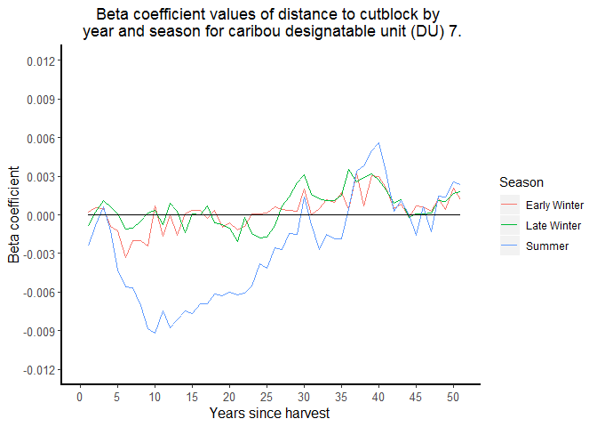
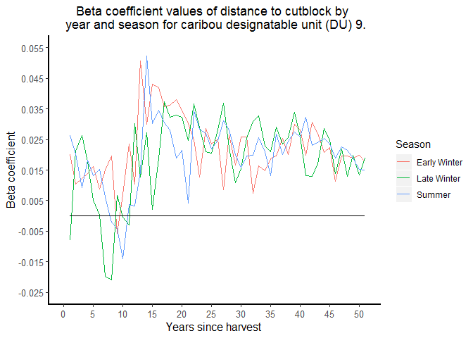
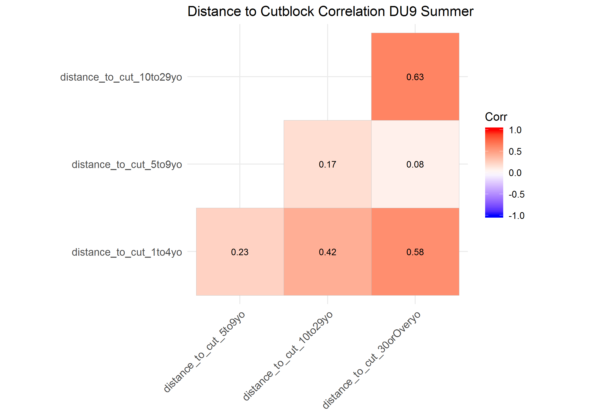

## Introduction
Here I describe a data exploration and model selection process completed to identify distance to cutblock covariates to include in caribou resource selection function (RSF) models. RSF models are a form of binomial logistic regression models that are used to statistically estimate habitat selection by animals (Boyce et al. 1999; Manly et al. 2007). RSFs were calculated for three seasons (early winter, late winter and summer), and across four caribou designatable units (DUs), i.e., ecological designations, of caribou. Caribou DU's  in British Columbia include DU 6 (boreal), DU7 (northern mountain), DU8 (central mountain) and DU9 (sourthern mountain) [see COSEWIC 2011](https://www.canada.ca/content/dam/eccc/migration/cosewic-cosepac/4e5136bf-f3ef-4b7a-9a79-6d70ba15440f/cosewic_caribou_du_report_23dec2011.pdf)

I had data that estimated the distance of approximately 500,000 caribou telemetry locations collected across Brtisish Columbia, and approximately two million randomly sampled locations within caribou home ranges (i.e., 'available' locations), to the nearest cutblock, by cutblock age, from one year old cutblocks up to greater than 50 year old cutblocks. I hypothesized that caribou selection for cutblocks would change as cutblocks age. Specifically, I predicted that caribou would be less likely to select younger cutblocks than older cutblocks, as younger cutblocks are typically associated with forage for other ungulates (i.e., moose and deer) and thus higher ungulate and predator (e.g., wolf) densities, resulting in higher mortality and predation risk for caribou (Wittmer et al. 2005; DeCesare et al. 2010).  

In addition, I hypothesized that distance to cutblock covariates would be correlated across years (e.g., distance to one year old cutblocks would be correlated with distance to two year old cutblocks). RSF models with highly correlated covariates (i.e., multicollinearity) can inflate  standard error coefficients of regression model covariates and make it difficult to interpret the contribution of covariates to estimating caribou resource selection. Therefore it would be necessary to simplify the number of covariates. I predicted that annual distance to cutblock covariates would need to be grouped to avoid multicollinearity. 

After temporally grouping the distance to cutblock data, I did further data exploration and correlation analyses of covariates by season and DU. I then fit distance to cutblock RSF models using functional responses (Matthiopolous et al. 2010) to test whether caribou selection of cutblocks is a function of the available distance to cutblocks within the caribou's home range. Specifically, I tested the hypothesis that caribou are more likely to avoid cutblocks in home ranges located closer to cutblocks. 

## Methods
### Correlation of Distance to Cutblock Across Years
Here I tested whether distance to cutblocks of different ages, from one year old to greater than 50 years old were correlated. I used a Spearman ($\rho$) correlation and correlated distance to cutblock between years in 10 year increments. Data were divided by designatable unit (DU). The following is an example of the R code used to calculate and display the correlation plots:

```r
# data
rsf.data.cut.age <- read.csv ("C:\\Work\\caribou\\clus_data\\caribou_habitat_model\\rsf_data_cutblock_age.csv")

# Correlations
# Example code for first 10 years
dist.cut.1.10.corr <- rsf.data.cut.age [c (10:19)] # sub-sample 10 year periods
corr.1.10 <- round (cor (dist.cut.1.10.corr, method = "spearman"), 3)
p.mat.1.10 <- round (cor_pmat (dist.cut.1.10.corr), 2)
ggcorrplot (corr.1.10, type = "lower", lab = TRUE, tl.cex = 10,  lab_size = 3,
            title = "All Data Distance to Cutblock Correlation Years 1 to 10")
```

### Generalized Linear Models (GLMs) of Distance to Cutblock across Years
Here I tested whether caribou selection of distance to cutblock changed as cublocks aged. This helped with temporally grouping distance to cutblock data by age, by illustrating if and when caribou consistently selected or avoided cutblocks of similar ages. 

I compared how caribou selected distance to cutblock across years by fitting seperate caribou RSFs, where each RSF had a single covariate for distance to cublock for each cutblock age. RSFs were fit using binomial generalized linear models (GLMs) with a logit link (i.e., comparing used to available caribou locations, where used locations are caribou telmetry locations and available locations are randomly sampled locations within the extent of estimated caribou home ranges). RSFs were fit for each season and DU. The following is an example of the R code used to calculate these RSFs:

```r
dist.cut.data.du.6.ew <- dist.cut.data %>% # sub-sample the data by season and DU
  dplyr::filter (du == "du6") %>% 
  dplyr::filter (season == "EarlyWinter")
glm.du.6.ew.1yo <- glm (pttype ~ distance_to_cut_1yo, 
                        data = dist.cut.data.du.6.ew,
                        family = binomial (link = 'logit'))
glm.du.6.ew.2yo <- glm (pttype ~ distance_to_cut_2yo, 
                        data = dist.cut.data.du.6.ew,
                        family = binomial (link = 'logit'))
....
....
....
glm.du.6.ew.51yo <- glm (pttype ~ distance_to_cut_pre50yo, 
                         data = dist.cut.data.du.6.ew,
                         family = binomial (link = 'logit'))
```

The beta coefficients of distance to cutblock covariates were outputted from each model and plotted against  cutblock age to illustrate how caribou selection changed as the cutblock aged.  

### Resource Selection Function (RSF) Model Selection of Distance to Cutblock Covariates by Cutblock Age
Based on the results of the analysis described above, I grouped distance to cutblock into four age categories: one to four years old, five to nine years old, 10 to 29 years old and over 29 years old (see Results and Conclusion, below, for details). I then tested for correlation between these covariates using a Spearman-rank ($\rho$) correlation and by calculating variance inflation factors (VIFs) from GLMs. If covariates had a $\rho$ > 0.7 or VIF > 10 (Montgomery and Peck 1992; Manly et al. 2007; DeCesare et al. 2012), then distance to cutblock covariates were further grouped into larger age classes. VIFs were calculated using the vif() function from the 'car' package in R. 


```r
model.glm.du6.ew <- glm (pttype ~ distance_to_cut_1to4yo + distance_to_cut_5to9yo + 
                          distance_to_cut_10yoorOver, 
                         data = dist.cut.data.du.6.ew,
                         family = binomial (link = 'logit'))
vif (model.glm.du6.ew) 
```

I fit RSF models as mixed effect regressions using the glmer() function in the lme4 package of R. I fit models with correlated random effect intercepts and slopes for each distance to cutblock covariate by each unique indivdual cariobu and year in the model (i.e., a unique identifier). I fit models with all combinations of distance to cutblock covariates and compared them using Akaike Information Criterion (AIC). To faciliate model convergence, I standardized the distance to cutblock covaraites by subtracting the mean and dividing by the standard deviation of the covariate.


```r
# Generalized Linear Mixed Models (GLMMs)
# standardize covariates  (helps with model convergence)
dist.cut.data.du.6.ew$std.distance_to_cut_1to4yo <- (dist.cut.data.du.6.ew$distance_to_cut_1to4yo - mean (dist.cut.data.du.6.ew$distance_to_cut_1to4yo)) / sd (dist.cut.data.du.6.ew$distance_to_cut_1to4yo)
dist.cut.data.du.6.ew$std.distance_to_cut_5to9yo <- (dist.cut.data.du.6.ew$distance_to_cut_5to9yo - mean (dist.cut.data.du.6.ew$distance_to_cut_5to9yo)) / sd (dist.cut.data.du.6.ew$distance_to_cut_5to9yo)
dist.cut.data.du.6.ew$std.distance_to_cut_10yoorOver <- (dist.cut.data.du.6.ew$distance_to_cut_10yoorOver - mean (dist.cut.data.du.6.ew$distance_to_cut_10yoorOver)) / sd (dist.cut.data.du.6.ew$distance_to_cut_10yoorOver)

# fit correlated random effects model
model.lme.du6.ew <- glmer (pttype ~ std.distance_to_cut_1to4yo + std.distance_to_cut_5to9yo + 
                            std.distance_to_cut_10yoorOver + 
                            (std.distance_to_cut_1to4yo | uniqueID) + 
                            (std.distance_to_cut_5to9yo | uniqueID) +
                            (std.distance_to_cut_10yoorOver | uniqueID) , 
                          data = dist.cut.data.du.6.ew, 
                          family = binomial,
                          REML = F, 
                          verbose = T)
AIC (model.lme.du6.ew)
# AUC 
pr.temp <- prediction (predict (model.lme.du6.ew, type = 'response'), dist.cut.data.du.6.ew$pttype)
prf.temp <- performance (pr.temp, measure = "tpr", x.measure = "fpr")
plot (prf.temp)
auc <- performance (pr.temp, measure = "auc")
auc <- auc@y.values[[1]]
```

Next, I tested whether models with a functional repsonse (*sensu* Matthiplolus et al. 2010) improved model fit by comparing the above models to models that included interaction terms for available distance to cutblock, by age class. Available distance to cublock was calculated as the mean distance to cutblock (for each age class) sampled at all available locations within each individual caribou's seasonal home range. 


```r
### Fit model with functional responses
# Calculating dataframe with covariate expectations
sub <- subset (dist.cut.data.du.6.ew, pttype == 0)
std.distance_to_cut_1to4yo_E <- tapply (sub$std.distance_to_cut_1to4yo, sub$uniqueID, mean)
std.distance_to_cut_5to9yo_E <- tapply (sub$std.distance_to_cut_5to9yo, sub$uniqueID, mean)
std.distance_to_cut_10yoorOver_E <- tapply (sub$std.distance_to_cut_10yoorOver, sub$uniqueID, mean)
inds <- as.character (dist.cut.data.du.6.ew$uniqueID)
dist.cut.data.du.6.ew <- cbind (dist.cut.data.du.6.ew, 
                                "std.distance_to_cut_1to4yo_E" = std.distance_to_cut_1to4yo_E [inds],
                                "std.distance_to_cut_5to9yo_E" = std.distance_to_cut_5to9yo_E [inds],
                                "std.distance_to_cut_10yoorOver_E" = std.distance_to_cut_10yoorOver_E [inds])

model.lme.fxn.du6.ew <- glmer (pttype ~ std.distance_to_cut_1to4yo + std.distance_to_cut_5to9yo + 
                               std.distance_to_cut_10yoorOver + std.distance_to_cut_1to4yo_E +
                               std.distance_to_cut_5to9yo_E + std.distance_to_cut_10yoorOver_E +
                               std.distance_to_cut_1to4yo:std.distance_to_cut_1to4yo_E +
                               std.distance_to_cut_5to9yo:std.distance_to_cut_5to9yo_E +
                               std.distance_to_cut_10yoorOver:std.distance_to_cut_10yoorOver_E +
                               (1 | uniqueID), 
                               data = dist.cut.data.du.6.ew, 
                               family = binomial (link = "logit"),
                               verbose = T,
                               control = glmerControl (calc.derivs = FALSE, 
                                                       optimizer = "nloptwrap",
                                                       optCtrl = list (maxfun = 2e5)))
```


I calculated the AIC for each model and compared them to asses the most parsimonious model fit. I also calculated area under the curve (AUC) of Receiver Operating Characteristic (ROC) curves for each model using the ROCR package in R to test the accuracy of predictions. The model with the highest AIC weight and a reasonably high AUC score (i.e., the abiliy of the accurately predict caribou locations) was considered the best distance to cutblock model for a particular season and DU combination. This model, and covaraites from this model will be included in a broader RSF model fittign adn selction porcess to identify a comprehensive, parsimonious and robust caribou habitat model for each season and DU. 

## Results
### Correlation Plots of Distance to Cutblock by Year for Designatable Unit (DU) 6
In the first 10 years (i.e., correlations between distance to cutblocks 1 to 10 years old), distance to cublock at locations in caribou home ranges were generally correlated. Correlations were relatively strong within two to three years ($\rho$ > 0.45). Correlations generally became weaker ($\rho$ < 0.4) after three to four years. Correlation between distance to cutblock 11 to 20, 21 to 30 and 31 to 40 years old were correlated across all 10 years ($\rho$ > 0.45). Correlation between distance to cutblock in years 41 to 50 were generally weaker, but also highly variable ($\rho$ = -0.07 to 0.86). 


### Correlation Plots of Distance to Cutblock by Year for Designatable Unit (DU) 7
Distance to cutblock was consistently correlated across years within all the 10 years periods (\rho > 0.5), and generally highly correlated (\rho > 0.7) across ten year periods for older cutblocks (older than ten years). In general, proximate years (i.e., three to four years apart) tended to be highly correlated (\rho > 0.7) for newer cutblocks (one to ten yeas old).


### Correlation Plots of Distance to Cutblock by Year for Designatable Unit (DU) 8
In the first 10 years, distance to cublock at locations in caribou home ranges were generally correlated. Correlations were typically stronger within two to three years ($\rho$ > 0.35) and weaker after three to four years. In years 11 to 20, 21 to 30 and 31 to 40, distance to cutblock was correlated within one year ($\rho$ > 0.41), but less correlated when greater than one year apart. In years 41 to greater than 50 years, correlations were generally weak between years.


### Correlation Plots of Distance to Cutblock by Year for Designatable Unit (DU) 9
In the first 10 years, distance to cublock at locations in caribou home ranges were generally correlated within one year ($\rho$ > 0.44), but less correlated when over one year apart. Correlation between distance to cutblock 11 to 20, 21 to 30, 31 to 40 and 41 to greater than 50 years old were generally highly correlated across all 10 years ($\rho$ > 0.7), but with some exceptions.


### Resource Selection Function (RSF) Distance to Cutblock Beta Coefficients by Year, Season and Designatable Unit (DU)
In DU6, distance to cutblock generally had a weak effect on caribou resource selection across years. There was not a clear pattern in selection of cutblocks across years, and this lack of  pattern was consistent across seasons. In general, caribou in DU6, across all seasons, appeared to avoid cutblocks less than three years old, select cutblocks four to ten years old and then avoid cutblocks over seven to ten years old.  
<!-- -->

In DU7, there was a more distinct pattern in caribou selection of cutblocks, and this pattern was different among seasons. The early and late winter seasons were generally consistent. The effect of distacne to cutblock was relatively weak across years, but the effect shifted from little or no selection of more recent cutblocks (cutblocks less than 25 years old), to avoidance of older cutblocks (greater than 25 years old). In the summer, cutblocks less than four years old appeared to have little effect on caribou. However, there was relatively strong selection of cutblcoks five to 30 years old and general avoidance of cutblocks older than 30 to 35 years old. 
<!-- -->

In DU8, selection of cutblocks was relatively strong and consistent across all seasons, but the pattern of selction was highly variable. However, in general, caribou selected younger cutblocks (approximately one to 20 years old) and avoided older cutblocks (greater than 20 years old). 
<!-- -->
  
In DU9, the effect of cutblocks was relatively strong and consistent across seasons. In general, caribou avoided cutblocks, although avoidance of younger (less than 10 year old) cutblocks was weaker than older cutlbocks. 
<!-- -->

### Resource Selection Function (RSF) Model Selection
#### DU6
##### Early Winter
The correlation plot indicated that distance to cutblocks 10 to 29 years old and 30 years old or over were highly correlated ($\rho$ = 0.85), therefore, I grouped these two age categories together (i.e., distance to cutblocks greater than 10 years old).


The maximum VIF from the simple GLM covariate model (i.e., including distance to cutblock 1 to 4, 5 to 9 and over 10 years old) was <1.7, indicating these covariates were not highly correlated. 

The top-ranked model included covariates of distance to cutblock ages five to nine years old and over nine years, but no functional response, and had an AIC weight (AIC*~w~*) of 1.00 (Table 1). In addition, the top model had the second highest AUC (AUC = 0.604), which was very close to the highest AUC value in the model set (AUC = 0.607).

##### Late Winter
The correlation plot indicated that distance to cutblocks 10 to 29 years old and 30 years old or over were highly correlated ($\rho$ = 0.79), therefore, I grouped these two age categories together (i.e., disatnce to cutblcoks greater than 10 years old).


The maximum VIF from the simple GLM covariate model was <1.6, indicating these covariates were not highly correlated. The top-ranked model included covariates of distance to cutblock for each cutblock age class, but no functional response, and had an AIC*~w~* of 1.00 (Table 1). In addition, the top model had the highest AUC (AUC = 0.665).

##### Summer
The correlation plot indicated that distance to cutblocks 10 to 29 years old and 30 years old or over were highly correlated ($\rho$ = 0.82), therefore, I grouped these two age categories together (i.e., disatnce to cutblcoks greater than 10 years old).


The maximum VIF from the simple GLM covariate model was <1.7, indicating these covariates were not highly correlated. The top-ranked model included covariates of distance to cutblock for each cutblock age class, but no functional response, and had an AIC*~w~* of 1.00 (Table 1). In addition, the top model had the highest AUC (AUC = 0.698).

#### DU7
##### Early Winter
The correlation plot indicated that distance to cutblocks 10 to 29 years old and 30 years old or over were highly correlated ($\rho$ = 0.81), therefore, I grouped these two age categories together (i.e., distance to cutblocks greater than 10 years old).


The maximum VIF from the simple GLM covariate model (i.e., including distance to cutblock 1 to 4, 5 to 9 and over 10 years old) was <4.1, indicating these covaraites were not highly correlated. The AIC*~w~* of the top model was 1.00 (Table 1). It included all distance to cutblock covariates, but not a functional response in caribou selection for cutblocks. The AUC of the top model (AUC = 0.679) was better than all other models.

##### Late Winter
The correlation plot indicated that distance to cutblocks 10 to 29 years old and 30 years old or over were highly correlated ($\rho$ = 0.82) and distance to cutblocks 5 to 9 years old and 10 to 29 years old were highly correlated ($\rho$ = 0.71) therefore, I grouped these three age categories together (i.e., distance to cutblocks greater than 5 years old).


The maximum VIF from the simple GLM covariate model (i.e., including distance to cutblock 1 to 4, over 5 years old) was <1.8, indicating these covariates were not highly correlated. The AIC*~w~* of the top model was 1.00 (Table 1). It included all distance to cutblock covariates, but not a functional response in caribou selection for cutblocks. The AUC of the top model (AUC = 0.690) was better than all other models.

##### Summer
The correlation plot indicated that distance to cutblocks 10 to 29 years old and 30 years old or over were highly correlated ($\rho$ = 0.80) and distance to cutblocks 5 to 9 years old and 10 to 29 years old were highly correlated ($\rho$ = 0.87) therefore, I grouped these three age category covariates together (i.e., distance to cutblocks greater than 5 years old).


The maximum VIF from the simple GLM covariate model (i.e., including distance to cutblock 1 to 4, over 5 years old) was <1.6, indicating these covariates were not highly correlated. The AIC*~w~* of the top model was 1.00 (Table 1). It included all distance to cutblock covariates, but not a functional response in caribou selection for cutblocks. The AUC of the top model (AUC = 0.694) was better than all other models.

#### DU8
##### Early Winter
The correlation plot indicated that none of the distance to cutblock covariates were highly correlated ($\rho$ < 0.61). Therefore, I did not group any of the age covariates together.


The maximum VIF from the simple GLM covariate model was <1.9, indicating the covariates were not highly correlated. The AIC*~w~* of the top model was 1.00 (Table 1). It included all distance to cutblock covariates, but not a functional response in caribou selection for cutblocks. The AUC of the top model (AUC = 0.698) was better than all other models.

##### Late Winter
The correlation plot indicated that none of the distance to cutblock covariates were highly correlated ($\rho$ < 0.57). Therefore, I did not group any of the age covariates together.


The maximum VIF from the simple GLM covariate model was <1.7, indicating the covariates were not highly correlated. The AIC*~w~* of the top model was 1.00 (Table 1). It included all distance to cutblock covariates, but not a functional response in caribou selection for cutblocks. The AUC of the top model (AUC = 0.715) was better than all other models.

##### Summer
The correlation plot indicated that none of the distance to cutblock covariates were highly correlated ($\rho$ < 0.54). Therefore, I did not group any of the age covariates together.


The maximum VIF from the simple GLM covariate model was <1.8, indicating the covariates were not highly correlated. The AIC*~w~* of the top model was 1.00 (Table 1). It included all distance to cutblock covariates, but not a functional response in caribou selection for cutblocks. The AUC of the top model (AUC = 0.701) was better than all other models.

#### DU9
##### Early Winter
The correlation plot indicated that none of the distance to cutblock covariates were highly correlated ($\rho$ < 0.67). Therefore, I did not group any of the age covariates together.


The maximum VIF from the simple GLM covariate model was <6.6, indicating covariates were not highly correlated. The AIC*~w~* of the top model was 0.90 (Table 1). It included all temporal distance to cutblock covariates with a functional response in caribou selection for cutblocks for each covariate. The AUC of the top model (AUC = 0.636) was about average for the model set, and slightly less than the most predictive model (i.e., AUC = 0.648).

##### Late Winter
The correlation plot indicated that none of the distance to cutblock covariates were highly correlated ($\rho$ < 0.57). Therefore, I did not group any of the age covariates together.


The maximum VIF from the simple GLM covariate model was <3.5, indicating covariates were not highly correlated. The AIC*~w~* of the top model was 0.986 (Table 1). It included all temporal distance to cutblock covariates, but no functional response in caribou selection for cutblocks. The AUC of the top model (AUC = 0.681) was better than all other models.

##### Summer
The correlation plot indicated that none of the distance to cutblock covariates were highly correlated ($\rho$ < 0.64). Therefore, I did not group any of the age covariates together.



The maximum VIF from the simple GLM covariate model was <2.2, indicating covariates were not highly correlated. The AIC*~w~* of the top model was 1.00 (Table 1). It included all temporal distance to cutblock covariates, but no functional response in caribou selection for cutblocks. The AUC of the top model (AUC = 0.694) was better than all other models.

Table 1. AIC, AIC*~w~* and AUC values from DU and seasonal sets of distance to cutblock resoruce selection models for caribou. 
<table class="table table-striped table-condensed" style="margin-left: auto; margin-right: auto;">
 <thead>
  <tr>
   <th style="text-align:left;"> DU </th>
   <th style="text-align:left;"> Season </th>
   <th style="text-align:left;"> Model.Type </th>
   <th style="text-align:left;"> Fixed.Effects.Covariates </th>
   <th style="text-align:left;"> Random.Effects.Covariates </th>
   <th style="text-align:right;"> AIC </th>
   <th style="text-align:right;"> AICw </th>
   <th style="text-align:right;"> AUC </th>
  </tr>
 </thead>
<tbody>
  <tr>
   <td style="text-align:left;"> DU6 </td>
   <td style="text-align:left;"> Early Winter </td>
   <td style="text-align:left;"> GLMM with Individual and Year (UniqueID) Random Effect </td>
   <td style="text-align:left;"> DC1to4, DC5to9, DCover9 </td>
   <td style="text-align:left;"> (DC1to4 | UniqueID), (DC5to9 | UniqueID), (DCover9 | UniqueID) </td>
   <td style="text-align:right;"> 219571 </td>
   <td style="text-align:right;"> 0.000 </td>
   <td style="text-align:right;"> 0.607 </td>
  </tr>
  <tr>
   <td style="text-align:left;"> DU6 </td>
   <td style="text-align:left;"> Early Winter </td>
   <td style="text-align:left;"> GLMM with Individual and Year (UniqueID) Random Effect </td>
   <td style="text-align:left;"> DC1to4 </td>
   <td style="text-align:left;"> (DC1to4 | UniqueID) </td>
   <td style="text-align:right;"> 219770 </td>
   <td style="text-align:right;"> 0.000 </td>
   <td style="text-align:right;"> 0.594 </td>
  </tr>
  <tr>
   <td style="text-align:left;"> DU6 </td>
   <td style="text-align:left;"> Early Winter </td>
   <td style="text-align:left;"> GLMM with Individual and Year (UniqueID) Random Effect </td>
   <td style="text-align:left;"> DC5to9 </td>
   <td style="text-align:left;"> (DC5to9 | UniqueID) </td>
   <td style="text-align:right;"> 219656 </td>
   <td style="text-align:right;"> 0.000 </td>
   <td style="text-align:right;"> 0.599 </td>
  </tr>
  <tr>
   <td style="text-align:left;"> DU6 </td>
   <td style="text-align:left;"> Early Winter </td>
   <td style="text-align:left;"> GLMM with Individual and Year (UniqueID) Random Effect </td>
   <td style="text-align:left;"> DCover9 </td>
   <td style="text-align:left;"> (DCover9 | UniqueID) </td>
   <td style="text-align:right;"> 219681 </td>
   <td style="text-align:right;"> 0.000 </td>
   <td style="text-align:right;"> 0.599 </td>
  </tr>
  <tr>
   <td style="text-align:left;"> DU6 </td>
   <td style="text-align:left;"> Early Winter </td>
   <td style="text-align:left;"> GLMM with Individual and Year (UniqueID) Random Effect </td>
   <td style="text-align:left;"> DC1to4, DC5to9 </td>
   <td style="text-align:left;"> (DC1to4 | UniqueID), (DC5to9 | UniqueID) </td>
   <td style="text-align:right;"> 219666 </td>
   <td style="text-align:right;"> 0.000 </td>
   <td style="text-align:right;"> 0.599 </td>
  </tr>
  <tr>
   <td style="text-align:left;"> DU6 </td>
   <td style="text-align:left;"> Early Winter </td>
   <td style="text-align:left;"> GLMM with Individual and Year (UniqueID) Random Effect </td>
   <td style="text-align:left;"> DC1to4, DCover9 </td>
   <td style="text-align:left;"> (DC1to4 | UniqueID), (DCover9 | UniqueID) </td>
   <td style="text-align:right;"> 219644 </td>
   <td style="text-align:right;"> 0.000 </td>
   <td style="text-align:right;"> 0.604 </td>
  </tr>
  <tr>
   <td style="text-align:left;"> DU6 </td>
   <td style="text-align:left;"> Early Winter </td>
   <td style="text-align:left;"> GLMM with Individual and Year (UniqueID) Random Effect </td>
   <td style="text-align:left;"> DC5to9, DCover9 </td>
   <td style="text-align:left;"> (DC5to9 | UniqueID), (DCover9 | UniqueID) </td>
   <td style="text-align:right;"> 219544 </td>
   <td style="text-align:right;"> 1.000 </td>
   <td style="text-align:right;"> 0.604 </td>
  </tr>
  <tr>
   <td style="text-align:left;"> DU6 </td>
   <td style="text-align:left;"> Early Winter </td>
   <td style="text-align:left;"> GLMM with Functional Response </td>
   <td style="text-align:left;"> DC1to4, DC5to9, DCover9, A_DC1to4, A_DC5to9, A_DCover9, DC1to4*A_DC1to4, DC5to9*A_DC5to9, DCover9*A_DCover9 </td>
   <td style="text-align:left;"> (1 | UniqueID) </td>
   <td style="text-align:right;"> 219760 </td>
   <td style="text-align:right;"> 0.000 </td>
   <td style="text-align:right;"> 0.592 </td>
  </tr>
  <tr>
   <td style="text-align:left;"> DU6 </td>
   <td style="text-align:left;"> Early Winter </td>
   <td style="text-align:left;"> GLMM with Functional Response </td>
   <td style="text-align:left;"> DC1to4, A_DC1to4, DC1to4*A_DC1to4 </td>
   <td style="text-align:left;"> (1 | UniqueID) </td>
   <td style="text-align:right;"> 219766 </td>
   <td style="text-align:right;"> 0.000 </td>
   <td style="text-align:right;"> 0.604 </td>
  </tr>
  <tr>
   <td style="text-align:left;"> DU6 </td>
   <td style="text-align:left;"> Early Winter </td>
   <td style="text-align:left;"> GLMM with Functional Response </td>
   <td style="text-align:left;"> DC5to9, A_DC5to9, DC5to9*A_DC5to9 </td>
   <td style="text-align:left;"> (1 | UniqueID) </td>
   <td style="text-align:right;"> 219789 </td>
   <td style="text-align:right;"> 0.000 </td>
   <td style="text-align:right;"> 0.591 </td>
  </tr>
  <tr>
   <td style="text-align:left;"> DU6 </td>
   <td style="text-align:left;"> Early Winter </td>
   <td style="text-align:left;"> GLMM with Functional Response </td>
   <td style="text-align:left;"> DCover9, A_DCover9, DCover9*A_DCover9 </td>
   <td style="text-align:left;"> (1 | UniqueID) </td>
   <td style="text-align:right;"> 219768 </td>
   <td style="text-align:right;"> 0.000 </td>
   <td style="text-align:right;"> 0.591 </td>
  </tr>
  <tr>
   <td style="text-align:left;"> DU6 </td>
   <td style="text-align:left;"> Early Winter </td>
   <td style="text-align:left;"> GLMM with Functional Response </td>
   <td style="text-align:left;"> DC1to4, DC5to9, A_DC1to4, A_DC5to9, DC1to4*A_DC1to4, DC5to9*A_DC5to9 </td>
   <td style="text-align:left;"> (1 | UniqueID) </td>
   <td style="text-align:right;"> 219771 </td>
   <td style="text-align:right;"> 0.000 </td>
   <td style="text-align:right;"> 0.592 </td>
  </tr>
  <tr>
   <td style="text-align:left;"> DU6 </td>
   <td style="text-align:left;"> Early Winter </td>
   <td style="text-align:left;"> GLMM with Functional Response </td>
   <td style="text-align:left;"> DC1to4, DCover9, A_DC1to4, A_DCover9, DC1to4*A_DC1to4, DCover9*A_DCover9 </td>
   <td style="text-align:left;"> (1 | UniqueID) </td>
   <td style="text-align:right;"> 219762 </td>
   <td style="text-align:right;"> 0.000 </td>
   <td style="text-align:right;"> 0.592 </td>
  </tr>
  <tr>
   <td style="text-align:left;"> DU6 </td>
   <td style="text-align:left;"> Early Winter </td>
   <td style="text-align:left;"> GLMM with Functional Response </td>
   <td style="text-align:left;"> DC5to9, DCover9, A_DC5to9, A_DCover9, DC5to9*A_DC5to9, DCover9*A_DCover9 </td>
   <td style="text-align:left;"> (1 | UniqueID) </td>
   <td style="text-align:right;"> 219765 </td>
   <td style="text-align:right;"> 0.000 </td>
   <td style="text-align:right;"> 0.592 </td>
  </tr>
  <tr>
   <td style="text-align:left;"> DU6 </td>
   <td style="text-align:left;"> Late Winter </td>
   <td style="text-align:left;"> GLMM with Individual and Year (UniqueID) Random Effect </td>
   <td style="text-align:left;"> DC1to4, DC5to9, DCover9 </td>
   <td style="text-align:left;"> (DC1to4 | UniqueID), (DC5to9 | UniqueID), (DCover9 | UniqueID) </td>
   <td style="text-align:right;"> 380908 </td>
   <td style="text-align:right;"> 1.000 </td>
   <td style="text-align:right;"> 0.665 </td>
  </tr>
  <tr>
   <td style="text-align:left;"> DU6 </td>
   <td style="text-align:left;"> Late Winter </td>
   <td style="text-align:left;"> GLMM with Individual and Year (UniqueID) Random Effect </td>
   <td style="text-align:left;"> DC1to4 </td>
   <td style="text-align:left;"> (DC1to4 | UniqueID) </td>
   <td style="text-align:right;"> 383349 </td>
   <td style="text-align:right;"> 0.000 </td>
   <td style="text-align:right;"> 0.648 </td>
  </tr>
  <tr>
   <td style="text-align:left;"> DU6 </td>
   <td style="text-align:left;"> Late Winter </td>
   <td style="text-align:left;"> GLMM with Individual and Year (UniqueID) Random Effect </td>
   <td style="text-align:left;"> DC5to9 </td>
   <td style="text-align:left;"> (DC5to9 | UniqueID) </td>
   <td style="text-align:right;"> 382911 </td>
   <td style="text-align:right;"> 0.000 </td>
   <td style="text-align:right;"> 0.649 </td>
  </tr>
  <tr>
   <td style="text-align:left;"> DU6 </td>
   <td style="text-align:left;"> Late Winter </td>
   <td style="text-align:left;"> GLMM with Individual and Year (UniqueID) Random Effect </td>
   <td style="text-align:left;"> DCover9 </td>
   <td style="text-align:left;"> (DCover9 | UniqueID) </td>
   <td style="text-align:right;"> 382830 </td>
   <td style="text-align:right;"> 0.000 </td>
   <td style="text-align:right;"> 0.649 </td>
  </tr>
  <tr>
   <td style="text-align:left;"> DU6 </td>
   <td style="text-align:left;"> Late Winter </td>
   <td style="text-align:left;"> GLMM with Individual and Year (UniqueID) Random Effect </td>
   <td style="text-align:left;"> DC1to4, DC5to9 </td>
   <td style="text-align:left;"> (DC1to4 | UniqueID), (DC5to9 | UniqueID) </td>
   <td style="text-align:right;"> 381949 </td>
   <td style="text-align:right;"> 0.000 </td>
   <td style="text-align:right;"> 0.649 </td>
  </tr>
  <tr>
   <td style="text-align:left;"> DU6 </td>
   <td style="text-align:left;"> Late Winter </td>
   <td style="text-align:left;"> GLMM with Individual and Year (UniqueID) Random Effect </td>
   <td style="text-align:left;"> DC1to4, DCover9 </td>
   <td style="text-align:left;"> (DC1to4 | UniqueID), (DCover9 | UniqueID) </td>
   <td style="text-align:right;"> 381760 </td>
   <td style="text-align:right;"> 0.000 </td>
   <td style="text-align:right;"> 0.659 </td>
  </tr>
  <tr>
   <td style="text-align:left;"> DU6 </td>
   <td style="text-align:left;"> Late Winter </td>
   <td style="text-align:left;"> GLMM with Individual and Year (UniqueID) Random Effect </td>
   <td style="text-align:left;"> DC5to9, DCover9 </td>
   <td style="text-align:left;"> (DC5to9 | UniqueID), (DCover9 | UniqueID) </td>
   <td style="text-align:right;"> 381949 </td>
   <td style="text-align:right;"> 0.000 </td>
   <td style="text-align:right;"> 0.658 </td>
  </tr>
  <tr>
   <td style="text-align:left;"> DU6 </td>
   <td style="text-align:left;"> Late Winter </td>
   <td style="text-align:left;"> GLMM with Functional Response </td>
   <td style="text-align:left;"> DC1to4, DC5to9, DCover9, A_DC1to4, A_DC5to9, A_DCover9, DC1to4*A_DC1to4, DC5to9*A_DC5to9, DCover9*A_DCover9 </td>
   <td style="text-align:left;"> (1 | UniqueID) </td>
   <td style="text-align:right;"> 385133 </td>
   <td style="text-align:right;"> 0.000 </td>
   <td style="text-align:right;"> 0.630 </td>
  </tr>
  <tr>
   <td style="text-align:left;"> DU6 </td>
   <td style="text-align:left;"> Late Winter </td>
   <td style="text-align:left;"> GLMM with Functional Response </td>
   <td style="text-align:left;"> DC1to4, A_DC1to4, DC1to4*A_DC1to4 </td>
   <td style="text-align:left;"> (1 | UniqueID) </td>
   <td style="text-align:right;"> 385197 </td>
   <td style="text-align:right;"> 0.000 </td>
   <td style="text-align:right;"> 0.629 </td>
  </tr>
  <tr>
   <td style="text-align:left;"> DU6 </td>
   <td style="text-align:left;"> Late Winter </td>
   <td style="text-align:left;"> GLMM with Functional Response </td>
   <td style="text-align:left;"> DC5to9, A_DC5to9, DC5to9*A_DC5to9 </td>
   <td style="text-align:left;"> (1 | UniqueID) </td>
   <td style="text-align:right;"> 385170 </td>
   <td style="text-align:right;"> 0.000 </td>
   <td style="text-align:right;"> 0.630 </td>
  </tr>
  <tr>
   <td style="text-align:left;"> DU6 </td>
   <td style="text-align:left;"> Late Winter </td>
   <td style="text-align:left;"> GLMM with Functional Response </td>
   <td style="text-align:left;"> DCover9, A_DCover9, DCover9*A_DCover9 </td>
   <td style="text-align:left;"> (1 | UniqueID) </td>
   <td style="text-align:right;"> 385165 </td>
   <td style="text-align:right;"> 0.000 </td>
   <td style="text-align:right;"> 0.630 </td>
  </tr>
  <tr>
   <td style="text-align:left;"> DU6 </td>
   <td style="text-align:left;"> Late Winter </td>
   <td style="text-align:left;"> GLMM with Functional Response </td>
   <td style="text-align:left;"> DC1to4, DC5to9, A_DC1to4, A_DC5to9, DC1to4*A_DC1to4, DC5to9*A_DC5to9 </td>
   <td style="text-align:left;"> (1 | UniqueID) </td>
   <td style="text-align:right;"> 385161 </td>
   <td style="text-align:right;"> 0.000 </td>
   <td style="text-align:right;"> 0.630 </td>
  </tr>
  <tr>
   <td style="text-align:left;"> DU6 </td>
   <td style="text-align:left;"> Late Winter </td>
   <td style="text-align:left;"> GLMM with Functional Response </td>
   <td style="text-align:left;"> DC1to4, DCover9, A_DC1to4, A_DCover9, DC1to4*A_DC1to4, DCover9*A_DCover9 </td>
   <td style="text-align:left;"> (1 | UniqueID) </td>
   <td style="text-align:right;"> 385151 </td>
   <td style="text-align:right;"> 0.000 </td>
   <td style="text-align:right;"> 0.630 </td>
  </tr>
  <tr>
   <td style="text-align:left;"> DU6 </td>
   <td style="text-align:left;"> Late Winter </td>
   <td style="text-align:left;"> GLMM with Functional Response </td>
   <td style="text-align:left;"> DC5to9, DCover9, A_DC5to9, A_DCover9, DC5to9*A_DC5to9, DCover9*A_DCover9 </td>
   <td style="text-align:left;"> (1 | UniqueID) </td>
   <td style="text-align:right;"> 385147 </td>
   <td style="text-align:right;"> 0.000 </td>
   <td style="text-align:right;"> 0.630 </td>
  </tr>
  <tr>
   <td style="text-align:left;"> DU6 </td>
   <td style="text-align:left;"> Summer </td>
   <td style="text-align:left;"> GLMM with Individual and Year (UniqueID) Random Effect </td>
   <td style="text-align:left;"> DC1to4, DC5to9, DCover9 </td>
   <td style="text-align:left;"> (DC1to4 | UniqueID), (DC5to9 | UniqueID), (DCover9 | UniqueID) </td>
   <td style="text-align:right;"> 426565 </td>
   <td style="text-align:right;"> 1.000 </td>
   <td style="text-align:right;"> 0.698 </td>
  </tr>
  <tr>
   <td style="text-align:left;"> DU6 </td>
   <td style="text-align:left;"> Summer </td>
   <td style="text-align:left;"> GLMM with Individual and Year (UniqueID) Random Effect </td>
   <td style="text-align:left;"> DC1to4 </td>
   <td style="text-align:left;"> (DC1to4 | UniqueID) </td>
   <td style="text-align:right;"> 432125 </td>
   <td style="text-align:right;"> 0.000 </td>
   <td style="text-align:right;"> 0.675 </td>
  </tr>
  <tr>
   <td style="text-align:left;"> DU6 </td>
   <td style="text-align:left;"> Summer </td>
   <td style="text-align:left;"> GLMM with Individual and Year (UniqueID) Random Effect </td>
   <td style="text-align:left;"> DC5to9 </td>
   <td style="text-align:left;"> (DC5to9 | UniqueID) </td>
   <td style="text-align:right;"> 431384 </td>
   <td style="text-align:right;"> 0.000 </td>
   <td style="text-align:right;"> 0.673 </td>
  </tr>
  <tr>
   <td style="text-align:left;"> DU6 </td>
   <td style="text-align:left;"> Summer </td>
   <td style="text-align:left;"> GLMM with Individual and Year (UniqueID) Random Effect </td>
   <td style="text-align:left;"> DCover9 </td>
   <td style="text-align:left;"> (DCover9 | UniqueID) </td>
   <td style="text-align:right;"> 430372 </td>
   <td style="text-align:right;"> 0.000 </td>
   <td style="text-align:right;"> 0.677 </td>
  </tr>
  <tr>
   <td style="text-align:left;"> DU6 </td>
   <td style="text-align:left;"> Summer </td>
   <td style="text-align:left;"> GLMM with Individual and Year (UniqueID) Random Effect </td>
   <td style="text-align:left;"> DC1to4, DC5to9 </td>
   <td style="text-align:left;"> (DC1to4 | UniqueID), (DC5to9 | UniqueID) </td>
   <td style="text-align:right;"> 429137 </td>
   <td style="text-align:right;"> 0.000 </td>
   <td style="text-align:right;"> 0.687 </td>
  </tr>
  <tr>
   <td style="text-align:left;"> DU6 </td>
   <td style="text-align:left;"> Summer </td>
   <td style="text-align:left;"> GLMM with Individual and Year (UniqueID) Random Effect </td>
   <td style="text-align:left;"> DC1to4, DCover9 </td>
   <td style="text-align:left;"> (DC1to4 | UniqueID), (DCover9 | UniqueID) </td>
   <td style="text-align:right;"> 427979 </td>
   <td style="text-align:right;"> 0.000 </td>
   <td style="text-align:right;"> 0.690 </td>
  </tr>
  <tr>
   <td style="text-align:left;"> DU6 </td>
   <td style="text-align:left;"> Summer </td>
   <td style="text-align:left;"> GLMM with Individual and Year (UniqueID) Random Effect </td>
   <td style="text-align:left;"> DC5to9, DCover9 </td>
   <td style="text-align:left;"> (DC5to9 | UniqueID), (DCover9 | UniqueID) </td>
   <td style="text-align:right;"> 428097 </td>
   <td style="text-align:right;"> 0.000 </td>
   <td style="text-align:right;"> 0.688 </td>
  </tr>
  <tr>
   <td style="text-align:left;"> DU6 </td>
   <td style="text-align:left;"> Summer </td>
   <td style="text-align:left;"> GLMM with Functional Response </td>
   <td style="text-align:left;"> DC1to4, DC5to9, DCover9, A_DC1to4, A_DC5to9, A_DCover9, DC1to4*A_DC1to4, DC5to9*A_DC5to9, DCover9*A_DCover9 </td>
   <td style="text-align:left;"> (1 | UniqueID) </td>
   <td style="text-align:right;"> 435824 </td>
   <td style="text-align:right;"> 0.000 </td>
   <td style="text-align:right;"> 0.649 </td>
  </tr>
  <tr>
   <td style="text-align:left;"> DU6 </td>
   <td style="text-align:left;"> Summer </td>
   <td style="text-align:left;"> GLMM with Functional Response </td>
   <td style="text-align:left;"> DC1to4, A_DC1to4, DC1to4*A_DC1to4 </td>
   <td style="text-align:left;"> (1 | UniqueID) </td>
   <td style="text-align:right;"> 436081 </td>
   <td style="text-align:right;"> 0.000 </td>
   <td style="text-align:right;"> 0.647 </td>
  </tr>
  <tr>
   <td style="text-align:left;"> DU6 </td>
   <td style="text-align:left;"> Summer </td>
   <td style="text-align:left;"> GLMM with Functional Response </td>
   <td style="text-align:left;"> DC5to9, A_DC5to9, DC5to9*A_DC5to9 </td>
   <td style="text-align:left;"> (1 | UniqueID) </td>
   <td style="text-align:right;"> 435865 </td>
   <td style="text-align:right;"> 0.000 </td>
   <td style="text-align:right;"> 0.649 </td>
  </tr>
  <tr>
   <td style="text-align:left;"> DU6 </td>
   <td style="text-align:left;"> Summer </td>
   <td style="text-align:left;"> GLMM with Functional Response </td>
   <td style="text-align:left;"> DCover9, A_DCover9, DCover9*A_DCover9 </td>
   <td style="text-align:left;"> (1 | UniqueID) </td>
   <td style="text-align:right;"> 435966 </td>
   <td style="text-align:right;"> 0.000 </td>
   <td style="text-align:right;"> 0.647 </td>
  </tr>
  <tr>
   <td style="text-align:left;"> DU6 </td>
   <td style="text-align:left;"> Summer </td>
   <td style="text-align:left;"> GLMM with Functional Response </td>
   <td style="text-align:left;"> DC1to4, DC5to9, A_DC1to4, A_DC5to9, DC1to4*A_DC1to4, DC5to9*A_DC5to9 </td>
   <td style="text-align:left;"> (1 | UniqueID) </td>
   <td style="text-align:right;"> 435853 </td>
   <td style="text-align:right;"> 0.000 </td>
   <td style="text-align:right;"> 0.649 </td>
  </tr>
  <tr>
   <td style="text-align:left;"> DU6 </td>
   <td style="text-align:left;"> Summer </td>
   <td style="text-align:left;"> GLMM with Functional Response </td>
   <td style="text-align:left;"> DC1to4, DCover9, A_DC1to4, A_DCover9, DC1to4*A_DC1to4, DCover9*A_DCover9 </td>
   <td style="text-align:left;"> (1 | UniqueID) </td>
   <td style="text-align:right;"> 435952 </td>
   <td style="text-align:right;"> 0.000 </td>
   <td style="text-align:right;"> 0.648 </td>
  </tr>
  <tr>
   <td style="text-align:left;"> DU6 </td>
   <td style="text-align:left;"> Summer </td>
   <td style="text-align:left;"> GLMM with Functional Response </td>
   <td style="text-align:left;"> DC5to9, DCover9, A_DC5to9, A_DCover9, DC5to9*A_DC5to9, DCover9*A_DCover9 </td>
   <td style="text-align:left;"> (1 | UniqueID) </td>
   <td style="text-align:right;"> 435824 </td>
   <td style="text-align:right;"> 0.000 </td>
   <td style="text-align:right;"> 0.649 </td>
  </tr>
  <tr>
   <td style="text-align:left;"> DU7 </td>
   <td style="text-align:left;"> Early Winter </td>
   <td style="text-align:left;"> GLMM with Individual and Year (UniqueID) Random Effect </td>
   <td style="text-align:left;"> DC1to4, DC5to9, DCover9 </td>
   <td style="text-align:left;"> (DC1to4 | UniqueID), (DC5to9 | UniqueID), (DCover9 | UniqueID) </td>
   <td style="text-align:right;"> 134485 </td>
   <td style="text-align:right;"> 1.000 </td>
   <td style="text-align:right;"> 0.679 </td>
  </tr>
  <tr>
   <td style="text-align:left;"> DU7 </td>
   <td style="text-align:left;"> Early Winter </td>
   <td style="text-align:left;"> GLMM with Individual and Year (UniqueID) Random Effect </td>
   <td style="text-align:left;"> DC1to4 </td>
   <td style="text-align:left;"> (DC1to4 | UniqueID) </td>
   <td style="text-align:right;"> 134750 </td>
   <td style="text-align:right;"> 0.000 </td>
   <td style="text-align:right;"> 0.672 </td>
  </tr>
  <tr>
   <td style="text-align:left;"> DU7 </td>
   <td style="text-align:left;"> Early Winter </td>
   <td style="text-align:left;"> GLMM with Individual and Year (UniqueID) Random Effect </td>
   <td style="text-align:left;"> DC5to9 </td>
   <td style="text-align:left;"> (DC5to9 | UniqueID) </td>
   <td style="text-align:right;"> 134624 </td>
   <td style="text-align:right;"> 0.000 </td>
   <td style="text-align:right;"> 0.674 </td>
  </tr>
  <tr>
   <td style="text-align:left;"> DU7 </td>
   <td style="text-align:left;"> Early Winter </td>
   <td style="text-align:left;"> GLMM with Individual and Year (UniqueID) Random Effect </td>
   <td style="text-align:left;"> DCover9 </td>
   <td style="text-align:left;"> (DCover9 | UniqueID) </td>
   <td style="text-align:right;"> 134667 </td>
   <td style="text-align:right;"> 0.000 </td>
   <td style="text-align:right;"> 0.673 </td>
  </tr>
  <tr>
   <td style="text-align:left;"> DU7 </td>
   <td style="text-align:left;"> Early Winter </td>
   <td style="text-align:left;"> GLMM with Individual and Year (UniqueID) Random Effect </td>
   <td style="text-align:left;"> DC1to4, DC5to9 </td>
   <td style="text-align:left;"> (DC1to4 | UniqueID), (DC5to9 | UniqueID) </td>
   <td style="text-align:right;"> 134566 </td>
   <td style="text-align:right;"> 0.000 </td>
   <td style="text-align:right;"> 0.676 </td>
  </tr>
  <tr>
   <td style="text-align:left;"> DU7 </td>
   <td style="text-align:left;"> Early Winter </td>
   <td style="text-align:left;"> GLMM with Individual and Year (UniqueID) Random Effect </td>
   <td style="text-align:left;"> DC1to4, DCover9 </td>
   <td style="text-align:left;"> (DC1to4 | UniqueID), (DCover9 | UniqueID) </td>
   <td style="text-align:right;"> 134590 </td>
   <td style="text-align:right;"> 0.000 </td>
   <td style="text-align:right;"> 0.676 </td>
  </tr>
  <tr>
   <td style="text-align:left;"> DU7 </td>
   <td style="text-align:left;"> Early Winter </td>
   <td style="text-align:left;"> GLMM with Individual and Year (UniqueID) Random Effect </td>
   <td style="text-align:left;"> DC5to9, DCover9 </td>
   <td style="text-align:left;"> (DC5to9 | UniqueID), (DCover9 | UniqueID) </td>
   <td style="text-align:right;"> 134564 </td>
   <td style="text-align:right;"> 0.000 </td>
   <td style="text-align:right;"> 0.676 </td>
  </tr>
  <tr>
   <td style="text-align:left;"> DU7 </td>
   <td style="text-align:left;"> Early Winter </td>
   <td style="text-align:left;"> GLMM with Functional Response </td>
   <td style="text-align:left;"> DC1to4, DC5to9, DCover9, A_DC1to4, A_DC5to9, A_DCover9, DC1to4*A_DC1to4, DC5to9*A_DC5to9, DCover9*A_DCover9 </td>
   <td style="text-align:left;"> (1 | UniqueID) </td>
   <td style="text-align:right;"> 134855 </td>
   <td style="text-align:right;"> 0.000 </td>
   <td style="text-align:right;"> 0.668 </td>
  </tr>
  <tr>
   <td style="text-align:left;"> DU7 </td>
   <td style="text-align:left;"> Early Winter </td>
   <td style="text-align:left;"> GLMM with Functional Response </td>
   <td style="text-align:left;"> DC1to4, A_DC1to4, DC1to4*A_DC1to4 </td>
   <td style="text-align:left;"> (1 | UniqueID) </td>
   <td style="text-align:right;"> 134873 </td>
   <td style="text-align:right;"> 0.000 </td>
   <td style="text-align:right;"> 0.668 </td>
  </tr>
  <tr>
   <td style="text-align:left;"> DU7 </td>
   <td style="text-align:left;"> Early Winter </td>
   <td style="text-align:left;"> GLMM with Functional Response </td>
   <td style="text-align:left;"> DC5to9, A_DC5to9, DC5to9*A_DC5to9 </td>
   <td style="text-align:left;"> (1 | UniqueID) </td>
   <td style="text-align:right;"> 134877 </td>
   <td style="text-align:right;"> 0.000 </td>
   <td style="text-align:right;"> 0.667 </td>
  </tr>
  <tr>
   <td style="text-align:left;"> DU7 </td>
   <td style="text-align:left;"> Early Winter </td>
   <td style="text-align:left;"> GLMM with Functional Response </td>
   <td style="text-align:left;"> DCover9, A_DCover9, DCover9*A_DCover9 </td>
   <td style="text-align:left;"> (1 | UniqueID) </td>
   <td style="text-align:right;"> 134865 </td>
   <td style="text-align:right;"> 0.000 </td>
   <td style="text-align:right;"> 0.668 </td>
  </tr>
  <tr>
   <td style="text-align:left;"> DU7 </td>
   <td style="text-align:left;"> Early Winter </td>
   <td style="text-align:left;"> GLMM with Functional Response </td>
   <td style="text-align:left;"> DC1to4, DC5to9, A_DC1to4, A_DC5to9, DC1to4*A_DC1to4, DC5to9*A_DC5to9 </td>
   <td style="text-align:left;"> (1 | UniqueID) </td>
   <td style="text-align:right;"> 134877 </td>
   <td style="text-align:right;"> 0.000 </td>
   <td style="text-align:right;"> 0.668 </td>
  </tr>
  <tr>
   <td style="text-align:left;"> DU7 </td>
   <td style="text-align:left;"> Early Winter </td>
   <td style="text-align:left;"> GLMM with Functional Response </td>
   <td style="text-align:left;"> DC1to4, DCover9, A_DC1to4, A_DCover9, DC1to4*A_DC1to4, DCover9*A_DCover9 </td>
   <td style="text-align:left;"> (1 | UniqueID) </td>
   <td style="text-align:right;"> 134868 </td>
   <td style="text-align:right;"> 0.000 </td>
   <td style="text-align:right;"> 0.668 </td>
  </tr>
  <tr>
   <td style="text-align:left;"> DU7 </td>
   <td style="text-align:left;"> Early Winter </td>
   <td style="text-align:left;"> GLMM with Functional Response </td>
   <td style="text-align:left;"> DC5to9, DCover9, A_DC5to9, A_DCover9, DC5to9*A_DC5to9, DCover9*A_DCover9 </td>
   <td style="text-align:left;"> (1 | UniqueID) </td>
   <td style="text-align:right;"> 134854 </td>
   <td style="text-align:right;"> 0.000 </td>
   <td style="text-align:right;"> 0.668 </td>
  </tr>
  <tr>
   <td style="text-align:left;"> DU7 </td>
   <td style="text-align:left;"> Late Winter </td>
   <td style="text-align:left;"> GLMM with Individual and Year (UniqueID) Random Effect </td>
   <td style="text-align:left;"> DC1to4, DCover5 </td>
   <td style="text-align:left;"> (DC1to4 | UniqueID), (DCover5 | UniqueID) </td>
   <td style="text-align:right;"> 261752 </td>
   <td style="text-align:right;"> 1.000 </td>
   <td style="text-align:right;"> 0.690 </td>
  </tr>
  <tr>
   <td style="text-align:left;"> DU7 </td>
   <td style="text-align:left;"> Late Winter </td>
   <td style="text-align:left;"> GLMM with Individual and Year (UniqueID) Random Effect </td>
   <td style="text-align:left;"> DC1to4 </td>
   <td style="text-align:left;"> (DC1to4 | UniqueID) </td>
   <td style="text-align:right;"> 262605 </td>
   <td style="text-align:right;"> 0.000 </td>
   <td style="text-align:right;"> 0.683 </td>
  </tr>
  <tr>
   <td style="text-align:left;"> DU7 </td>
   <td style="text-align:left;"> Late Winter </td>
   <td style="text-align:left;"> GLMM with Individual and Year (UniqueID) Random Effect </td>
   <td style="text-align:left;"> DCover5 </td>
   <td style="text-align:left;"> (DCover5 | UniqueID) </td>
   <td style="text-align:right;"> 262789 </td>
   <td style="text-align:right;"> 0.000 </td>
   <td style="text-align:right;"> 0.682 </td>
  </tr>
  <tr>
   <td style="text-align:left;"> DU7 </td>
   <td style="text-align:left;"> Late Winter </td>
   <td style="text-align:left;"> GLMM with Functional Response </td>
   <td style="text-align:left;"> DC1to4, DCover5, A_DC1to4, A_DCover5, DC1to4*A_DC1to4, DCover5*A_DCover5 </td>
   <td style="text-align:left;"> (1 | UniqueID) </td>
   <td style="text-align:right;"> 263471 </td>
   <td style="text-align:right;"> 0.000 </td>
   <td style="text-align:right;"> 0.675 </td>
  </tr>
  <tr>
   <td style="text-align:left;"> DU7 </td>
   <td style="text-align:left;"> Late Winter </td>
   <td style="text-align:left;"> GLMM with Functional Response </td>
   <td style="text-align:left;"> DC1to4, A_DC1to4, DC1to4*A_DC1to4 </td>
   <td style="text-align:left;"> (1 | UniqueID) </td>
   <td style="text-align:right;"> 263470 </td>
   <td style="text-align:right;"> 0.000 </td>
   <td style="text-align:right;"> 0.675 </td>
  </tr>
  <tr>
   <td style="text-align:left;"> DU7 </td>
   <td style="text-align:left;"> Late Winter </td>
   <td style="text-align:left;"> GLMM with Functional Response </td>
   <td style="text-align:left;"> DCover5, A_DCover5, DCover5*A_DCover5 </td>
   <td style="text-align:left;"> (1 | UniqueID) </td>
   <td style="text-align:right;"> 263470 </td>
   <td style="text-align:right;"> 0.000 </td>
   <td style="text-align:right;"> 0.675 </td>
  </tr>
  <tr>
   <td style="text-align:left;"> DU7 </td>
   <td style="text-align:left;"> Summer </td>
   <td style="text-align:left;"> GLMM with Individual and Year (UniqueID) Random Effect </td>
   <td style="text-align:left;"> DC1to4, DCover5 </td>
   <td style="text-align:left;"> (DC1to4 | UniqueID), (DCover5 | UniqueID) </td>
   <td style="text-align:right;"> 254658 </td>
   <td style="text-align:right;"> 1.000 </td>
   <td style="text-align:right;"> 0.694 </td>
  </tr>
  <tr>
   <td style="text-align:left;"> DU7 </td>
   <td style="text-align:left;"> Summer </td>
   <td style="text-align:left;"> GLMM with Individual and Year (UniqueID) Random Effect </td>
   <td style="text-align:left;"> DC1to4 </td>
   <td style="text-align:left;"> (DC1to4 | UniqueID) </td>
   <td style="text-align:right;"> 256005 </td>
   <td style="text-align:right;"> 0.000 </td>
   <td style="text-align:right;"> 0.685 </td>
  </tr>
  <tr>
   <td style="text-align:left;"> DU7 </td>
   <td style="text-align:left;"> Summer </td>
   <td style="text-align:left;"> GLMM with Individual and Year (UniqueID) Random Effect </td>
   <td style="text-align:left;"> DCover5 </td>
   <td style="text-align:left;"> (DCover5 | UniqueID) </td>
   <td style="text-align:right;"> 255401 </td>
   <td style="text-align:right;"> 0.000 </td>
   <td style="text-align:right;"> 0.688 </td>
  </tr>
  <tr>
   <td style="text-align:left;"> DU7 </td>
   <td style="text-align:left;"> Summer </td>
   <td style="text-align:left;"> GLMM with Functional Response </td>
   <td style="text-align:left;"> DC1to4, DCover5, A_DC1to4, A_DCover5, DC1to4*A_DC1to4, DCover5*A_DCover5 </td>
   <td style="text-align:left;"> (1 | UniqueID) </td>
   <td style="text-align:right;"> 256855 </td>
   <td style="text-align:right;"> 0.000 </td>
   <td style="text-align:right;"> 0.678 </td>
  </tr>
  <tr>
   <td style="text-align:left;"> DU7 </td>
   <td style="text-align:left;"> Summer </td>
   <td style="text-align:left;"> GLMM with Functional Response </td>
   <td style="text-align:left;"> DC1to4, A_DC1to4, DC1to4*A_DC1to4 </td>
   <td style="text-align:left;"> (1 | UniqueID) </td>
   <td style="text-align:right;"> 257153 </td>
   <td style="text-align:right;"> 0.000 </td>
   <td style="text-align:right;"> 0.677 </td>
  </tr>
  <tr>
   <td style="text-align:left;"> DU7 </td>
   <td style="text-align:left;"> Summer </td>
   <td style="text-align:left;"> GLMM with Functional Response </td>
   <td style="text-align:left;"> DCover5, A_DCover5, DCover5*A_DCover5 </td>
   <td style="text-align:left;"> (1 | UniqueID) </td>
   <td style="text-align:right;"> 256871 </td>
   <td style="text-align:right;"> 0.000 </td>
   <td style="text-align:right;"> 0.678 </td>
  </tr>
  <tr>
   <td style="text-align:left;"> DU8 </td>
   <td style="text-align:left;"> Early Winter </td>
   <td style="text-align:left;"> GLMM with Individual and Year (UniqueID) Random Effect </td>
   <td style="text-align:left;"> DC1to4, DC5to9, DC10to29, DCover30 </td>
   <td style="text-align:left;"> (DC1to4 | UniqueID), (DC5to9 | UniqueID), (DC10to29 | UniqueID), (DCover30 | UniqueID) </td>
   <td style="text-align:right;"> 169166 </td>
   <td style="text-align:right;"> 1.000 </td>
   <td style="text-align:right;"> 0.698 </td>
  </tr>
  <tr>
   <td style="text-align:left;"> DU8 </td>
   <td style="text-align:left;"> Early Winter </td>
   <td style="text-align:left;"> GLMM with Individual and Year (UniqueID) Random Effect </td>
   <td style="text-align:left;"> DC1to4 </td>
   <td style="text-align:left;"> (DC1to4 | UniqueID) </td>
   <td style="text-align:right;"> 171144 </td>
   <td style="text-align:right;"> 0.000 </td>
   <td style="text-align:right;"> 0.676 </td>
  </tr>
  <tr>
   <td style="text-align:left;"> DU8 </td>
   <td style="text-align:left;"> Early Winter </td>
   <td style="text-align:left;"> GLMM with Individual and Year (UniqueID) Random Effect </td>
   <td style="text-align:left;"> DC5to9 </td>
   <td style="text-align:left;"> (DC5to9 | UniqueID) </td>
   <td style="text-align:right;"> 170983 </td>
   <td style="text-align:right;"> 0.000 </td>
   <td style="text-align:right;"> 0.677 </td>
  </tr>
  <tr>
   <td style="text-align:left;"> DU8 </td>
   <td style="text-align:left;"> Early Winter </td>
   <td style="text-align:left;"> GLMM with Individual and Year (UniqueID) Random Effect </td>
   <td style="text-align:left;"> DC10to29 </td>
   <td style="text-align:left;"> (DC10to29 | UniqueID) </td>
   <td style="text-align:right;"> 170650 </td>
   <td style="text-align:right;"> 0.000 </td>
   <td style="text-align:right;"> 0.679 </td>
  </tr>
  <tr>
   <td style="text-align:left;"> DU8 </td>
   <td style="text-align:left;"> Early Winter </td>
   <td style="text-align:left;"> GLMM with Individual and Year (UniqueID) Random Effect </td>
   <td style="text-align:left;"> DCover30 </td>
   <td style="text-align:left;"> (DCover30 | UniqueID) </td>
   <td style="text-align:right;"> 171315 </td>
   <td style="text-align:right;"> 0.000 </td>
   <td style="text-align:right;"> 0.675 </td>
  </tr>
  <tr>
   <td style="text-align:left;"> DU8 </td>
   <td style="text-align:left;"> Early Winter </td>
   <td style="text-align:left;"> GLMM with Individual and Year (UniqueID) Random Effect </td>
   <td style="text-align:left;"> DC1to4, DC5to9 </td>
   <td style="text-align:left;"> (DC1to4 | UniqueID), (DC5to9 | UniqueID) </td>
   <td style="text-align:right;"> 170430 </td>
   <td style="text-align:right;"> 0.000 </td>
   <td style="text-align:right;"> 0.686 </td>
  </tr>
  <tr>
   <td style="text-align:left;"> DU8 </td>
   <td style="text-align:left;"> Early Winter </td>
   <td style="text-align:left;"> GLMM with Individual and Year (UniqueID) Random Effect </td>
   <td style="text-align:left;"> DC1to4, DC10to29 </td>
   <td style="text-align:left;"> (DC1to4 | UniqueID), (DC10to29 | UniqueID) </td>
   <td style="text-align:right;"> 170220 </td>
   <td style="text-align:right;"> 0.000 </td>
   <td style="text-align:right;"> 0.686 </td>
  </tr>
  <tr>
   <td style="text-align:left;"> DU8 </td>
   <td style="text-align:left;"> Early Winter </td>
   <td style="text-align:left;"> GLMM with Individual and Year (UniqueID) Random Effect </td>
   <td style="text-align:left;"> DC1to4, DCover30 </td>
   <td style="text-align:left;"> (DC1to4 | UniqueID), (DCover30 | UniqueID) </td>
   <td style="text-align:right;"> 170651 </td>
   <td style="text-align:right;"> 0.000 </td>
   <td style="text-align:right;"> 0.684 </td>
  </tr>
  <tr>
   <td style="text-align:left;"> DU8 </td>
   <td style="text-align:left;"> Early Winter </td>
   <td style="text-align:left;"> GLMM with Individual and Year (UniqueID) Random Effect </td>
   <td style="text-align:left;"> DC5to9, DC10to29 </td>
   <td style="text-align:left;"> (DC5to9 | UniqueID), (DC10to29 | UniqueID) </td>
   <td style="text-align:right;"> 170086 </td>
   <td style="text-align:right;"> 0.000 </td>
   <td style="text-align:right;"> 0.687 </td>
  </tr>
  <tr>
   <td style="text-align:left;"> DU8 </td>
   <td style="text-align:left;"> Early Winter </td>
   <td style="text-align:left;"> GLMM with Individual and Year (UniqueID) Random Effect </td>
   <td style="text-align:left;"> DC5to9, DCover30 </td>
   <td style="text-align:left;"> (DC5to9 | UniqueID), (DCover30 | UniqueID) </td>
   <td style="text-align:right;"> 170523 </td>
   <td style="text-align:right;"> 0.000 </td>
   <td style="text-align:right;"> 0.685 </td>
  </tr>
  <tr>
   <td style="text-align:left;"> DU8 </td>
   <td style="text-align:left;"> Early Winter </td>
   <td style="text-align:left;"> GLMM with Individual and Year (UniqueID) Random Effect </td>
   <td style="text-align:left;"> DC10to29, DCover30 </td>
   <td style="text-align:left;"> (DC10to29 | UniqueID), (DCover30 | UniqueID) </td>
   <td style="text-align:right;"> 170183 </td>
   <td style="text-align:right;"> 0.000 </td>
   <td style="text-align:right;"> 0.687 </td>
  </tr>
  <tr>
   <td style="text-align:left;"> DU8 </td>
   <td style="text-align:left;"> Early Winter </td>
   <td style="text-align:left;"> GLMM with Individual and Year (UniqueID) Random Effect </td>
   <td style="text-align:left;"> DC1to4, DC5to9, DC10to29 </td>
   <td style="text-align:left;"> (DC1to4 | UniqueID), (DC5to9 | UniqueID), (DC10to29 | UniqueID) </td>
   <td style="text-align:right;"> 169492 </td>
   <td style="text-align:right;"> 0.000 </td>
   <td style="text-align:right;"> 0.693 </td>
  </tr>
  <tr>
   <td style="text-align:left;"> DU8 </td>
   <td style="text-align:left;"> Early Winter </td>
   <td style="text-align:left;"> GLMM with Individual and Year (UniqueID) Random Effect </td>
   <td style="text-align:left;"> DC1to4, DC5to9, DCover30 </td>
   <td style="text-align:left;"> (DC1to4 | UniqueID), (DC5to9 | UniqueID), (DCover30 | UniqueID) </td>
   <td style="text-align:right;"> 170046 </td>
   <td style="text-align:right;"> 0.000 </td>
   <td style="text-align:right;"> 0.691 </td>
  </tr>
  <tr>
   <td style="text-align:left;"> DU8 </td>
   <td style="text-align:left;"> Early Winter </td>
   <td style="text-align:left;"> GLMM with Individual and Year (UniqueID) Random Effect </td>
   <td style="text-align:left;"> DC1to4, DC10to29, DCover30 </td>
   <td style="text-align:left;"> (DC1to4 | UniqueID), (DC10to29 | UniqueID), (DCover30 | UniqueID) </td>
   <td style="text-align:right;"> 169816 </td>
   <td style="text-align:right;"> 0.000 </td>
   <td style="text-align:right;"> 0.692 </td>
  </tr>
  <tr>
   <td style="text-align:left;"> DU8 </td>
   <td style="text-align:left;"> Early Winter </td>
   <td style="text-align:left;"> GLMM with Individual and Year (UniqueID) Random Effect </td>
   <td style="text-align:left;"> DC5to9, DC10to29, DCover30 </td>
   <td style="text-align:left;"> (DC5to9 | UniqueID), (DC10to29 | UniqueID), (DCover30 | UniqueID) </td>
   <td style="text-align:right;"> 169765 </td>
   <td style="text-align:right;"> 0.000 </td>
   <td style="text-align:right;"> 0.693 </td>
  </tr>
  <tr>
   <td style="text-align:left;"> DU8 </td>
   <td style="text-align:left;"> Early Winter </td>
   <td style="text-align:left;"> GLMM with Functional Response </td>
   <td style="text-align:left;"> DC1to4, DC5to9, DC10to29, DCover30, A_DC1to4, A_DC5to9, A_DC10to29, A_DCover30, DC1to4*A_DC1to4, DC5to9*A_DC5to9, DC10to29*A_DC10to29, DCover30*A_DCover30 </td>
   <td style="text-align:left;"> (1 | UniqueID) </td>
   <td style="text-align:right;"> 171690 </td>
   <td style="text-align:right;"> 0.000 </td>
   <td style="text-align:right;"> 0.666 </td>
  </tr>
  <tr>
   <td style="text-align:left;"> DU8 </td>
   <td style="text-align:left;"> Early Winter </td>
   <td style="text-align:left;"> GLMM with Functional Response </td>
   <td style="text-align:left;"> DC1to4, A_DC1to4, DC1to4*A_DC1to4 </td>
   <td style="text-align:left;"> (1 | UniqueID) </td>
   <td style="text-align:right;"> 172046 </td>
   <td style="text-align:right;"> 0.000 </td>
   <td style="text-align:right;"> 0.662 </td>
  </tr>
  <tr>
   <td style="text-align:left;"> DU8 </td>
   <td style="text-align:left;"> Early Winter </td>
   <td style="text-align:left;"> GLMM with Functional Response </td>
   <td style="text-align:left;"> DC5to9, A_DC5to9, DC5to9*A_DC5to9 </td>
   <td style="text-align:left;"> (1 | UniqueID) </td>
   <td style="text-align:right;"> 171958 </td>
   <td style="text-align:right;"> 0.000 </td>
   <td style="text-align:right;"> 0.663 </td>
  </tr>
  <tr>
   <td style="text-align:left;"> DU8 </td>
   <td style="text-align:left;"> Early Winter </td>
   <td style="text-align:left;"> GLMM with Functional Response </td>
   <td style="text-align:left;"> DC10to29, A_DC10to29, DC10to29*A_DC10to29 </td>
   <td style="text-align:left;"> (1 | UniqueID) </td>
   <td style="text-align:right;"> 172154 </td>
   <td style="text-align:right;"> 0.000 </td>
   <td style="text-align:right;"> 0.661 </td>
  </tr>
  <tr>
   <td style="text-align:left;"> DU8 </td>
   <td style="text-align:left;"> Early Winter </td>
   <td style="text-align:left;"> GLMM with Functional Response </td>
   <td style="text-align:left;"> DCover30, A_DCover30, DCover30*A_DCover30 </td>
   <td style="text-align:left;"> (1 | UniqueID) </td>
   <td style="text-align:right;"> 171917 </td>
   <td style="text-align:right;"> 0.000 </td>
   <td style="text-align:right;"> 0.664 </td>
  </tr>
  <tr>
   <td style="text-align:left;"> DU8 </td>
   <td style="text-align:left;"> Early Winter </td>
   <td style="text-align:left;"> GLMM with Functional Response </td>
   <td style="text-align:left;"> DC1to4, DC5to9, A_DC1to4, A_DC5to9, DC1to4*A_DC1to4, DC5to9*A_DC5to9 </td>
   <td style="text-align:left;"> (1 | UniqueID) </td>
   <td style="text-align:right;"> 171943 </td>
   <td style="text-align:right;"> 0.000 </td>
   <td style="text-align:right;"> 0.663 </td>
  </tr>
  <tr>
   <td style="text-align:left;"> DU8 </td>
   <td style="text-align:left;"> Early Winter </td>
   <td style="text-align:left;"> GLMM with Functional Response </td>
   <td style="text-align:left;"> DC1to4, DC10to29, A_DC1to4, A_DC10to29, DC1to4*A_DC1to4, DC10to29*A_DC10to29 </td>
   <td style="text-align:left;"> (1 | UniqueID) </td>
   <td style="text-align:right;"> 171978 </td>
   <td style="text-align:right;"> 0.000 </td>
   <td style="text-align:right;"> 0.663 </td>
  </tr>
  <tr>
   <td style="text-align:left;"> DU8 </td>
   <td style="text-align:left;"> Early Winter </td>
   <td style="text-align:left;"> GLMM with Functional Response </td>
   <td style="text-align:left;"> DC1to4, DCover30, A_DC1to4, A_DCover30, DC1to4*A_DC1to4, DCover30*A_DCover30 </td>
   <td style="text-align:left;"> (1 | UniqueID) </td>
   <td style="text-align:right;"> 171832 </td>
   <td style="text-align:right;"> 0.000 </td>
   <td style="text-align:right;"> 0.665 </td>
  </tr>
  <tr>
   <td style="text-align:left;"> DU8 </td>
   <td style="text-align:left;"> Early Winter </td>
   <td style="text-align:left;"> GLMM with Functional Response </td>
   <td style="text-align:left;"> DC5to9, DC10to29, A_DC5to9, A_DC10to29, DC5to9*A_DC5to9, DC10to29*A_DC10to29 </td>
   <td style="text-align:left;"> (1 | UniqueID) </td>
   <td style="text-align:right;"> 171856 </td>
   <td style="text-align:right;"> 0.000 </td>
   <td style="text-align:right;"> 0.664 </td>
  </tr>
  <tr>
   <td style="text-align:left;"> DU8 </td>
   <td style="text-align:left;"> Early Winter </td>
   <td style="text-align:left;"> GLMM with Functional Response </td>
   <td style="text-align:left;"> DC5to9, DCover30, A_DC5to9, A_DCover30, DC5to9*A_DC5to9, DCover30*A_DCover30 </td>
   <td style="text-align:left;"> (1 | UniqueID) </td>
   <td style="text-align:right;"> 171769 </td>
   <td style="text-align:right;"> 0.000 </td>
   <td style="text-align:right;"> 0.665 </td>
  </tr>
  <tr>
   <td style="text-align:left;"> DU8 </td>
   <td style="text-align:left;"> Early Winter </td>
   <td style="text-align:left;"> GLMM with Functional Response </td>
   <td style="text-align:left;"> DC10to29, DCover30, A_DC10to29, A_DCover30, DC10to29*A_DC10to29, DCover30*A_DCover30 </td>
   <td style="text-align:left;"> (1 | UniqueID) </td>
   <td style="text-align:right;"> 171873 </td>
   <td style="text-align:right;"> 0.000 </td>
   <td style="text-align:right;"> 0.664 </td>
  </tr>
  <tr>
   <td style="text-align:left;"> DU8 </td>
   <td style="text-align:left;"> Early Winter </td>
   <td style="text-align:left;"> GLMM with Functional Response </td>
   <td style="text-align:left;"> DC1to4, DC5to9, DC10to29, A_DC1to4, A_DC5to9, A_DC10to29, DC1to4*A_DC1to4, DC5to9*A_DC5to9, DC10to29*A_DC10to29 </td>
   <td style="text-align:left;"> (1 | UniqueID) </td>
   <td style="text-align:right;"> 171845 </td>
   <td style="text-align:right;"> 0.000 </td>
   <td style="text-align:right;"> 0.664 </td>
  </tr>
  <tr>
   <td style="text-align:left;"> DU8 </td>
   <td style="text-align:left;"> Early Winter </td>
   <td style="text-align:left;"> GLMM with Functional Response </td>
   <td style="text-align:left;"> DC1to4, DC5to9, DCover30, A_DC1to4, A_DC5to9, A_DCover30, DC1to4*A_DC1to4, DC5to9*A_DC5to9, DCover30*A_DCover30 </td>
   <td style="text-align:left;"> (1 | UniqueID) </td>
   <td style="text-align:right;"> 171770 </td>
   <td style="text-align:right;"> 0.000 </td>
   <td style="text-align:right;"> 0.665 </td>
  </tr>
  <tr>
   <td style="text-align:left;"> DU8 </td>
   <td style="text-align:left;"> Early Winter </td>
   <td style="text-align:left;"> GLMM with Functional Response </td>
   <td style="text-align:left;"> DC1to4, DC10to29, DCover30, A_DC1to4, A_DC10to29, A_DCover30, DC1to4*A_DC1to4, DC10to29*A_DC10to29, DCover30*A_DCover30 </td>
   <td style="text-align:left;"> (1 | UniqueID) </td>
   <td style="text-align:right;"> 171785 </td>
   <td style="text-align:right;"> 0.000 </td>
   <td style="text-align:right;"> 0.665 </td>
  </tr>
  <tr>
   <td style="text-align:left;"> DU8 </td>
   <td style="text-align:left;"> Early Winter </td>
   <td style="text-align:left;"> GLMM with Functional Response </td>
   <td style="text-align:left;"> DC5to9, DC10to29, DCover30, A_DC5to9, A_DC10to29, A_DCover30, DC5to9*A_DC5to9, DC10to29*A_DC10to29, DCover30*A_DCover30 </td>
   <td style="text-align:left;"> (1 | UniqueID) </td>
   <td style="text-align:right;"> 171689 </td>
   <td style="text-align:right;"> 0.000 </td>
   <td style="text-align:right;"> 0.666 </td>
  </tr>
  <tr>
   <td style="text-align:left;"> DU8 </td>
   <td style="text-align:left;"> Late Winter </td>
   <td style="text-align:left;"> GLMM with Individual and Year (UniqueID) Random Effect </td>
   <td style="text-align:left;"> DC1to4, DC5to9, DC10to29, DCover30 </td>
   <td style="text-align:left;"> (DC1to4 | UniqueID), (DC5to9 | UniqueID), (DC10to29 | UniqueID), (DCover30 | UniqueID) </td>
   <td style="text-align:right;"> 254338 </td>
   <td style="text-align:right;"> 1.000 </td>
   <td style="text-align:right;"> 0.715 </td>
  </tr>
  <tr>
   <td style="text-align:left;"> DU8 </td>
   <td style="text-align:left;"> Late Winter </td>
   <td style="text-align:left;"> GLMM with Individual and Year (UniqueID) Random Effect </td>
   <td style="text-align:left;"> DC1to4 </td>
   <td style="text-align:left;"> (DC1to4 | UniqueID) </td>
   <td style="text-align:right;"> 258523 </td>
   <td style="text-align:right;"> 0.000 </td>
   <td style="text-align:right;"> 0.682 </td>
  </tr>
  <tr>
   <td style="text-align:left;"> DU8 </td>
   <td style="text-align:left;"> Late Winter </td>
   <td style="text-align:left;"> GLMM with Individual and Year (UniqueID) Random Effect </td>
   <td style="text-align:left;"> DC5to9 </td>
   <td style="text-align:left;"> (DC5to9 | UniqueID) </td>
   <td style="text-align:right;"> 258349 </td>
   <td style="text-align:right;"> 0.000 </td>
   <td style="text-align:right;"> 0.683 </td>
  </tr>
  <tr>
   <td style="text-align:left;"> DU8 </td>
   <td style="text-align:left;"> Late Winter </td>
   <td style="text-align:left;"> GLMM with Individual and Year (UniqueID) Random Effect </td>
   <td style="text-align:left;"> DC10to29 </td>
   <td style="text-align:left;"> (DC10to29 | UniqueID) </td>
   <td style="text-align:right;"> 258091 </td>
   <td style="text-align:right;"> 0.000 </td>
   <td style="text-align:right;"> 0.684 </td>
  </tr>
  <tr>
   <td style="text-align:left;"> DU8 </td>
   <td style="text-align:left;"> Late Winter </td>
   <td style="text-align:left;"> GLMM with Individual and Year (UniqueID) Random Effect </td>
   <td style="text-align:left;"> DCover30 </td>
   <td style="text-align:left;"> (DCover30 | UniqueID) </td>
   <td style="text-align:right;"> 257635 </td>
   <td style="text-align:right;"> 0.000 </td>
   <td style="text-align:right;"> 0.687 </td>
  </tr>
  <tr>
   <td style="text-align:left;"> DU8 </td>
   <td style="text-align:left;"> Late Winter </td>
   <td style="text-align:left;"> GLMM with Individual and Year (UniqueID) Random Effect </td>
   <td style="text-align:left;"> DC1to4, DC5to9 </td>
   <td style="text-align:left;"> (DC1to4 | UniqueID), (DC5to9 | UniqueID) </td>
   <td style="text-align:right;"> 257195 </td>
   <td style="text-align:right;"> 0.000 </td>
   <td style="text-align:right;"> 0.694 </td>
  </tr>
  <tr>
   <td style="text-align:left;"> DU8 </td>
   <td style="text-align:left;"> Late Winter </td>
   <td style="text-align:left;"> GLMM with Individual and Year (UniqueID) Random Effect </td>
   <td style="text-align:left;"> DC1to4, DC10to29 </td>
   <td style="text-align:left;"> (DC1to4 | UniqueID), (DC10to29 | UniqueID) </td>
   <td style="text-align:right;"> 256815 </td>
   <td style="text-align:right;"> 0.000 </td>
   <td style="text-align:right;"> 0.695 </td>
  </tr>
  <tr>
   <td style="text-align:left;"> DU8 </td>
   <td style="text-align:left;"> Late Winter </td>
   <td style="text-align:left;"> GLMM with Individual and Year (UniqueID) Random Effect </td>
   <td style="text-align:left;"> DC1to4, DCover30 </td>
   <td style="text-align:left;"> (DC1to4 | UniqueID), (DCover30 | UniqueID) </td>
   <td style="text-align:right;"> 256531 </td>
   <td style="text-align:right;"> 0.000 </td>
   <td style="text-align:right;"> 0.697 </td>
  </tr>
  <tr>
   <td style="text-align:left;"> DU8 </td>
   <td style="text-align:left;"> Late Winter </td>
   <td style="text-align:left;"> GLMM with Individual and Year (UniqueID) Random Effect </td>
   <td style="text-align:left;"> DC5to9, DC10to29 </td>
   <td style="text-align:left;"> (DC5to9 | UniqueID), (DC10to29 | UniqueID) </td>
   <td style="text-align:right;"> 256704 </td>
   <td style="text-align:right;"> 0.000 </td>
   <td style="text-align:right;"> 0.696 </td>
  </tr>
  <tr>
   <td style="text-align:left;"> DU8 </td>
   <td style="text-align:left;"> Late Winter </td>
   <td style="text-align:left;"> GLMM with Individual and Year (UniqueID) Random Effect </td>
   <td style="text-align:left;"> DC5to9, DCover30 </td>
   <td style="text-align:left;"> (DC5to9 | UniqueID), (DCover30 | UniqueID) </td>
   <td style="text-align:right;"> 256573 </td>
   <td style="text-align:right;"> 0.000 </td>
   <td style="text-align:right;"> 0.697 </td>
  </tr>
  <tr>
   <td style="text-align:left;"> DU8 </td>
   <td style="text-align:left;"> Late Winter </td>
   <td style="text-align:left;"> GLMM with Individual and Year (UniqueID) Random Effect </td>
   <td style="text-align:left;"> DC10to29, DCover30 </td>
   <td style="text-align:left;"> (DC10to29 | UniqueID), (DCover30 | UniqueID) </td>
   <td style="text-align:right;"> 256459 </td>
   <td style="text-align:right;"> 0.000 </td>
   <td style="text-align:right;"> 0.697 </td>
  </tr>
  <tr>
   <td style="text-align:left;"> DU8 </td>
   <td style="text-align:left;"> Late Winter </td>
   <td style="text-align:left;"> GLMM with Individual and Year (UniqueID) Random Effect </td>
   <td style="text-align:left;"> DC1to4, DC5to9, DC10to29 </td>
   <td style="text-align:left;"> (DC1to4 | UniqueID), (DC5to9 | UniqueID), (DC10to29 | UniqueID) </td>
   <td style="text-align:right;"> 255644 </td>
   <td style="text-align:right;"> 0.000 </td>
   <td style="text-align:right;"> 0.706 </td>
  </tr>
  <tr>
   <td style="text-align:left;"> DU8 </td>
   <td style="text-align:left;"> Late Winter </td>
   <td style="text-align:left;"> GLMM with Individual and Year (UniqueID) Random Effect </td>
   <td style="text-align:left;"> DC1to4, DC5to9, DCover30 </td>
   <td style="text-align:left;"> (DC1to4 | UniqueID), (DC5to9 | UniqueID), (DCover30 | UniqueID) </td>
   <td style="text-align:right;"> 255558 </td>
   <td style="text-align:right;"> 0.000 </td>
   <td style="text-align:right;"> 0.706 </td>
  </tr>
  <tr>
   <td style="text-align:left;"> DU8 </td>
   <td style="text-align:left;"> Late Winter </td>
   <td style="text-align:left;"> GLMM with Individual and Year (UniqueID) Random Effect </td>
   <td style="text-align:left;"> DC1to4, DC10to29, DCover30 </td>
   <td style="text-align:left;"> (DC1to4 | UniqueID), (DC10to29 | UniqueID), (DCover30 | UniqueID) </td>
   <td style="text-align:right;"> 255362 </td>
   <td style="text-align:right;"> 0.000 </td>
   <td style="text-align:right;"> 0.706 </td>
  </tr>
  <tr>
   <td style="text-align:left;"> DU8 </td>
   <td style="text-align:left;"> Late Winter </td>
   <td style="text-align:left;"> GLMM with Individual and Year (UniqueID) Random Effect </td>
   <td style="text-align:left;"> DC5to9, DC10to29, DCover30 </td>
   <td style="text-align:left;"> (DC5to9 | UniqueID), (DC10to29 | UniqueID), (DCover30 | UniqueID) </td>
   <td style="text-align:right;"> 255318 </td>
   <td style="text-align:right;"> 0.000 </td>
   <td style="text-align:right;"> 0.707 </td>
  </tr>
  <tr>
   <td style="text-align:left;"> DU8 </td>
   <td style="text-align:left;"> Late Winter </td>
   <td style="text-align:left;"> GLMM with Functional Response </td>
   <td style="text-align:left;"> DC1to4, DC5to9, DC10to29, DCover30, A_DC1to4, A_DC5to9, A_DC10to29, A_DCover30, DC1to4*A_DC1to4, DC5to9*A_DC5to9, DC10to29*A_DC10to29, DCover30*A_DCover30 </td>
   <td style="text-align:left;"> (1 | UniqueID) </td>
   <td style="text-align:right;"> 259316 </td>
   <td style="text-align:right;"> 0.000 </td>
   <td style="text-align:right;"> 0.672 </td>
  </tr>
  <tr>
   <td style="text-align:left;"> DU8 </td>
   <td style="text-align:left;"> Late Winter </td>
   <td style="text-align:left;"> GLMM with Functional Response </td>
   <td style="text-align:left;"> DC1to4, A_DC1to4, DC1to4*A_DC1to4 </td>
   <td style="text-align:left;"> (1 | UniqueID) </td>
   <td style="text-align:right;"> 259755 </td>
   <td style="text-align:right;"> 0.000 </td>
   <td style="text-align:right;"> 0.669 </td>
  </tr>
  <tr>
   <td style="text-align:left;"> DU8 </td>
   <td style="text-align:left;"> Late Winter </td>
   <td style="text-align:left;"> GLMM with Functional Response </td>
   <td style="text-align:left;"> DC5to9, A_DC5to9, DC5to9*A_DC5to9 </td>
   <td style="text-align:left;"> (1 | UniqueID) </td>
   <td style="text-align:right;"> 259813 </td>
   <td style="text-align:right;"> 0.000 </td>
   <td style="text-align:right;"> 0.669 </td>
  </tr>
  <tr>
   <td style="text-align:left;"> DU8 </td>
   <td style="text-align:left;"> Late Winter </td>
   <td style="text-align:left;"> GLMM with Functional Response </td>
   <td style="text-align:left;"> DC10to29, A_DC10to29, DC10to29*A_DC10to29 </td>
   <td style="text-align:left;"> (1 | UniqueID) </td>
   <td style="text-align:right;"> 259565 </td>
   <td style="text-align:right;"> 0.000 </td>
   <td style="text-align:right;"> 0.671 </td>
  </tr>
  <tr>
   <td style="text-align:left;"> DU8 </td>
   <td style="text-align:left;"> Late Winter </td>
   <td style="text-align:left;"> GLMM with Functional Response </td>
   <td style="text-align:left;"> DCover30, A_DCover30, DCover30*A_DCover30 </td>
   <td style="text-align:left;"> (1 | UniqueID) </td>
   <td style="text-align:right;"> 259713 </td>
   <td style="text-align:right;"> 0.000 </td>
   <td style="text-align:right;"> 0.669 </td>
  </tr>
  <tr>
   <td style="text-align:left;"> DU8 </td>
   <td style="text-align:left;"> Late Winter </td>
   <td style="text-align:left;"> GLMM with Functional Response </td>
   <td style="text-align:left;"> DC1to4, DC5to9, A_DC1to4, A_DC5to9, DC1to4*A_DC1to4, DC5to9*A_DC5to9 </td>
   <td style="text-align:left;"> (1 | UniqueID) </td>
   <td style="text-align:right;"> 259742 </td>
   <td style="text-align:right;"> 0.000 </td>
   <td style="text-align:right;"> 0.669 </td>
  </tr>
  <tr>
   <td style="text-align:left;"> DU8 </td>
   <td style="text-align:left;"> Late Winter </td>
   <td style="text-align:left;"> GLMM with Functional Response </td>
   <td style="text-align:left;"> DC1to4, DC10to29, A_DC1to4, A_DC10to29, DC1to4*A_DC1to4, DC10to29*A_DC10to29 </td>
   <td style="text-align:left;"> (1 | UniqueID) </td>
   <td style="text-align:right;"> 259502 </td>
   <td style="text-align:right;"> 0.000 </td>
   <td style="text-align:right;"> 0.671 </td>
  </tr>
  <tr>
   <td style="text-align:left;"> DU8 </td>
   <td style="text-align:left;"> Late Winter </td>
   <td style="text-align:left;"> GLMM with Functional Response </td>
   <td style="text-align:left;"> DC1to4, DCover30, A_DC1to4, A_DCover30, DC1to4*A_DC1to4, DCover30*A_DCover30 </td>
   <td style="text-align:left;"> (1 | UniqueID) </td>
   <td style="text-align:right;"> 259637 </td>
   <td style="text-align:right;"> 0.000 </td>
   <td style="text-align:right;"> 0.670 </td>
  </tr>
  <tr>
   <td style="text-align:left;"> DU8 </td>
   <td style="text-align:left;"> Late Winter </td>
   <td style="text-align:left;"> GLMM with Functional Response </td>
   <td style="text-align:left;"> DC5to9, DC10to29, A_DC5to9, A_DC10to29, DC5to9*A_DC5to9, DC10to29*A_DC10to29 </td>
   <td style="text-align:left;"> (1 | UniqueID) </td>
   <td style="text-align:right;"> 259496 </td>
   <td style="text-align:right;"> 0.000 </td>
   <td style="text-align:right;"> 0.671 </td>
  </tr>
  <tr>
   <td style="text-align:left;"> DU8 </td>
   <td style="text-align:left;"> Late Winter </td>
   <td style="text-align:left;"> GLMM with Functional Response </td>
   <td style="text-align:left;"> DC5to9, DCover30, A_DC5to9, A_DCover30, DC5to9*A_DC5to9, DCover30*A_DCover30 </td>
   <td style="text-align:left;"> (1 | UniqueID) </td>
   <td style="text-align:right;"> 259688 </td>
   <td style="text-align:right;"> 0.000 </td>
   <td style="text-align:right;"> 0.669 </td>
  </tr>
  <tr>
   <td style="text-align:left;"> DU8 </td>
   <td style="text-align:left;"> Late Winter </td>
   <td style="text-align:left;"> GLMM with Functional Response </td>
   <td style="text-align:left;"> DC10to29, DCover30, A_DC10to29, A_DCover30, DC10to29*A_DC10to29, DCover30*A_DCover30 </td>
   <td style="text-align:left;"> (1 | UniqueID) </td>
   <td style="text-align:right;"> 259403 </td>
   <td style="text-align:right;"> 0.000 </td>
   <td style="text-align:right;"> 0.672 </td>
  </tr>
  <tr>
   <td style="text-align:left;"> DU8 </td>
   <td style="text-align:left;"> Late Winter </td>
   <td style="text-align:left;"> GLMM with Functional Response </td>
   <td style="text-align:left;"> DC1to4, DC5to9, DC10to29, A_DC1to4, A_DC5to9, A_DC10to29, DC1to4*A_DC1to4, DC5to9*A_DC5to9, DC10to29*A_DC10to29 </td>
   <td style="text-align:left;"> (1 | UniqueID) </td>
   <td style="text-align:right;"> 259453 </td>
   <td style="text-align:right;"> 0.000 </td>
   <td style="text-align:right;"> 0.671 </td>
  </tr>
  <tr>
   <td style="text-align:left;"> DU8 </td>
   <td style="text-align:left;"> Late Winter </td>
   <td style="text-align:left;"> GLMM with Functional Response </td>
   <td style="text-align:left;"> DC1to4, DC5to9, DCover30, A_DC1to4, A_DC5to9, A_DCover30, DC1to4*A_DC1to4, DC5to9*A_DC5to9, DCover30*A_DCover30 </td>
   <td style="text-align:left;"> (1 | UniqueID) </td>
   <td style="text-align:right;"> 259629 </td>
   <td style="text-align:right;"> 0.000 </td>
   <td style="text-align:right;"> 0.670 </td>
  </tr>
  <tr>
   <td style="text-align:left;"> DU8 </td>
   <td style="text-align:left;"> Late Winter </td>
   <td style="text-align:left;"> GLMM with Functional Response </td>
   <td style="text-align:left;"> DC1to4, DC10to29, DCover30, A_DC1to4, A_DC10to29, A_DCover30, DC1to4*A_DC1to4, DC10to29*A_DC10to29, DCover30*A_DCover30 </td>
   <td style="text-align:left;"> (1 | UniqueID) </td>
   <td style="text-align:right;"> 259343 </td>
   <td style="text-align:right;"> 0.000 </td>
   <td style="text-align:right;"> 0.672 </td>
  </tr>
  <tr>
   <td style="text-align:left;"> DU8 </td>
   <td style="text-align:left;"> Late Winter </td>
   <td style="text-align:left;"> GLMM with Functional Response </td>
   <td style="text-align:left;"> DC5to9, DC10to29, DCover30, A_DC5to9, A_DC10to29, A_DCover30, DC5to9*A_DC5to9, DC10to29*A_DC10to29, DCover30*A_DCover30 </td>
   <td style="text-align:left;"> (1 | UniqueID) </td>
   <td style="text-align:right;"> 259351 </td>
   <td style="text-align:right;"> 0.000 </td>
   <td style="text-align:right;"> 0.672 </td>
  </tr>
  <tr>
   <td style="text-align:left;"> DU8 </td>
   <td style="text-align:left;"> Summer </td>
   <td style="text-align:left;"> GLMM with Individual and Year (UniqueID) Random Effect </td>
   <td style="text-align:left;"> DC1to4, DC5to9, DC10to29, DCover30 </td>
   <td style="text-align:left;"> (DC1to4 | UniqueID), (DC5to9 | UniqueID), (DC10to29 | UniqueID), (DCover30 | UniqueID) </td>
   <td style="text-align:right;"> 233969 </td>
   <td style="text-align:right;"> 1.000 </td>
   <td style="text-align:right;"> 0.701 </td>
  </tr>
  <tr>
   <td style="text-align:left;"> DU8 </td>
   <td style="text-align:left;"> Summer </td>
   <td style="text-align:left;"> GLMM with Individual and Year (UniqueID) Random Effect </td>
   <td style="text-align:left;"> DC1to4 </td>
   <td style="text-align:left;"> (DC1to4 | UniqueID) </td>
   <td style="text-align:right;"> 237217 </td>
   <td style="text-align:right;"> 0.000 </td>
   <td style="text-align:right;"> 0.675 </td>
  </tr>
  <tr>
   <td style="text-align:left;"> DU8 </td>
   <td style="text-align:left;"> Summer </td>
   <td style="text-align:left;"> GLMM with Individual and Year (UniqueID) Random Effect </td>
   <td style="text-align:left;"> DC5to9 </td>
   <td style="text-align:left;"> (DC5to9 | UniqueID) </td>
   <td style="text-align:right;"> 236987 </td>
   <td style="text-align:right;"> 0.000 </td>
   <td style="text-align:right;"> 0.676 </td>
  </tr>
  <tr>
   <td style="text-align:left;"> DU8 </td>
   <td style="text-align:left;"> Summer </td>
   <td style="text-align:left;"> GLMM with Individual and Year (UniqueID) Random Effect </td>
   <td style="text-align:left;"> DC10to29 </td>
   <td style="text-align:left;"> (DC10to29 | UniqueID) </td>
   <td style="text-align:right;"> 237220 </td>
   <td style="text-align:right;"> 0.000 </td>
   <td style="text-align:right;"> 0.675 </td>
  </tr>
  <tr>
   <td style="text-align:left;"> DU8 </td>
   <td style="text-align:left;"> Summer </td>
   <td style="text-align:left;"> GLMM with Individual and Year (UniqueID) Random Effect </td>
   <td style="text-align:left;"> DCover30 </td>
   <td style="text-align:left;"> (DCover30 | UniqueID) </td>
   <td style="text-align:right;"> 237098 </td>
   <td style="text-align:right;"> 0.000 </td>
   <td style="text-align:right;"> 0.675 </td>
  </tr>
  <tr>
   <td style="text-align:left;"> DU8 </td>
   <td style="text-align:left;"> Summer </td>
   <td style="text-align:left;"> GLMM with Individual and Year (UniqueID) Random Effect </td>
   <td style="text-align:left;"> DC1to4, DC5to9 </td>
   <td style="text-align:left;"> (DC1to4 | UniqueID), (DC5to9 | UniqueID) </td>
   <td style="text-align:right;"> 235863 </td>
   <td style="text-align:right;"> 0.000 </td>
   <td style="text-align:right;"> 0.686 </td>
  </tr>
  <tr>
   <td style="text-align:left;"> DU8 </td>
   <td style="text-align:left;"> Summer </td>
   <td style="text-align:left;"> GLMM with Individual and Year (UniqueID) Random Effect </td>
   <td style="text-align:left;"> DC1to4, DC10to29 </td>
   <td style="text-align:left;"> (DC1to4 | UniqueID), (DC10to29 | UniqueID) </td>
   <td style="text-align:right;"> 236128 </td>
   <td style="text-align:right;"> 0.000 </td>
   <td style="text-align:right;"> 0.685 </td>
  </tr>
  <tr>
   <td style="text-align:left;"> DU8 </td>
   <td style="text-align:left;"> Summer </td>
   <td style="text-align:left;"> GLMM with Individual and Year (UniqueID) Random Effect </td>
   <td style="text-align:left;"> DC1to4, DCover30 </td>
   <td style="text-align:left;"> (DC1to4 | UniqueID), (DCover30 | UniqueID) </td>
   <td style="text-align:right;"> 235819 </td>
   <td style="text-align:right;"> 0.000 </td>
   <td style="text-align:right;"> 0.686 </td>
  </tr>
  <tr>
   <td style="text-align:left;"> DU8 </td>
   <td style="text-align:left;"> Summer </td>
   <td style="text-align:left;"> GLMM with Individual and Year (UniqueID) Random Effect </td>
   <td style="text-align:left;"> DC5to9, DC10to29 </td>
   <td style="text-align:left;"> (DC5to9 | UniqueID), (DC10to29 | UniqueID) </td>
   <td style="text-align:right;"> 235783 </td>
   <td style="text-align:right;"> 0.000 </td>
   <td style="text-align:right;"> 0.686 </td>
  </tr>
  <tr>
   <td style="text-align:left;"> DU8 </td>
   <td style="text-align:left;"> Summer </td>
   <td style="text-align:left;"> GLMM with Individual and Year (UniqueID) Random Effect </td>
   <td style="text-align:left;"> DC5to9, DCover30 </td>
   <td style="text-align:left;"> (DC5to9 | UniqueID), (DCover30 | UniqueID) </td>
   <td style="text-align:right;"> 235785 </td>
   <td style="text-align:right;"> 0.000 </td>
   <td style="text-align:right;"> 0.686 </td>
  </tr>
  <tr>
   <td style="text-align:left;"> DU8 </td>
   <td style="text-align:left;"> Summer </td>
   <td style="text-align:left;"> GLMM with Individual and Year (UniqueID) Random Effect </td>
   <td style="text-align:left;"> DC10to29, DCover30 </td>
   <td style="text-align:left;"> (DC10to29 | UniqueID), (DCover30 | UniqueID) </td>
   <td style="text-align:right;"> 235942 </td>
   <td style="text-align:right;"> 0.000 </td>
   <td style="text-align:right;"> 0.685 </td>
  </tr>
  <tr>
   <td style="text-align:left;"> DU8 </td>
   <td style="text-align:left;"> Summer </td>
   <td style="text-align:left;"> GLMM with Individual and Year (UniqueID) Random Effect </td>
   <td style="text-align:left;"> DC1to4, DC5to9, DC10to29 </td>
   <td style="text-align:left;"> (DC1to4 | UniqueID), (DC5to9 | UniqueID), (DC10to29 | UniqueID) </td>
   <td style="text-align:right;"> 234847 </td>
   <td style="text-align:right;"> 0.000 </td>
   <td style="text-align:right;"> 0.694 </td>
  </tr>
  <tr>
   <td style="text-align:left;"> DU8 </td>
   <td style="text-align:left;"> Summer </td>
   <td style="text-align:left;"> GLMM with Individual and Year (UniqueID) Random Effect </td>
   <td style="text-align:left;"> DC1to4, DC5to9, DCover30 </td>
   <td style="text-align:left;"> (DC1to4 | UniqueID), (DC5to9 | UniqueID), (DCover30 | UniqueID) </td>
   <td style="text-align:right;"> 234701 </td>
   <td style="text-align:right;"> 0.000 </td>
   <td style="text-align:right;"> 0.695 </td>
  </tr>
  <tr>
   <td style="text-align:left;"> DU8 </td>
   <td style="text-align:left;"> Summer </td>
   <td style="text-align:left;"> GLMM with Individual and Year (UniqueID) Random Effect </td>
   <td style="text-align:left;"> DC1to4, DC10to29, DCover30 </td>
   <td style="text-align:left;"> (DC1to4 | UniqueID), (DC10to29 | UniqueID), (DCover30 | UniqueID) </td>
   <td style="text-align:right;"> 235047 </td>
   <td style="text-align:right;"> 0.000 </td>
   <td style="text-align:right;"> 0.693 </td>
  </tr>
  <tr>
   <td style="text-align:left;"> DU8 </td>
   <td style="text-align:left;"> Summer </td>
   <td style="text-align:left;"> GLMM with Individual and Year (UniqueID) Random Effect </td>
   <td style="text-align:left;"> DC5to9, DC10to29, DCover30 </td>
   <td style="text-align:left;"> (DC5to9 | UniqueID), (DC10to29 | UniqueID), (DCover30 | UniqueID) </td>
   <td style="text-align:right;"> 234787 </td>
   <td style="text-align:right;"> 0.000 </td>
   <td style="text-align:right;"> 0.694 </td>
  </tr>
  <tr>
   <td style="text-align:left;"> DU8 </td>
   <td style="text-align:left;"> Summer </td>
   <td style="text-align:left;"> GLMM with Functional Response </td>
   <td style="text-align:left;"> DC1to4, DC5to9, DC10to29, DCover30, A_DC1to4, A_DC5to9, A_DC10to29, A_DCover30, DC1to4*A_DC1to4, DC5to9*A_DC5to9, DC10to29*A_DC10to29, DCover30*A_DCover30 </td>
   <td style="text-align:left;"> (1 | UniqueID) </td>
   <td style="text-align:right;"> 238373 </td>
   <td style="text-align:right;"> 0.000 </td>
   <td style="text-align:right;"> 0.663 </td>
  </tr>
  <tr>
   <td style="text-align:left;"> DU8 </td>
   <td style="text-align:left;"> Summer </td>
   <td style="text-align:left;"> GLMM with Functional Response </td>
   <td style="text-align:left;"> DC1to4, A_DC1to4, DC1to4*A_DC1to4 </td>
   <td style="text-align:left;"> (1 | UniqueID) </td>
   <td style="text-align:right;"> 238683 </td>
   <td style="text-align:right;"> 0.000 </td>
   <td style="text-align:right;"> 0.660 </td>
  </tr>
  <tr>
   <td style="text-align:left;"> DU8 </td>
   <td style="text-align:left;"> Summer </td>
   <td style="text-align:left;"> GLMM with Functional Response </td>
   <td style="text-align:left;"> DC5to9, A_DC5to9, DC5to9*A_DC5to9 </td>
   <td style="text-align:left;"> (1 | UniqueID) </td>
   <td style="text-align:right;"> 238687 </td>
   <td style="text-align:right;"> 0.000 </td>
   <td style="text-align:right;"> 0.659 </td>
  </tr>
  <tr>
   <td style="text-align:left;"> DU8 </td>
   <td style="text-align:left;"> Summer </td>
   <td style="text-align:left;"> GLMM with Functional Response </td>
   <td style="text-align:left;"> DC10to29, A_DC10to29, DC10to29*A_DC10to29 </td>
   <td style="text-align:left;"> (1 | UniqueID) </td>
   <td style="text-align:right;"> 238676 </td>
   <td style="text-align:right;"> 0.000 </td>
   <td style="text-align:right;"> 0.660 </td>
  </tr>
  <tr>
   <td style="text-align:left;"> DU8 </td>
   <td style="text-align:left;"> Summer </td>
   <td style="text-align:left;"> GLMM with Functional Response </td>
   <td style="text-align:left;"> DCover30, A_DCover30, DCover30*A_DCover30 </td>
   <td style="text-align:left;"> (1 | UniqueID) </td>
   <td style="text-align:right;"> 238514 </td>
   <td style="text-align:right;"> 0.000 </td>
   <td style="text-align:right;"> 0.661 </td>
  </tr>
  <tr>
   <td style="text-align:left;"> DU8 </td>
   <td style="text-align:left;"> Summer </td>
   <td style="text-align:left;"> GLMM with Functional Response </td>
   <td style="text-align:left;"> DC1to4, DC5to9, A_DC1to4, A_DC5to9, DC1to4*A_DC1to4, DC5to9*A_DC5to9 </td>
   <td style="text-align:left;"> (1 | UniqueID) </td>
   <td style="text-align:right;"> 238656 </td>
   <td style="text-align:right;"> 0.000 </td>
   <td style="text-align:right;"> 0.660 </td>
  </tr>
  <tr>
   <td style="text-align:left;"> DU8 </td>
   <td style="text-align:left;"> Summer </td>
   <td style="text-align:left;"> GLMM with Functional Response </td>
   <td style="text-align:left;"> DC1to4, DC10to29, A_DC1to4, A_DC10to29, DC1to4*A_DC1to4, DC10to29*A_DC10to29 </td>
   <td style="text-align:left;"> (1 | UniqueID) </td>
   <td style="text-align:right;"> 238628 </td>
   <td style="text-align:right;"> 0.000 </td>
   <td style="text-align:right;"> 0.660 </td>
  </tr>
  <tr>
   <td style="text-align:left;"> DU8 </td>
   <td style="text-align:left;"> Summer </td>
   <td style="text-align:left;"> GLMM with Functional Response </td>
   <td style="text-align:left;"> DC1to4, DCover30, A_DC1to4, A_DCover30, DC1to4*A_DC1to4, DCover30*A_DCover30 </td>
   <td style="text-align:left;"> (1 | UniqueID) </td>
   <td style="text-align:right;"> 238461 </td>
   <td style="text-align:right;"> 0.000 </td>
   <td style="text-align:right;"> 0.662 </td>
  </tr>
  <tr>
   <td style="text-align:left;"> DU8 </td>
   <td style="text-align:left;"> Summer </td>
   <td style="text-align:left;"> GLMM with Functional Response </td>
   <td style="text-align:left;"> DC5to9, DC10to29, A_DC5to9, A_DC10to29, DC5to9*A_DC5to9, DC10to29*A_DC10to29 </td>
   <td style="text-align:left;"> (1 | UniqueID) </td>
   <td style="text-align:right;"> 238607 </td>
   <td style="text-align:right;"> 0.000 </td>
   <td style="text-align:right;"> 0.661 </td>
  </tr>
  <tr>
   <td style="text-align:left;"> DU8 </td>
   <td style="text-align:left;"> Summer </td>
   <td style="text-align:left;"> GLMM with Functional Response </td>
   <td style="text-align:left;"> DC5to9, DCover30, A_DC5to9, A_DCover30, DC5to9*A_DC5to9, DCover30*A_DCover30 </td>
   <td style="text-align:left;"> (1 | UniqueID) </td>
   <td style="text-align:right;"> 238485 </td>
   <td style="text-align:right;"> 0.000 </td>
   <td style="text-align:right;"> 0.661 </td>
  </tr>
  <tr>
   <td style="text-align:left;"> DU8 </td>
   <td style="text-align:left;"> Summer </td>
   <td style="text-align:left;"> GLMM with Functional Response </td>
   <td style="text-align:left;"> DC10to29, DCover30, A_DC10to29, A_DCover30, DC10to29*A_DC10to29, DCover30*A_DCover30 </td>
   <td style="text-align:left;"> (1 | UniqueID) </td>
   <td style="text-align:right;"> 238459 </td>
   <td style="text-align:right;"> 0.000 </td>
   <td style="text-align:right;"> 0.662 </td>
  </tr>
  <tr>
   <td style="text-align:left;"> DU8 </td>
   <td style="text-align:left;"> Summer </td>
   <td style="text-align:left;"> GLMM with Functional Response </td>
   <td style="text-align:left;"> DC1to4, DC5to9, DC10to29, A_DC1to4, A_DC5to9, A_DC10to29, DC1to4*A_DC1to4, DC5to9*A_DC5to9, DC10to29*A_DC10to29 </td>
   <td style="text-align:left;"> (1 | UniqueID) </td>
   <td style="text-align:right;"> 238459 </td>
   <td style="text-align:right;"> 0.000 </td>
   <td style="text-align:right;"> 0.662 </td>
  </tr>
  <tr>
   <td style="text-align:left;"> DU8 </td>
   <td style="text-align:left;"> Summer </td>
   <td style="text-align:left;"> GLMM with Functional Response </td>
   <td style="text-align:left;"> DC1to4, DC5to9, DCover30, A_DC1to4, A_DC5to9, A_DCover30, DC1to4*A_DC1to4, DC5to9*A_DC5to9, DCover30*A_DCover30 </td>
   <td style="text-align:left;"> (1 | UniqueID) </td>
   <td style="text-align:right;"> 238434 </td>
   <td style="text-align:right;"> 0.000 </td>
   <td style="text-align:right;"> 0.662 </td>
  </tr>
  <tr>
   <td style="text-align:left;"> DU8 </td>
   <td style="text-align:left;"> Summer </td>
   <td style="text-align:left;"> GLMM with Functional Response </td>
   <td style="text-align:left;"> DC1to4, DC10to29, DCover30, A_DC1to4, A_DC10to29, A_DCover30, DC1to4*A_DC1to4, DC10to29*A_DC10to29, DCover30*A_DCover30 </td>
   <td style="text-align:left;"> (1 | UniqueID) </td>
   <td style="text-align:right;"> 238422 </td>
   <td style="text-align:right;"> 0.000 </td>
   <td style="text-align:right;"> 0.662 </td>
  </tr>
  <tr>
   <td style="text-align:left;"> DU8 </td>
   <td style="text-align:left;"> Summer </td>
   <td style="text-align:left;"> GLMM with Functional Response </td>
   <td style="text-align:left;"> DC5to9, DC10to29, DCover30, A_DC5to9, A_DC10to29, A_DCover30, DC5to9*A_DC5to9, DC10to29*A_DC10to29, DCover30*A_DCover30 </td>
   <td style="text-align:left;"> (1 | UniqueID) </td>
   <td style="text-align:right;"> 238411 </td>
   <td style="text-align:right;"> 0.000 </td>
   <td style="text-align:right;"> 0.662 </td>
  </tr>
  <tr>
   <td style="text-align:left;"> DU9 </td>
   <td style="text-align:left;"> Early Winter </td>
   <td style="text-align:left;"> GLMM with Individual and Year (UniqueID) Random Effect </td>
   <td style="text-align:left;"> DC1to4, DC5to9, DC10to29, DCover30 </td>
   <td style="text-align:left;"> (DC1to4 | UniqueID), (DC5to9 | UniqueID), (DC10to29 | UniqueID), (DCover30 | UniqueID) </td>
   <td style="text-align:right;"> 7637 </td>
   <td style="text-align:right;"> 0.000 </td>
   <td style="text-align:right;"> 0.648 </td>
  </tr>
  <tr>
   <td style="text-align:left;"> DU9 </td>
   <td style="text-align:left;"> Early Winter </td>
   <td style="text-align:left;"> GLMM with Individual and Year (UniqueID) Random Effect </td>
   <td style="text-align:left;"> DC1to4 </td>
   <td style="text-align:left;"> (DC1to4 | UniqueID) </td>
   <td style="text-align:right;"> 7639 </td>
   <td style="text-align:right;"> 0.000 </td>
   <td style="text-align:right;"> 0.634 </td>
  </tr>
  <tr>
   <td style="text-align:left;"> DU9 </td>
   <td style="text-align:left;"> Early Winter </td>
   <td style="text-align:left;"> GLMM with Individual and Year (UniqueID) Random Effect </td>
   <td style="text-align:left;"> DC5to9 </td>
   <td style="text-align:left;"> (DC5to9 | UniqueID) </td>
   <td style="text-align:right;"> 7631 </td>
   <td style="text-align:right;"> 0.000 </td>
   <td style="text-align:right;"> 0.640 </td>
  </tr>
  <tr>
   <td style="text-align:left;"> DU9 </td>
   <td style="text-align:left;"> Early Winter </td>
   <td style="text-align:left;"> GLMM with Individual and Year (UniqueID) Random Effect </td>
   <td style="text-align:left;"> DC10to29 </td>
   <td style="text-align:left;"> (DC10to29 | UniqueID) </td>
   <td style="text-align:right;"> 7633 </td>
   <td style="text-align:right;"> 0.000 </td>
   <td style="text-align:right;"> 0.637 </td>
  </tr>
  <tr>
   <td style="text-align:left;"> DU9 </td>
   <td style="text-align:left;"> Early Winter </td>
   <td style="text-align:left;"> GLMM with Individual and Year (UniqueID) Random Effect </td>
   <td style="text-align:left;"> DCover30 </td>
   <td style="text-align:left;"> (DCover30 | UniqueID) </td>
   <td style="text-align:right;"> 7636 </td>
   <td style="text-align:right;"> 0.000 </td>
   <td style="text-align:right;"> 0.635 </td>
  </tr>
  <tr>
   <td style="text-align:left;"> DU9 </td>
   <td style="text-align:left;"> Early Winter </td>
   <td style="text-align:left;"> GLMM with Individual and Year (UniqueID) Random Effect </td>
   <td style="text-align:left;"> DC1to4, DC5to9 </td>
   <td style="text-align:left;"> (DC1to4 | UniqueID), (DC5to9 | UniqueID) </td>
   <td style="text-align:right;"> 7633 </td>
   <td style="text-align:right;"> 0.000 </td>
   <td style="text-align:right;"> 0.641 </td>
  </tr>
  <tr>
   <td style="text-align:left;"> DU9 </td>
   <td style="text-align:left;"> Early Winter </td>
   <td style="text-align:left;"> GLMM with Individual and Year (UniqueID) Random Effect </td>
   <td style="text-align:left;"> DC1to4, DC10to29 </td>
   <td style="text-align:left;"> (DC1to4 | UniqueID), (DC10to29 | UniqueID) </td>
   <td style="text-align:right;"> 7636 </td>
   <td style="text-align:right;"> 0.000 </td>
   <td style="text-align:right;"> 0.638 </td>
  </tr>
  <tr>
   <td style="text-align:left;"> DU9 </td>
   <td style="text-align:left;"> Early Winter </td>
   <td style="text-align:left;"> GLMM with Individual and Year (UniqueID) Random Effect </td>
   <td style="text-align:left;"> DC1to4, DCover30 </td>
   <td style="text-align:left;"> (DC1to4 | UniqueID), (DCover30 | UniqueID) </td>
   <td style="text-align:right;"> 7639 </td>
   <td style="text-align:right;"> 0.000 </td>
   <td style="text-align:right;"> 0.637 </td>
  </tr>
  <tr>
   <td style="text-align:left;"> DU9 </td>
   <td style="text-align:left;"> Early Winter </td>
   <td style="text-align:left;"> GLMM with Individual and Year (UniqueID) Random Effect </td>
   <td style="text-align:left;"> DC5to9, DC10to29 </td>
   <td style="text-align:left;"> (DC5to9 | UniqueID), (DC10to29 | UniqueID) </td>
   <td style="text-align:right;"> 7626 </td>
   <td style="text-align:right;"> 0.000 </td>
   <td style="text-align:right;"> 0.647 </td>
  </tr>
  <tr>
   <td style="text-align:left;"> DU9 </td>
   <td style="text-align:left;"> Early Winter </td>
   <td style="text-align:left;"> GLMM with Individual and Year (UniqueID) Random Effect </td>
   <td style="text-align:left;"> DC5to9, DCover30 </td>
   <td style="text-align:left;"> (DC5to9 | UniqueID), (DCover30 | UniqueID) </td>
   <td style="text-align:right;"> 7635 </td>
   <td style="text-align:right;"> 0.000 </td>
   <td style="text-align:right;"> 0.642 </td>
  </tr>
  <tr>
   <td style="text-align:left;"> DU9 </td>
   <td style="text-align:left;"> Early Winter </td>
   <td style="text-align:left;"> GLMM with Individual and Year (UniqueID) Random Effect </td>
   <td style="text-align:left;"> DC10to29, DCover30 </td>
   <td style="text-align:left;"> (DC10to29 | UniqueID), (DCover30 | UniqueID) </td>
   <td style="text-align:right;"> 7631 </td>
   <td style="text-align:right;"> 0.000 </td>
   <td style="text-align:right;"> 0.641 </td>
  </tr>
  <tr>
   <td style="text-align:left;"> DU9 </td>
   <td style="text-align:left;"> Early Winter </td>
   <td style="text-align:left;"> GLMM with Individual and Year (UniqueID) Random Effect </td>
   <td style="text-align:left;"> DC1to4, DC5to9, DC10to29 </td>
   <td style="text-align:left;"> (DC1to4 | UniqueID), (DC5to9 | UniqueID), (DC10to29 | UniqueID) </td>
   <td style="text-align:right;"> 7632 </td>
   <td style="text-align:right;"> 0.000 </td>
   <td style="text-align:right;"> 0.647 </td>
  </tr>
  <tr>
   <td style="text-align:left;"> DU9 </td>
   <td style="text-align:left;"> Early Winter </td>
   <td style="text-align:left;"> GLMM with Individual and Year (UniqueID) Random Effect </td>
   <td style="text-align:left;"> DC1to4, DC5to9, DCover30 </td>
   <td style="text-align:left;"> (DC1to4 | UniqueID), (DC5to9 | UniqueID), (DCover30 | UniqueID) </td>
   <td style="text-align:right;"> 7638 </td>
   <td style="text-align:right;"> 0.000 </td>
   <td style="text-align:right;"> 0.642 </td>
  </tr>
  <tr>
   <td style="text-align:left;"> DU9 </td>
   <td style="text-align:left;"> Early Winter </td>
   <td style="text-align:left;"> GLMM with Individual and Year (UniqueID) Random Effect </td>
   <td style="text-align:left;"> DC1to4, DC10to29, DCover30 </td>
   <td style="text-align:left;"> (DC1to4 | UniqueID), (DC10to29 | UniqueID), (DCover30 | UniqueID) </td>
   <td style="text-align:right;"> 7638 </td>
   <td style="text-align:right;"> 0.000 </td>
   <td style="text-align:right;"> 0.641 </td>
  </tr>
  <tr>
   <td style="text-align:left;"> DU9 </td>
   <td style="text-align:left;"> Early Winter </td>
   <td style="text-align:left;"> GLMM with Individual and Year (UniqueID) Random Effect </td>
   <td style="text-align:left;"> DC5to9, DC10to29, DCover30 </td>
   <td style="text-align:left;"> (DC5to9 | UniqueID), (DC10to29 | UniqueID), (DCover30 | UniqueID) </td>
   <td style="text-align:right;"> 7631 </td>
   <td style="text-align:right;"> 0.000 </td>
   <td style="text-align:right;"> 0.648 </td>
  </tr>
  <tr>
   <td style="text-align:left;"> DU9 </td>
   <td style="text-align:left;"> Early Winter </td>
   <td style="text-align:left;"> GLMM with Functional Response </td>
   <td style="text-align:left;"> DC1to4, DC5to9, DC10to29, DCover30, A_DC1to4, A_DC5to9, A_DC10to29, A_DCover30, DC1to4*A_DC1to4, DC5to9*A_DC5to9, DC10to29*A_DC10to29, DCover30*A_DCover30 </td>
   <td style="text-align:left;"> (1 | UniqueID) </td>
   <td style="text-align:right;"> 7592 </td>
   <td style="text-align:right;"> 0.898 </td>
   <td style="text-align:right;"> 0.636 </td>
  </tr>
  <tr>
   <td style="text-align:left;"> DU9 </td>
   <td style="text-align:left;"> Early Winter </td>
   <td style="text-align:left;"> GLMM with Functional Response </td>
   <td style="text-align:left;"> DC1to4, A_DC1to4, DC1to4*A_DC1to4 </td>
   <td style="text-align:left;"> (1 | UniqueID) </td>
   <td style="text-align:right;"> 7610 </td>
   <td style="text-align:right;"> 0.000 </td>
   <td style="text-align:right;"> 0.633 </td>
  </tr>
  <tr>
   <td style="text-align:left;"> DU9 </td>
   <td style="text-align:left;"> Early Winter </td>
   <td style="text-align:left;"> GLMM with Functional Response </td>
   <td style="text-align:left;"> DC5to9, A_DC5to9, DC5to9*A_DC5to9 </td>
   <td style="text-align:left;"> (1 | UniqueID) </td>
   <td style="text-align:right;"> 7629 </td>
   <td style="text-align:right;"> 0.000 </td>
   <td style="text-align:right;"> 0.637 </td>
  </tr>
  <tr>
   <td style="text-align:left;"> DU9 </td>
   <td style="text-align:left;"> Early Winter </td>
   <td style="text-align:left;"> GLMM with Functional Response </td>
   <td style="text-align:left;"> DC10to29, A_DC10to29, DC10to29*A_DC10to29 </td>
   <td style="text-align:left;"> (1 | UniqueID) </td>
   <td style="text-align:right;"> 7636 </td>
   <td style="text-align:right;"> 0.000 </td>
   <td style="text-align:right;"> 0.627 </td>
  </tr>
  <tr>
   <td style="text-align:left;"> DU9 </td>
   <td style="text-align:left;"> Early Winter </td>
   <td style="text-align:left;"> GLMM with Functional Response </td>
   <td style="text-align:left;"> DCover30, A_DCover30, DCover30*A_DCover30 </td>
   <td style="text-align:left;"> (1 | UniqueID) </td>
   <td style="text-align:right;"> 7643 </td>
   <td style="text-align:right;"> 0.000 </td>
   <td style="text-align:right;"> 0.628 </td>
  </tr>
  <tr>
   <td style="text-align:left;"> DU9 </td>
   <td style="text-align:left;"> Early Winter </td>
   <td style="text-align:left;"> GLMM with Functional Response </td>
   <td style="text-align:left;"> DC1to4, DC5to9, A_DC1to4, A_DC5to9, DC1to4*A_DC1to4, DC5to9*A_DC5to9 </td>
   <td style="text-align:left;"> (1 | UniqueID) </td>
   <td style="text-align:right;"> 7605 </td>
   <td style="text-align:right;"> 0.002 </td>
   <td style="text-align:right;"> 0.637 </td>
  </tr>
  <tr>
   <td style="text-align:left;"> DU9 </td>
   <td style="text-align:left;"> Early Winter </td>
   <td style="text-align:left;"> GLMM with Functional Response </td>
   <td style="text-align:left;"> DC1to4, DC10to29, A_DC1to4, A_DC10to29, DC1to4*A_DC1to4, DC10to29*A_DC10to29 </td>
   <td style="text-align:left;"> (1 | UniqueID) </td>
   <td style="text-align:right;"> 7611 </td>
   <td style="text-align:right;"> 0.000 </td>
   <td style="text-align:right;"> 0.633 </td>
  </tr>
  <tr>
   <td style="text-align:left;"> DU9 </td>
   <td style="text-align:left;"> Early Winter </td>
   <td style="text-align:left;"> GLMM with Functional Response </td>
   <td style="text-align:left;"> DC1to4, DCover30, A_DC1to4, A_DCover30, DC1to4*A_DC1to4, DCover30*A_DCover30 </td>
   <td style="text-align:left;"> (1 | UniqueID) </td>
   <td style="text-align:right;"> 7614 </td>
   <td style="text-align:right;"> 0.000 </td>
   <td style="text-align:right;"> 0.633 </td>
  </tr>
  <tr>
   <td style="text-align:left;"> DU9 </td>
   <td style="text-align:left;"> Early Winter </td>
   <td style="text-align:left;"> GLMM with Functional Response </td>
   <td style="text-align:left;"> DC5to9, DC10to29, A_DC5to9, A_DC10to29, DC5to9*A_DC5to9, DC10to29*A_DC10to29 </td>
   <td style="text-align:left;"> (1 | UniqueID) </td>
   <td style="text-align:right;"> 7632 </td>
   <td style="text-align:right;"> 0.000 </td>
   <td style="text-align:right;"> 0.638 </td>
  </tr>
  <tr>
   <td style="text-align:left;"> DU9 </td>
   <td style="text-align:left;"> Early Winter </td>
   <td style="text-align:left;"> GLMM with Functional Response </td>
   <td style="text-align:left;"> DC5to9, DCover30, A_DC5to9, A_DCover30, DC5to9*A_DC5to9, DCover30*A_DCover30 </td>
   <td style="text-align:left;"> (1 | UniqueID) </td>
   <td style="text-align:right;"> 7628 </td>
   <td style="text-align:right;"> 0.000 </td>
   <td style="text-align:right;"> 0.636 </td>
  </tr>
  <tr>
   <td style="text-align:left;"> DU9 </td>
   <td style="text-align:left;"> Early Winter </td>
   <td style="text-align:left;"> GLMM with Functional Response </td>
   <td style="text-align:left;"> DC10to29, DCover30, A_DC10to29, A_DCover30, DC10to29*A_DC10to29, DCover30*A_DCover30 </td>
   <td style="text-align:left;"> (1 | UniqueID) </td>
   <td style="text-align:right;"> 7628 </td>
   <td style="text-align:right;"> 0.000 </td>
   <td style="text-align:right;"> 0.636 </td>
  </tr>
  <tr>
   <td style="text-align:left;"> DU9 </td>
   <td style="text-align:left;"> Early Winter </td>
   <td style="text-align:left;"> GLMM with Functional Response </td>
   <td style="text-align:left;"> DC1to4, DC5to9, DC10to29, A_DC1to4, A_DC5to9, A_DC10to29, DC1to4*A_DC1to4, DC5to9*A_DC5to9, DC10to29*A_DC10to29 </td>
   <td style="text-align:left;"> (1 | UniqueID) </td>
   <td style="text-align:right;"> 7605 </td>
   <td style="text-align:right;"> 0.001 </td>
   <td style="text-align:right;"> 0.635 </td>
  </tr>
  <tr>
   <td style="text-align:left;"> DU9 </td>
   <td style="text-align:left;"> Early Winter </td>
   <td style="text-align:left;"> GLMM with Functional Response </td>
   <td style="text-align:left;"> DC1to4, DC5to9, DCover30, A_DC1to4, A_DC5to9, A_DCover30, DC1to4*A_DC1to4, DC5to9*A_DC5to9, DCover30*A_DCover30 </td>
   <td style="text-align:left;"> (1 | UniqueID) </td>
   <td style="text-align:right;"> 7608 </td>
   <td style="text-align:right;"> 0.000 </td>
   <td style="text-align:right;"> 0.637 </td>
  </tr>
  <tr>
   <td style="text-align:left;"> DU9 </td>
   <td style="text-align:left;"> Early Winter </td>
   <td style="text-align:left;"> GLMM with Functional Response </td>
   <td style="text-align:left;"> DC1to4, DC10to29, DCover30, A_DC1to4, A_DC10to29, A_DCover30, DC1to4*A_DC1to4, DC10to29*A_DC10to29, DCover30*A_DCover30 </td>
   <td style="text-align:left;"> (1 | UniqueID) </td>
   <td style="text-align:right;"> 7596 </td>
   <td style="text-align:right;"> 0.097 </td>
   <td style="text-align:right;"> 0.626 </td>
  </tr>
  <tr>
   <td style="text-align:left;"> DU9 </td>
   <td style="text-align:left;"> Early Winter </td>
   <td style="text-align:left;"> GLMM with Functional Response </td>
   <td style="text-align:left;"> DC5to9, DC10to29, DCover30, A_DC5to9, A_DC10to29, A_DCover30, DC5to9*A_DC5to9, DC10to29*A_DC10to29, DCover30*A_DCover30 </td>
   <td style="text-align:left;"> (1 | UniqueID) </td>
   <td style="text-align:right;"> 7633 </td>
   <td style="text-align:right;"> 0.000 </td>
   <td style="text-align:right;"> 0.637 </td>
  </tr>
  <tr>
   <td style="text-align:left;"> DU9 </td>
   <td style="text-align:left;"> Late Winter </td>
   <td style="text-align:left;"> GLMM with Individual and Year (UniqueID) Random Effect </td>
   <td style="text-align:left;"> DC1to4, DC5to9, DC10to29, DCover30 </td>
   <td style="text-align:left;"> (DC1to4 | UniqueID), (DC5to9 | UniqueID), (DC10to29 | UniqueID), (DCover30 | UniqueID) </td>
   <td style="text-align:right;"> 17186 </td>
   <td style="text-align:right;"> 0.986 </td>
   <td style="text-align:right;"> 0.681 </td>
  </tr>
  <tr>
   <td style="text-align:left;"> DU9 </td>
   <td style="text-align:left;"> Late Winter </td>
   <td style="text-align:left;"> GLMM with Individual and Year (UniqueID) Random Effect </td>
   <td style="text-align:left;"> DC1to4 </td>
   <td style="text-align:left;"> (DC1to4 | UniqueID) </td>
   <td style="text-align:right;"> 17298 </td>
   <td style="text-align:right;"> 0.000 </td>
   <td style="text-align:right;"> 0.654 </td>
  </tr>
  <tr>
   <td style="text-align:left;"> DU9 </td>
   <td style="text-align:left;"> Late Winter </td>
   <td style="text-align:left;"> GLMM with Individual and Year (UniqueID) Random Effect </td>
   <td style="text-align:left;"> DC5to9 </td>
   <td style="text-align:left;"> (DC5to9 | UniqueID) </td>
   <td style="text-align:right;"> 17324 </td>
   <td style="text-align:right;"> 0.000 </td>
   <td style="text-align:right;"> 0.651 </td>
  </tr>
  <tr>
   <td style="text-align:left;"> DU9 </td>
   <td style="text-align:left;"> Late Winter </td>
   <td style="text-align:left;"> GLMM with Individual and Year (UniqueID) Random Effect </td>
   <td style="text-align:left;"> DC10to29 </td>
   <td style="text-align:left;"> (DC10to29 | UniqueID) </td>
   <td style="text-align:right;"> 17355 </td>
   <td style="text-align:right;"> 0.000 </td>
   <td style="text-align:right;"> 0.640 </td>
  </tr>
  <tr>
   <td style="text-align:left;"> DU9 </td>
   <td style="text-align:left;"> Late Winter </td>
   <td style="text-align:left;"> GLMM with Individual and Year (UniqueID) Random Effect </td>
   <td style="text-align:left;"> DCover30 </td>
   <td style="text-align:left;"> (DCover30 | UniqueID) </td>
   <td style="text-align:right;"> 17272 </td>
   <td style="text-align:right;"> 0.000 </td>
   <td style="text-align:right;"> 0.661 </td>
  </tr>
  <tr>
   <td style="text-align:left;"> DU9 </td>
   <td style="text-align:left;"> Late Winter </td>
   <td style="text-align:left;"> GLMM with Individual and Year (UniqueID) Random Effect </td>
   <td style="text-align:left;"> DC1to4, DC5to9 </td>
   <td style="text-align:left;"> (DC1to4 | UniqueID), (DC5to9 | UniqueID) </td>
   <td style="text-align:right;"> 17260 </td>
   <td style="text-align:right;"> 0.000 </td>
   <td style="text-align:right;"> 0.661 </td>
  </tr>
  <tr>
   <td style="text-align:left;"> DU9 </td>
   <td style="text-align:left;"> Late Winter </td>
   <td style="text-align:left;"> GLMM with Individual and Year (UniqueID) Random Effect </td>
   <td style="text-align:left;"> DC1to4, DC10to29 </td>
   <td style="text-align:left;"> (DC1to4 | UniqueID), (DC10to29 | UniqueID) </td>
   <td style="text-align:right;"> 17241 </td>
   <td style="text-align:right;"> 0.000 </td>
   <td style="text-align:right;"> 0.667 </td>
  </tr>
  <tr>
   <td style="text-align:left;"> DU9 </td>
   <td style="text-align:left;"> Late Winter </td>
   <td style="text-align:left;"> GLMM with Individual and Year (UniqueID) Random Effect </td>
   <td style="text-align:left;"> DC1to4, DCover30 </td>
   <td style="text-align:left;"> (DC1to4 | UniqueID), (DCover30 | UniqueID) </td>
   <td style="text-align:right;"> 17232 </td>
   <td style="text-align:right;"> 0.000 </td>
   <td style="text-align:right;"> 0.670 </td>
  </tr>
  <tr>
   <td style="text-align:left;"> DU9 </td>
   <td style="text-align:left;"> Late Winter </td>
   <td style="text-align:left;"> GLMM with Individual and Year (UniqueID) Random Effect </td>
   <td style="text-align:left;"> DC5to9, DC10to29 </td>
   <td style="text-align:left;"> (DC5to9 | UniqueID), (DC10to29 | UniqueID) </td>
   <td style="text-align:right;"> 17272 </td>
   <td style="text-align:right;"> 0.000 </td>
   <td style="text-align:right;"> 0.662 </td>
  </tr>
  <tr>
   <td style="text-align:left;"> DU9 </td>
   <td style="text-align:left;"> Late Winter </td>
   <td style="text-align:left;"> GLMM with Individual and Year (UniqueID) Random Effect </td>
   <td style="text-align:left;"> DC5to9, DCover30 </td>
   <td style="text-align:left;"> (DC5to9 | UniqueID), (DCover30 | UniqueID) </td>
   <td style="text-align:right;"> 17249 </td>
   <td style="text-align:right;"> 0.000 </td>
   <td style="text-align:right;"> 0.667 </td>
  </tr>
  <tr>
   <td style="text-align:left;"> DU9 </td>
   <td style="text-align:left;"> Late Winter </td>
   <td style="text-align:left;"> GLMM with Individual and Year (UniqueID) Random Effect </td>
   <td style="text-align:left;"> DC10to29, DCover30 </td>
   <td style="text-align:left;"> (DC10to29 | UniqueID), (DCover30 | UniqueID) </td>
   <td style="text-align:right;"> 17238 </td>
   <td style="text-align:right;"> 0.000 </td>
   <td style="text-align:right;"> 0.673 </td>
  </tr>
  <tr>
   <td style="text-align:left;"> DU9 </td>
   <td style="text-align:left;"> Late Winter </td>
   <td style="text-align:left;"> GLMM with Individual and Year (UniqueID) Random Effect </td>
   <td style="text-align:left;"> DC1to4, DC5to9, DC10to29 </td>
   <td style="text-align:left;"> (DC1to4 | UniqueID), (DC5to9 | UniqueID), (DC5to9 | DC10to29) </td>
   <td style="text-align:right;"> 17217 </td>
   <td style="text-align:right;"> 0.000 </td>
   <td style="text-align:right;"> 0.671 </td>
  </tr>
  <tr>
   <td style="text-align:left;"> DU9 </td>
   <td style="text-align:left;"> Late Winter </td>
   <td style="text-align:left;"> GLMM with Individual and Year (UniqueID) Random Effect </td>
   <td style="text-align:left;"> DC1to4, DC5to9, DCover30 </td>
   <td style="text-align:left;"> (DC1to4 | UniqueID), (DC5to9 | UniqueID), (DCover30 | DC10to29) </td>
   <td style="text-align:right;"> 17220 </td>
   <td style="text-align:right;"> 0.000 </td>
   <td style="text-align:right;"> 0.671 </td>
  </tr>
  <tr>
   <td style="text-align:left;"> DU9 </td>
   <td style="text-align:left;"> Late Winter </td>
   <td style="text-align:left;"> GLMM with Individual and Year (UniqueID) Random Effect </td>
   <td style="text-align:left;"> DC1to4, DC10to29, DCover30 </td>
   <td style="text-align:left;"> (DC1to4 | UniqueID), (DC10to29 | UniqueID), (DCover30 | DC10to29) </td>
   <td style="text-align:right;"> 17194 </td>
   <td style="text-align:right;"> 0.014 </td>
   <td style="text-align:right;"> 0.681 </td>
  </tr>
  <tr>
   <td style="text-align:left;"> DU9 </td>
   <td style="text-align:left;"> Late Winter </td>
   <td style="text-align:left;"> GLMM with Individual and Year (UniqueID) Random Effect </td>
   <td style="text-align:left;"> DC5to9, DC10to29, DCover30 </td>
   <td style="text-align:left;"> (DC5to9 | UniqueID), (DC10to29 | UniqueID), (DCover30 | DC10to29) </td>
   <td style="text-align:right;"> 17218 </td>
   <td style="text-align:right;"> 0.000 </td>
   <td style="text-align:right;"> 0.678 </td>
  </tr>
  <tr>
   <td style="text-align:left;"> DU9 </td>
   <td style="text-align:left;"> Late Winter </td>
   <td style="text-align:left;"> GLMM with Functional Response </td>
   <td style="text-align:left;"> DC1to4, DC5to9, DC10to29, DCover30, A_DC1to4, A_DC5to9, A_DC10to29, A_DCover30, DC1to4*A_DC1to4, DC5to9*A_DC5to9, DC10to29*A_DC10to29, DCover30*A_DCover30 </td>
   <td style="text-align:left;"> (1 | UniqueID) </td>
   <td style="text-align:right;"> 17203 </td>
   <td style="text-align:right;"> 0.000 </td>
   <td style="text-align:right;"> 0.657 </td>
  </tr>
  <tr>
   <td style="text-align:left;"> DU9 </td>
   <td style="text-align:left;"> Late Winter </td>
   <td style="text-align:left;"> GLMM with Functional Response </td>
   <td style="text-align:left;"> DC1to4, A_DC1to4, DC1to4*A_DC1to4 </td>
   <td style="text-align:left;"> (1 | UniqueID) </td>
   <td style="text-align:right;"> 17351 </td>
   <td style="text-align:right;"> 0.000 </td>
   <td style="text-align:right;"> 0.637 </td>
  </tr>
  <tr>
   <td style="text-align:left;"> DU9 </td>
   <td style="text-align:left;"> Late Winter </td>
   <td style="text-align:left;"> GLMM with Functional Response </td>
   <td style="text-align:left;"> DC5to9, A_DC5to9, DC5to9*A_DC5to9 </td>
   <td style="text-align:left;"> (1 | UniqueID) </td>
   <td style="text-align:right;"> 17349 </td>
   <td style="text-align:right;"> 0.000 </td>
   <td style="text-align:right;"> 0.640 </td>
  </tr>
  <tr>
   <td style="text-align:left;"> DU9 </td>
   <td style="text-align:left;"> Late Winter </td>
   <td style="text-align:left;"> GLMM with Functional Response </td>
   <td style="text-align:left;"> DC10to29, A_DC10to29, DC10to29*A_DC10to29 </td>
   <td style="text-align:left;"> (1 | UniqueID) </td>
   <td style="text-align:right;"> 17350 </td>
   <td style="text-align:right;"> 0.000 </td>
   <td style="text-align:right;"> 0.630 </td>
  </tr>
  <tr>
   <td style="text-align:left;"> DU9 </td>
   <td style="text-align:left;"> Late Winter </td>
   <td style="text-align:left;"> GLMM with Functional Response </td>
   <td style="text-align:left;"> DCover30, A_DCover30, DCover30*A_DCover30 </td>
   <td style="text-align:left;"> (1 | UniqueID) </td>
   <td style="text-align:right;"> 17399 </td>
   <td style="text-align:right;"> 0.000 </td>
   <td style="text-align:right;"> 0.629 </td>
  </tr>
  <tr>
   <td style="text-align:left;"> DU9 </td>
   <td style="text-align:left;"> Late Winter </td>
   <td style="text-align:left;"> GLMM with Functional Response </td>
   <td style="text-align:left;"> DC1to4, DC5to9, A_DC1to4, A_DC5to9, DC1to4*A_DC1to4, DC5to9*A_DC5to9 </td>
   <td style="text-align:left;"> (1 | UniqueID) </td>
   <td style="text-align:right;"> 17329 </td>
   <td style="text-align:right;"> 0.000 </td>
   <td style="text-align:right;"> 0.645 </td>
  </tr>
  <tr>
   <td style="text-align:left;"> DU9 </td>
   <td style="text-align:left;"> Late Winter </td>
   <td style="text-align:left;"> GLMM with Functional Response </td>
   <td style="text-align:left;"> DC1to4, DC10to29, A_DC1to4, A_DC10to29, DC1to4*A_DC1to4, DC10to29*A_DC10to29 </td>
   <td style="text-align:left;"> (1 | UniqueID) </td>
   <td style="text-align:right;"> 17270 </td>
   <td style="text-align:right;"> 0.000 </td>
   <td style="text-align:right;"> 0.645 </td>
  </tr>
  <tr>
   <td style="text-align:left;"> DU9 </td>
   <td style="text-align:left;"> Late Winter </td>
   <td style="text-align:left;"> GLMM with Functional Response </td>
   <td style="text-align:left;"> DC1to4, DCover30, A_DC1to4, A_DCover30, DC1to4*A_DC1to4, DCover30*A_DCover30 </td>
   <td style="text-align:left;"> (1 | UniqueID) </td>
   <td style="text-align:right;"> 17291 </td>
   <td style="text-align:right;"> 0.000 </td>
   <td style="text-align:right;"> 0.647 </td>
  </tr>
  <tr>
   <td style="text-align:left;"> DU9 </td>
   <td style="text-align:left;"> Late Winter </td>
   <td style="text-align:left;"> GLMM with Functional Response </td>
   <td style="text-align:left;"> DC5to9, DC10to29, A_DC5to9, A_DC10to29, DC5to9*A_DC5to9, DC10to29*A_DC10to29 </td>
   <td style="text-align:left;"> (1 | UniqueID) </td>
   <td style="text-align:right;"> 17278 </td>
   <td style="text-align:right;"> 0.000 </td>
   <td style="text-align:right;"> 0.646 </td>
  </tr>
  <tr>
   <td style="text-align:left;"> DU9 </td>
   <td style="text-align:left;"> Late Winter </td>
   <td style="text-align:left;"> GLMM with Functional Response </td>
   <td style="text-align:left;"> DC5to9, DCover30, A_DC5to9, A_DCover30, DC5to9*A_DC5to9, DCover30*A_DCover30 </td>
   <td style="text-align:left;"> (1 | UniqueID) </td>
   <td style="text-align:right;"> 17298 </td>
   <td style="text-align:right;"> 0.000 </td>
   <td style="text-align:right;"> 0.648 </td>
  </tr>
  <tr>
   <td style="text-align:left;"> DU9 </td>
   <td style="text-align:left;"> Late Winter </td>
   <td style="text-align:left;"> GLMM with Functional Response </td>
   <td style="text-align:left;"> DC10to29, DCover30, A_DC10to29, A_DCover30, DC10to29*A_DC10to29, DCover30*A_DCover30 </td>
   <td style="text-align:left;"> (1 | UniqueID) </td>
   <td style="text-align:right;"> 17332 </td>
   <td style="text-align:right;"> 0.000 </td>
   <td style="text-align:right;"> 0.634 </td>
  </tr>
  <tr>
   <td style="text-align:left;"> DU9 </td>
   <td style="text-align:left;"> Late Winter </td>
   <td style="text-align:left;"> GLMM with Functional Response </td>
   <td style="text-align:left;"> DC1to4, DC5to9, DC10to29, A_DC1to4, A_DC5to9, A_DC10to29, DC1to4*A_DC1to4, DC5to9*A_DC5to9, DC10to29*A_DC10to29 </td>
   <td style="text-align:left;"> (1 | UniqueID) </td>
   <td style="text-align:right;"> 17250 </td>
   <td style="text-align:right;"> 0.000 </td>
   <td style="text-align:right;"> 0.651 </td>
  </tr>
  <tr>
   <td style="text-align:left;"> DU9 </td>
   <td style="text-align:left;"> Late Winter </td>
   <td style="text-align:left;"> GLMM with Functional Response </td>
   <td style="text-align:left;"> DC1to4, DC5to9, DCover30, A_DC1to4, A_DC5to9, A_DCover30, DC1to4*A_DC1to4, DC5to9*A_DC5to9, DCover30*A_DCover30 </td>
   <td style="text-align:left;"> (1 | UniqueID) </td>
   <td style="text-align:right;"> 17265 </td>
   <td style="text-align:right;"> 0.000 </td>
   <td style="text-align:right;"> 0.653 </td>
  </tr>
  <tr>
   <td style="text-align:left;"> DU9 </td>
   <td style="text-align:left;"> Late Winter </td>
   <td style="text-align:left;"> GLMM with Functional Response </td>
   <td style="text-align:left;"> DC1to4, DC10to29, DCover30, A_DC1to4, A_DC10to29, A_DCover30, DC1to4*A_DC1to4, DC10to29*A_DC10to29, DCover30*A_DCover30 </td>
   <td style="text-align:left;"> (1 | UniqueID) </td>
   <td style="text-align:right;"> 17230 </td>
   <td style="text-align:right;"> 0.000 </td>
   <td style="text-align:right;"> 0.652 </td>
  </tr>
  <tr>
   <td style="text-align:left;"> DU9 </td>
   <td style="text-align:left;"> Late Winter </td>
   <td style="text-align:left;"> GLMM with Functional Response </td>
   <td style="text-align:left;"> DC5to9, DC10to29, DCover30, A_DC5to9, A_DC10to29, A_DCover30, DC5to9*A_DC5to9, DC10to29*A_DC10to29, DCover30*A_DCover30 </td>
   <td style="text-align:left;"> (1 | UniqueID) </td>
   <td style="text-align:right;"> 17245 </td>
   <td style="text-align:right;"> 0.000 </td>
   <td style="text-align:right;"> 0.652 </td>
  </tr>
  <tr>
   <td style="text-align:left;"> DU9 </td>
   <td style="text-align:left;"> Summer </td>
   <td style="text-align:left;"> GLMM with Individual and Year (UniqueID) Random Effect </td>
   <td style="text-align:left;"> DC1to4, DC5to9, DC10to29, DCover30 </td>
   <td style="text-align:left;"> (DC1to4 | UniqueID), (DC5to9 | UniqueID), (DC10to29 | UniqueID), (DCover30 | UniqueID) </td>
   <td style="text-align:right;"> 31673 </td>
   <td style="text-align:right;"> 1.000 </td>
   <td style="text-align:right;"> 0.694 </td>
  </tr>
  <tr>
   <td style="text-align:left;"> DU9 </td>
   <td style="text-align:left;"> Summer </td>
   <td style="text-align:left;"> GLMM with Individual and Year (UniqueID) Random Effect </td>
   <td style="text-align:left;"> DC1to4 </td>
   <td style="text-align:left;"> (DC1to4 | UniqueID) </td>
   <td style="text-align:right;"> 31865 </td>
   <td style="text-align:right;"> 0.000 </td>
   <td style="text-align:right;"> 0.676 </td>
  </tr>
  <tr>
   <td style="text-align:left;"> DU9 </td>
   <td style="text-align:left;"> Summer </td>
   <td style="text-align:left;"> GLMM with Individual and Year (UniqueID) Random Effect </td>
   <td style="text-align:left;"> DC5to9 </td>
   <td style="text-align:left;"> (DC5to9 | UniqueID) </td>
   <td style="text-align:right;"> 31895 </td>
   <td style="text-align:right;"> 0.000 </td>
   <td style="text-align:right;"> 0.675 </td>
  </tr>
  <tr>
   <td style="text-align:left;"> DU9 </td>
   <td style="text-align:left;"> Summer </td>
   <td style="text-align:left;"> GLMM with Individual and Year (UniqueID) Random Effect </td>
   <td style="text-align:left;"> DC10to29 </td>
   <td style="text-align:left;"> (DC10to29 | UniqueID) </td>
   <td style="text-align:right;"> 31858 </td>
   <td style="text-align:right;"> 0.000 </td>
   <td style="text-align:right;"> 0.676 </td>
  </tr>
  <tr>
   <td style="text-align:left;"> DU9 </td>
   <td style="text-align:left;"> Summer </td>
   <td style="text-align:left;"> GLMM with Individual and Year (UniqueID) Random Effect </td>
   <td style="text-align:left;"> DCover30 </td>
   <td style="text-align:left;"> (DCover30 | UniqueID) </td>
   <td style="text-align:right;"> 31880 </td>
   <td style="text-align:right;"> 0.000 </td>
   <td style="text-align:right;"> 0.676 </td>
  </tr>
  <tr>
   <td style="text-align:left;"> DU9 </td>
   <td style="text-align:left;"> Summer </td>
   <td style="text-align:left;"> GLMM with Individual and Year (UniqueID) Random Effect </td>
   <td style="text-align:left;"> DC1to4, DC5to9 </td>
   <td style="text-align:left;"> (DC1to4 | UniqueID), (DC5to9 | UniqueID) </td>
   <td style="text-align:right;"> 31793 </td>
   <td style="text-align:right;"> 0.000 </td>
   <td style="text-align:right;"> 0.682 </td>
  </tr>
  <tr>
   <td style="text-align:left;"> DU9 </td>
   <td style="text-align:left;"> Summer </td>
   <td style="text-align:left;"> GLMM with Individual and Year (UniqueID) Random Effect </td>
   <td style="text-align:left;"> DC1to4, DC10to29 </td>
   <td style="text-align:left;"> (DC1to4 | UniqueID), (DC10to29 | UniqueID) </td>
   <td style="text-align:right;"> 31759 </td>
   <td style="text-align:right;"> 0.000 </td>
   <td style="text-align:right;"> 0.684 </td>
  </tr>
  <tr>
   <td style="text-align:left;"> DU9 </td>
   <td style="text-align:left;"> Summer </td>
   <td style="text-align:left;"> GLMM with Individual and Year (UniqueID) Random Effect </td>
   <td style="text-align:left;"> DC1to4, DCover30 </td>
   <td style="text-align:left;"> (DC1to4 | UniqueID), (DCover30 | UniqueID) </td>
   <td style="text-align:right;"> 31768 </td>
   <td style="text-align:right;"> 0.000 </td>
   <td style="text-align:right;"> 0.685 </td>
  </tr>
  <tr>
   <td style="text-align:left;"> DU9 </td>
   <td style="text-align:left;"> Summer </td>
   <td style="text-align:left;"> GLMM with Individual and Year (UniqueID) Random Effect </td>
   <td style="text-align:left;"> DC5to9, DC10to29 </td>
   <td style="text-align:left;"> (DC5to9 | UniqueID), (DC10to29 | UniqueID) </td>
   <td style="text-align:right;"> 31769 </td>
   <td style="text-align:right;"> 0.000 </td>
   <td style="text-align:right;"> 0.686 </td>
  </tr>
  <tr>
   <td style="text-align:left;"> DU9 </td>
   <td style="text-align:left;"> Summer </td>
   <td style="text-align:left;"> GLMM with Individual and Year (UniqueID) Random Effect </td>
   <td style="text-align:left;"> DC5to9, DCover30 </td>
   <td style="text-align:left;"> (DC5to9 | UniqueID), (DCover30 | UniqueID) </td>
   <td style="text-align:right;"> 31813 </td>
   <td style="text-align:right;"> 0.000 </td>
   <td style="text-align:right;"> 0.683 </td>
  </tr>
  <tr>
   <td style="text-align:left;"> DU9 </td>
   <td style="text-align:left;"> Summer </td>
   <td style="text-align:left;"> GLMM with Individual and Year (UniqueID) Random Effect </td>
   <td style="text-align:left;"> DC10to29, DCover30 </td>
   <td style="text-align:left;"> (DC10to29 | UniqueID), (DCover30 | UniqueID) </td>
   <td style="text-align:right;"> 31802 </td>
   <td style="text-align:right;"> 0.000 </td>
   <td style="text-align:right;"> 0.686 </td>
  </tr>
  <tr>
   <td style="text-align:left;"> DU9 </td>
   <td style="text-align:left;"> Summer </td>
   <td style="text-align:left;"> GLMM with Individual and Year (UniqueID) Random Effect </td>
   <td style="text-align:left;"> DC1to4, DC5to9, DC10to29 </td>
   <td style="text-align:left;"> (DC1to4 | UniqueID), (DC5to9 | UniqueID), (DC10to29 | UniqueID) </td>
   <td style="text-align:right;"> 31705 </td>
   <td style="text-align:right;"> 0.000 </td>
   <td style="text-align:right;"> 0.689 </td>
  </tr>
  <tr>
   <td style="text-align:left;"> DU9 </td>
   <td style="text-align:left;"> Summer </td>
   <td style="text-align:left;"> GLMM with Individual and Year (UniqueID) Random Effect </td>
   <td style="text-align:left;"> DC1to4, DC5to9, DCover30 </td>
   <td style="text-align:left;"> (DC1to4 | UniqueID), (DC5to9 | UniqueID), (DCover30 | UniqueID) </td>
   <td style="text-align:right;"> 31741 </td>
   <td style="text-align:right;"> 0.000 </td>
   <td style="text-align:right;"> 0.689 </td>
  </tr>
  <tr>
   <td style="text-align:left;"> DU9 </td>
   <td style="text-align:left;"> Summer </td>
   <td style="text-align:left;"> GLMM with Individual and Year (UniqueID) Random Effect </td>
   <td style="text-align:left;"> DC1to4, DC10to29, DCover30 </td>
   <td style="text-align:left;"> (DC1to4 | UniqueID), (DC10to29 | UniqueID), (DCover30 | UniqueID) </td>
   <td style="text-align:right;"> 31714 </td>
   <td style="text-align:right;"> 0.000 </td>
   <td style="text-align:right;"> 0.691 </td>
  </tr>
  <tr>
   <td style="text-align:left;"> DU9 </td>
   <td style="text-align:left;"> Summer </td>
   <td style="text-align:left;"> GLMM with Individual and Year (UniqueID) Random Effect </td>
   <td style="text-align:left;"> DC5to9, DC10to29, DCover30 </td>
   <td style="text-align:left;"> (DC5to9 | UniqueID), (DC10to29 | UniqueID), (DCover30 | UniqueID) </td>
   <td style="text-align:right;"> 31733 </td>
   <td style="text-align:right;"> 0.000 </td>
   <td style="text-align:right;"> 0.691 </td>
  </tr>
  <tr>
   <td style="text-align:left;"> DU9 </td>
   <td style="text-align:left;"> Summer </td>
   <td style="text-align:left;"> GLMM with Functional Response </td>
   <td style="text-align:left;"> DC1to4, DC5to9, DC10to29, DCover30, A_DC1to4, A_DC5to9, A_DC10to29, A_DCover30, DC1to4*A_DC1to4, DC5to9*A_DC5to9, DC10to29*A_DC10to29, DCover30*A_DCover30 </td>
   <td style="text-align:left;"> (1 | UniqueID) </td>
   <td style="text-align:right;"> 31965 </td>
   <td style="text-align:right;"> 0.000 </td>
   <td style="text-align:right;"> 0.667 </td>
  </tr>
  <tr>
   <td style="text-align:left;"> DU9 </td>
   <td style="text-align:left;"> Summer </td>
   <td style="text-align:left;"> GLMM with Functional Response </td>
   <td style="text-align:left;"> DC1to4, A_DC1to4, DC1to4*A_DC1to4 </td>
   <td style="text-align:left;"> (1 | UniqueID) </td>
   <td style="text-align:right;"> 32002 </td>
   <td style="text-align:right;"> 0.000 </td>
   <td style="text-align:right;"> 0.662 </td>
  </tr>
  <tr>
   <td style="text-align:left;"> DU9 </td>
   <td style="text-align:left;"> Summer </td>
   <td style="text-align:left;"> GLMM with Functional Response </td>
   <td style="text-align:left;"> DC5to9, A_DC5to9, DC5to9*A_DC5to9 </td>
   <td style="text-align:left;"> (1 | UniqueID) </td>
   <td style="text-align:right;"> 32004 </td>
   <td style="text-align:right;"> 0.000 </td>
   <td style="text-align:right;"> 0.662 </td>
  </tr>
  <tr>
   <td style="text-align:left;"> DU9 </td>
   <td style="text-align:left;"> Summer </td>
   <td style="text-align:left;"> GLMM with Functional Response </td>
   <td style="text-align:left;"> DC10to29, A_DC10to29, DC10to29*A_DC10to29 </td>
   <td style="text-align:left;"> (1 | UniqueID) </td>
   <td style="text-align:right;"> 31979 </td>
   <td style="text-align:right;"> 0.000 </td>
   <td style="text-align:right;"> 0.666 </td>
  </tr>
  <tr>
   <td style="text-align:left;"> DU9 </td>
   <td style="text-align:left;"> Summer </td>
   <td style="text-align:left;"> GLMM with Functional Response </td>
   <td style="text-align:left;"> DC1to4, DC5to9, A_DC1to4, A_DC5to9, DC1to4*A_DC1to4, DC5to9*A_DC5to9 </td>
   <td style="text-align:left;"> (1 | UniqueID) </td>
   <td style="text-align:right;"> 31998 </td>
   <td style="text-align:right;"> 0.000 </td>
   <td style="text-align:right;"> 0.662 </td>
  </tr>
  <tr>
   <td style="text-align:left;"> DU9 </td>
   <td style="text-align:left;"> Summer </td>
   <td style="text-align:left;"> GLMM with Functional Response </td>
   <td style="text-align:left;"> DC1to4, DC10to29, A_DC1to4, A_DC10to29, DC1to4*A_DC1to4, DC10to29*A_DC10to29 </td>
   <td style="text-align:left;"> (1 | UniqueID) </td>
   <td style="text-align:right;"> 31975 </td>
   <td style="text-align:right;"> 0.000 </td>
   <td style="text-align:right;"> 0.662 </td>
  </tr>
  <tr>
   <td style="text-align:left;"> DU9 </td>
   <td style="text-align:left;"> Summer </td>
   <td style="text-align:left;"> GLMM with Functional Response </td>
   <td style="text-align:left;"> DC1to4, DC10to29, A_DC1to4, A_DC10to29, DC1to4*A_DC1to4, DC10to29*A_DC10to29 </td>
   <td style="text-align:left;"> (1 | UniqueID) </td>
   <td style="text-align:right;"> 31975 </td>
   <td style="text-align:right;"> 0.000 </td>
   <td style="text-align:right;"> 0.667 </td>
  </tr>
  <tr>
   <td style="text-align:left;"> DU9 </td>
   <td style="text-align:left;"> Summer </td>
   <td style="text-align:left;"> GLMM with Functional Response </td>
   <td style="text-align:left;"> DC1to4, DCover30, A_DC1to4, A_DCover30, DC1to4*A_DC1to4, DCover30*A_DCover30 </td>
   <td style="text-align:left;"> (1 | UniqueID) </td>
   <td style="text-align:right;"> 31994 </td>
   <td style="text-align:right;"> 0.000 </td>
   <td style="text-align:right;"> 0.663 </td>
  </tr>
  <tr>
   <td style="text-align:left;"> DU9 </td>
   <td style="text-align:left;"> Summer </td>
   <td style="text-align:left;"> GLMM with Functional Response </td>
   <td style="text-align:left;"> DC5to9, DC10to29, A_DC5to9, A_DC10to29, DC5to9*A_DC5to9, DC10to29*A_DC10to29 </td>
   <td style="text-align:left;"> (1 | UniqueID) </td>
   <td style="text-align:right;"> 31975 </td>
   <td style="text-align:right;"> 0.000 </td>
   <td style="text-align:right;"> 0.666 </td>
  </tr>
  <tr>
   <td style="text-align:left;"> DU9 </td>
   <td style="text-align:left;"> Summer </td>
   <td style="text-align:left;"> GLMM with Functional Response </td>
   <td style="text-align:left;"> DC5to9, DCover30, A_DC5to9, A_DCover30, DC5to9*A_DC5to9, DCover30*A_DCover30 </td>
   <td style="text-align:left;"> (1 | UniqueID) </td>
   <td style="text-align:right;"> 31993 </td>
   <td style="text-align:right;"> 0.000 </td>
   <td style="text-align:right;"> 0.662 </td>
  </tr>
  <tr>
   <td style="text-align:left;"> DU9 </td>
   <td style="text-align:left;"> Summer </td>
   <td style="text-align:left;"> GLMM with Functional Response </td>
   <td style="text-align:left;"> DC10to29, DCover30, A_DC10to29, A_DCover30, DC10to29*A_DC10to29, DCover30*A_DCover30 </td>
   <td style="text-align:left;"> (1 | UniqueID) </td>
   <td style="text-align:right;"> 31971 </td>
   <td style="text-align:right;"> 0.000 </td>
   <td style="text-align:right;"> 0.666 </td>
  </tr>
  <tr>
   <td style="text-align:left;"> DU9 </td>
   <td style="text-align:left;"> Summer </td>
   <td style="text-align:left;"> GLMM with Functional Response </td>
   <td style="text-align:left;"> DC1to4, DC5to9, DC10to29, A_DC1to4, A_DC5to9, A_DC10to29, DC1to4*A_DC1to4, DC5to9*A_DC5to9, DC10to29*A_DC10to29 </td>
   <td style="text-align:left;"> (1 | UniqueID) </td>
   <td style="text-align:right;"> 31969 </td>
   <td style="text-align:right;"> 0.000 </td>
   <td style="text-align:right;"> 0.667 </td>
  </tr>
  <tr>
   <td style="text-align:left;"> DU9 </td>
   <td style="text-align:left;"> Summer </td>
   <td style="text-align:left;"> GLMM with Functional Response </td>
   <td style="text-align:left;"> DC1to4, DC5to9, DCover30, A_DC1to4, A_DC5to9, A_DCover30, DC1to4*A_DC1to4, DC5to9*A_DC5to9, DCover30*A_DCover30 </td>
   <td style="text-align:left;"> (1 | UniqueID) </td>
   <td style="text-align:right;"> 31990 </td>
   <td style="text-align:right;"> 0.000 </td>
   <td style="text-align:right;"> 0.663 </td>
  </tr>
  <tr>
   <td style="text-align:left;"> DU9 </td>
   <td style="text-align:left;"> Summer </td>
   <td style="text-align:left;"> GLMM with Functional Response </td>
   <td style="text-align:left;"> DC1to4, DC10to29, DCover30, A_DC1to4, A_DC10to29, A_DCover30, DC1to4*A_DC1to4, DC10to29*A_DC10to29, DCover30*A_DCover30 </td>
   <td style="text-align:left;"> (1 | UniqueID) </td>
   <td style="text-align:right;"> 31967 </td>
   <td style="text-align:right;"> 0.000 </td>
   <td style="text-align:right;"> 0.667 </td>
  </tr>
  <tr>
   <td style="text-align:left;"> DU9 </td>
   <td style="text-align:left;"> Summer </td>
   <td style="text-align:left;"> GLMM with Functional Response </td>
   <td style="text-align:left;"> DC5to9, DC10to29, DCover30, A_DC5to9, A_DC10to29, A_DCover30, DC5to9*A_DC5to9, DC10to29*A_DC10to29, DCover30*A_DCover30 </td>
   <td style="text-align:left;"> (1 | UniqueID) </td>
   <td style="text-align:right;"> 31970 </td>
   <td style="text-align:right;"> 0.000 </td>
   <td style="text-align:right;"> 0.667 </td>
  </tr>
</tbody>
</table>

## Conclusions
Based on the correlation of annual distance to cutblock measures across years, there was a need to group distance to cutblock covariates into fewer categories to avoid correlation of covariates in the RSF model. At a minimum (but varying among season and DU) it appeared that distance to cutblock measures were correlated 2-5 years apart. In addition, patterns in caribou selection of cutblocks (but again, varying slightly among season and DU) indicated that caribou may avoid or have weak responses to cutblocks when they are relatively new (less than five years old), but select for cutblocks five to 30 years old and avoid cutblocks over 10 to 30 years old. Therefore, I reclassifed distance to cutblock into four classes: one to four years old, five to nine years old, ten to 29 years old and 30 and over. 

The effect of distance to cutblock on caribou habitat selection was relatively weak in DU6 (compared to other DU's) across all seasons, and the models were relatively simple (i.e., some of the distance to cutblock age class covariates were highly correlated, which required further grouping, and there was no functional response) suggesting that distance to cutblock may not be an important habitat feature. However, forestry activity is relatively low in boreal British Columbia, and therefore likely has limited influence on caribou distribution there.  

In DU7, the effect of distance to cutblock on caribou habitat selection was relatively weak, but stronger in summer than other seasons. In general the models were relatively simple, suggesting that distance to cutblock may not be important except in summer and when cutblocks are relatively new. 

In DU8, the effect of distance to cutblock on caribou habitat selection was relatively strong and generally consistent across seasons. However, the models did not include functional responses, suggesing a consistent response to cutblocks by caribou across areas regardless of the amount of cutblocks in those areas.  

In DU9, the effect of distance to cutblock on caribou habitat selection was similar to DU8 (relatively strong and generally consistent across seasons). However, the early winter model included functional reponse covariates, indicating caribou selction of cutblocks varied across areas with different amounts of cutblocks at that time of the year. However, this was not the case in late winter or summer. 

This analysis helped identify how to temporally group distance to cutblock covariates measured annually over a 50 year period for use in fitting a RSF model. This temproal grouping by cutblock age was done based on statistical principles of minimizing correlation between covariates and identifying parsimonious but reasonably predictive RSF models. However, results here are also consistent with our ecological understanding of how cutblocks age and how caribou might respond to them differently as they age. Specifically, new cutblocks (i.e., one to four year old) provide different habitat features for caribou and their 'competitors' (i.e., other ungulate species) than moderately aged (i.e., five to nine years old and 10 to 29 eyars old) and older (i.e., over 29 years old) cutblocks. For example, caribou may be responding to vegetation development on cutblock sites, as young cutblocks may be sparsely vegetated, moderately aged cutblocks may provide early seral vegetation, particularly shrubs, forbs and herbs, and older cutblocks may provide more treed vegetation. However, the exact mechanism for how caribou are reponding to these different age classes of cutblocks is not clear. For example, caribou may avoid new and moderately aged cutblcoks because of lack of lichen (Fisher and Wilkinson 2005). Alternatively, they may select moderately aged cutblocks because they provide preffered non-lichen summer food sources, such as some shrub species (Denryter et al. 2017). Caribou may also select for cutblock edges that provide access to lichen via litterfall and windthrow (Serrouya et al. 2007). However, in general caribou population parameters such as adult female survival (Wittmer et al. 2007) and calf recruitment (Environment Canada 2008) have been negatively correlated with cutblocks. Therefore, cariobu may not select cutblocks if they are associated with or they are unable to survive there because of higher predation risk. Moose density and distribtuion is generally postively correlated with cutblocks (Fisher and Wilkinson 2005; Anderson et al. 2018), which may result in higher wolf density (Messier 1994; Fuller et al. 2003; Kuzyk and Hatter 2014) and wolves might also select cutblocks to maximize their probabiltiy of encountering prey (Houle et al. 2010).     

The distance to cutblock covariates from the top models for each season and DU will be compared to and combined with other RSF models that include other habitat covariates. Comparisons will be made using the same statsical principles and undertanding of ecological mechanisms described here. This will help identify a robust and useful RSF model of caribou habitat selection across seasons and DUs in BC.

## Literature Cited
Anderson, M., McLellan, B. N., & Serrouya, R. (2018). Moose response to high‐elevation forestry: Implications for apparent competition with endangered caribou. The Journal of Wildlife Management, 82(2), 299-309.

DeCesare, N. J., Hebblewhite, M., Robinson, H. S., & Musiani, M. (2010). Endangered, apparently: the role of apparent competition in endangered species conservation. Animal conservation, 13(4), 353-362.

DeCesare, N. J., Hebblewhite, M., Schmiegelow, F., Hervieux, D., McDermid, G. J., Neufeld, L., ... & Wheatley, M. (2012). Transcending scale dependence in identifying habitat with resource selection functions. Ecological Applications, 22(4), 1068-1083.

Denryter, K. A., Cook, R. C., Cook, J. G., & Parker, K. L. (2017). Straight from the caribou’s (Rangifer tarandus) mouth: detailed observations of tame caribou reveal new insights into summer–autumn diets. Canadian Journal of Zoology, 95(2), 81-94.
Available from: http://www.nrcresearchpress.com/doi/pdf/10.1139/cjz-2016-0114

Environment Canada. 2008. Scientific Review for the Identification of Critical Habitat for Woodland Caribou (Rangifer tarandus caribou), Boreal Population, in Canada. August 2008. Ottawa: Environment Canada. 75 pp. plus 179 pp Appendices.

Fuller, T. K., Mech, L. D., & Cochrane, J. F. (2010). Wolf population dynamics. In: Mech, L. D., & Boitani, L. (Eds.). Wolves: behavior, ecology, and conservation. University of Chicago Press.

Houle, M., Fortin, D., Dussault, C., Courtois, R., & Ouellet, J. P. (2010). Cumulative effects of forestry on habitat use by gray wolf (Canis lupus) in the boreal forest. Landscape ecology, 25(3), 419-433.

Kuzyk, G. W., & Hatter, I. W. (2014). Using ungulate biomass to estimate abundance of wolves in British Columbia. Wildlife Society Bulletin, 38(4), 878-883.

Messier, F. (1994). Ungulate population models with predation: a case study with the North American moose. Ecology, 75(2), 478-488.

Montgomery, D. C., and E. A. Peck. 1992. Introduction to linear regression analysis. Wiley, New York, New York, USA

Serrouya, R., Lewis, D., McLellan, B. and Pavan, G. (2007). The selection of movement paths by mountain caribou , during winter within managed: landscapes: 4-year results of snow trailing. Final Technical Report, FSP Project #Y071312. Available from: https://www.researchgate.net/profile/Bruce_Mclellan/publication/255635833_The_selection_of_movement_paths_by_mountain_caribou_during_winter_within_managed_landscapes_4-year_results_of_snow_trailing/links/552d343e0cf29b22c9c4c3b4/The-selection-of-movement-paths-by-mountain-caribou-during-winter-within-managed-landscapes-4-year-results-of-snow-trailing.pdf

Wittmer, H. U., Sinclair, A. R., & McLellan, B. N. (2005). The role of predation in the decline and extirpation of woodland caribou. Oecologia, 144(2), 257-267.

Wittmer, H. U., McLellan, B. N., Serrouya, R., & Apps, C. D. (2007). Changes in landscape composition influence the decline of a threatened woodland caribou population. Journal of animal ecology, 76(3), 568-579.

