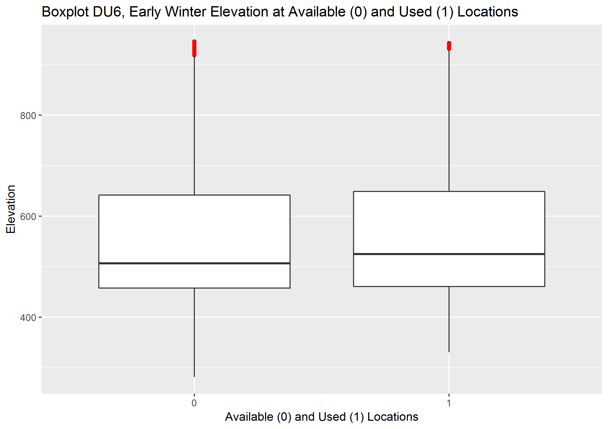
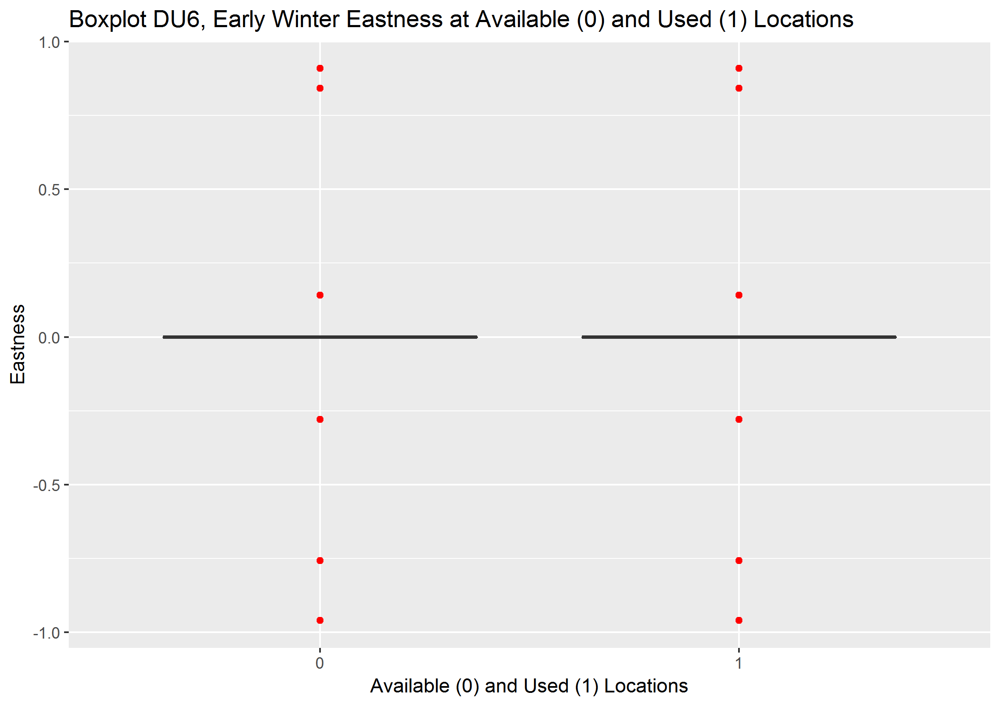
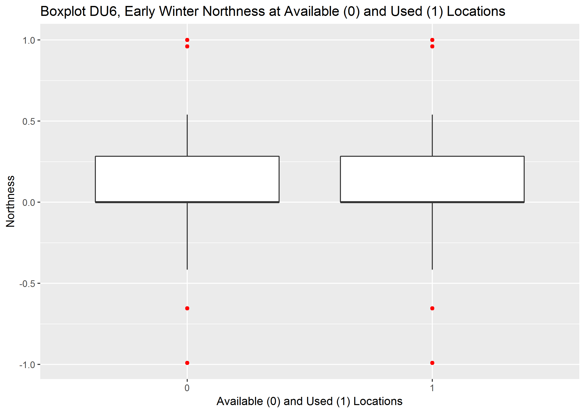
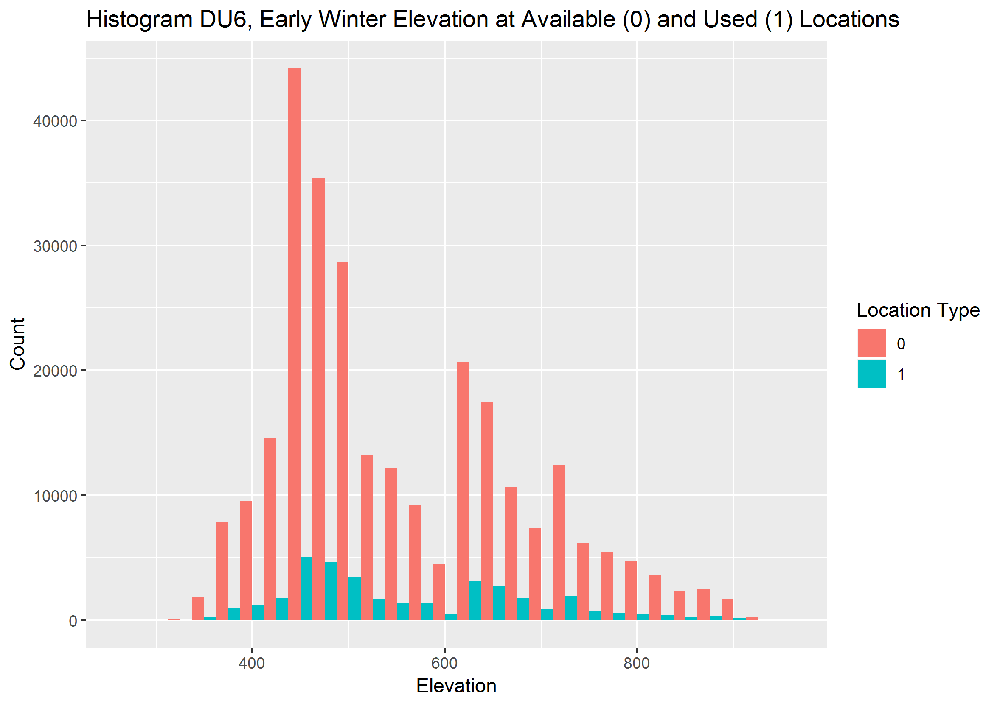
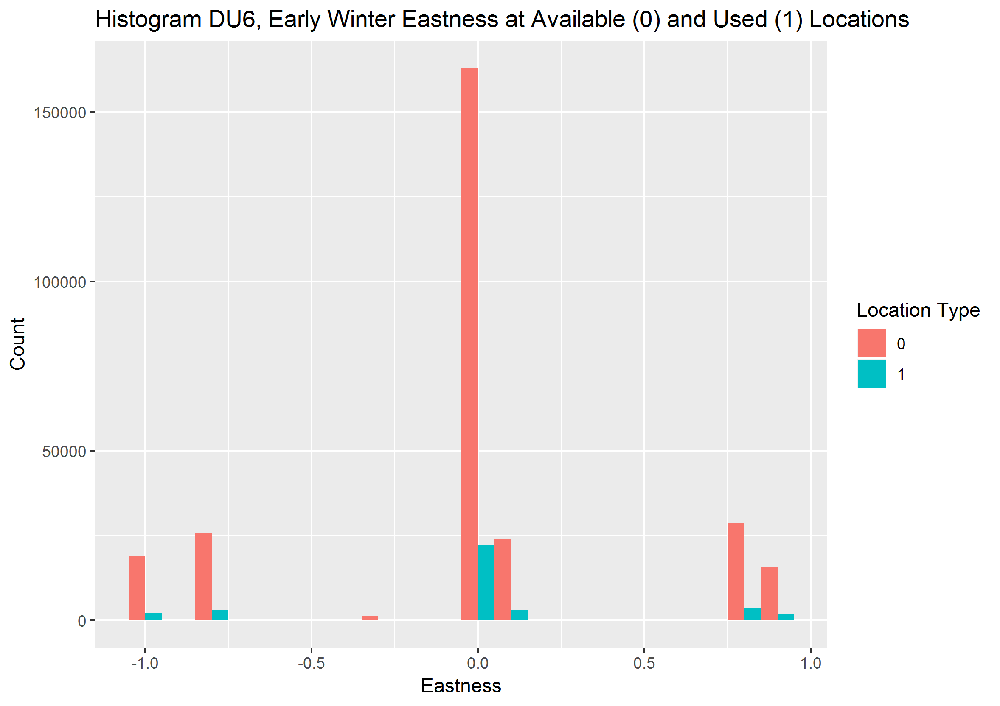
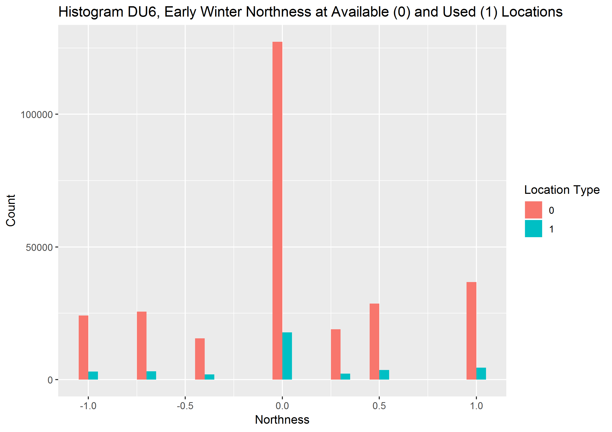

```{r setup, include=FALSE}
knitr::opts_chunk$set(echo = TRUE)
```

## Introduction
The conservation and recovery of caribou popualtiosn across British Columbia (BC) has become an urgent prioirty for the provincal government and the government of Canada. The provincal governemtn recently supported a five year, $50 million program to corrdinate adn facilitate recovery actiosn across teh province. Integral to this program are decision support tools to help decision makers underatnd the implcaiitosn or alternative recovery actions. 

Decision support tools are infraomtion and models that represent factors of interest to decision makers. Specifically, these tools are being developed as a caribou and land use simulator (CLUS). The CLUS directly supports decision makers by providing spatial information (i.e., data and maps) on the current condition of the landscape (specifically, caribou habitat and populations and natural resource development), but more importantly, information on how future land use and climate change influences landscape condition. It will be used to help quantify, visualize and provide bounds to how alternate caribou recovery actions applied to an area (e.g., a group of caribou herds) could influence the future status of caribou and economic development in that area. The compoents of the CLUS are  transparent (i.e., available to the public), mathematical models (i.e., a documented, scientifically supported representation of reality using numbers and equations). These models reprsetn our undersadtning of ecology adn natural reorce development in a simplistic but useful way for supproting decision making. The CLUS model will allow decision makers to try out different management options (e.g., forest practices policies and habitat protection) before putting them into practice and identify those that achieve the desired balance between caribou recovery and economic costs and benefits. It helps improve the decision maker’s confidence in their decision by helping them understand the implications of alternative decisions, and the public’s confidence that the decision was based on a rational consideration of alternatives. 

Here I develop the cariobu habitat model component of the CLUS. The habitat model was developed using a resource selection function (RSF) and model selection process approach.  RSFs were calculated for three seasons (early winter, late winter and summer), and across four caribou designatable units (DUs), i.e., ecological designations, of caribou. Caribou DU's  in British Columbia include DU 6 (boreal), DU7 (northern mountain), DU8 (central mountain) and DU9 (sourthern mountain) [see COSEWIC 2011](https://www.canada.ca/content/dam/eccc/migration/cosewic-cosepac/4e5136bf-f3ef-4b7a-9a79-6d70ba15440f/cosewic_caribou_du_report_23dec2011.pdf). I had data that estimated measures of caribou habitat features (covaraites) at approximately 500,000 caribou telemetry locations collected across Brtisish Columbia, and approximately two million randomly sampled locations within caribou home ranges (i.e., 'available' locations). Cariobu selection of these habtait features was tested by formulating RSF models consisting of different combinatiosn of habtait covariates. Each RSF model reprsents a differetn hypothesis of habtiat features that influence cariobu. These hypotheses are coamrped in a model selection appraoch using Akaike's Infomation Criterion (AIC), and soem consdieation of their ability to predict cariobu occurence. 

The hyptohesis consisted of the follwong models:
- terrain adn water (soil parent amterail, lakes, watercoruses, eleavtion, aspect adn slope); cariobu are infleunced by 'enduring' features of teh ladnscape and/or these features represent or are proxies for a wide range of habtait featrues imprtoant to cariobu (food, predation risk, etc.)   
- forestry disturabnce (distance to cubtlocks of variaous age and different road types); well documented that cariobu distirbution and survical are inlfuenced by forestry activity, either as disturabnce or likely through predation meachnisms
- agricultural distruabnce (distance to agricultrual areas and different road types); likely contributes to predation mechanism; ag lands highly provudctive for ungualtes
- mine disturbance (distance to mines and different road types); highly modifed/disturbed ladnscape; cariobu shoudl avoid
- energy disturabnce; (distance to pipeliens and wells, sesimic lines and different road types); highly modifed/disturbed ladnscape; improtant preation mechanism, partiucalrly in boreal
- all human distruabnce (all huan distruabce covarties listed above); test whether all covaraites togetehr improve model fit
- 'natural' distruabce (burns adn beetles); natural distruabcen affects forest succesiion, early seral, which impacts food for ungulate sand predators; cariobu may avoid
- annual cliamte (temp, ppt, etc.); measures of climate taken over an annual period; long-term dirvers of habtiat
- seasonal climate; with lags?; measure sof climate over teh saeson that the cariobu occurred at those locations; shorter term dirvers of habtiat
- landcover (wetland (boreal only), bec, vri.....); broad classes of habitat; likely represent imprtoatn asptects fo food and predation
- forest stand (.....)


- combos of the above

- build a 'table' of these by DU/season; combos may vary by DU


## Methods
RSF models are a form of binomial logistic regression models that are used to statistically estimate habitat selection by animals (Boyce et al. 1999; Manly et al. 2007).


AIC is a model selction method, where models are ranked based on their fit to the data (log-likelihood) and the numebr of covaraites in teh model (Bunrham adn Anderson 2002). Models are penalzied for having more covaraites (i.e., are more complex).  


 I also calculated area under the curve (AUC) of Receiver Operating Characteristic (ROC) curves for each model using the ROCR package in R to test the accuracy of predictions. The model with the highest AIC weight and a reasonably high AUC score (i.e., the abiliy of the accurately predict caribou locations) was considered the best distance to cutblock model for a particular season and DU combination.
 
 
### Data Exploration
Did series of data visualtizatiosn to explore data for anamolies, potential issues with aplying regression mdoel and also better undersatdn potantil realtionships between covariates (Zuur et al. 2010)
 
First, looked for outliers using a bxolpot
 
```{r, boxplot data exploration, eval = F, echo = T}
ggplot (rsf.data.terrain.water.du6.ew, aes (x = pttype, y = elevation)) +
        geom_boxplot (outlier.colour = "red") +
        labs (title = "Boxplot DU6, Early Winter Elevation at Available (0) and Used (1) Locations",
              x = "Available (0) and Used (1) Locations",
              y = "Elevation")
```
 

Then looked at distbituion of data using hisotograms
```{r, histogram data exploration, eval = F, echo = T}
ggplot (rsf.data.terrain.water.du6.ew, aes (x = elevation, fill = pttype)) + 
        geom_histogram (position = "dodge", binwidth = 25) +
        labs (title = "Histogram DU6, Early Winter Elevation at Available (0) and Used (1) Locations",
              x = "Elevation",
              y = "Count") +
        scale_fill_discrete (name = "Location Type")
```

Then looked for corraltion using spearman correaltion analysis and plots

```{r, correlation plot, eval = F, echo = T}
corr.terrain.water.du6.ew <- rsf.data.terrain.water.du6.ew [c (10:15)]
corr.terrain.water.du6.ew <- round (cor (corr.terrain.water.du6.ew, method = "spearman"), 3)
ggcorrplot (corr.terrain.water.du6.ew, type = "lower", lab = TRUE, tl.cex = 10,  lab_size = 3,
            title = "Terrain and Water Resource Selection Function Model
            Covariate Correlations for DU6, Early Winter")
```


and coreatlions  variance inflation factors (VIFs) from 'car' package based on a simple glm
```{r, glm and vifs, eval = F, echo = T}
glm.terrain.du6.ew <- glm (pttype ~ elevation + easting + northing + slope + distance_to_lake +
                                     distance_to_watercourse + soil_parent_material_name, 
                            data = rsf.data.terrain.water.du6.ew,
                            family = binomial (link = 'logit'))
car::vif (glm.terrain.du6.ew)
```

- covaraites tdandardized ((x-mean) / sd) to help with model convergence and simplify interepretation of relative effects of covariates


- compared models using AIC

- fit models with random efefcts (inercept adn slope) for continuous covariaets each unique indivudal and year, adn fixed efefcts for continouts and categoriacla covaraites, if model failed to converge with slope random effects, hten fir model with random efefct intercept only
- random efefcts account for indivdual anaimal variability and a random sampel of the popautlion; fixed efefcts are the popautliomn efefct, estiametd with random invidail varaition in sample accounted for in the model

- first fit terrain models, fit single covaraites, then combined, identified top model to combine with others


## Results

### DU 6
#### Early Winter
##### Data Exploration
- boxplots
- genrally didn;t appear to be signfiant outliers
- removed one location at 86 degree slope as outlier, unlikely to ever be eslected by cariobu even if in home range; very well coudl be a data error






- hisotragms
- shows maybe soem avoidance of lakes adn watercoruses






- correaltions
- not correalted, strongest was 0.18 between disatnce to lake and eleavtion


- highest vif value was 1.24


