```{r setup, include = FALSE}
knitr::opts_chunk$set (echo = TRUE)
require (dplyr)
require (ggplot2)
require (ggcorrplot)
require (gridExtra)
require (kable)
require (kableExtra)
```

## Introduction
Here I describe a data exploration and model selection process completed to identify forest fire covariates to include in caribou resource selection function (RSF) models. RSF models are a form of binomial logistic regression models that are used to statistically estimate habitat selection by animals (Boyce et al. 1999; Manly et al. 2007). RSFs were calculated for three seasons (early winter, late winter and summer), and across four caribou designatable units (DUs), i.e., ecological designations, of caribou. Caribou DU's  in British Columbia include DU 6 (boreal), DU7 (northern mountain), DU8 (central mountain) and DU9 (sourthern mountain) [see COSEWIC 2011](https://www.canada.ca/content/dam/eccc/migration/cosewic-cosepac/4e5136bf-f3ef-4b7a-9a79-6d70ba15440f/cosewic_caribou_du_report_23dec2011.pdf)

I had data that estimated use of burned areas, by burn age, at approximately 500,000 caribou telemetry locations collected across Brtisish Columbia, and approximately two million randomly sampled locations within caribou home ranges (i.e., 'available' locations). I hypothesized that caribou selection for burned areas would change as burns aged. Specifically, I predicted that caribou would be less likely to select younger burns than older burns, as younger burns are typically associated with forage for other ungulates (i.e., moose and deer) and thus higher ungulate and predator (e.g., wolf) densities, resulting in higher mortality and predation risk for caribou (Wittmer et al. 2005; DeCesare et al. 2010). I wanted to reduce the number of fire covariates by temporally grouping burns based on similarity in caribou selection. 

After temporall groupign burn covariates, I did further data exploration and correlation analyses of covariates by season and DU. I then fit fire RSF models using functional responses (Matthiopolous et al. 2010) to test whether caribou selection of burns is a function of the amount of burns within the caribou's home range. Specifically, I tested the hypothesis that caribou are more likely to avoid burns in home ranges with a higher density of burns. 

## Methods
### Correlation of Distance to Cutblock Across Years
Here I tested whether burns of different ages, from one year old to 50 years old were correlated. I used a Spearman ($\rho$) correlation and correlated distance to cutblock between years in 10 year increments. Data were divided by designatable unit (DU). The following is an example of the R code used to calculate and display the correlation plots:
```{r, correlation plot code, eval = F, echo = T}
# Correlations
# Example code for first 10 years
fire.1.10.corr.du.8 <- fire.data.du.8 [c (4:13)]
corr.1.10.du8 <- round (cor (fire.1.10.corr.du.8, method = "spearman"), 3)
p.mat <- round (cor_pmat (corr.1.10.du8), 2)
ggcorrplot (corr.1.10.du8, type = "lower", lab = TRUE, tl.cex = 10,  lab_size = 3, 
            title = "DU8 Fire Correlation Years 1 to 10")
```

### Generalized Linear Models (GLMs) of Distance to Cutblock across Years
Here I tested whether caribou selection of burns changed as they aged. This helped with temporally grouping burn data by age, by illustrating if and when caribou consistently selected or avoided burns of similar ages. 

I compared how caribou selected burns across years by fitting seperate caribou RSFs, where each RSF had a single covariate for burn for each burn age. RSFs were fit using binomial generalized linear models (GLMs) with a logit link (i.e., comparing used to available caribou locations, where used locations are caribou telemetry locations and available locations are randomly sampled locations within the extent of estimated caribou home ranges). RSFs were fit for each season and DU. The following is an example of the R code used to calculate these RSFs:
```{r, single covariate RSF model code, eval = F, echo = T}
fire.data.du.6.ew <- fire.data %>% # sub-sample the data by season and DU
                            dplyr::filter (du == "du6") %>% 
                            dplyr::filter (season == "EarlyWinter")
glm.du.6.ew.1yo <- glm (pttype ~ distance_to_cut_1yo, 
                        data = fire.data.du.6.ew,
                        family = binomial (link = 'logit'))
glm.du.6.ew.2yo <- glm (pttype ~ fire_2yo, 
                        data = fire.data.du.6.ew,
                        family = binomial (link = 'logit'))
....
....
....
glm.du.6.ew.50yo <- glm (pttype ~ fire_50yo, 
                        data = fire.data.du.6.ew,
                        family = binomial (link = 'logit'))
```

The beta coefficients of fire covariates were outputted from each model and plotted against burn age to illustrate how caribou selection changed as the burn aged.  

### Resource Selection Function (RSF) Model Selection of Distance to Cutblock Covariates by Burn Age
Based on the results of the analysis described above, I grouped distance burn age three categories: one to five years old, six to 25 years old, and greater than 25 years old (see Results and Conclusion, below, for details). I then tested for correlation between these covariates using a Spearman-rank ($\rho$) correlation and by calculating variance inflation factors (VIFs) from GLMs. If covariates had a $\rho$ > 0.7 or VIF > 10 (Montgomery and Peck 1992; Manly et al. 2007; DeCesare et al. 2012), then distance to cutblock covariates were further grouped into larger age classes. VIFs were calculated using the vif() function from the 'car' package in R. 


```{r, example of GLM and VIF code, eval = F, echo = T}
model.glm.du6.ew <- glm (pttype ~ fire_1to5yo + fire_6to25yo + fire_over25yo, 
                         data = fire.data.du.6.ew,
                         family = binomial (link = 'logit'))
vif (model.glm.du6.ew)  
```

I fit RSF models as mixed effect regressions using the glmer() function in the lme4 package of R. I fit models with correlated random effect intercepts and slopes for each distance to cutblock covariate by each unique indivdual cariobu and year in the model (i.e., a unique identifier). I fit models with all combinations of distance to cutblock covariates and compared them using Akaike Information Criterion (AIC). 

```{r, example of GLMM code, eval = F, echo = T}
# Generalized Linear Mixed Models (GLMMs)
# fit correlated random effects model
model.lme.du6.ew <- glmer (pttype ~ fire_1to5yo + fire_6to25yo + fire_over25yo + 
                             (fire_1to5yo | uniqueID) + 
                             (fire_6to25yo | uniqueID) +
                             (fire_over25yo | uniqueID), 
                           data = fire.data.du.6.ew, 
                           family = binomial (link = "logit"),
                           verbose = T,
                           control = glmerControl (calc.derivs = FALSE,
                                                   optimizer = "nloptwrap",
                                                   optCtrl = list (maxfun = 2e5))) 
AIC (model.lme.du6.ew)
# AUC 
pr.temp <- prediction (predict (model.lme.du6.ew, type = 'response'), fire.data.du.6.ew$pttype)
prf.temp <- performance (pr.temp, measure = "tpr", x.measure = "fpr")
plot (prf.temp)
auc.temp <- performance (pr.temp, measure = "auc")
auc <- auc.temp@y.values[[1]]
```

Next, I tested whether models with a functional repsonse (*sensu* Matthiplolus et al. 2010) improved model fit by comparing the above models to models that included interaction terms for available fire area, by age class. Available fire area was calculated as the sume of burned areas (for each age class) sampled at all available locations within each individual caribou's seasonal home range. 

```{r, example of GLMM fxn response code, eval = F, echo = T}
### Fit model with functional responses
# Calculating dataframe with covariate expectations
sub <- subset (fire.data.du.6.ew, pttype == 0)
fire_1to5yo_E <- tapply (sub$fire_1to5yo, sub$uniqueID, sum)
fire_6to25yo_E <- tapply (sub$fire_6to25yo, sub$uniqueID, sum)
fire_over25yo_E <- tapply (sub$fire_over25yo, sub$uniqueID, sum)

inds <- as.character (fire.data.du.6.ew$uniqueID)
fire.data.du.6.ew <- cbind (fire.data.du.6.ew, 
                               "fire_1to5yo_E" = fire_1to5yo_E [inds],
                               "fire_6to25yo_E" = fire_6to25yo_E [inds],
                               "fire_over25yo_E" = fire_over25yo_E [inds])

model.lme.fxn.du6.ew.all <- glmer (pttype ~ fire_1to5yo + fire_6to25yo + fire_over25yo +
                                             fire_1to5yo_E + fire_6to25yo_E + fire_over25yo_E + 
                                             fire_1to5yo:fire_1to5yo_E +
                                             fire_6to25yo:fire_6to25yo_E +
                                             fire_over25yo:fire_over25yo_E +
                                             (1 | uniqueID), 
                                  data = fire.data.du.6.ew, 
                                  family = binomial (link = "logit"),
                                  verbose = T,
                                  control = glmerControl (calc.derivs = FALSE, 
                                                          optimizer = "nloptwrap", 
                                                          optCtrl = list (maxfun = 2e5)))
```


I calculated the AIC for each model and compared them to asses the most parsimonious model fit. I also calculated area under the curve (AUC) of Receiver Operating Characteristic (ROC) curves for each model using the ROCR package in R to test the accuracy of predictions. The model with the highest AIC weight and a reasonably high AUC score (i.e., the abiliy of the accurately predict caribou locations) was considered the best distance to cutblock model for a particular season and DU combination. This model, and covaraites from this model will be included in a broader RSF model fittign adn selction porcess to identify a comprehensive, parsimonious and robust caribou habitat model for each season and DU. 

## Results
### Correlation Plots of Fire by Year 
None of them are correalted. 


### Resource Selection Function (RSF) Distance to Cutblock Beta Coefficients by Year, Season and Designatable Unit (DU)
I was unable to fit a model for some burn year, season and DU combinations because there was a lack of use of burned areas in those years. Thus, there was further reason to group data, as use of burned areas was in some cases a rare event. 

In DU6, burn areas generally had a negative effect on caribou resource selection across seasons. In some cases, caribou appeared to strongly avoid burns between 5 and 25 years old, particularly in the late winter and summer.  
```{r, DU6 single covariate RSF model output, echo = F, fig.width = 7, fig.height = 5}
table.glm.summary.fire <- read.csv ("data/table_glm_summary_fire.csv")
table.glm.summary.fire$DU <- as.factor (table.glm.summary.fire$DU)
table.glm.summary.fire.du6 <- table.glm.summary.fire %>%
  filter (DU == 6)
print (ggplot (data = table.glm.summary.fire.du6, 
        aes (years, Coefficient)) +
  geom_line (aes (colour = Season)) +
  ggtitle ("Beta coefficient values of burn by year \n and season for caribou designatable unit (DU) 6.") +
  xlab ("Years since burn") + 
  ylab ("Beta coefficient") +
  geom_line (aes (x = years, y = 0), 
             size = 0.5, linetype = "solid", colour = "black") +
  theme (plot.title = element_text(hjust = 0.5),
         axis.text = element_text (size = 10),
         axis.title = element_text (size = 12),
         axis.line.x = element_line (size = 1),
         axis.line.y = element_line (size = 1),
         panel.grid.minor = element_blank (),
         panel.border = element_blank (),
         panel.background = element_blank ()) +
  scale_x_continuous (limits = c (0, 51), breaks = seq (0, 51, by = 5)) +
  scale_y_continuous (limits = c (-10, 10), breaks = seq (-10, 10, by = 2)))
```

In DU7, burned areas generally had a negative effect on caribou resource selection across seasons. In general, burns over 5 years old were strongly avoided, with few exceptions. 
```{r, DU7 single covariate RSF model output, echo = F,  fig.width = 7, fig.height = 5}
table.glm.summary.fire <- read.csv ("data/table_glm_summary_fire.csv")
table.glm.summary.fire$DU <- as.factor (table.glm.summary.fire$DU)
table.glm.summary.fire.du7 <- table.glm.summary.fire %>%
  filter (DU == 7)
ggplot (data = table.glm.summary.fire.du7, 
        aes (years, Coefficient)) +
  geom_line (aes (colour = Season)) +
  ggtitle ("Beta coefficient values of burn by year \n and season for caribou designatable unit (DU) 7.") +
  xlab ("Years since burn") + 
  ylab ("Beta coefficient") +
  geom_line (aes (x = years, y = 0), 
             size = 0.5, linetype = "solid", colour = "black") +
  theme (plot.title = element_text(hjust = 0.5),
         axis.text = element_text (size = 10),
         axis.title = element_text (size = 12),
         axis.line.x = element_line (size = 1),
         axis.line.y = element_line (size = 1),
         panel.grid.minor = element_blank (),
         panel.border = element_blank (),
         panel.background = element_blank ()) +
  scale_x_continuous (limits = c (0, 51), breaks = seq (0, 51, by = 5)) +
  scale_y_continuous (limits = c (-12, 12), breaks = seq (-12, 12, by = 2))
```

In DU8, burned areas generally had a strong negative effect on caribou resource selection across seasons. There were gaps in fitting models between ages 5 and 17 and 40 and 50.
```{r, DU8 single covariate RSF model output, echo = F, fig.width = 7, fig.height = 5}
table.glm.summary.fire <- read.csv ("data/table_glm_summary_fire.csv")
table.glm.summary.fire$DU <- as.factor (table.glm.summary.fire$DU)
table.glm.summary.fire.du8 <- table.glm.summary.fire %>%
  filter (DU == 8)
ggplot (data = table.glm.summary.fire.du8, 
        aes (years, Coefficient)) +
  geom_line (aes (colour = Season)) +
  ggtitle ("Beta coefficient values of burn by year \n and season for caribou designatable unit (DU) 8.") +
  xlab ("Years since burn") + 
  ylab ("Beta coefficient") +
  geom_line (aes (x = years, y = 0), 
             size = 0.5, linetype = "solid", colour = "black") +
  theme (plot.title = element_text(hjust = 0.5),
         axis.text = element_text (size = 10),
         axis.title = element_text (size = 12),
         axis.line.x = element_line (size = 1),
         axis.line.y = element_line (size = 1),
         panel.grid.minor = element_blank (),
         panel.border = element_blank (),
         panel.background = element_blank ()) +
  scale_x_continuous (limits = c (0, 51), breaks = seq (0, 51, by = 5)) +
  scale_y_continuous (limits = c (-10, 10), breaks = seq (-10, 10, by = 2))
```
  
In DU9, there were several gaps in fitting models, particularly between ages 1 to 5 and 10 to 40. However, for years where I was able to fit a model, the selection coefficens were all negative, and in some cases, strongly negative.
```{r, DU9 single covariate RSF model output, echo = F, fig.width = 7, fig.height = 5}
table.glm.summary.fire <- read.csv ("data/table_glm_summary_fire.csv")
table.glm.summary.fire$DU <- as.factor (table.glm.summary.fire$DU)
table.glm.summary.fire.du9 <- table.glm.summary.fire %>%
                              filter (DU == 9)
ggplot (data = table.glm.summary.fire.du9, 
        aes (years, Coefficient)) +
  geom_line (aes (colour = Season)) +
  ggtitle ("Beta coefficient values of burn by year \n and season for caribou designatable unit (DU) 9.") +
  xlab ("Years since burn") + 
  ylab ("Beta coefficient") +
  geom_line (aes (x = years, y = 0), 
             size = 0.5, linetype = "solid", colour = "black") +
  theme (plot.title = element_text(hjust = 0.5),
         axis.text = element_text (size = 10),
         axis.title = element_text (size = 12),
         axis.line.x = element_line (size = 1),
         axis.line.y = element_line (size = 1),
         panel.grid.minor = element_blank (),
         panel.border = element_blank (),
         panel.background = element_blank ()) +
  scale_x_continuous (limits = c (0, 51), breaks = seq (0, 51, by = 5)) +
  scale_y_continuous (limits = c (-14, 0), breaks = seq (-14, 0, by = 2))
```

### Resource Selection Function (RSF) Model Selection
#### DU6
###### Early Winter
The correlation plots indicated that fire age was not correlated across burn age classes.

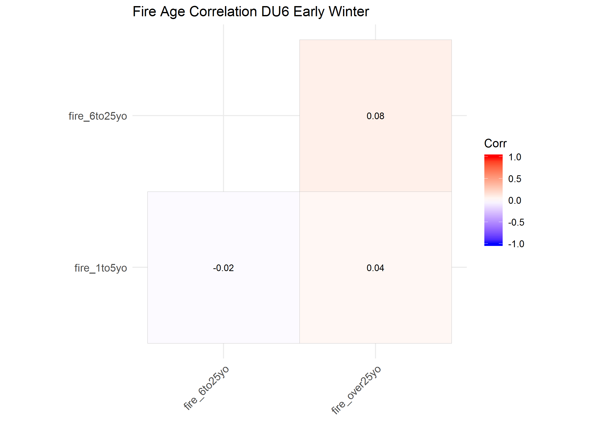

The maximum VIF from the simple GLM covariate model was <1.01, indicating these covariates were not correlated. The top-ranked model included covariates of all burn age classes, but no functional response covariates, and had an AIC weight (AIC*~w~*) of 1.00 (Table 1). In addition, the top model had the highest AUC (AUC = 0.600).

##### Late Winter
The correlation plots indicated that fire age was not correlated across burn age classes.

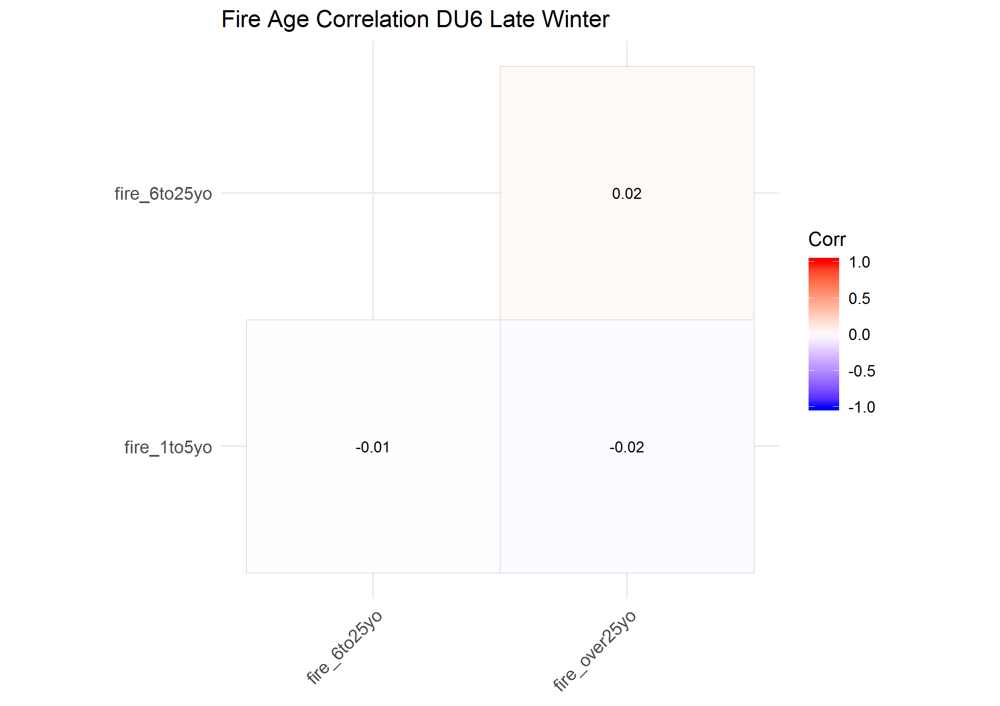

The maximum VIF from the simple GLM covariate model was <1.01, indicating these covariates were not  correlated. The top-ranked model included covariates of all burn age classes, but no functional response, and had an AIC*~w~* of 1.000 (Table 1). In addition, the top model had the highest AUC (AUC = 0.635).

##### Summer
The correlation plots indicated that fire age was not correlated across burn age classes.

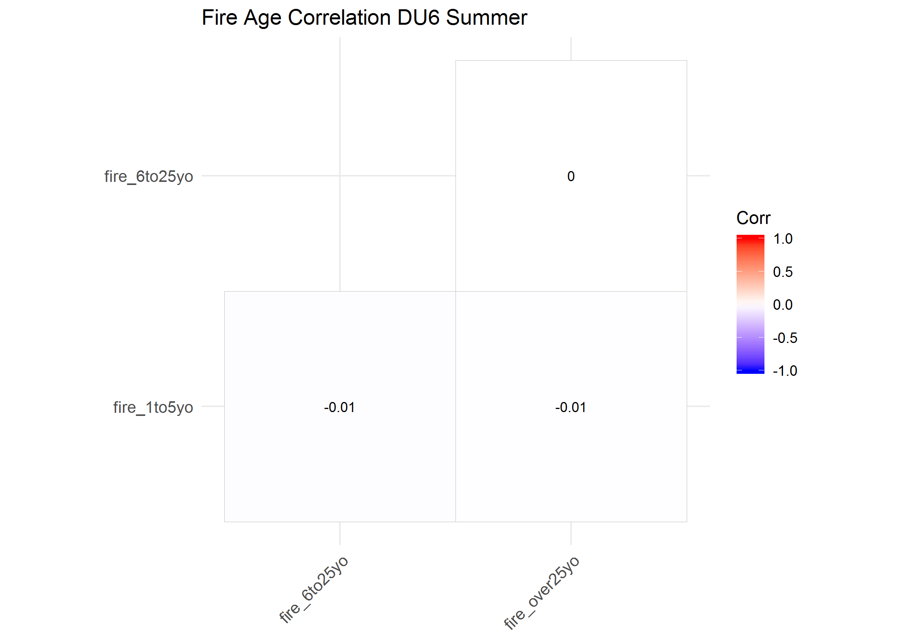

The maximum VIF from the simple GLM covariate model was <1.01, indicating these covariates were not correlated. The top-ranked model included covariates of all burn age classes, but no functional response, and had an AIC*~w~* of 1.000 (Table 1). The top model had the highest AUC (AUC = 0.655).

#### DU7
##### Early Winter
The correlation plots indicated that fire age was not correlated across burn age classes.

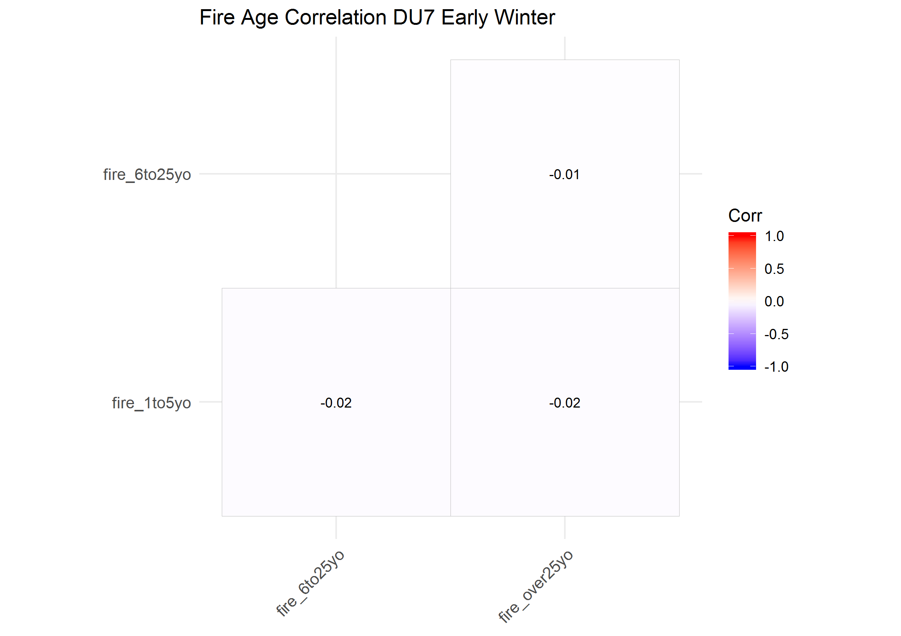

The maximum VIF from the simple GLM covariate model was <1.01, indicating these covariates were not correlated. The top-ranked model included covariates of burn age classes 1 to 5 years old and over 25 years old, with a functional response, and had an AIC*~w~* of 0.556 (Table 1). The second-ranked model included  all burn age class covariates and a fucntional response, with a similar AIC*~w~* of 0.437 (Table 1). These two top models had the highest AUC (AUC = 0.668).

##### Late Winter
The correlation plots indicated that fire age was not correlated across burn age classes.

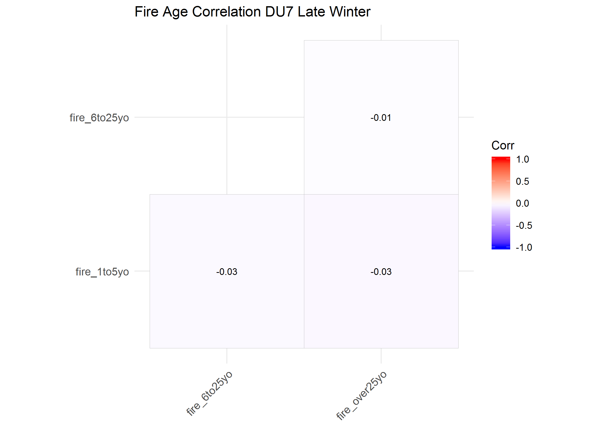

The maximum VIF from the simple GLM covariate model was <1.01, indicating these covariates were not correlated. The AIC*~w~* of the top model was 1.00 (Table 1). It included all distance to burn age covariates, but not a functional response. The AUC of the top model (AUC = 0.677) was better than all other models.

##### Summer
The correlation plots indicated that fire age was not correlated across burn age classes.

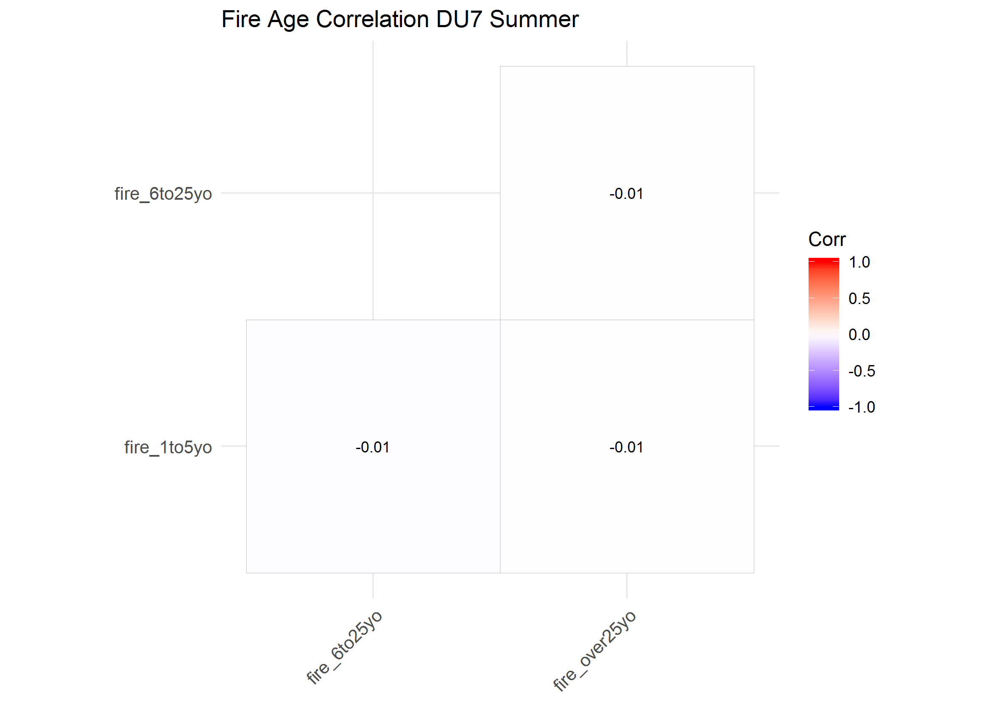

The maximum VIF from the simple GLM covariate model was <1.01, indicating these covariates were not correlated. The AIC*~w~* of the top model was 1.00 (Table 1). It included all distance to burn age covariates, but not a functional response. The AUC of the top model (AUC = 0.678) was better than all other models.

#### DU8
##### Early Winter
The correlation plots indicated that fire age was not correlated across burn age classes.

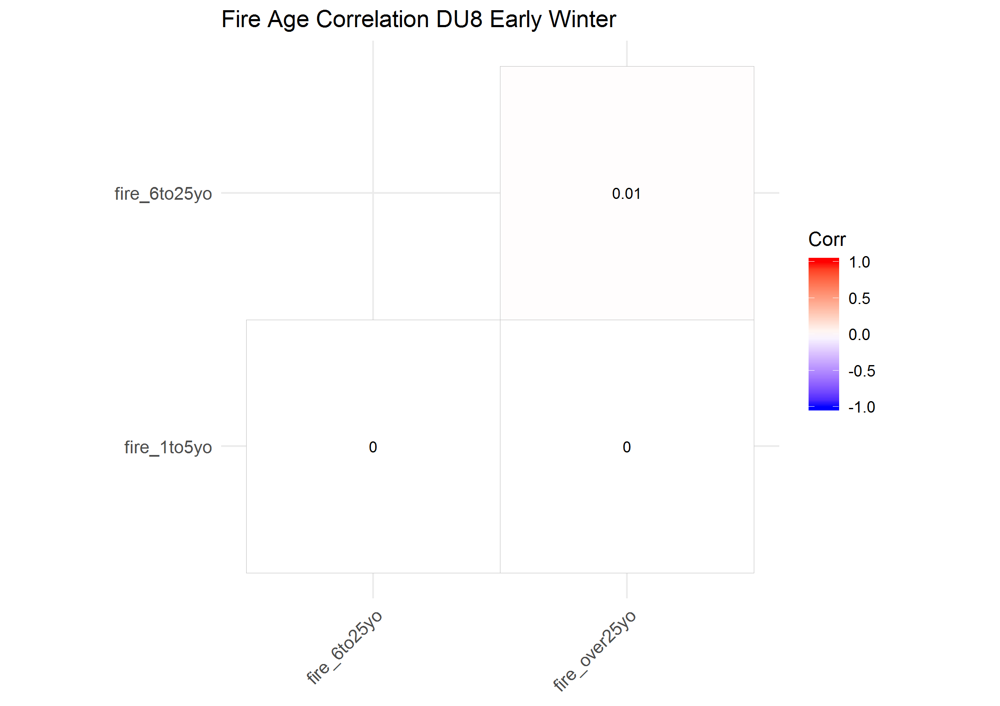

The maximum VIF from the simple GLM covariate model was <1.01, indicating these covariates were not correlated. The top-ranked model included all covariates of burn age classes, with a functional response, and had an AIC*~w~* of 0.770 (Table 1). The second-ranked model included 1 to 5 year old and over 25 year old burn age class covariates and a functional response, with an AIC*~w~* of 0.198 (Table 1). The top-ranked model had close to the highest AUC (AUC = 0.661).

##### Late Winter
The correlation plots indicated that fire age was not correlated across burn age classes.

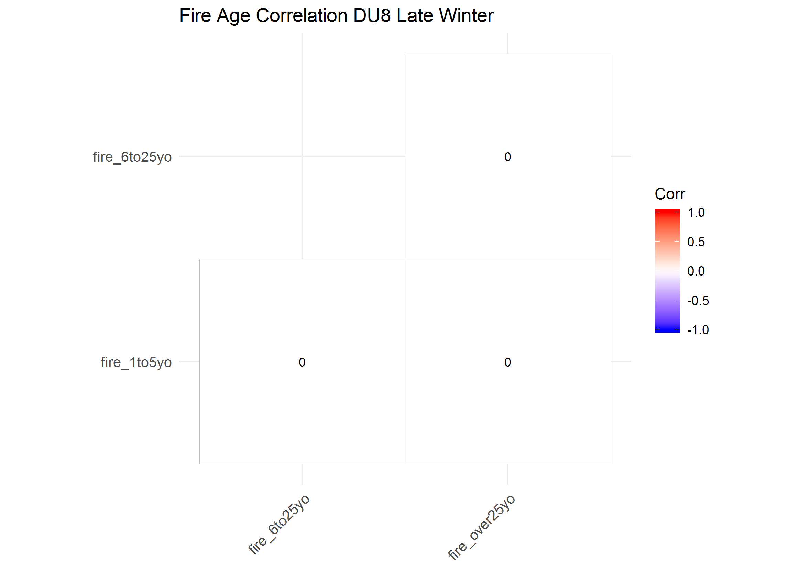

The maximum VIF from the simple GLM covariate model was <1.01, indicating these covariates were not correlated. The top-ranked model included the 6 to 25 year old and over 25 year old burn age class covariates, with a functional response, and had an AIC*~w~* of 0.976 (Table 1). The second-ranked model included all burn age class covariates and a functional response, with an AIC*~w~* of 0.024 (Table 1). The top-ranked model had the second highest AUC (AUC = 0.670).

##### Summer
The correlation plots indicated that fire age was not correlated across burn age classes.

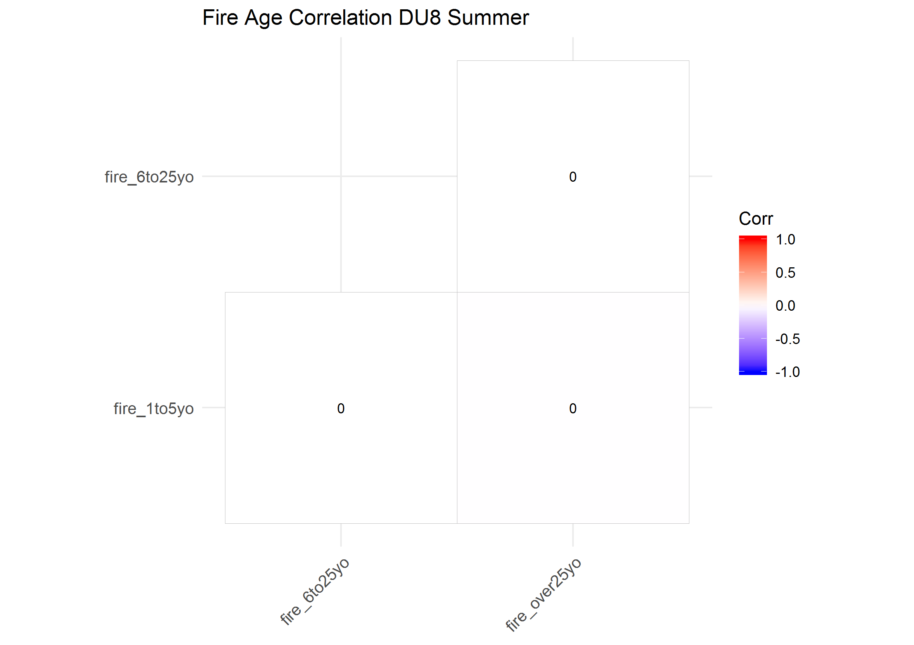

The maximum VIF from the simple GLM covariate model was <1.01, indicating these covariates were not correlated. The top-ranked model included the 6 to 25 year old and over 25 year old burn age class covariates, but no functional response, and had an AIC*~w~* of 0.887 (Table 1). The second-ranked model included all burn age class covariates, but no functional response, with an AIC*~w~* of 0.113 (Table 1). The top-ranked model had the second highest AUC (AUC = 0.661).


#### DU9
##### Early Winter
The correlation plots indicated that fire age was not correlated across burn age classes.


The maximum VIF from the simple GLM covariate model was <1.01, indicating these covariates were not correlated. The top-ranked model included the over 25 year old burn age class covariate, including a functional response, and had an AIC*~w~* of 0.598 (Table 1). The second-ranked model included the over 25 year old burn age class covariate, but no functional response, with an AIC*~w~* of 0.114 (Table 1). The top-ranked model had the tenth highest AUC (AUC = 0.630).

##### Late Winter
The 1 to 5 year old burn age class covariate was all 0's, and therefore correlation could not be calculated between it and the other age class covariates. The correlation plot indicated that fire age was not correlated across the 6 to 25 and over 25 year old burn age classes. I therefore grouped the 1 to 5 year old and 6 to 25 year old age class covairates together.

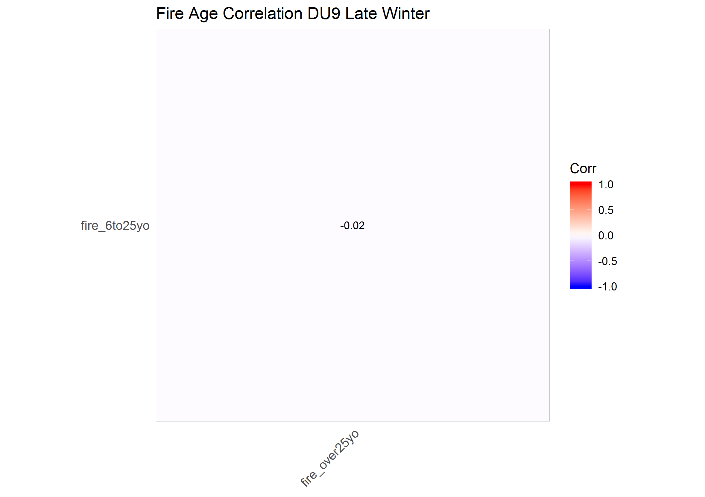

The maximum VIF from the simple GLM covariate model was <1.01, indicating these covariates were not correlated. The AIC*~w~* of the top model was 0.969 (Table 1). It included all distance to burn age covariates (1 to 25 years old and over 25 years old), and a functional response. The AUC of the top model (AUC = 0.627) was the second highest of the group of models.


##### Summer
The 1 to 5 year old burn age class covariate was all 0's, and therefore correlation could not be calculated between it and the other age class covariates. The correlation plot indicated that fire age was not correlated across the 6 to 25 and over 25 year old burn age classes. I therefore grouped the 1 to 5 year old and 6 to 25 year old age class covairates together (1 to 25 years old).

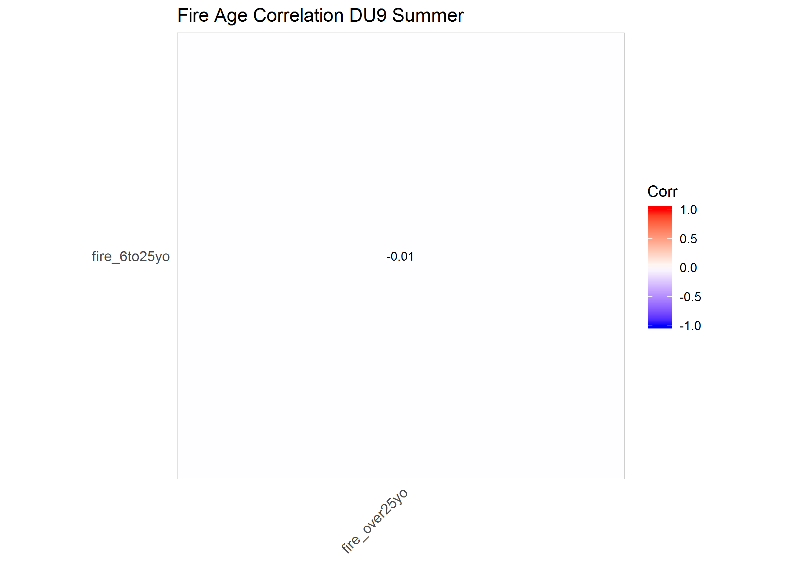

The maximum VIF from the simple GLM covariate model was <1.01, indicating these covariates were not correlated. The top-ranked model included the over 25 year old burn age class covariate, including a functional response, and had an AIC*~w~* of 0.719 (Table 1). The second-ranked model included the over 25 year old burn age class covariate, but no functional response, with an AIC*~w~* of 0.218 (Table 1). The top-ranked model had the fourth highest AUC (AUC = 0.663).


Table 1. AIC, AIC*~w~* and AUC values from DU and seasonal sets of distance to cutblock resoruce selection models for caribou. 
```{r table of aic results, echo = F}
table.aic <- read.csv ("data/table_aic_fire.csv")
table.aic$AIC <- round (table.aic$AIC, 0)
table.aic$AICw <- round (table.aic$AICw, 3)
table.aic$AUC <- round (table.aic$AUC, 3)
table.aic %>%
  kable (longtable = T, booktabs = T) %>%
  kable_styling (bootstrap_options = c ("striped", "condensed"),
                 latex_options = c ("repeat_header","HOLD_position","scale_down"),
                 font_size = 10) %>%
  landscape () %>%
  column_spec (c (3:5), width = "15em")
```

## Conclusions
To simplify models, I grouped annual burn age covariates into age classes. While burn age covariates were not correlated across years, there were patterns in caribou selection of burns as they aged. Specifically, it appeared that caribou may avoid younger burns in some DU's. Therefore, I grouped brusn into age classes 1 to 5 years old, 6 to 25 yeas old and over 25 years old.  

This analysis helped identify how to temporally group burn covariates measured annually over a 50 year period for use in fitting a RSF model. This temproal grouping by burn age was done based on statistical principles of minimizing correlation between covariates and identifying parsimonious but reasonably predictive RSF models. However, results here are also consistent with our ecological understanding of how burns age and how caribou might respond to them differently as they age. Specifically, new burns (i.e., one to five years old) provide different habitat features for caribou and their 'competitors' (i.e., other ungulate species) than moderately aged (i.e., six to twenty-five years old) and older (i.e., over 25 years old) burns. For example, caribou may be responding to vegetation development on burns, as young burns may be sparsely vegetated, moderately aged burns may provide early seral vegetation, particularly shrubs, forbs and herbs, and older burns may provide more treed vegetation. However, the exact mechanism for how caribou are reponding to these different age classes of burns is not clear.    

The burn age covariates from the top models for each season and DU will be compared to and combined with other RSF models that include other habitat covariates. Comparisons will be made using the same statistical principles and undertanding of ecological mechanisms described here. This will help identify a robust and useful RSF model of caribou habitat selection across seasons and DUs in BC.

## Literature Cited
Anderson, M., McLellan, B. N., & Serrouya, R. (2018). Moose response to high‐elevation forestry: Implications for apparent competition with endangered caribou. The Journal of Wildlife Management, 82(2), 299-309.

DeCesare, N. J., Hebblewhite, M., Robinson, H. S., & Musiani, M. (2010). Endangered, apparently: the role of apparent competition in endangered species conservation. Animal conservation, 13(4), 353-362.

DeCesare, N. J., Hebblewhite, M., Schmiegelow, F., Hervieux, D., McDermid, G. J., Neufeld, L., ... & Wheatley, M. (2012). Transcending scale dependence in identifying habitat with resource selection functions. Ecological Applications, 22(4), 1068-1083.

Denryter, K. A., Cook, R. C., Cook, J. G., & Parker, K. L. (2017). Straight from the caribou’s (Rangifer tarandus) mouth: detailed observations of tame caribou reveal new insights into summer–autumn diets. Canadian Journal of Zoology, 95(2), 81-94.
Available from: http://www.nrcresearchpress.com/doi/pdf/10.1139/cjz-2016-0114

Environment Canada. 2008. Scientific Review for the Identification of Critical Habitat for Woodland Caribou (Rangifer tarandus caribou), Boreal Population, in Canada. August 2008. Ottawa: Environment Canada. 75 pp. plus 179 pp Appendices.

Fuller, T. K., Mech, L. D., & Cochrane, J. F. (2010). Wolf population dynamics. In: Mech, L. D., & Boitani, L. (Eds.). Wolves: behavior, ecology, and conservation. University of Chicago Press.

Houle, M., Fortin, D., Dussault, C., Courtois, R., & Ouellet, J. P. (2010). Cumulative effects of forestry on habitat use by gray wolf (Canis lupus) in the boreal forest. Landscape ecology, 25(3), 419-433.

Kuzyk, G. W., & Hatter, I. W. (2014). Using ungulate biomass to estimate abundance of wolves in British Columbia. Wildlife Society Bulletin, 38(4), 878-883.

Messier, F. (1994). Ungulate population models with predation: a case study with the North American moose. Ecology, 75(2), 478-488.

Montgomery, D. C., and E. A. Peck. 1992. Introduction to linear regression analysis. Wiley, New York, New York, USA

Serrouya, R., Lewis, D., McLellan, B. and Pavan, G. (2007). The selection of movement paths by mountain caribou , during winter within managed: landscapes: 4-year results of snow trailing. Final Technical Report, FSP Project #Y071312. Available from: https://www.researchgate.net/profile/Bruce_Mclellan/publication/255635833_The_selection_of_movement_paths_by_mountain_caribou_during_winter_within_managed_landscapes_4-year_results_of_snow_trailing/links/552d343e0cf29b22c9c4c3b4/The-selection-of-movement-paths-by-mountain-caribou-during-winter-within-managed-landscapes-4-year-results-of-snow-trailing.pdf

Wittmer, H. U., Sinclair, A. R., & McLellan, B. N. (2005). The role of predation in the decline and extirpation of woodland caribou. Oecologia, 144(2), 257-267.

Wittmer, H. U., McLellan, B. N., Serrouya, R., & Apps, C. D. (2007). Changes in landscape composition influence the decline of a threatened woodland caribou population. Journal of animal ecology, 76(3), 568-579.

