```{r setup, include = FALSE}
knitr::opts_chunk$set (echo = TRUE)
require (dplyr)
require (ggplot2)
require (ggcorrplot)
require (gridExtra)
require (kable)
require (kableExtra)
```

## Introduction
Here I describe a data exploration and model selection process completed to identify beetle infested forest stand covariates to include in caribou resource selection function (RSF) models. RSF models are binomial logistic regression models that are used to statistically estimate habitat selection by animals (Boyce et al. 1999; Manly et al. 2007). RSFs were calculated for three seasons (early winter, late winter and summer), and across four caribou designatable units (DUs), i.e., ecological designations, of caribou. Caribou DU's  in British Columbia include DU 6 (boreal), DU7 (northern mountain), DU8 (central mountain) and DU9 (sourthern mountain) [see COSEWIC 2011](https://www.canada.ca/content/dam/eccc/migration/cosewic-cosepac/4e5136bf-f3ef-4b7a-9a79-6d70ba15440f/cosewic_caribou_du_report_23dec2011.pdf)

I had data that estimated caribou use of beetle infested forest stands, by age (one to nine years old) and severity (moderate, severe and very severe), at approximately 500,000 caribou telemetry locations collected across British Columbia, and approximately two million randomly sampled locations within caribou home ranges (i.e., 'available' locations). I hypothesized that caribou selection for beetle infested forest stands would change as stands aged and became more severely infested. Specifically, I predicted that caribou would be more likely to select older and less severely infested stands. Recent and more severely infested stands might be associated with forage for other ungulates (i.e., moose and deer) and thus higher ungulate and predator (e.g., wolf) densities, resulting in higher mortality and predation risk for caribou (Wittmer et al. 2005; DeCesare et al. 2010). I wanted to reduce the number of beetle infested forest stand covariates in the model by testing this hypothesis and grouping data based on similarity in caribou selection across stand age and infestation severity. 

After grouping beetle infestated forest stand covariates by age and severity, I did further data exploration and correlation analyses of covariates by season and DU. I then fit RSF models using functional responses (Matthiopolous et al. 2010) to test whether caribou selection of beetle infested forest stands is a function of the amount of infestation within the caribou's home range. Specifically, I tested the hypothesis that caribou are more likely to avoid infested forest stands in home ranges with a higher density of infested stands.

## Methods
### Correlation of Distance to Cutblock Across Years
Here I tested whether beetle infested forest stands of different ages and severity were correlated using a Spearman ($\rho$) correlation. Data were divided by designatable unit (DU). The following is an example of the R code used to calculate and display the correlation plots:
```{r, correlation plot code, eval = F, echo = T}
# Correlations
corr.beetle.du6 <- round (cor (beetle.data.du.6 [c (10:32)], method = "spearman"), 3)
ggcorrplot (corr.beetle.du6, type = "lower", lab = TRUE, tl.cex = 10,  lab_size = 3, 
            title = "DU6 Beetle Infestation Correlation")
```

### Generalized Linear Models (GLMs) of Distance to Cutblock across Years
Here I tested whether caribou selection of beetle infested forest stands changed with severity of the infestation and as they aged. This helped with temporally grouping data by age and severity, by illustrating if and when caribou consistently selected or avoided infested stands of similar ages or severities. 

I compared how caribou selected beetle infested forest stands across years and severity by fitting seperate caribou RSFs, where each RSF had a single covariate for each age and severity. RSFs were fit using binomial generalized linear models (GLMs) with a logit link (i.e., comparing used to available caribou locations, where used locations are caribou telemetry locations and available locations are randomly sampled locations within the extent of estimated caribou home ranges). RSFs were fit for each season and DU. The following is an example of the R code used to calculate these RSFs:
```{r, single covariate RSF model code, eval = F, echo = T}
beetle.data.du.6.ew <- beetle.data %>%
                        dplyr::filter (du == "du6") %>% 
                        dplyr::filter (season == "EarlyWinter")
glm.du.6.ew.1yo.m <- glm (pttype ~ beetle_moderate_1yo, 
                          data = beetle.data.du.6.ew,
                          family = binomial (link = 'logit'))
glm.du.6.ew.2yo.m <- glm (pttype ~ beetle_moderate_2yo, 
                          data = beetle.data.du.6.ew,
                          family = binomial (link = 'logit'))
....
....
....
glm.du.6.ew.5yo.vs <- glm (pttype ~ beetle_very_severe_5yo, 
                           data = beetle.data.du.6.ew,
                           family = binomial (link = 'logit'))
```

The beta coefficients of covariates were outputted from each model and plotted against beetle infested stand age and severity to illustrate how caribou selection changed as the infested stand aged or the infestation became more severe.  

### Resource Selection Function (RSF) Model Selection of Distance to Cutblock Covariates by Burn Age
Based on the results of the analysis described above, I grouped beetle infested stand covariates into
two age categories: one to five years old and six to nine years old. I also grouped all severity classes together, in part because in some cases there was a lack of data to fit a model (particularly for very severe stands), but also because there was often no clear difference in selection between the different levels of severity. 

I then tested for correlation between these covariates using a Spearman-rank ($\rho$) correlation and by calculating variance inflation factors (VIFs) from GLMs. If covariates had a $\rho$ > 0.7 or VIF > 10 (Montgomery and Peck 1992; Manly et al. 2007; DeCesare et al. 2012), then covariates were further grouped into larger age classes. VIFs were calculated using the vif() function from the 'car' package in R. 

```{r, example of GLM and VIF code, eval = F, echo = T}
model.glm.du6.ew <- glm (pttype ~ beetle_1to5yo + beetle_6to9yo, 
                         data = insect.data.du.6.ew,
                         family = binomial (link = 'logit'))
vif (model.glm.du6.ew) 
```

I fit RSF models as mixed effect regressions using the glmer() function in the lme4 package of R. I fit models with correlated random effect intercepts and slopes for each covariate by each unique indivdual cariobu and year in the model (i.e., a unique identifier). I fit models with all combinations of covariates and compared them using Akaike Information Criterion (AIC). 

```{r, example of GLMM code, eval = F, echo = T}
# Generalized Linear Mixed Models (GLMMs)
# fit correlated random effects model
model.lme.du6.ew <- glmer (pttype ~ beetle_1to5yo + beetle_6to9yo + 
                                     (beetle_1to5yo | uniqueID) + 
                                     (beetle_6to9yo | uniqueID), 
                           data = insect.data.du.6.ew, 
                           family = binomial (link = "logit"),
                           verbose = T,
                           control = glmerControl (calc.derivs = FALSE, 
                                                   optimizer = "nloptwrap", 
                                                   optCtrl = list (maxfun = 2e5)))
```

Next, I tested whether models with a functional response (*sensu* Matthiplolus et al. 2010) improved model fit by comparing the above models to models that included interaction terms for available beetle infested stand area, by age class. Available beetle infested stand area was calculated as the sum of beetle infested stand areas (for each age class) sampled at all available locations within each individual caribou's seasonal home range. 

```{r, example of GLMM fxn response code, eval = F, echo = T}
### Fit model with functional responses
# Calculating dataframe with covariate expectations
sub <- subset (insect.data.du.6.ew, pttype == 0)
beetle_1to5yo_E <- tapply (sub$beetle_1to5yo, sub$uniqueID, sum)
beetle_6to9yo_E <- tapply (sub$beetle_6to9yo, sub$uniqueID, sum)

inds <- as.character (insect.data.du.6.ew$uniqueID)
insect.data.du.6.ew <- cbind (insect.data.du.6.ew, 
                               "beetle_1to5yo_E" = beetle_1to5yo_E [inds],
                               "beetle_6to9yo_E" = beetle_6to9yo_E [inds])

model.lme.fxn.du6.ew.all <- glmer (pttype ~ beetle_1to5yo + beetle_6to9yo +
                                             beetle_1to5yo_E + beetle_6to9yo_E + 
                                             beetle_1to5yo:beetle_1to5yo_E +
                                             beetle_6to9yo:beetle_6to9yo_E +
                                             (1 | uniqueID), 
                                  data = insect.data.du.6.ew, 
                                  family = binomial (link = "logit"),
                                  verbose = T,
                                  control = glmerControl (calc.derivs = FALSE, 
                                                          optimizer = "nloptwrap", 
                                                          optCtrl = list (maxfun = 2e5)))
```

I calculated the AIC for each model and compared them by calculating AIC weights (AIC*~w~*) to asses the most parsimonious model. I also calculated area under the curve (AUC) of Receiver Operating Characteristic (ROC) curves for each model using the ROCR package in R to test the accuracy of predictions. The model with the highest AIC*~w~* weight and a reasonably high AUC score (i.e., the abiliy of the accurately predict caribou locations) was considered the best model for a particular season and DU combination. This model, and covariates from this model will be included in a broader RSF model fitting selection process to identify a comprehensive, parsimonious and robust caribou habitat model for each season and DU. 

## Results
### Correlation Plots of Beetle Infestation by Year and Severity
Beetle infested forest stand age and severity covariates were not correlated in DU6 ($\rho$ < 0.09). Many $\rho$ values could not be estimated because of lack of caribou use of those stand types, indicating covariates would need to be grouped by age or severity for them to be considered in the DU6 RSF models.


Covariates were not highly correlated in DU7 ($\rho$ < 0.39) or DU8 ($\rho$ < 0.39).

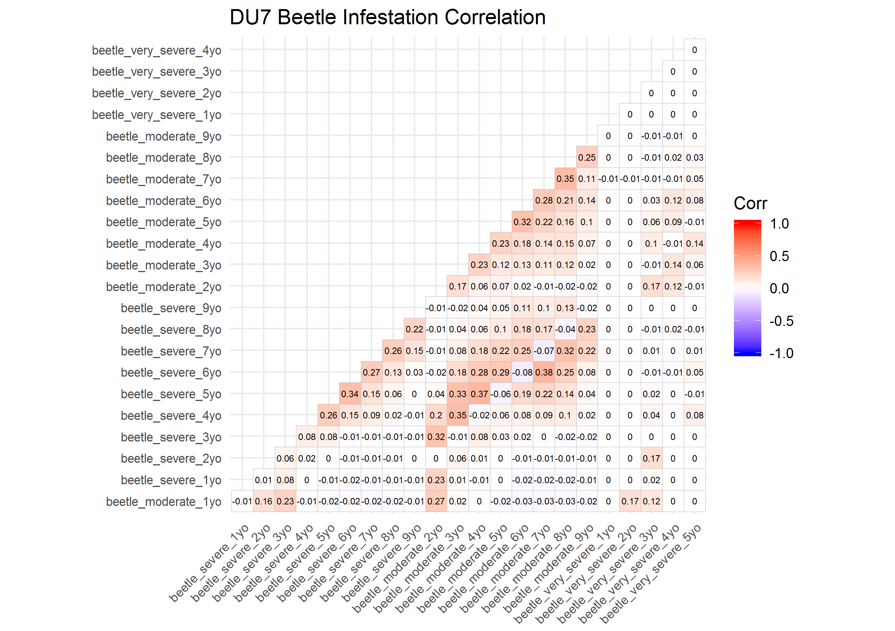

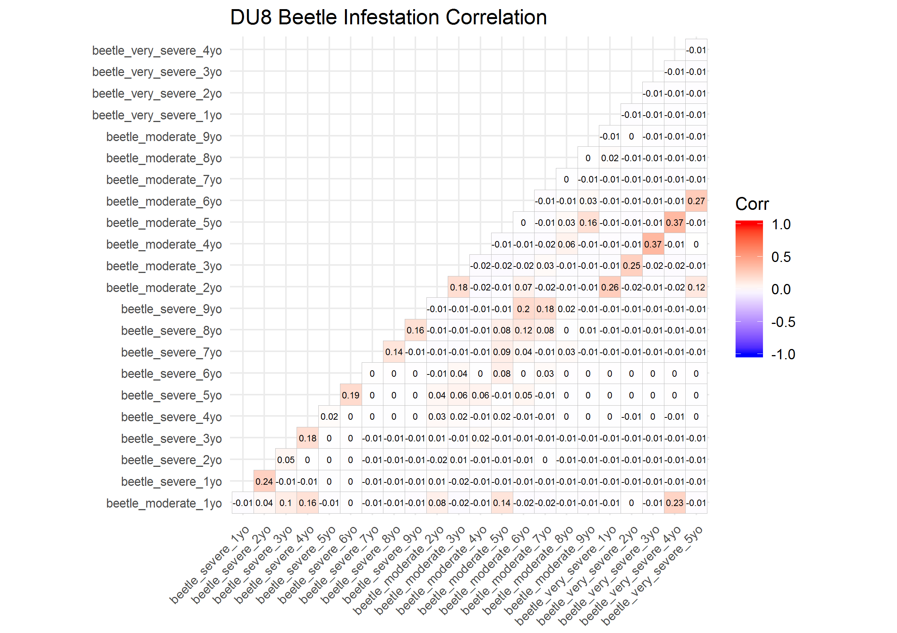

In DU9, covariates were not highly correlated ($\rho$ < 0.55). Many $\rho$ values could not be estimated because of lack of caribou use of those stand types, indicating covariates would need to be grouped by age or severity for them to be considered in the DU6 RSF models.

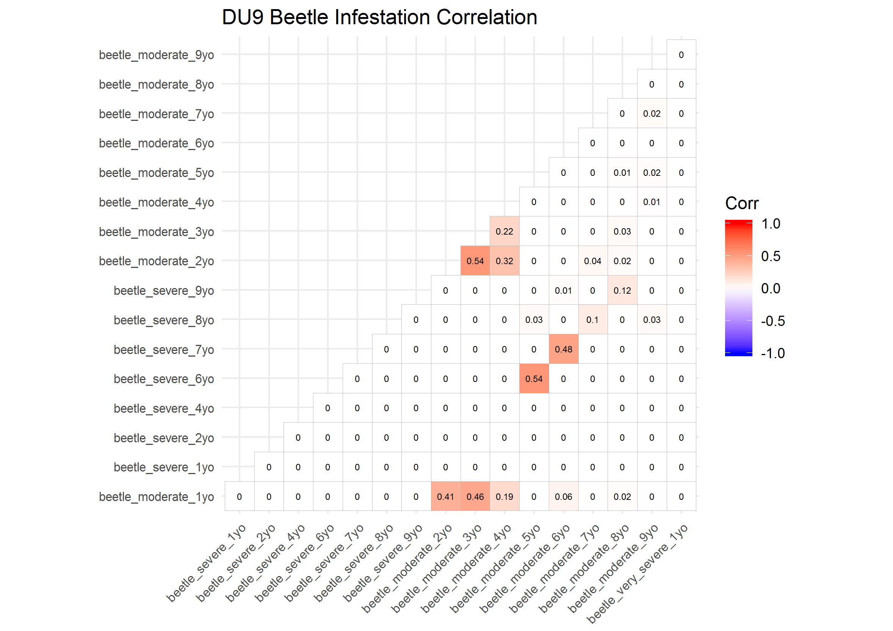

### Resource Selection Function (RSF) Distance to Cutblock Beta Coefficients by Year, Season and Designatable Unit (DU)
I was unable to fit a model for some severity, year, season and DU combinations because there was a lack of use of beetle infested forest stands. Thus, there was further reason to group data. In addition, many of the large model coefficeint values (i.e., >2) were not statistically significant (i.e., p-value > 0.05).   

In DU6, caribou generally avoided beetle infested forest stands across years, seasons and severity of infestation, particularly as infested stands aged.  
```{r, DU6 single covariate RSF model output, echo = F, fig.width = 7, fig.height = 5}
table.glm.summary.insect <- read.csv ("data/table_glm_summary_insect.csv")
table.glm.summary.insect$DU <- as.factor (table.glm.summary.insect$DU)
table.glm.summary.insect.du6 <- table.glm.summary.insect %>%
                                          filter (DU == 6)
print (ggplot (data = table.glm.summary.insect.du6, 
        aes (years, Coefficient)) +
  geom_line (aes (group = interaction (Severity, Season),
                  colour = Severity,
                  linetype = Season)) +
  ggtitle ("Beta coefficient values of selection of beetle infested forest stands \n by year, severity and season for caribou designatable unit (DU) 6.") +
  xlab ("Years since beetle infestation") + 
  ylab ("Beta coefficient") +
  geom_line (aes (x = years, y = 0), 
             size = 0.5, linetype = "solid", colour = "black") +
  theme (plot.title = element_text (hjust = 0.5),
         axis.text = element_text (size = 10),
         axis.title = element_text (size = 12),
         axis.line.x = element_line (size = 1),
         axis.line.y = element_line (size = 1),
         panel.grid.minor = element_blank (),
         panel.border = element_blank (),
         panel.background = element_blank ()) +
  scale_x_continuous (limits = c (0, 10), breaks = seq (0, 10, by = 1)) +
  scale_y_continuous (limits = c (-10, 10), breaks = seq (-10, 10, by = 2)))
```

In DU7, caribou generally selected beetle infested forest stands across years, seasons and severity of infestation. However, there was avoidance of younger beetle infested stands, particularly in severe and very severe infestations. 

```{r, DU7 single covariate RSF model output, echo = F,  fig.width = 7, fig.height = 5}
table.glm.summary.insect <- read.csv ("data/table_glm_summary_insect.csv")
table.glm.summary.insect$DU <- as.factor (table.glm.summary.insect$DU)
table.glm.summary.insect.du7 <- table.glm.summary.insect %>%
                                          filter (DU == 7)
ggplot (data = table.glm.summary.insect.du7, 
        aes (years, Coefficient)) +
  geom_line (aes (group = interaction (Severity, Season),
                  colour = Severity,
                  linetype = Season)) +
  ggtitle ("Beta coefficient values of selection of beetle infested forest stands \n by year, severity and season for caribou designatable unit (DU) 7.") +
  xlab ("Years since beetle infestation") + 
  ylab ("Beta coefficient") +
  geom_line (aes (x = years, y = 0), 
             size = 0.5, linetype = "solid", colour = "black") +
  theme (plot.title = element_text (hjust = 0.5),
         axis.text = element_text (size = 10),
         axis.title = element_text (size = 12),
         axis.line.x = element_line (size = 1),
         axis.line.y = element_line (size = 1),
         panel.grid.minor = element_blank (),
         panel.border = element_blank (),
         panel.background = element_blank ()) +
  scale_x_continuous (limits = c (0, 10), breaks = seq (0, 10, by = 1)) +
  scale_y_continuous (limits = c (-10, 10), breaks = seq (-10, 10, by = 2))
```

In DU8, caribou generally avoided beetle infested forest stands across years, seasons and severity of infestation.However, there was selection of severely infested younger (one to three year old) beetle infested stands. 

```{r, DU8 single covariate RSF model output, echo = F, fig.width = 7, fig.height = 5}
table.glm.summary.insect <- read.csv ("data/table_glm_summary_insect.csv")
table.glm.summary.insect$DU <- as.factor (table.glm.summary.insect$DU)
table.glm.summary.insect.du8 <- table.glm.summary.insect %>%
                                      filter (DU == 8)
ggplot (data = table.glm.summary.insect.du8, 
        aes (years, Coefficient)) +
  geom_line (aes (group = interaction (Severity, Season),
                  colour = Severity,
                  linetype = Season)) +
  ggtitle ("Beta coefficient values of selection of beetle infested forest stands \n by year, severity and season for caribou designatable unit (DU) 8.") +
  xlab ("Years since beetle infestation") + 
  ylab ("Beta coefficient") +
  geom_line (aes (x = years, y = 0), 
             size = 0.5, linetype = "solid", colour = "black") +
  theme (plot.title = element_text (hjust = 0.5),
         axis.text = element_text (size = 10),
         axis.title = element_text (size = 12),
         axis.line.x = element_line (size = 1),
         axis.line.y = element_line (size = 1),
         panel.grid.minor = element_blank (),
         panel.border = element_blank (),
         panel.background = element_blank ()) +
  scale_x_continuous (limits = c (0, 10), breaks = seq (0, 10, by = 1)) +
  scale_y_continuous (limits = c (-10, 10), breaks = seq (-10, 10, by = 2))
```
  
In DU9, caribou selection and avoidance was difficult to interpret. In some years there was selection and in others there was strong avoidance (although these coefficients were not signficant). There was also a lack of data for severe and very severe infestations.
```{r, DU9 single covariate RSF model output, echo = F, fig.width = 7, fig.height = 5}
table.glm.summary.insect <- read.csv ("data/table_glm_summary_insect.csv")
table.glm.summary.insect$DU <- as.factor (table.glm.summary.insect$DU)
table.glm.summary.insect.du9 <- table.glm.summary.insect %>%
                                            filter (DU == 9)
ggplot (data = table.glm.summary.insect.du9, 
        aes (years, Coefficient)) +
  geom_line (aes (group = interaction (Severity, Season),
                  colour = Severity,
                  linetype = Season)) +
  ggtitle ("Beta coefficient values of selection of beetle infested forest stands \n by year, severity and season for caribou designatable unit (DU) 9.") +
  xlab ("Years since beetle infestation") + 
  ylab ("Beta coefficient") +
  geom_line (aes (x = years, y = 0), 
             size = 0.5, linetype = "solid", colour = "black") +
  theme (plot.title = element_text (hjust = 0.5),
         axis.text = element_text (size = 10),
         axis.title = element_text (size = 12),
         axis.line.x = element_line (size = 1),
         axis.line.y = element_line (size = 1),
         panel.grid.minor = element_blank (),
         panel.border = element_blank (),
         panel.background = element_blank ()) +
  scale_x_continuous (limits = c (0, 10), breaks = seq (0, 10, by = 1)) +
  scale_y_continuous (limits = c (-14, 14), breaks = seq (-14, 14, by = 2))
```

### Resource Selection Function (RSF) Model Selection
#### DU6
###### Early Winter
The correlation plots indicated that the two age classes of beetle infested forest stands were not correlated ($\rho$ = 0.02).

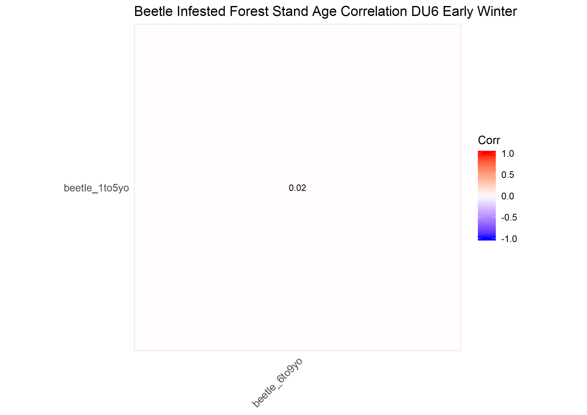

The maximum VIF from the simple GLM covariate model was <1.01, indicating these covariates were not correlated. The top-ranked model included a covariate for beetle infested forest stands one to five years old, including functional response covariates, and had an AIC weight (AIC*~w~*) of 0.937 (Table 1). The top ranked model had the fourth highest AUC (AUC = 0.592).

##### Late Winter
The correlation plots indicated that the two age classes of beetle infested stands were not correlated ($\rho$ = 0.02).


The maximum VIF from the simple GLM covariate model was <1.01, indicating these covariates were not  correlated. The top-ranked model included covariates for both beetle infested forest stand age classes, but no functional response, and had an AIC*~w~* of 0.716 (Table 1). The second-ranked model included the one to five year old age class covariate only, and no functional response, with a AIC*~w~* of 0.284 (Table 1). These two top models had the highest AUC (AUC = 0.631).

##### Summer
The correlation plots indicated that the two age classes of beetle infested stands were not correlated ($\rho$ = 0.01).

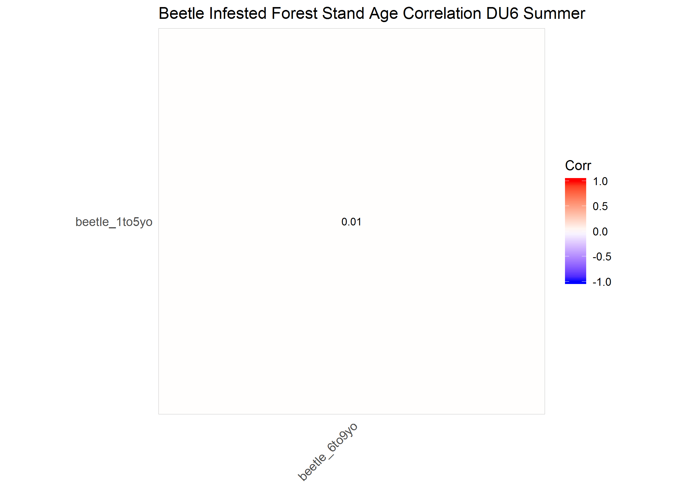

The maximum VIF from the simple GLM covariate model was <1.01, indicating these covariates were not correlated. The top-ranked model included the one to five year old beetle infested forest stand age covariate only, but no functional response, and had an AIC*~w~* of 0.933 (Table 1). The second-ranked model included covariates for both beetle infested forest stand age classes, but no functional response, with a AIC*~w~* of 0.067 (Table 1). These two top models had the highest AUC (AUC = 0.647).

#### DU7
##### Early Winter
The correlation plots indicated that the two age classes of beetle infested stands were not strongly correlated ($\rho$ = 0.44).

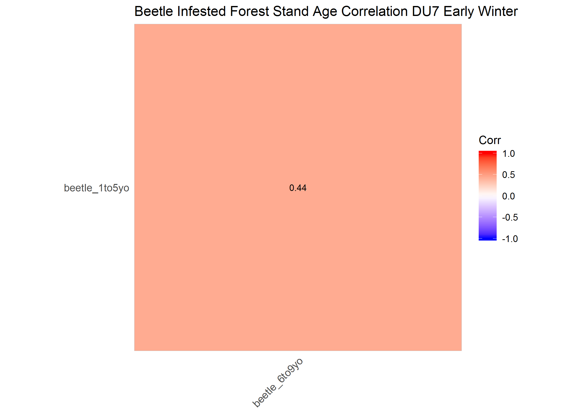

The maximum VIF from the simple GLM covariate model was <1.26, indicating these covariates were not correlated. The top-ranked model included covariates for both beetle infested forest stand age classes, but no functional response covariates, and had an AIC weight (AIC*~w~*) of 1.000 (Table 1). The top ranked model had the highest AUC (AUC = 0.674).

##### Late Winter
The correlation plots indicated that the two age classes of beetle infested stands were not strongly correlated ($\rho$ = 0.36).


The maximum VIF from the simple GLM covariate model was <1.17, indicating these covariates were not correlated. The top-ranked model included covariates for both beetle infested forest stand age classes, but no functional response covariates, and had an AIC weight (AIC*~w~*) of 1.000 (Table 1). The top ranked model had the highest AUC (AUC = 0.682).

##### Summer
The correlation plots indicated that the two age classes of beetle infested stands were not strongly correlated ($\rho$ = 0.64).

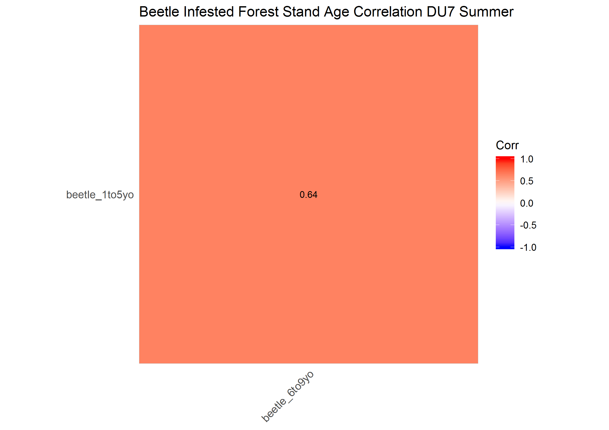

The maximum VIF from the simple GLM covariate model was <1.72, indicating these covariates were not strongly correlated. The top-ranked model included covariates for both beetle infested forest stand age classes, but no functional response covariates, and had an AIC weight (AIC*~w~*) of 1.000 (Table 1). The top ranked model had the highest AUC (AUC = 0.687).

#### DU8
##### Early Winter
The correlation plots indicated that the two age classes of beetle infested stands were not correlated ($\rho$ = 0.01).

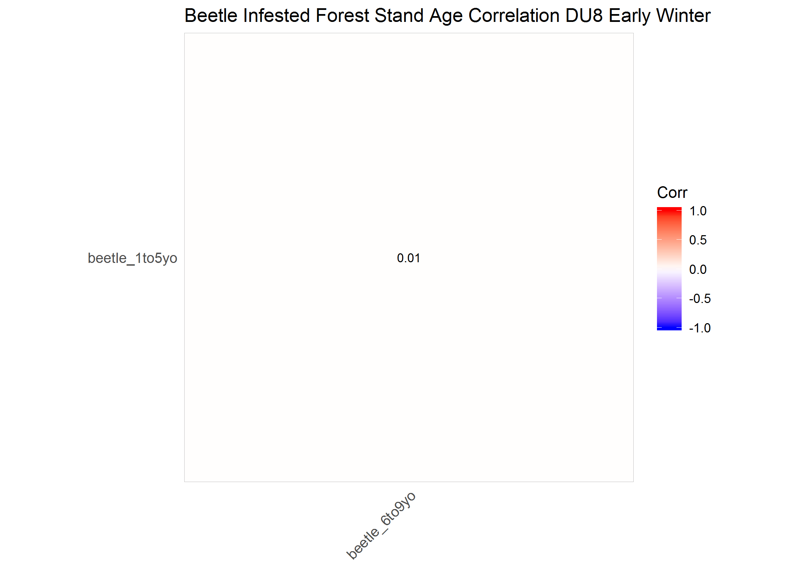

The maximum VIF from the simple GLM covariate model was <1.01, indicating these covariates were not correlated. The top-ranked model included covariates for both beetle infested forest stand age classes, but no functional response covariates, and had an AIC weight (AIC*~w~*) of 1.000 (Table 1). The top ranked model had the highest AUC (AUC = 0.677).

##### Late Winter
The correlation plots indicated that the two age classes of beetle infested stands were not correlated ($\rho$ = 0.01).


The maximum VIF from the simple GLM covariate model was <1.01, indicating these covariates were not correlated. The top-ranked model included covariates for both beetle infested forest stand age classes, but no functional response covariates, and had an AIC weight (AIC*~w~*) of 1.000 (Table 1). The top ranked model had the highest AUC (AUC = 0.681).

##### Summer
The correlation plots indicated that the two age classes of beetle infested stands were not correlated ($\rho$ = 0.02).

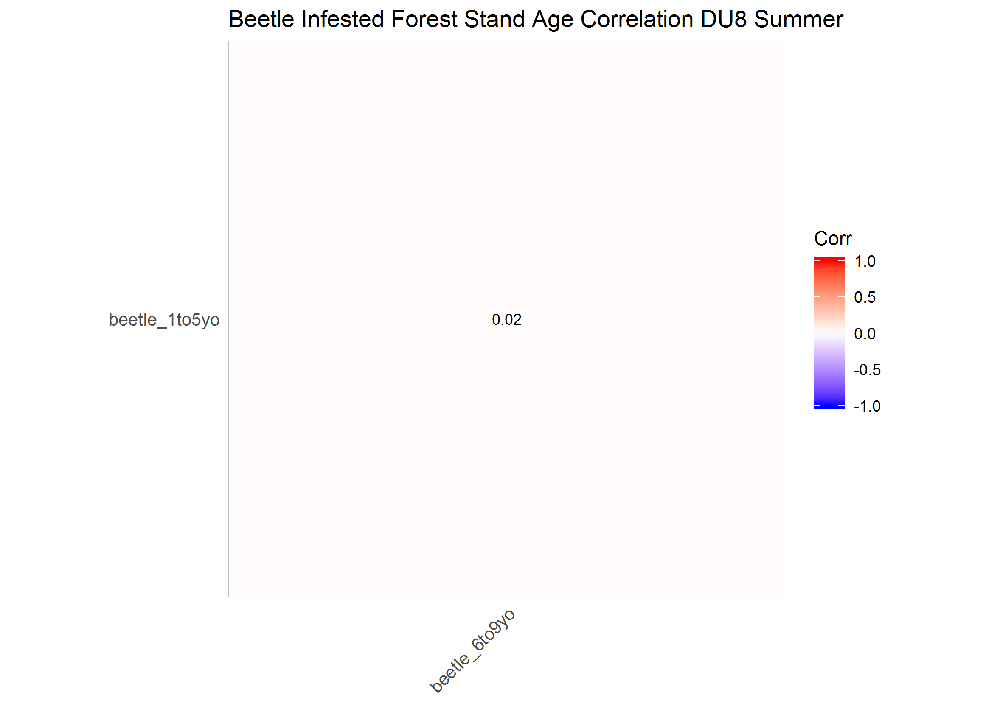

The maximum VIF from the simple GLM covariate model was <1.01, indicating these covariates were not correlated. The top-ranked model included covariates for both beetle infested forest stand age classes, but no functional response covariates, and had an AIC weight (AIC*~w~*) of 1.000 (Table 1). The top ranked model had the highest AUC (AUC = 0.673).

#### DU9
##### Early Winter
The correlation plots indicated that the two age classes of beetle infested stands were not correlated ($\rho$ = 0.02).


The maximum VIF from the simple GLM covariate model was <1.01, indicating these covariates were not correlated. The top-ranked model included the one to five year old beetle infested forest stand age covariate, including a functional response, and had an AIC*~w~* of 0.688 (Table 1). The second-ranked model included covariates for both beetle infested forest stand age classes and a functional response, with a AIC*~w~* of 0.300 (Table 1). The top-ranked model had the third highest AUC (AUC = 0.633) and the second-ranked model had the second highest AUC (AUC = 0.634).

##### Late Winter
The correlation plots indicated that the two age classes of beetle infested stands were not correlated ($\rho$ = 0.02).

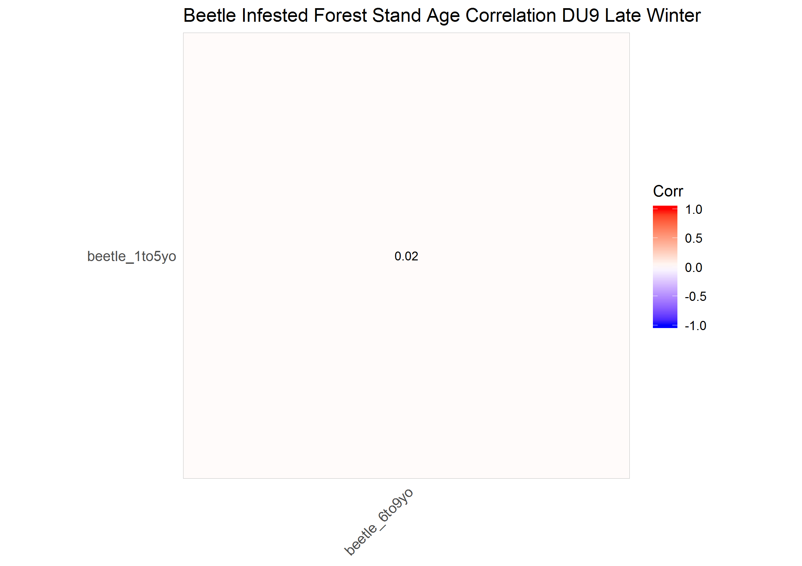

The maximum VIF from the simple GLM covariate model was <1.01, indicating these covariates were not correlated. The top-ranked model included covariates for both beetle infested forest stand age classes, but no functional response covariates, and had an AIC weight (AIC*~w~*) of 0.912 (Table 1). The top ranked model had the highest AUC (AUC = 0.629).

##### Summer
The correlation plots indicated that the two age classes of beetle infested stands were not correlated ($\rho$ = 0.28).

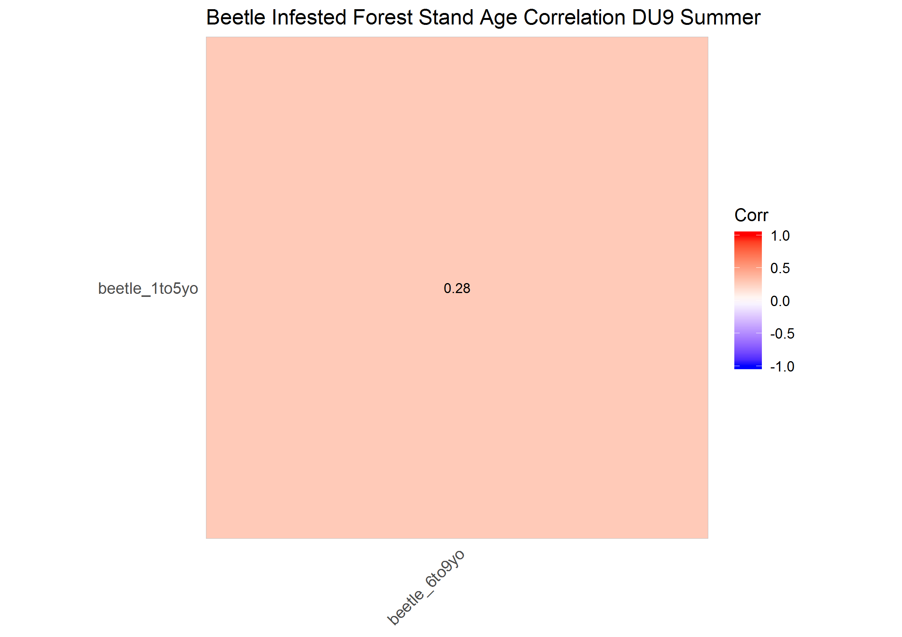

The maximum VIF from the simple GLM covariate model was <1.08, indicating these covariates were not correlated. he top-ranked model included the six to nine year old beetle infested forest stand age covariate, including a functional response, and had an AIC*~w~* of 0.662 (Table 1). The second-ranked model included the six to nine year old beetle infested forest stand age covariate, but no functional response, with a AIC*~w~* of 0.176 (Table 1). The top-ranked model had the lowest AUC (AUC = 0.660) and the second-ranked model had the second highest AUC (AUC = 0.662).

Table 1. AIC, AIC*~w~* and AUC values from DU and seasonal sets of distance to cutblock resoruce selection models for caribou. 
```{r table of aic results, echo = F}
table.aic <- read.csv ("data/table_aic_fire.csv")
table.aic$AIC <- round (table.aic$AIC, 0)
table.aic$AICw <- round (table.aic$AICw, 3)
table.aic$AUC <- round (table.aic$AUC, 3)
table.aic %>%
  kable (longtable = T, booktabs = T) %>%
  kable_styling (bootstrap_options = c ("striped", "condensed"),
                 latex_options = c ("repeat_header","HOLD_position","scale_down"),
                 font_size = 10) %>%
  landscape () %>%
  column_spec (c (3:5), width = "15em")
```

## Conclusions
To simplify models, I grouped annual beetle infested forest stand age and severity covariates into classes. In general, caribou selection for beetle infested forest stands was consistent across years and severity. Therefore, I combined all severity types (moderate, severe, very severe) into a single class, and grouped ages into two classes: 1 to 5 years old and 6 to 9 years old. This grouping by burn age was done based on statistical principles of minimizing correlation between covariates and identifying parsimonious but reasonably predictive RSF models. However, results here are also consistent with our ecological understanding of how disturbed stands age and how caribou might respond to them differently as they age. Specifically, newly infested stands (i.e., one to five years old) may provide different habitat features for caribou and their 'competitors' (i.e., other ungulate species) than older aged standsa (i.e., six to nine years old). However, the exact mechanism for how caribou might repond to these different age classes is not clear.

## Literature Cited
DeCesare, N. J., Hebblewhite, M., Robinson, H. S., & Musiani, M. (2010). Endangered, apparently: the role of apparent competition in endangered species conservation. Animal conservation, 13(4), 353-362.

DeCesare, N. J., Hebblewhite, M., Schmiegelow, F., Hervieux, D., McDermid, G. J., Neufeld, L., ... & Wheatley, M. (2012). Transcending scale dependence in identifying habitat with resource selection functions. Ecological Applications, 22(4), 1068-1083.

Montgomery, D. C., and E. A. Peck. 1992. Introduction to linear regression analysis. Wiley, New York, New York, USA

Wittmer, H. U., Sinclair, A. R., & McLellan, B. N. (2005). The role of predation in the decline and extirpation of woodland caribou. Oecologia, 144(2), 257-267.