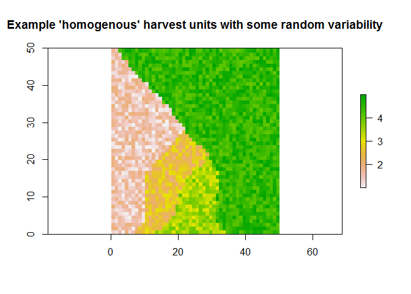
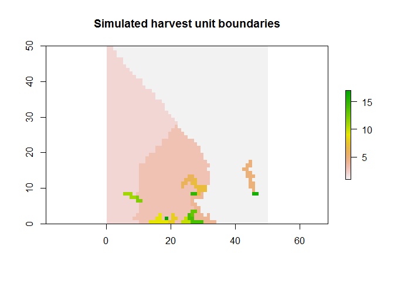
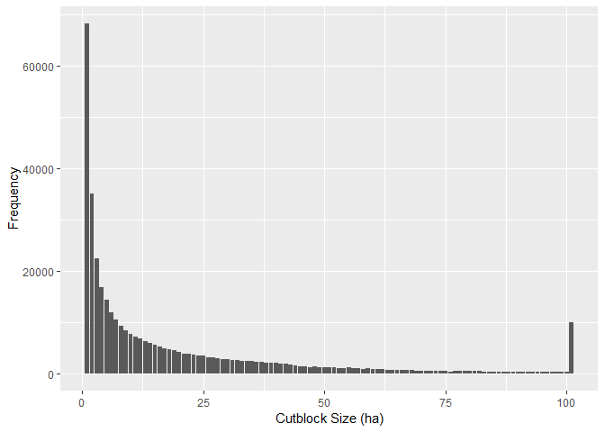

## Introduction
The size of a harvest unit (ie. a cutblock) has important implications for economic feasiblity, patch size distribution objectives and other metrics important to wildlife habitat (Ie. distance to a cutblock). While forest cover-polygons, representing stand-level forest attributes, may be assumed as an operational unit; typically, harvest units have included the aggregation of many forest cover-polygons given harvesting operations can capture economies of scale resulting from harvesting a number of stands in a spatially contiguous manner. Given the implications of harvesting units on wildlife and other forest values; how do we simulate into the future the size of these operational harvesting units? 

First, the spatial bounds on a cutblock, are generally predicated by law. The Forest Practices Code of British Columbia Act ["Operation and Site Planning Regulation"](http://www.bclaws.ca/civix/document/id/loo60/loo60/107_98) states (11(1)) - the maximum size of a harvest unit must not exceed 40 ha for coast forest region and some areas within the South interior region and 60 ha for the northern interior region and some areas within the South interior region. However, these maximal sizes can be increased further: given objectives from a high level forest plan for the salvage timber from natural disturbances; it retains 40% or more of the pre-harvest basal area or at the discretion of the district manager. Second, given these spatial bounds, we need an alogirthum for aggregating forest cover polygons or pixels into harvest units or blocks.

A block building algorithum aggregates forest cover polygons or pixels into harvest units or blocks. Note that the term block here does not convey any information concerning the geometry of the harvest unit but rather the term is used to describe an operational harvesting boundary which can take on many shapes and include alternative harvesting systems to notions of clearcutting and 'cutblocks'. Two general assumptions about block development can be made i) 'pre-blocking' (e.g., Murray and Weintraub 2002) which is used in a unit restrictive model (Murray 1999)  and ii) 'dynamic blocking' (e.g., Gustafson 1998) which is used in a area restriction model (Murray 1999).Typically, the choice of these assumptions are made in concordance with the proposed harvest scheduling approach. Under a pre-blocking approach, the entire landscape is divided into blocks before the harvest schedule is determined. This assumption can be limiting given harvest unit configurations are known _a_ _priori_ and evidently restrict the flexibility of the modelled outcome. Conversely, dynamic blocking assigns harvest unit size and its geometry during the harvest scheduling simulation. This dynamic behaviour may better emulate flexible management strategies like salavage operations.

The advantages of 'pre-blocking' is typically a cost saving during run time of the simulation and the ability to leverage their _a_ _priori_ assumptions which support the formulations of spatial optimization harvest schedule problems. In particular, this allows the model to have greater insight into future outcomes from harvesting that could be used within a harvest scheduling model to make improved decisions (intertemporal decision making). The major disadvantage of pre blocking is conversely the advantage of using a 'dynamic blocking' approach. In particular, 'emergent processes' like salvage operations can be included to dictate harvest unit size. Further, this approach presents the ability of the simulation to account for reactive decision making when modelling land uses under uncertainty. In reality a combination of these approaches is implemeneted (given the flexiblity of management and spectrum of future insight given to the model) which allows advantages from both approaches to be realized.

### Dynamic blocking

The general dynamic blocking algorithum is as follows from Murray and Weintraub (2002):
1. the area is randomly seeded with blocks 'growing' around these seeds 
2. polygons/pixels are then grouped into harvest units based on the 'closest' seed point (i.e., 'closest' can mean both real and variable space)
3. the harvest unit size is thus controlled by the number of initial seed points or some target size

This algorthium is very similar to a [k-means clustering](https://en.wikipedia.org/wiki/K-means_clustering) which partions _n_ pixels into _k_ clusters with each pixel belonging to a cluster with the nearest mean. The result of this process is ability to partition the data space into [Voronoi cells](https://en.wikipedia.org/wiki/Voronoi_diagram) which can be used to represent objects like harvest units. Various modifications to this approach have been made with consideration to i) randomly sampling a harvest unit size target distribution and ii) including various priorities for aggregating, for example, stand type, age, and terrain for achieving objectives of block homogeneity. However, both pre-blocking and dynamic blocking approches can be implemented with this simple algorithum.


### Pre-blocking 

Various approaches to 'pre-blocking' have included optimization formulations and near optimal solutions via heuristics. Lu and Eriksson (1999) used a genetic algorithum to build harvest units but this algorthium was applied to a 20 ha landscape with realtively long run-times. Boyland (2004) used simulated annealing to group polygons into harvest units based on area, age, species and shape criteria for the Invermere TSA. The use of algorithums with greater complexity increases the computational time and restricts the scalability of the analysis. These characteristics are vitally important to the caribou and landscape simulator, which requires the simulation of land use events across very large spatial and temporal scales in a timely manner. Thus, heuristics are of interest for pre-blocking. 

A problem with heuristic alogorithums is their inability to leave a local optimum to achieve a global optimum. For pre-blocking this means being able to accomodate variability in the forest or image of the forest. Thus, the process of 'pre-blocking' for purposes of creating spatially contigous harvesting units has some similarities to the image segementation problem. The goal of image segmentation is to partion or cluster pixels into regions that represent meaningful objects or parts of objects. The problem of segementing an image into objects has been posed by many studies for applications ranging from improving the stratification of the forest which is needed in some forest inventory sampling regimes to  interpreting biomedical images (e.g., delineating oragans or tumours). Typically, image segmentation involves either top-down or bottom-up perspectives.

Keeping in line with forestry applications- a common commercial software used for image segemetnation is [eCognition](http://www.ecognition.com/). This software is proprietary, and uses a bottom-up region merging technique (Baatz and Schape 2000), that merges indiviudal pixels into larger objects based on a 'scale' parameter. However, as shown by Blaschke and Hay (2001), finding any relatioship between this 'scale' parameter and spatial indicators is complicated, which forces a trial and error approach for meeting segementation objectives (i.e., size and homogenity). Hay et al. (2005) attempted to overcome this issue by developing multiscale object-specific segmentation (MOSS) which uses an integrative three-part approach. For purposes of blocking harvest units, the size constrained region merging (SCRM) part of the approach is of importance.

SCRM concept stems from the topographic view of a watershed. Watersheds define a network of 'ridges' that represent the boundaries of where each drop of rain would drain towards. In the harvest unit problem these ridges are boundaries of stand types. To complete the region merging, the idea is to find sinks where the rain would drain to and then assume these areas are springs from which uplift of water would fill these areas. As water fills a sink, these areas represent contiguous areas with similar features (i.e., elevation). Various size constraints can then be used to stop the process of merging which allows objects to be delineated.

In blockingCLUS, we leverage ideas from image based segementation (Felzenszwalb and Huttenlocher 2004) and SCRM (Hay et al. 2005) to develop a graph based image segementation approach that spatialy clusters pixels into harvest units based on similarity between adjacent pixels and size constraints. The following steps are used:
1. Estimate the similarity of a vector of forest attributes into an image
2. Convert the similarity image into a undirected graph
2. Solve the minnimum spanning tree of the graph to get a list of edges (i.e., ridge lines)
3. Sort the edgelist according to the metric of similarity (i.e., multivariate distance)
3. Starting with the pixel with the largest [degree](https://en.wikipedia.org/wiki/Degree_(graph_theory)), cluster surounding pixels until the largest size constraint has been met
4. When there are no more adjacent pixels or the size has been met, go on to the next block

The following is an example of an example test from using this algorithum

<!-- --><!-- -->

An important consideration of this pre-block algorithum is thTwo improvements to this algorithum can be made for future work : i) if a size constraint is not met then determine if the current harvest unit could fit in the next largest size constraint; ii) use the weights of the edges to determine the order from which to add pixels. For instance, the 'islands' within a harvest unit is a result of this issue. 


## Case Study


The spatial simulation of cutblock size can be approached in 3 ways. 1) set the cutblock size as a random variable from a distribution (estimated empirically), 2) pre-solve the forest area into blocks by aggregating based on some rule

Below is a histogram of the historical (1908-2018) cutblock size which could be used direct block size.The negative "J" shaped curve is often similar to natural distruabnce size and thus provides some empirical evidence of cutblock size emulating natural disturbances which has been argued as a foundation for achieving forest management objectives. This is useful becuase forests without a comprehensive historical cutblock dataset could thus rely on the natural disturbance size distribution.

```r
dist.cutblk.size<-getTableQuery("select width_bucket(areaha, 0, 100, 100) as sizebin, count(*)
    from cns_cut_bl_polygon where harvestyr >= 1980 and datasource != 'Landsat'
    group by sizebin 
    order by sizebin;") 

ggplot(dist.cutblk.size, aes(x = sizebin,y =count)) +
  geom_bar(stat="identity") +
  xlab("Cutblock Size (ha)") + 
  ylab("Frequency")
```

<!-- -->


```r
library(DBI)
library(RPostgreSQL)
conn<-dbConnect(dbDriver("PostgreSQL"), host='DC052586.idir.bcgov', dbname = 'clus', port='5432' ,user='postgres' ,password='postgres')
dbListTables(conn)
```

```
##  [1] "clim_pred_mountain_2010"                     
##  [2] "clim_plot_data_bec"                          
##  [3] "clim_pred_boreal_2025"                       
##  [4] "clim_pred_mountain_2055"                     
##  [5] "clim_pred_mountain_2085"                     
##  [6] "clim_pred_northern_1990"                     
##  [7] "clim_pred_northern_2010"                     
##  [8] "uwr_caribou_conditional_harvest_20180627"    
##  [9] "h_fire_ply_polygon"                          
## [10] "cb_sum"                                      
## [11] "spatial_ref_sys"                             
## [12] "fire_sum"                                    
## [13] "wha_caribou_no_harvest_20180627"             
## [14] "uwr_caribou_no_harvest_20180627"             
## [15] "study_area_tsa"                              
## [16] "study_area_tsa_dissolve"                     
## [17] "study_area_caribou_herd_dissolve"            
## [18] "bec_zone_2020s"                              
## [19] "bec_zone_2050s"                              
## [20] "bec_zone_2010s"                              
## [21] "bec_zone_2080s"                              
## [22] "pre_roads_ras"                               
## [23] "bc_ha_slope"                                 
## [24] "bec_zone_vat"                                
## [25] "bec_zone_2080s_albers"                       
## [26] "rmp_lu_sp_polygon"                           
## [27] "fadm_tflad_polygon"                          
## [28] "fadm_tflde_polygon"                          
## [29] "fadm_tfl_polygon"                            
## [30] "lakes"                                       
## [31] "pipelines"                                   
## [32] "watercourses"                                
## [33] "lut_wetlands_boreal_caribou"                 
## [34] "cutseq1980"                                  
## [35] "rd_cost_surface"                             
## [36] "telemetry_caribou_all"                       
## [37] "ften_rs_ln_line"                             
## [38] "ften_roads_ras"                              
## [39] "telemetry_caribou_bc_final"                  
## [40] "available_locations_caribou_bc"              
## [41] "bc_bound_vat"                                
## [42] "veg_comp_lyr_r1_poly_final_spatialv2_2003"   
## [43] "rsf_locations_caribou_bc"                    
## [44] "gcbp_carib_polygon"                          
## [45] "clim_pred_northern_2055"                     
## [46] "clim_pred_mountain_1990"                     
## [47] "clim_pred_northern_2085"                     
## [48] "clim_pred_mountain_2025"                     
## [49] "clim_pred_boreal_2085"                       
## [50] "uwr_proposed_caribou_no_constraints_20180627"
## [51] "uwr_proposed_caribou_no_harvest_20180627"    
## [52] "wha_caribou_conditional_harvest_20180627"    
## [53] "wha_proposed_caribou_no_harvest_20180627"    
## [54] "integrated_roads"                            
## [55] "clim_plot_data"                              
## [56] "clime_bec"                                   
## [57] "cns_cut_bl_polygon"                          
## [58] "pre_roads"                                   
## [59] "forest_tenure"                               
## [60] "tsa_herd_union"                              
## [61] "study_area_caribou_herd"                     
## [62] "cutseq"                                      
## [63] "bec_zone"                                    
## [64] "clim_pred_boreal_1990"                       
## [65] "bc_bound"                                    
## [66] "clim_pred_boreal_2010"                       
## [67] "clim_pred_boreal_2055"                       
## [68] "clim_pred_northern_2025"                     
## [69] "topology"                                    
## [70] "layer"                                       
## [71] "wetlands_boreal_caribou"                     
## [72] "crds_loose"                                  
## [73] "vri_tfl"                                     
## [74] "directory_clus_data"                         
## [75] "crds_paved"                                  
## [76] "veg_comp_lyr_r1_poly_with_tfl"               
## [77] "crds_petroleum"                              
## [78] "crds_trim_transport"                         
## [79] "crds_rough"                                  
## [80] "crds_unknown"                                
## [81] "bc_bound_ras"                                
## [82] "vri_bclcs_classes"                           
## [83] "thlb_data_rco"                               
## [84] "thlb_data_sir"                               
## [85] "thlb_data_nir"                               
## [86] "bc_thlb"                                     
## [87] "ras_bc_thlb2018"                             
## [88] "vri_species_lut"                             
## [89] "ras_similar_vri2003"                         
## [90] "vri_species_groups"                          
## [91] "ras_thlb_nir_lyr2018"                        
## [92] "ras_thlb_rco_lyr2018"                        
## [93] "ras_thlb_sir_lyr2018"
```


#References

Felzenszwalb, P.F. and Huttenlocher, D.P., 2004. Efficient graph-based image segmentation. International journal of computer vision, 59(2), pp.167-181.

Gustafson, E.J. 1998. Clustering timber harvests and the effect of dynamic forest management policy on forest fragmentation.
Ecosystems 1:484-492.

Nelson, J.D. 2001. Assessment of harvest blocks generate from operational polygons and forest cover polygons in tactical and strategic planning. Can. J. For. Res. 31:682-693.

Lu, F. and Eriksson, L.O. 2000. Formation of harvest units with genetic algorithms. For. Ecol. And Manage. 130:57-67. 

Murray, A.T., and Weintraub, A. 2002. Scale and unit specification influences in harvest scheduling with maximum area restrictions. For. Sci. 48(4):779-789.


