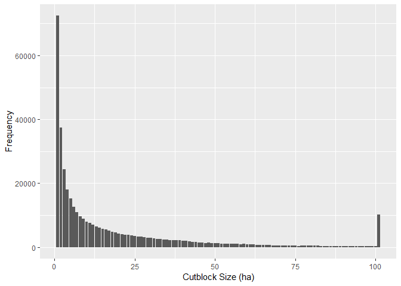

##Introduction
The size of a harvest unit (ie. a cutblock) has important implications for ecnomic feasiblity, patch size distrubtion across the landscape and metrics imporant to wildlife habitat (Ie. distance to a cutblock). How do we simulate the size of a cutblock? The spatial bounds on a cutblock, are generally known. The Forest Practices Code of British Columbia Act ["Operation and Site Planning Regulation"](http://www.bclaws.ca/civix/document/id/loo60/loo60/107_98) states (11(1)) - the maximum size of a cutblock must not exceed 40 ha for coast forest region and some areas within the South interior region and 60 ha for the northern interior region and some areas within the South interior region. However, these maximal sizes can be increased further: given objectives from a high level forest plan for the salvage timber from natural disturbances; it retains 40% or more of the pre-harvest basal area or at the discretion og the district manager. 


```r
dist.cutblk.size<-getTableQuery("select width_bucket(areaha, 0, 60, 60) as sizebin, count(*)
    from cns_cut_bl_polygon where harvestyr >= 1980
    group by sizebin 
    order by sizebin;")

ggplot(dist.cutblk.size, aes(x = sizebin,y =count)) +
  geom_bar(stat="identity") +
  xlab("Cutblock Size (ha)") + 
  ylab("Frequency")
```

<!-- -->

##Case Study
The spatial simulation of cutblock size can be approached in 3 ways. 1) set the cutblock size as a random variable from a distribution (estimated empirically), 2) pre-solve the forest area into blocks by aggregating 
