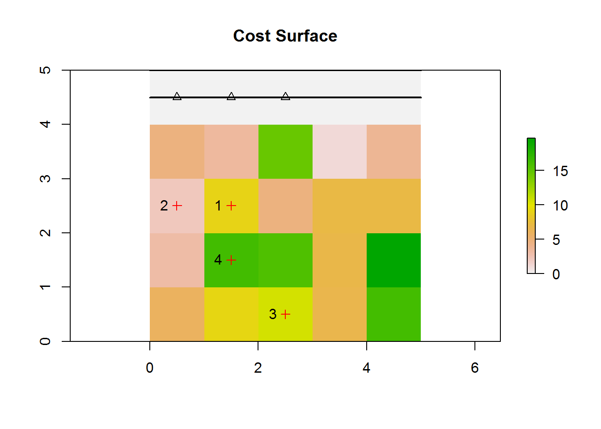
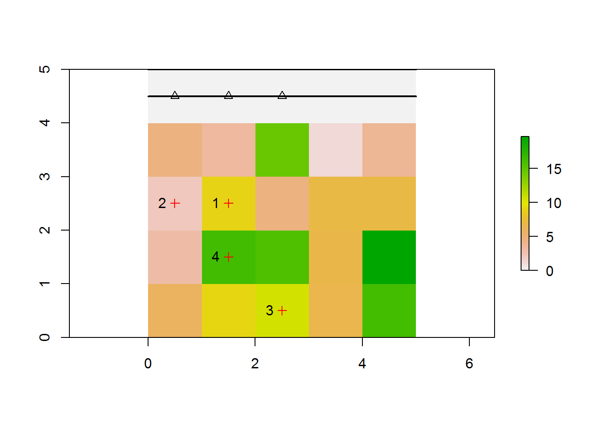
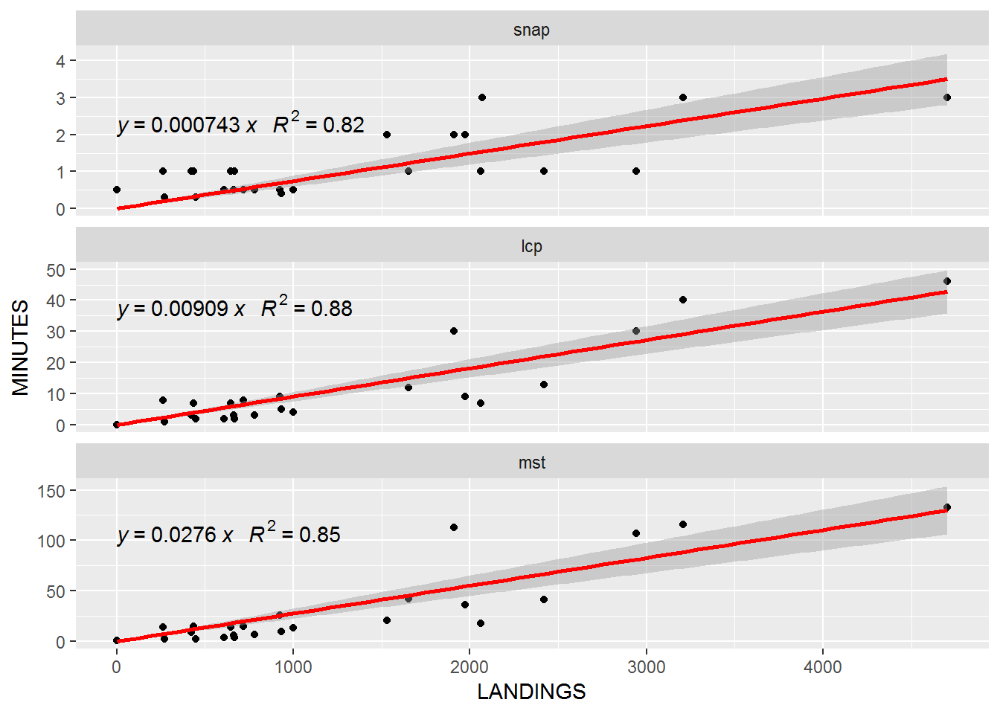
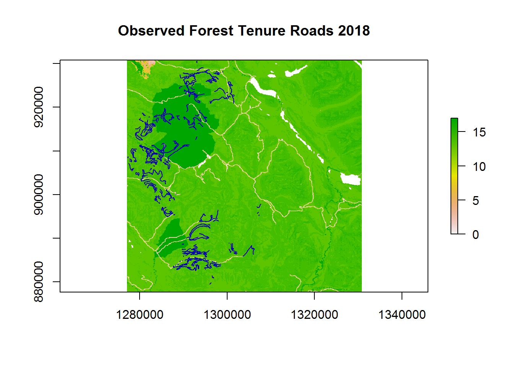
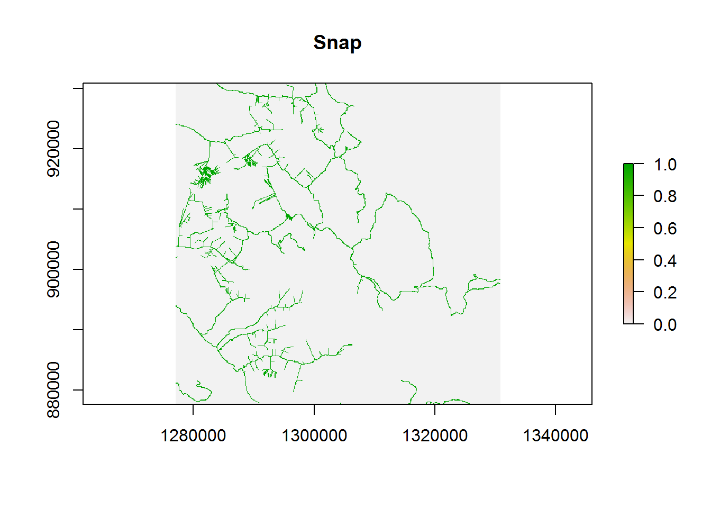
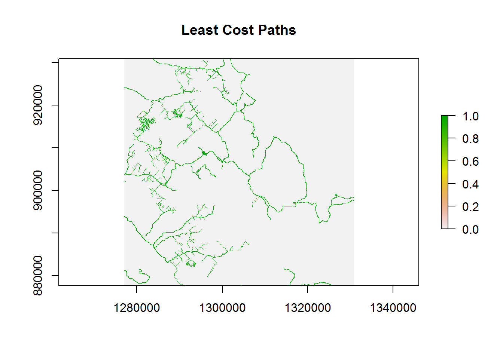
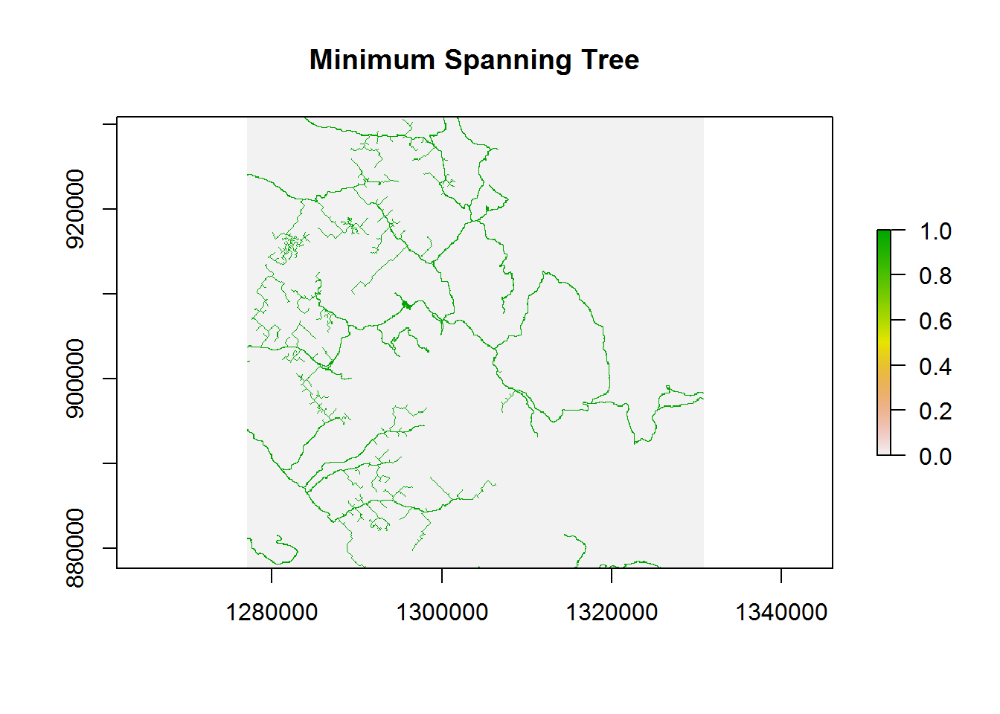

##Introduction

Roads are an important consequence from land use operations that impact future economic opportunities and wildlife habitat.In particular, caribou are a threatened species in some regions of BC and thier habitat selection is particualry senstive to road development. As such, restrictions on future road development may be implemented in caribou habitat areas. To understand the implications of these policies, there is a need to project future roads. Assuming an annual harvest of 200 000 ha with 3 % of the harvest area in roads, a road right of way of 20 m, then roughly 3 000 km of roads get built per year. This equates to travelling a round trip between Vancouver, BC and Fort Nelson, BC. How are these roads planned and designed? 

Short term planning has been the historical approach to road development because it is an enormous task to manually project road networks (e.g., depending on the computer, it may take up to ½ day for an individual Timber Supply Area). Further, we rarely have a long term view on the life cycle of each road segment. This includes how much volume will be hauled over the roads which makes it hard to determine the best decision regarding deactivation and reactivation. Lastly there are limited tools available to assess strategic questions such as how yarding distance and road design parameters affect the: total length and cost of the network, area of land lost to roads, and the amount to caribou habitat sensitive to future road networks.

Our interest is in the automated process of: projecting roads, the speed in preforming this process and the realism of assumptions. While optimal road construction strategies including activation and deactivation have been developed (Murray 1998; Anderson et al. 2006), optimizing very large landbases is problematic in terms of speed in execution, generating the estimates needed to parameterize the formulation and the level of integration with other modelling approaches like simulation. Research has shown there are trade-offs between optimized routing and the time to solve the problem (Dean 1997; Picard et al. 2006).

Simulation models offer an alternative approach to optimization that links nicely to strategic models looking to assess land uses across very large landscapes involving multiple regions and Timber Supply Areas. These models employ heuristic algorithms for road design which may not be optimal but rather close to it. However, many assumptions are needed to parameterize road simulations and these need careful consideration. The following vignette looks at various road simulation assumptions used by Forest Analysis and Inventory Branch (FAIB).    


##Problem Defintion

###Road Spacing and Multiple Target Access
Generally, road simulations assume landings (determined by a harvest scheduler) will be connected to an existing road network. These include: a "as the crow flies" method where the road has no costs associated with direction; a "least cost distance" which builds upon the "as the crow flies" method by incorporating costs and obstacles (a.k.a., "as the wolf runs"); and a MST (Minimum Spanning Tree) with Least-Cost Paths as used in StTSM-SELES (Spatial Timber Supply Model in the Spatially Explicit Landscape Event Simulator platform).

Current road simulators used in FAIB have a similar problem in the forest management context– design a future road network that connects harvesting locations or landings to an existing road network under the objective of minimizing cost. This problem can be defined under two approachs: i) a road spacing problem (RSP) where every point is potentially a target, the problem is then to find a network as densely as possible, with a stopping rule that infers the maximum total cost that can be achieved. or ii) a multiple target access problem (MTAP) which considers _m_ point-shaped targets (i.e., landings of cutblocks) that have to be connected to an existing road network (the source). The first approach provides a long term view of road development that would help inform road saturation and activation/deactivation decisions. If the harvest locations are known, this approach can also be implemented at single time step often during the simulations intitalization or start up period through 'pre-solving'. Examples of pre-solving the road network can be found in jfssam (FAIB -internal model) or through SELES-roading. Conversely, a second approach can be taken which simulates roads dynamically. The difference between these two approaches concerns the amount of information given to the model with the first approach assuming perfect information of harvest locations across the simulation time horizon which would result in a lower cost (ie., road density). The second approach assumes limited information concerning harvest locations (i.e., a single period of locations) or _m_ point-shaped targets and thus has a higher cost. This lack of information may be more realistic given the temporal scale of imformation used in road planning and thus, is of interest to assess the economic and ecological impacts of land uses. 

A common assumption when simulating paths between landings and an existing road network concerns the objective of minimizing cost. In the simplest case, the minimum cost will be a straight line path between the existing road network and landing. However, a more realistic cost may include various impedance attributes like slope, habitat, length of roads, time, risk to fire or other barriers. Some expamples of a cost surface include: [Tobler's hiking function](https://en.wikipedia.org/wiki/Tobler%27s_hiking_function), expert opinion from operational researchers or an empircally derived function relating various topogrphical and biophyiscal variables. No matter what the attributes of cost surface may be, an estimate of cost is required across the study area and thus, the cost of a road segment is the sum of the costs associated to the pixels that form the segment. The total costs for a road segment form the edges of a mathematical graph with the vertices or nodes representing posible locations to build the road. For a raster data-structre, nodes are located on a square grid and spatially neighbouring nodes are connected by edges (or arcs).Adding addtional impedance attributes will increase the complexity of the path which will result in an increased cost of the network (i.e., greater road density). Further, the path of a landing to the existing road netwowrk assumes each road is planned independant of other landing locations. This may create parrallel roads/paths that may seem redundant. To over come this effect a more centrailized approach to road planning can be considered.

To include the effect of other landings on the road network a decision is assumed to determine which landing will connect to other landings versus the existing road network (i.e., also known as road branching). This decision can be approximated with a minimum spanning tree problem which uses as nodes in a graph both the paths between each landing to the existing road network and the pathes between landings. A more detail description of the least cost paths and minimuim spanning trees follows.

###Least-Cost Path

Decomposing the MTAP we find a similar smaller problem, connecting a single target point to a source point which is also called a least cost path or shortest path. To solve this problem [Dijkstra’s algorithm](https://en.wikipedia.org/wiki/Dijkstra%27s_algorithm) is often implemented (see [ArcGIS Network Analyst](http://help.arcgis.com/en/arcgisdesktop/10.0/pdf/network-analyst-tutorial.pdf) or [QGIS Network anlaysis library](https://docs.qgis.org/testing/en/docs/pyqgis_developer_cookbook/network_analysis.html). In this algorithm, every node is visited and thus solving the graph provides information on the least cost path for every target-source combination. This works by first initializing the graph by setting all the points to ‘unvisited’ and storing this as a set (called unvisited set). The values of the points are set to infinity except for the origin or source point which is set to zero. A series of iterations then determine the path. In the first iteration the current node is the source point. From the current node consider all the neighbours and calculate the cost from the current node to each of the neighbour nodes. This cost includes the cost from the current node (in the first iteration this will be 0). Store these nodes in priory queue so that the smallest distance is first. Thus, the first node will be the least cost. In the next iteration. find all the nieghbours For this first node and calculate the cost to go from the source point to these neighbouring nodes (this is taken from the edge). Store the least cost at this node and remove from unvisted set. The next interation then begins by finding all the neighbouring nodes until the target has been reached. A complete graphical example can be found [here](http://optlab-server.sce.carleton.ca/POAnimations2007/DijkstrasAlgo.html). Note Djikstra's algorithum  has limtations with negative costs and solving time and thus, various modifications of this algorithum have been proposed (eg., [A*](https://en.wikipedia.org/wiki/A*_search_algorithm), [Johnson's Algorithm](https://en.wikipedia.org/wiki/Johnson%27s_algorithm))

###Minimum Spanning Tree
A minimum spanning tree (MST) connects all nodes in a graph with out any loops or cycles. In the forestry context, the nodes of the MST are cutblock locations and existing road networks and the edges represent routes solved using a Least-Cost Path algorthium (eg., [Dijkstra’s algorithm](https://en.wikipedia.org/wiki/Dijkstra%27s_algorithm)). To solve the MST, [Kruskal's algorithm](https://en.wikipedia.org/wiki/Kruskal%27s_algorithm) is often used , however, this algrotihum is 'greedy' (finds a locally optimal choice using a problem solving heuristic with the intent of finding a global optimum) and thus various alternatives exist  (see [Prim's algorithm](https://en.wikipedia.org/wiki/Prim%27s_algorithm)). [Kruskal's algorithm](https://en.wikipedia.org/wiki/Kruskal%27s_algorithm) begins by sorting graph edges with respect to their weights (these are the total cost of the least cost path). Then, add edges to the MST by starting with the edges with the smallest weight and going until the edge of the largest weight. Lastly, only add edges that do not form a loop or cycle. A complete graphical example can be found [here](http://optlab-server.sce.carleton.ca/POAnimations2007/MinSpanTree.html).

#Comparing Road Simulation Algorithums
Various approaches to simulating road development in BC were compared for purposes of identifying their differences and evaluating trade-offs. To provide this comparison, the approaches were first contrasted based on their conceptual and structural assumptions. Using these assumptions, versions of road simulation approaches were then developed in the R programming language within the [SpaDES](https://cran.r-project.org/web/packages/SpaDES/index.html) package to support a consistent comparison between accuracy and speed of execution. The following describes the approaches and provides a comparison of the simulated outcomes.

##Description of Approaches

All of the methods are dependent on two considerations: i) the road building cost and ii) the view of road branching. First, road building cost is given as a surface constructed from many spatial layers including hydrology, slope, BEC etc. However, the cost can also deal with transportation cost, destruction risk or negative impacts to the environment or wildlife habitat. Second, a degraded version of the MTAP is considered by forcing the only possible branching points of the simulated road network to be targets. However, allowing greater branch points increase the time and complexity of the algorithm which severely limits the number of possible scenarios that can be run. For the remainder of this analysis, the degraded version of the MTAP is considered.

The following figure represents a simple raster with values pertaining to road build costs.

<!-- -->

```
## [1] "NOTE: black line is a road. Red crosses are targets (i.e., landing locations)"
```

### The 'Snapping' Approach 
This approach simply 'snaps' a landing (i.e., cutblock location) to the nearest existing road segment. Since the snapping is done for each landing it is also called an independent path method. First, using the existing road network, the closest road point is determined using rgeos [gDistance](https://www.rdocumentation.org/packages/rgeos/versions/0.3-28/topics/gDistance) function.


```r
#convert the raster pixels that are roads (i.e., cost = 0) to points
roads.pts <- rasterToPoints(ras, fun=function(x){x == 0})  
#get the distance between the two geometries (road points and targets) and select the minimum
closest.roads.pts <- apply(rgeos::gDistance(SpatialPoints(roads.pts),SpatialPoints(sC), byid=TRUE), 1, which.min) 

#The top row corresponds to the landing ID and the bottom row corresponds to the closest road point. Note the raster is labeled from 1 to n cells starting from left to right, top to bottom.
closest.roads.pts
```

```
## 1 2 3 4 
## 2 5 2 3
```

```r
# convert to a matrix
roads.close.XY <- as.matrix(roads.pts[closest.roads.pts, 1:2,drop=F]) 
plot(ras)
title('Cost Surface')
plot(sC, col ='red', add=TRUE)
segments(0,5,5,5, lwd =2)
text(sC, labels=sC$ID, pos=2)
lines(c(0,5),c(4.5,4.5), lwd =2)
plot(SpatialPoints(roads.close.XY), col='black', pch =2, add=TRUE)
```

<!-- -->

```r
#NOTE: black triangles are closest point on the existing road"
```

Second, connecting the closest road points (i.e., roads.close.XY) to the targets (landings) simply involves drawing a line between the two points using the sf and dplyr packages.


```r
rdptsXY<-data.frame(roads.close.XY) #convert to a data.frame
rdptsXY$id<-as.numeric(row.names(rdptsXY))
landings<-data.frame(sC)
landings<-landings[,2:3]
landings$id<-as.numeric(row.names(landings))

coordMatrix<-rbind(rdptsXY,landings)
coordMatrix$attr_data<-100
mt<-coordMatrix %>% st_as_sf(coords=c("x","y"))%>% group_by(id) %>% summarize(m=mean(attr_data)) %>% st_cast("LINESTRING")

plot(ras)
title('Cost Surface')
plot(sC, col ='red', add=TRUE)
segments(0,5,5,5, lwd =2)
text(sC, labels=sC$ID, pos=2)
lines(c(0,5),c(4.5,4.5), lwd =2)
plot(SpatialPoints(roads.close.XY), col='black', pch =2, add=TRUE)
plot(mt$geometry,add=TRUE, lwd= 2)
```

<!-- -->

Using this approach, a few issues would arise: 1) parrallel roads are not realistic since there is no branching and this ultimately leads to increases in the amount of roads; 2) costs are not included (i.e., slope and barriers like lakes); This means this approach, while simple to implement, would over estimate the amount of simulated roads

### Least Cost Paths (LCP) Approach 
This approach builds upon the snapping approach by assuming a 'cost directed' path for each landing to the existing road network. This includes the cost of barriers and impedance attributes. However, this approach requires a cost surface that needs to be estimated, then updated within the simulations and thus, requires greater computational time, realtive to the snapping approach. First the cost surface raster is converted to a data.table (a faster data structure when storing large amounts of data). This data.table is then used to build a graph using [igraph](http://igraph.org/r/) 


```r
#convert the cost surface raster to a matrix
ras.matrix<-raster::as.matrix(ras)
weight<-c(t(ras.matrix)) #transpose then vectorize. This follows how rasters are read

#This matrix is simply the values from the raster. Notice that the first 5 elements are 0 indicating the road.
weight
```

```
##  [1]  0.000000  0.000000  0.000000  0.000000  0.000000  1.447820  1.698491
##  [8]  4.552048  3.139038  6.703103  3.292355 19.030631  6.576840 18.600806
## [15] 10.972168  3.264046  2.530926  4.286654 11.433467  2.624341  4.340477
## [22]  2.875758 10.395888  3.709715 14.188587
```

```r
weight<-data.table(weight) #convert to a data.table
weight$id<-as.integer(row.names(weight)) # add an ID

#---------------
#build the graph
#---------------

#get the adjaceny
edges<-adj(returnDT= TRUE, numCol = 5, numCell=25, directions =8, cells = 1:25)
#merge and average between the to and from 
test<-merge(x=edges, y=weight, by.x= "from", by.y ="id")
setnames(test, c("from", "to", "w1"))

test2<-setDT(merge(x=test, y=weight, by.x= "to", by.y ="id"))
setnames(test2, c("from", "to", "w1", "w2"))
test2$weight<-(test2$w1 + test2$w2) /2 # take the average between the two pixels
edges.weight<-test2[complete.cases(test2), ]

edges.weight$id<-1:nrow(edges.weight)

g<-graph.edgelist(as.matrix(edges.weight)[,1:2], dir = FALSE)
#assign weights to the graph
E(g)$weight<-as.matrix(edges.weight)[,5]

#From this grah you can see the verticies labeled according to the raster cell number and the edges that connect a pixel to its neighbours
plot(g)
```

<!-- -->
Once the graph is built, it is simple to get the least cost path between any two verticies. Using [Dijkstra’s algorithm](https://en.wikipedia.org/wiki/Dijkstra%27s_algorithm), the [shortest_paths](http://igraph.org/r/doc/distances.html) function is called in [igraph](http://igraph.org/r/doc/#R). Further, the graph can be easily updated to simulate the change in the cost surface from dynamically developing roads during the simulation. Note, that this dynamic behaviour would not be possible in a pre-solve of the road network.


```r
paths.matrix<-cbind(cellFromXY(ras,sC ), cellFromXY(ras, roads.close.XY ))
paths.list<-split(paths.matrix, 1:nrow(paths.matrix)) #convert to a list for lapply

#get the shortest paths
paths<-unlist(lapply(paths.list, function(x) get.shortest.paths(g, x[1], x[2], out = "both")))
paths.v<-NULL
paths.v<-unique(rbind(data.table(paths[grepl("vpath",names(paths))] ), paths.v))

paths.e<-paths[grepl("epath",names(paths))]
r<-raster(ras)
r[]<-1:25 #assign the cell number ID as raster values
r2<-r

r[!(r[] %in% as.matrix(paths.v))] <- NA
r[r[]>0] <- 1
r[1:5]<- 1
plot(r)
plot(sC, col ='red', add=TRUE)
segments(0,5,5,5, lwd =2)
text(sC, labels=sC$ID, pos=2)
lines(c(0,5),c(4.5,4.5), lwd =2)
plot(SpatialPoints(roads.close.XY), col='black', pch =2, add=TRUE)
```

<!-- -->

```r
#show comparison to the cost surface
plot(ras)
plot(sC, col ='red', add=TRUE)
segments(0,5,5,5, lwd =2)
text(sC, labels=sC$ID, pos=2)
lines(c(0,5),c(4.5,4.5), lwd =2)
plot(SpatialPoints(roads.close.XY), col='black', pch =2, add=TRUE)
```

<!-- -->

The main disadvantage of this approach is the independant perspective of road planning. While in some cases there will be branching where two roads connecting targets to existing road network will use the same path; this will be dependant on the cost surface. In other cases the shortest path may produce parrellel or redundant roads given a path is made for each target to the corresponding closest point. Thus, the amount of road being developed from the least cost path is dependant on the cost surface and may be either higher or lower than the corresponding snap approach.

### Minnimum Spanning Tree with Least Cost Paths Approach 
This approach builds upon the least cost paths approach by determining if landings should be connected to one another before being connected to the exiting road network. Least cost distances are estimated both between the landings and between landings and the existing road network. These distances are then used as nodes for solving a minimum spanning tree (mst) problem. Least cost paths are then constructed following the solution to the MST. This approach allows for greater branching in simulated roads which would reduce the cost relative to the least cost paths approach. However, the computational time would increase over the least cost paths approach given the extra step of solving the MST.


```r
mst.v <- as.vector(rbind(cellFromXY(ras,sC ), cellFromXY(ras, roads.close.XY )))
paths.matrix<-as.matrix(mst.v)
paths.matrix<- paths.matrix[!duplicated(paths.matrix[,1]),]

mst.adj <- distances(g, paths.matrix, paths.matrix) # get an adjaceny matrix given then cell numbers
mst.adj
```

```
##          [,1]      [,2]     [,3]      [,4]      [,5]      [,6]      [,7]
## [1,]  0.00000 10.963136 24.60598 10.963136 10.780778 17.244185 10.963136
## [2,] 10.96314  0.000000 22.36176  0.000000  6.005638 12.469045  0.000000
## [3,] 24.60598 22.361763  0.00000 22.361763 16.356125 16.001953 22.361763
## [4,] 10.96314  0.000000 22.36176  0.000000  6.005638 12.469045  0.000000
## [5,] 10.78078  6.005638 16.35613  6.005638  0.000000  6.463407  6.005638
## [6,] 17.24419 12.469045 16.00195 12.469045  6.463407  0.000000 12.469045
## [7,] 10.96314  0.000000 22.36176  0.000000  6.005638 12.469045  0.000000
```

```r
# set the verticies names as the cell numbers in the costSurface
rownames(mst.adj)<-paths.matrix 
# set the verticies names as the cell numbers in the costSurface
colnames(mst.adj)<-paths.matrix 

mst.g <- graph_from_adjacency_matrix(mst.adj, weighted=TRUE) # create a graph
mst.paths <- mst(mst.g, weighted=TRUE) # get the the minimum spanning tree
paths.matrix<-noquote(get.edgelist(mst.paths, names=TRUE))
class(paths.matrix) <- "numeric"
paths.list<-split(paths.matrix, 1:nrow(paths.matrix))

paths<-unlist(lapply(paths.list, function(x) get.shortest.paths(g, x[1], x[2], out = "both")))
paths.v<-NULL
paths.v<-unique(rbind(data.table(paths[grepl("vpath",names(paths))] ), paths.v))

paths.e<-paths[grepl("epath",names(paths))]
#The edge lists
paths.e
```

```
## 1.epath1 1.epath2 1.epath3 2.epath1 2.epath2 2.epath3 2.epath4 2.epath5 
##       25       58       95       20       14        9       25       58 
## 2.epath6  3.epath 4.epath1 4.epath2  5.epath 6.epath1 6.epath2 6.epath3 
##       95       96      141      142      133        9       25       58 
## 6.epath4 
##       95
```

```r
#plot the resulting paths
r<-raster(ras)
r[]<-1:25
r2<-r

r[!(r[] %in% as.matrix(paths.v))] <- NA
r[r[]>0] <- 1
r[1:5]<- 1
plot(r)
plot(sC, col ='red', add=TRUE)
segments(0,5,5,5, lwd =2)
text(sC, labels=sC$ID, pos=2)
lines(c(0,5),c(4.5,4.5), lwd =2)
plot(SpatialPoints(roads.close.XY), col='black', pch =2, add=TRUE)
```

<!-- -->

```r
#compare to the cost surface
plot(ras)
plot(sC, col ='red', add=TRUE)
segments(0,5,5,5, lwd =2)
text(sC, labels=sC$ID, pos=2)
lines(c(0,5),c(4.5,4.5), lwd =2)
plot(SpatialPoints(roads.close.XY), col='black', pch =2, add=TRUE)
```

<!-- -->

The approach will produce the least amount of roads, given targets are allowed to connect to other target locations. This approach simulates a more realistic view of branching, realtive to the other two approaches. However, given the need to solve a mst and then construct the least cost paths, it is the most costly in terms of computation.

## Case study

To compare the three approaches (snap, lcp and mst): 
1. a schedule of historical harvest locations or landings was queried (starting from 1980 to 2018) from the consoldated cutblocks polygon spatial file conditional on the boundary of the selected study area representing a caribou boundary (_n_=25);
2. the existing road network assumed in 1980 was spatially queried based on the bounding box of these study areas;
3. each of the three approachs were then simulated over an estimated cost surface and over the time period; 
4. an analysis on the resulting simulated roads was then compared to the current (2018) state of road development for 'forest tenure' roads. An explaination of the datasets follows next.

###Landings

Selecting the landings involved the following query with [cns_cut_bl_polygon](https://catalogue.data.gov.bc.ca/dataset/harvested-areas-of-bc-consolidated-cutblocks-) used as the cutblock data. Note the ST_Exteriorring function being used - this function was chosen over centroid because a centroid would only by applicable to a spatial contiguous cutblock. For cutblocks that are not spatially contiguous the selection of a randomly selected exterior point would resemble an actual location of a landing. This could be further improved by querying further on the selection of exterior points that were closest to the centroid or an existing road network or other.


```sql
Create Table cutseq as
  SELECT a.areaha, a.harvestyr, ST_X(a.point) as X , ST_Y(a.point) as Y, point 
  FROM (SELECT areaha, harvestyr, ST_PointN(ST_Exteriorring(wkb_geometry) , 1) as point
  FROM cns_cut_bl_polygon) a 

```

###Existing Roads
The spataily comprehensive roads data  for the province of BC does not contain dates for road creation thus, a series of assumptions were used to query the roads data that would be indicative of the road network in 1980. This dataset was created by using the [Cumulative Effects Framework](https://www2.gov.bc.ca/gov/content/environment/natural-resource-stewardship/cumulative-effects-framework) (CEF) integrated roads dataset and augmenting it with some additional road classifications from the Digital Roads Atlas (DRA) and Forest Tenure Administration (FTA) roads. The CEF integrated roads have a script to classify roads into High, Moderate and Low use (1,2,3) respectively. (See query). These ‘high’ use roads were mainly paved roads and were missing some primary resource roads such as mainlines as well as other ‘local’ roads that are well established.
To attempt to better incorporate this additional roads the following classification logic was applied and then added to the dataset. The end product is the CEF integrated roads data where High use with classes 1B,1C,1D and 1E features merged into it to create a permanent road product, by TSA.

<table class="table table-striped table-condensed" style="width: auto !important; margin-left: auto; margin-right: auto;">
 <thead>
  <tr>
   <th style="text-align:left;"> Road Class </th>
   <th style="text-align:left;"> Description </th>
  </tr>
 </thead>
<tbody>
  <tr>
   <td style="text-align:left;"> 1 </td>
   <td style="text-align:left;"> ‘High’ Use – from CEF Script </td>
  </tr>
  <tr>
   <td style="text-align:left;"> 1B </td>
   <td style="text-align:left;"> DRA-Local,Loose,Named </td>
  </tr>
  <tr>
   <td style="text-align:left;"> 1C </td>
   <td style="text-align:left;"> DRA-Resource,Mainline </td>
  </tr>
  <tr>
   <td style="text-align:left;"> 1D </td>
   <td style="text-align:left;"> FTA-Current and Main Branches,Mainlines </td>
  </tr>
  <tr>
   <td style="text-align:left;"> 1E </td>
   <td style="text-align:left;"> FTA-Current and GT 10km </td>
  </tr>
</tbody>
</table>


1 - High Use Road Class (from CEF Script)

```sql
Road_Class in (alleyway, arterial, collector, driveway, freeway, highway, lane, ramp, strata)
Road_Class = ‘local’ and Road_Suface = ‘paved’
Road_Class = ‘resource’ and Road_Suface = ‘paved’
```
1B - DRA – Local, Loose surface roads with Names. Roads that are local and named with a loose surface are still very likely to be permanently established infrastructure for local use. Permanent on the landbase.

```sql
(UPPER(ROAD_CLASS) = 'LOCAL' AND UPPER(ROAD_SURFACE) = 'LOOSE' AND ROAD_NAME_FULL IS NOT NULL)
```
1C - DRA – Resource Roads, Mainline
Roads that are local and named with a loose surface are still very likely to be permanently established infrastructure for local use. Permanent on the landbase

```sql
(UPPER(ROAD_CLASS) = 'RESOURCE' AND UPPER(ROAD_SURFACE) = 'LOOSE' AND UPPER(ROAD_NAME_FULL) LIKE '%MAINLINE%')
```
1D - FTA Roads – Current Main Branches (01) and Mainlines
An attempt to model roads that are trunk, main sections based on road branch number being 01 (Main Branch) for FSR’s or named with ‘Mainline’ for Road Permit features

```sql
((FILE_TYPE_DESCRIPTION = 'Road Permit' and UPPER(ROAD_SECTION_NAME) LIKE '%MAINLINE%')
OR
(FILE_TYPE_DESCRIPTION = 'Forest Service Road' and UPPER(ROAD_SECTION_ID) = '01'))
AND RETIREMENT_DATE IS NULL
```
1E - FTA Roads – Current Roads > 10km
An attempt to model roads that are trunk, main sections based on feature length of tenured roads equal to, or longer than, 10km

```sql
FILE_TYPE_DESCRIPTION IN ('Forest Service Road', 'Road Permit') AND RETIREMENT_DATE IS NULL and FEATURE_LENGTH >= 10000
```

###Cost Surface
A road cost surface was created using road cost estimates from the [Interior](https://www2.gov.bc.ca/gov/content/industry/forestry/competitive-forest-industry/timber-pricing/interior-timber-pricing/interior-appraisal-manual) and [Coast Appraisal Mannual](https://www2.gov.bc.ca/gov/content/industry/forestry/competitive-forest-industry/timber-pricing/coast-timber-pricing/coast-appraisal-manual). These cost estimates were conditional on region (Timber Supply Areas), slope, BEC zone, pipecrossing, watercrossings. Major waterbodies (lakes) were also included to act as barriers to road development.


###Timing
All of the approaches resulted in execution times that were nearly linear with the number of landings. The 'snap' approach is the fastest (slope = 0.000743) with execution times of less than 4 minutes for very large study areas with many landings. The lcp was on average ~12 times slower, the mst was ~37 times slower than the 'snap' approach. 

<!-- -->

###Accuracy
The 'snap' approach resulted in the greatest number of predicted roaded pixels, followed by the 'lcp' approach.The root mean squared error (RMSE) for predicting the total number of roaded pixels in each study area (_n_=25) was the smallest with the 'mst' approach. Both 'snap' and 'lcp' approaches had similar RMSEs; the 'lcp' had a slightly smaller RMSE than the 'snap'. The 'mst' approach had the highest user accuracy, followed by the 'lcp' approach.

<table class="table table-striped table-condensed" style="width: auto !important; margin-left: auto; margin-right: auto;">
 <thead>
  <tr>
   <th style="text-align:left;"> METHOD </th>
   <th style="text-align:right;"> NUM_ROAD_OBS </th>
   <th style="text-align:right;"> NUM_ROAD_PRED </th>
   <th style="text-align:right;"> NUM_RMSE </th>
   <th style="text-align:right;"> USERS_ACCURACY </th>
  </tr>
 </thead>
<tbody>
  <tr>
   <td style="text-align:left;"> snap </td>
   <td style="text-align:right;"> 536814 </td>
   <td style="text-align:right;"> 746360 </td>
   <td style="text-align:right;"> 11590.166 </td>
   <td style="text-align:right;"> 45.21347 </td>
  </tr>
  <tr>
   <td style="text-align:left;"> lcp </td>
   <td style="text-align:right;"> 536814 </td>
   <td style="text-align:right;"> 748794 </td>
   <td style="text-align:right;"> 11523.019 </td>
   <td style="text-align:right;"> 45.26066 </td>
  </tr>
  <tr>
   <td style="text-align:left;"> mst </td>
   <td style="text-align:right;"> 536814 </td>
   <td style="text-align:right;"> 661828 </td>
   <td style="text-align:right;"> 6791.723 </td>
   <td style="text-align:right;"> 49.39106 </td>
  </tr>
</tbody>
</table>

###Example
<!-- --><!-- --><!-- --><!-- --><!-- -->

#Conclusion
In conclusion, a snapping approach is useful if the impact of roads on wildlife is a distance based measure. For example, a distance to nearest road is often used by wildlife biologist as a predictor of caribou selection. The mst method is recommended if road density is used as a predictor of wildlife metrics. This method is slightly slower than the lcp method, but its improved accuracy overcomes the increased computational time. 

#References
Anderson, A. E. and J. Nelson. 2004. Projecting vector based road networks with a shortest path algorithm. Can. J. For. Res., 34(7):1444–1457.[Cross-ref](http://www.nrcresearchpress.com/doi/abs/10.1139/x04-030#.WyFgGu4vxEY)

Dean, D. J. Finding optimal routes for networks of harvest site access roads using GIS-based techniques. Can. J. For. Res., 27:11–22, 1997.[Cross-ref](http://www.nrcresearchpress.com/doi/abs/10.1139/x96-144#.WyFgPu4vxEY)

Murray, A. T. 1998.Route planning for harvest site access. Can. J. For. Res., 28(7):1084–1087.[Cross-ref](http://www.nrcresearchpress.com/doi/abs/10.1139/x98-122#.WyFgWu4vxEY)

Picard, N., Gazull, L. and Freycon, V. 2006. Finding optimal routes for harvesting tree access. International Journal of Forest Engineering. 17(2): 35-50.[Cross-ref](https://journals.lib.unb.ca/index.php/ijfe/article/view/5695/6700)

