## Introduction
The purpose of this report is to compare [Castor, a forestry and land use simulator model](https://github.com/bcgov/castor) built using the [Spatial Discrete Event Simulation (SpaDES)](https://spades-core.predictiveecology.org/) package in program R, to the Spatially Explicit
Timber Supply Model (STSM) built using the [SELES](https://citeseerx.ist.psu.edu/document?repid=rep1&type=pdf&doi=14729e8f5430035cead9f38e708f4507c543ff9d) platform. These models were compared to test whether Castor approximates results from STSM when using the same input data to complete a timber supply analysis. 

Castor and STSM are not optimization models, i.e., they do not use an objective function to find a timber harvest pattern that will maximize the amount of timber volume that can be harvested from a forest. Instead, they spatially simulate timber harvest patterns based on heuristics regarding harvest practices, and estimate timber volume that can be harvested given those practices. Both models are programmed to harvest timber based on meeting a timber volume demand, following a harvest priority queue (e.g., oldest stands first), potentially with 'partitions' of the volume (i.e., spatial sub-zones or 'compartments', or forest stand types), and within the legal requirements of the land base (i.e., satisfy the requirements of zones with rules that restrict forest harvest in some way to meet some other objective, such as wildlife habitat). Both Castor and STSM estimate timber supply by simulating changes to forests and forest harvest activity over space and time. 

STSM has been used to estimate timber supply in support of allowable annual cut (AAC) determinations in British Columbia since the mid-2000's. Therefore, it has been refined over a relatively long-period of time and it is accepted as a valid model for completing timber supply reviews in the province. Castor was more recently developed, starting in 2017, by the Strategic Analysis Team in the Forest Analysis and Inventory Branch as an open source tool using the [R programming language](https://www.r-project.org/), which provides a relatively large user and developer base with a diversity of analytical functions (including data wrangling, statistical analyses and data visualization). To date it has primarily been used to support strategic decisions around habitat protections for species-at-risk such as caribou (*Rangifer taranadus caribou*) and fisher (*Pekania pennanti*). Therefore, Castor has not been as widely used as STSM and has not yet been approved for use in timber supply reviews.

If Castor closely approximates STSM in estimating timber supply, than it will improve confidence in output results from Castor and open the opportunity to use Castor as a model for timber supply reviews. This comparison also provides an opportunity to explore and discuss alternative approaches to simulating timber harvest and future forest conditions. 

## Methods
To compare the two models, a small timber supply area (approximately 350,000 ha in size) was created in the center of British Columbia. Both models used the same data within that area, including the same forest inventory to provide current (2022) forest stands characteristics, growth and yield estimates for natural and planted stands in the inventory, estimated from the the Variable Density Yield Projection (VDYP) and Table Interpolation Program for Stand Yields (TIPSY) models, respectively, and the timber harvest land base (THLB) to define the area of forest available for harvest.

### Model Parameters
In addition to using the same initial and projected forest conditions, the models were set-up with the same timber supply modeling parameters. This included a minimum harvest age of 80 years old, minimum harvest volume of 150 m^3^/ha, and no adjacency constraints. Each timber supply scenario (described below) was simulated to achieve a maximum sustainable harvest flow, i.e., the maximum volume that could be harvested across all time intervals without ever going down, over a 250 year simulation period. The spatial resolution of both models was 1 ha (here referred to as a *pixel*), and thus the area of interest was represented spatially as a 1 ha grid. 

Functionally, the models were set up the same way, but it is important to note that there are key differences between how these models are instantiated. STSM used a combination of raster Tag Image File Format (TIFF) images and text tables, whereas Castor used an SQLite database containing relational tables. Both models have flexibility in how things like minimum harvest criteria and the harvest queue are parameterized, but how they interact with data is different due to the fundamental differences in their data structures. 

Castor's approach is to have the user input simple SQL queries of forest stand characteristics (e.g., age, volume, height) for setting model parameters. For example, the minimum harvest and age criteria used here was parameterized as ' vol > 149 AND age > 79 '. Similarly, and oldest first priority queue was parameterized as ' age DESC '. These queries were integrated into the model as parameters within functions that were created in program R, and these functions were organized and scheduled using the SpaDES framework. 

STSMs approach is to use TIFFs and text files with parameter definitions specific to the [SELES modeling language](http://www.ncgia.ucsb.edu/SANTA_FE_CD-ROM/sf_papers/fall_andrew/fall.html). These get integrated into functions, and are organized and scheduled by the SELES program.

Other important differences between Castor and STSM functionality that are worth mentioning here were that STSM updated its harvest queue four times a year, whereas Castor's queue was calculated once at the start of a time interval, and STSM included a 'look-ahead' function, where the model determined whether a pixel or harvest block achieved the minimum harvest criteria (minimum 80 years old and volume 150 m^3^/ha) by the end of the time interval. For example, it checked whether the target was achieved at year 10 in a 10 year interval, and if it met the criteria by the end of the interval than the stand was available for harvest at any time during the interval, otherwise it was not. Castor did not have this functionality at the time of this analysis. 

### Model Scenarios
We simulated five scenarios:
1. annual time step; no blocking, no roads
2. decadal time step; no blocking, no roads
3. blocking; decadal time step; no roads
4. blocking and roads; decadal time step
5. no harvest constraint; decadal time step; no blocking, no roads 
6. forest cover constraint; annual time step; no blocking, no roads 

The first two scenarios had no roading and no harvest block definition, i.e., each 1 ha pixel was considered a harvest 'block'. Of these two scenarios, one was simulated with an annual time step to compare the two models without the effect of interpolating yield values between decadal periods (see the *Yield Update* section below for details). A second scenario was simulated with a decadal time step to show the effect of the different yield interpolation methods used by each model. The blocking and road scenarios allowed for comparison of how each model simulated harvest blocks and roads (see the *Harvest Blocking* and *Roads* sections below for details). The no harvest constraint scenario essentially removed a hypothetical zone of interest from the THLB. The modified harvest scenario applied an age-based constraint to the same zone of interest (see the *Forest Cover Constraints* section below for details).    

### Yield Update
The Castor and STSM models had different approaches for updating growth and yield values (e.g., volume, height) at simulation period intervals. The effect of these different approaches on timber supply estimates were tested.  

#### Castor
The Castor model updates growth and yield values at the mid-point of a simulation period. Therefore, if a simulation period is a decade, in the first period Castor updates growth and yield estimates to year 5 of the simulation by interpolating the estimates between the initial (year 0) and 10 year estimates from the growth and yield model. For example, if the initial stand volume is 150 m^3^/ha at year 0, and 170 m^3^/ha at year 10, then the Castor model will use 160 m^3^/ha as the volume estimate for the first interval. The age of forest stands harvested at the mid-point is set to 0. Castor then updates stand age and growth and yield estimates at 10 year intervals from there. The key point here is that the amount of volume harvested is first accounted for at the middle of the first interval, not the beginning or end of the interval.  

#### STSM
In contrast to Castor, STSM does not update growth and yield estimates at the mid-point of an interval. Instead, it estimates growth and yield at each year of the interval, i.e., the harvest request is divided equally by the number of years in the interval. For example, when using a 10 year interval, it will update and harvest stand volume at year 1, year 2, year 3, etc., up to year 10. The year that each stand is harvested is multiplied by -1 (e.g., year 1 = -1, year 2 = -2, year 3 = -3,  etc.) and then in the next interval stands are aged 10 years (i.e., stand ages become 9, 8, 7, etc.). Therefore, the amount of volume harvested in an interval is accounted for annually and then summed across the interval. 

###  Harvest Blocking
Scenarios with and without blocking were simulated to compare how the two models created harvest blocks, and their potential effects on harvest flow. When blocking was not simulated, both models selected harvest areas at a 1 ha spatial resolution (a pixel) using the harvest priority criteria (i.e., oldest first). Therefore, each pixel was harvested independently, in order of its age, and there was no defined spatial pattern or aggregation of pixels to form blocks.    

#### Castor
Castor uses an agglomerative hierarchical clustering method to pre-define harvest blocks prior to the harvest simulation. This method searches the landscape and groups pixels into blocks with similar forest characteristics (i.e., crown closure and height) and in close spatial proximity (i.e., Euclidean distance). It evaluates whether to cluster pixels together using the Mahalanobis distance statistic, which measures how far a pixels characteristics are from the distribution of the mean value of those characteristics in neighbouring pixels. If the Mahalanobis distance is below a threshold (in this case the default value of 6), then a pixel gets grouped into the cluster, otherwise it gets grouped into another cluster, or forms its own cluster. Once clustering is complete, block sizes are determined by drawing from a distribution of block sizes defined for natural disturbance types (see table below), and fitting those blocks onto the landscape within the defined clusters. Larger blocks are harder to find and are therefore placed on the landscape first and subsequently smaller blocks are added until blocking is complete.

| ndt| sizeClass|  freq|
|---:|---------:|-----:|
|   1|        40| 0.300|
|   1|        80| 0.300|
|   1|       120| 0.100|
|   1|       160| 0.100|
|   1|       200| 0.100|
|   1|       240| 0.100|
|   2|        40| 0.300|
|   2|        80| 0.300|
|   2|       120| 0.100|
|   2|       160| 0.100|
|   2|       200| 0.100|
|   2|       240| 0.100|
|   3|        40| 0.200|
|   3|        80| 0.300|
|   3|       120| 0.125|
|   3|       160| 0.125|
|   3|       200| 0.125|
|   3|       240| 0.125|
|   4|        40| 0.100|
|   4|        80| 0.020|
|   4|       120| 0.020|
|   4|       160| 0.020|
|   4|       200| 0.020|
|   4|       240| 0.800|
|   5|        40| 0.300|
|   5|        80| 0.300|
|   5|       120| 0.100|
|   5|       160| 0.100|
|   5|       200| 0.100|
|   5|       240| 0.100|

#### STSM
STSM does not pre-define harvest blocks, but instead uses a spreading algorithm to create blocks during the simulation. It selects 1 ha pixels based on the harvest priority queue, then selects a block size from a uniform distribution. The model then 'spreads' to neighbouring pixels based on age threshold criteria, where it is only able to spread to a neighbouring pixel that is within 20% of the age of the origin pixel, up to the selected block size. Block size targets are considered 'soft', i.e., they are approximate targets, and they must be a minimum of 10 ha in size.   

### Roads
Castor and STSM have developed different approaches to creating road networks related to forest harvest. Simulations of both models were run to compare outputs of the roading algorithms and assess whether they achieve similar results. Below provides a description of the different approaches used by each model. 

#### Castor
Castor can simulate roads using multiple approaches, but the preferred method, described here, uses a dynamic minimum spanning tree (MST) to create roads within a simulation. Castor pre-defines potential road networks by identifying a pixel on the edge of each pre-defined harvest block (see *Harvest Blocking*, above) as a 'landing' from which timber will be hauled. Castor then solves the least-cost path of interconnected pixels from each landing to other landings, existing roads and pixels on the edge of the area of interest using [Dijkstra’s algorithm](https://en.wikipedia.org/wiki/Dijkstra%27s_algorithm). The least cost paths can follow a queen's case, where all 8 neighbouring pixels are considered. 

During the simulation, as harvest blocks are selected by the harvest priority queue, Castor 'builds' the network of roads to connect the landings in those blocks to existing roads (or the edge of area of interest), following the identified least cost path in a MST. The MST connects all of the selected landings using [Kruskal's algorithm](https://en.wikipedia.org/wiki/Kruskal%27s_algorithm), which sorts the potential routes by their cost, and adds the least costly road connections, without a loop or cycle, until the network is completed.

The least-cost path was solved using a spatial cost-surface model, where each pixel was attributed a cost of building a road based on factors such as terrain, water and land designations. The same cost-surface model was used in both the Castor model and STSM, but the relative difference in cost values were inflated for use in Castor by taking the square of the cost values. Instead of values between 1 and 62, the values were scaled between 1 and 3844. We found this was necessary to fit reasonable least-cost paths in Castor based on review of the outputs.

#### STSM
STSM also pre-processes the road network, but the network is not dynamic during a simulation, Instead the network is 'set' and roads are activated or deactivated during a simulation as they are needed to access blocks selected in the harvest queue.

Similar to Castor, inputs to the STSM model include a cost-surface and existing roads networks. In addition, STSM requires the location of 'exit points' (i.e., destinations), which are locations where timber hauling ends, such as mills or the exit locations of highways from the area of interest.  

STSM pre-processes a simulated road network by selecting locations in areas of the THLB that are greater than 1 km from an existing road. Locations further from an existing road have a higher probability of being selected. It then iteratively connects the random locations to destination points following a least-cost path until all locations are within 1km from an existing road. Therefore, an entire road network that can connect to all locations within 1 km of any portion of THLB is created prior to the simulation. During the simulation, as blocks are selected in the harvest queue, a landing is selected in the block and a straight line (as a crow flies) road is created to connect it to the road network (existing or pre-processed roads).    

When running the STSM simulation, an additional constraint was included to limit the harvest queue to blocks less than 2 km from an active road. This had the effect of limiting the extent of road development from one time interval to the next. 

### Forest Cover Constraints
Here we included two scenarios to compare how Castor and STSM set aside areas to meet forest cover constraints. We created a 'dummy' zone over the THLB in the eastern portion of the area of interest. In one scenario we set this as a no harvest zone, and in a second scenario we created a forest cover constraint where 75% of the productive forest (i.e., forested areas with a site index > 5) had to be greater than or equal to 175 years old. Therefore, both models used the same general approach to defining cover constraints, where a variable of interest (i.e., the forest stand or landscape condition that is desired), must achieve a desired threshold (i.e., greater than or less than a target value for the variable), over a specific percentage of the zone, within a land base definition (i.e., denominator) for the zone. The former scenario was run on a decadal time step and the latter scenario was run with an annual time step to facilitate comparison.  

#### Castor
The Castor model sets forest cover constraints by reserving pixels in the zone that are above the threshold for the variable of interest (e.g., age, height, volume), in order from the highest to lowest values, up to when a sufficient percentage of area has been reserved. For example, here Castor reserves areas of the zone that are greater than 175 years old, starting with the oldest pixels, up to when 75% of the zone ha been reserved. If the reserve area is not achievable, than it becomes a *de facto* no harvest area. Constraints are re-calculated at each interval of the simulation period. Note that in more complex cases where there are multiple overlapping zones with different forest cover constraints, Castor prioritizes selecting pixels in a zone that were previously reserved to meet another constraint. 

#### STSM
STSM uses a slightly different approach to reserving pixels in forest cover constraint zones. STSM reserves pixels above the threshold of the variable in the area of interest in ascending order of the variable until a sufficient percentage of area has been reserved. However, if the percentage of reserve area is not met, then STSM reserves additional pixels below the threshold in descending order of the variable, until the threshold is met. In cases where the percentage of area is not met than it becomes a no harvest zone. STSM re-calculates constraints four times a year in a simulation, regardless of the time interval used.     

##	Results
The initial states of both models were checked to confirm that they were the same. The study area was 355,253 ha in size, of which 73,300 hectares was THLB, and the initial merchantable growing stock was 9,717,000 m^3^. In both models, the long-run sustained yield (LRSY) of current stands was calculated at 108,881 m^3^, the mean volume/ha was 179 m^3^ and the average mean annual increment (MAI) was 1.48 m^3^. The LRSY of managed stands was calculated at 235,930 m^3^. 

Below we compare the maximum non-declining harvest flow of each model for each scenario. As these harvest flows differed between both models, we also ran scenarios where we adjusted the Castor maximum non-declining harvest flow to fit the STSM harvest flow and compared the outputs, including average harvest age, area harvested and merchantable growing stock (amount of volume available to be harvested in the THLB).   

### Annual Harvest Simulation
#### Harvest Flow
When modeling the maximum non-declining harvest flow of each model on an annual basis, the Castor model was able to harvest approximately 136,000 m^3^ per year. STSM was able to harvest approximately 133,600 m^3^ per year. Thus, Castor was able to harvest slightly more volume (~1,400 m^3^ per year, or 2%).

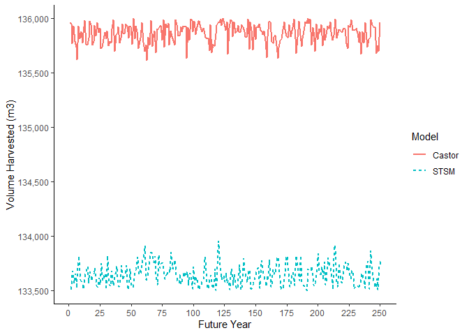<!-- -->

#### Area Harvested 
When modeling a harvest flow of approximately 133,600 m^3^ per year, the Castor model and STSM had comparable harvest area patterns, i.e., peaks and troughs in area harvested over time generally coincided in both models. However, the models began to diverge slightly at approximately year 130, where STSM harvested more area than the Castor model. From that point on, while both models followed a similar general trend in area harvested (i.e., a trough between approximately years 150 to 175 and a peak at approximately year 180) there were approximately 5-year differences in the timing of the peaks and troughs.

<!-- -->

#### Average Age Harvested
The Castor model and STSM harvested similar aged stands for the first 100 years when modeling a harvest flow of approximately 133,600 m^3^ per year. However, during the first 10 to 15 years of the simulation, the Castor model appears to harvest stands at maximum 250 years old, compared to STSM which harvested stands 310 to 250 years old. This was because the Castor model was set-up to make stands greater than 250 years old equal to 250 years old to make stand ages consistent with the yield curves, i.e., the yield curves used in both models only went to 250 years old. Therefore, volumes peaked at 250 years old and were level thereafter in both models, but Castor tracked these stands as 250 year old stands. Despite this difference, both models harvested essentially identical aged stands from approximately year 15 to 100, suggesting this had no effect on model outputs. The average age of harvested stands differed from years 100 to 250, where the age in the Castor model steadily increased over time, whereas the age in STSM was essentially level. This difference was likely because the Castor model could potentially harvest 2% more volume over the long-term, resulting in stands being able to age slightly more than in STSM.

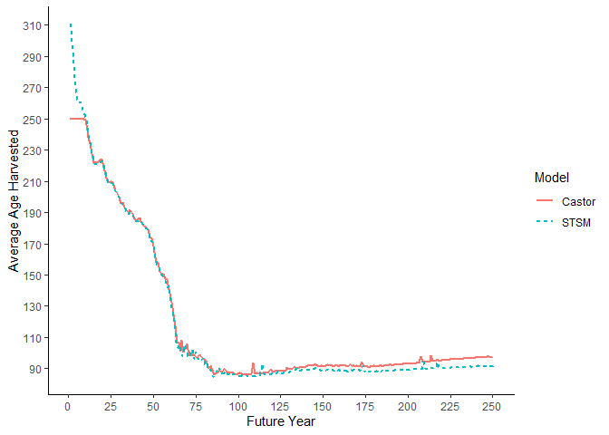<!-- -->

#### Merchantable Growing Stock
The trends in merchantable growing stock (i.e., volume in the THLB available for harvest) were similar between the Castor model and STSM. The amount of growing stock was close to identical between the models for the first 60 years. While the trends were the same after 60 years, the amount of growing stock began to diverge between the models, where growing stock in STSM was increasingly less than growing stock in the Castor model, up to a 9% (645,000 m^3^) difference by year 250. 

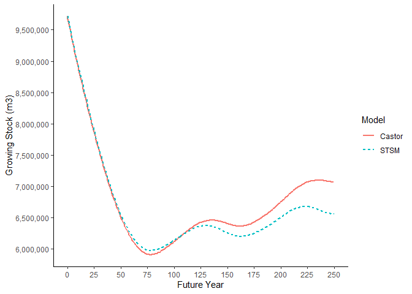<!-- -->

#### Spatial Harvest Location
The spatial harvest sequence was very similar for both models in the first 50 years of the simulation. However, there were some slight differences in areas that were harvested, and these differences may have contributed to the divergent harvest flows seen in both models.

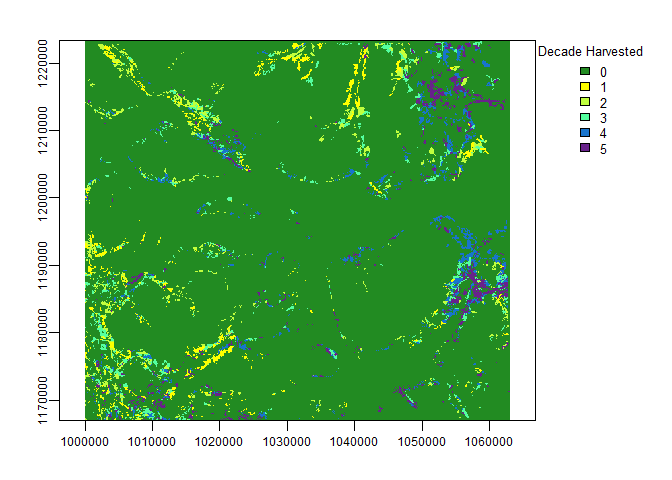<!-- -->

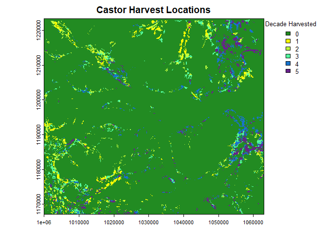<!-- -->

### Decadal Harvest Simulation
#### Harvest Flow
When modeling the maximum non-declining harvest flow of each model on a decadal basis, the Castor model was able to harvest approximately 135,000 m^3^ per year, approximately 1,000 m^3^ per year (<1%) less than in the annual model.
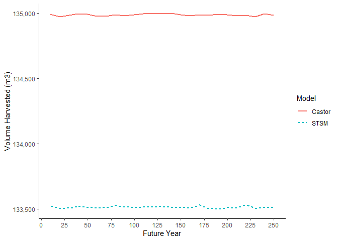<!-- -->

#### Area Harvested 
When modeling a harvest flow of approximately 133,600 m^3^ per year, the Castor model and STSM had comparable harvest area patterns, i.e., peaks and troughs in area harvested over time generally coincided in both models. However, the models began to diverge slightly at approximately year 70, where STSM harvested more area than the Castor model. From that point on, while both models followed a similar general trend in area harvested (i.e., a trough between approximately years 150 to 175 and a peak at approximately year 190), STSM generally harvested more area than Castor.

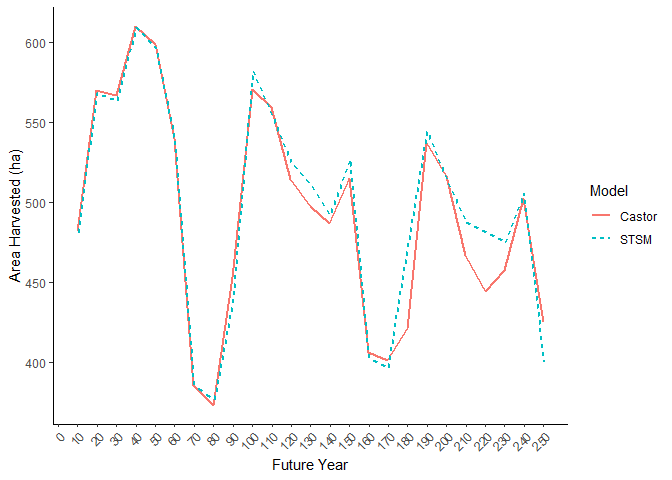<!-- -->

#### Merchantable Growing Stock
The trends in merchantable growing stock (i.e., volume in the THLB available for harvest) were similar between the Castor model and STSM. However, STSM had consistently higher growing stock estimates than the Castor model up to year 80, and then both models began to converge between years 80 and 250. 

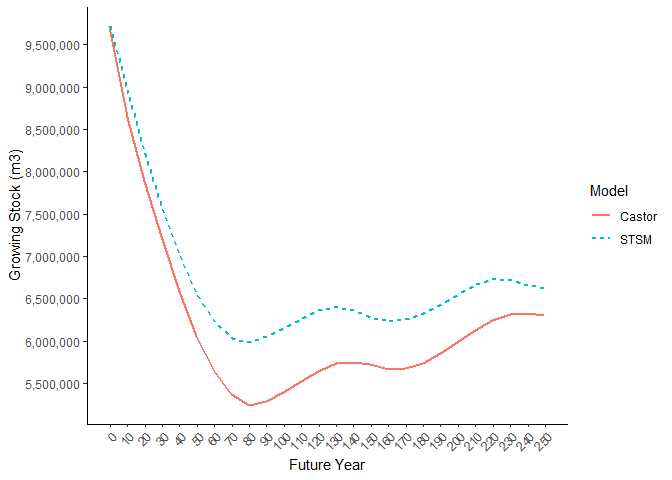<!-- -->

### Blocking Simulation
#### Characteristics of Harvest Blocks 
The spatial distribution of blocks that were predetermined in the Castor model is shown in the map below. 

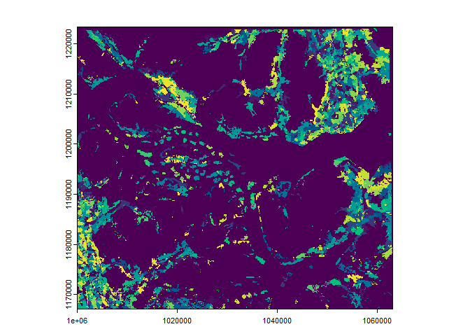<!-- -->

In the Castor model, the predetermined block sizes were right-skewed (i.e., there were many smaller blocks and few large blocks). The Castor initial mean block size was 28 ha, median block size was 7 ha and maximum block size was 320 ha. This block size distribution was used to parameterize STSM and thus average output block sizes were similar between STSM and Castor. STSM had a mean block size of 20 ha and median block size of 8 ha, and Castor had a mean block size of 22 ha and median block size of 6 ha. Both models harvested a similar distribution of block sizes but STSM harvested more medium sized blocks (20-40 ha in size), fewer large blocks (100-200 ha in size), and more very large blocks (greater than 260 ha in size) than Castor.

<!-- -->

#### Harvest Flow
Both models harvested less volume when blocking was implemented. The Castor model harvested 130,000 m^3^/year with blocking, a 3% decline (3,600 m^3^/year) from the baseline model. The STSM model with blocking harvested 127,000 m^3^/year, a 5% decline (6,600 m^3^/year) from the baseline model harvest flow. There was a 2% difference in harvest flows between Castor and STSM when blocking was simulated in the models. Therefore, pre-defining blocks resulted in lower timber supply in both models, but the STSM method was slightly more constraining on timber supply.

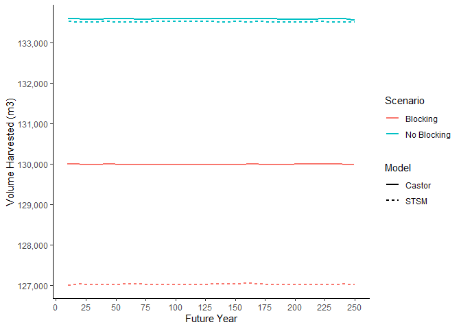<!-- -->

#### Area Harvested 
When blocking was implemented in the models they had similar overall patterns in the amount of area harvested over the simulation, with corresponding timing in the peaks and valleys in area harvested. However, there were differences in area harvested within those patterns. For example, the Castor model harvested more area in the first three decades of the simulation and then STSM harvested more area in the fourth to sixth decades. 

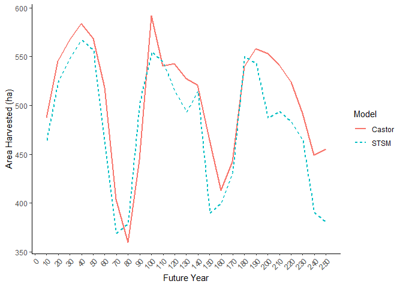<!-- -->

#### Merchantable Growing Stock
The trends in merchantable growing stock were similar between the Castor model and STSM. However, the models increasingly diverged, and this divergence became notably large at approximately year 70, where the Castor growing stock reached its plateau at approximately 5M m^3^ compared to STSM which reached its plateau at approximately 6M m^3^ before increasing to approximately 6.5M m^3^ at year 250.

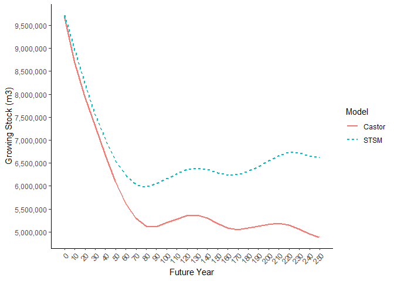<!-- -->

#### Spatial Harvest Location
Despite the similarities in harvest volume, blocking resulted in some differences in the spatial distribution of harvest in the two models over the first 50 years of the simulation. At the scale of the area-of-interest, the spatial distribution was generally similar, with more harvest in the southwest and northern parts in the first two to three decades of the simulation, shifting to more harvest in the eastern portion of the area in the fourth and fifth decades. However, there were some differences at finer scales. For example, there was more harvest in the northwest portion of the area in later decades in the Castor model compared to STSM.

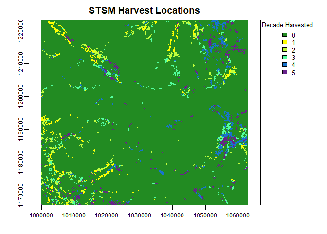<!-- -->

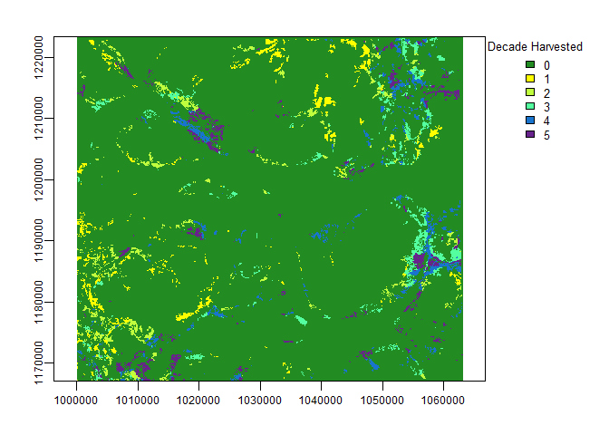<!-- -->

### Roads Simulation
#### Road Development Pattern
In the initial state of the models there were 23,938 ha (7% of the study area) that were classified as being roaded. Existing roads were concentrated in the northeast, central and southwest portions of the area of interest. Few existing roads were located in the northwest portion fo the area of interest. 

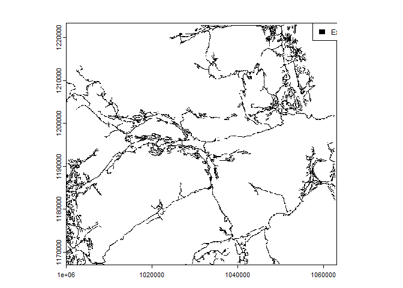<!-- -->

At the end of the simulation Castor had simulated roads in 38,671 ha (11%) and STSM simulated roads in 39,991 ha (11%) of the study area. Thus, STSM simulated slightly more roaded areas than Castor but they are remarkably similar (i.e., less than 1% of the area of interest).

The difference in road development patterns are illustrated below in the northwest corner of the study area where there were few existing roads at the start of the simulation. Existing roads are indicated in black and roads simulated by Castor are indicated in purple in the top figure. The bottom figure shows all roads in STSM, including existing and simulated. While the branching pattern fo the roads is somewhat different, the overall broad pattern is similar, as roads followed the least-cost path to develop a road system. 

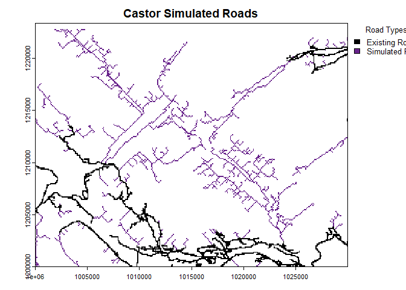<!-- -->

<!-- -->

Despite the broad-scale similarities in road development, the patterns in the timing of road development were notably different between the two models. Castor built the bulk of its roads early in the simulation, exclusively following the 'oldest first' priority queue, whereas STSM included additional constraints, for example, blocks must initiate within 2km of the active road network. This essentially delayed road development in STSM relative to Castor to approximately the middle of the simulation (i.e., years 75 to 125).

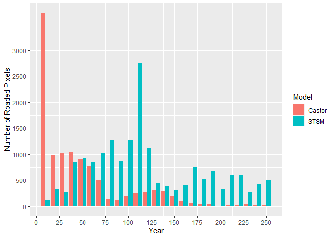<!-- -->

### No Harvest Constraint Simulation
When the models were run with a no harvest zone in the eastern portion of the area of interest (outlined in green over the timber harvest land base), the Castor model harvested 117,500 m^3^/year, 12% less than without the no harvest zone, and the STSM model harvested 120,216 m^3^/year, 10% less than without the no harvest zone. Thus the two models were approximately 2% different, consistent with the harvest flow without constraints.

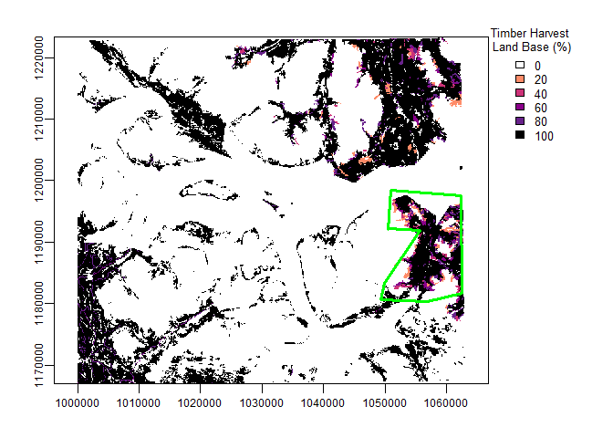<!-- -->

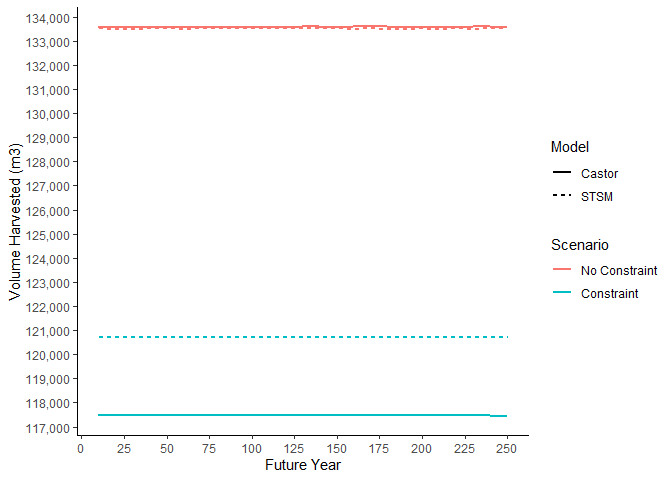<!-- -->

### Forest Cover Constraint Simulation
When the models were run with a modified harvest zone (i.e., at least 75% of the zone greater than 175 year-old forest) in the eastern portion of the area of interest, the Castor model harvested 123,500 m^3^/year, 8% less than without the modified harvest zone, and the STSM model harvested 125,000 m^3^/year, 6% less than without the no modified zone. The difference between the two models was 1,500 m^3^/year (approximately 2%).

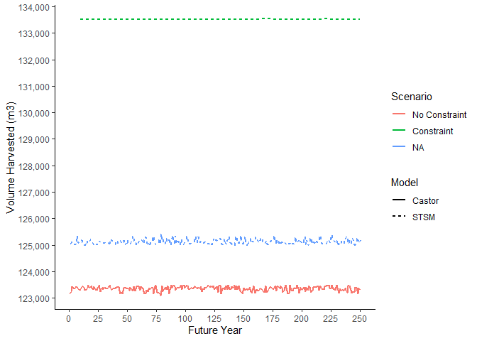<!-- -->

## Conclusions
We conclude that Castor and STSM are similar in terms of estimating long-term timber supply, indicating that the minor differences in logic between both models ultimately resulted in similar results. However, at its simplest parameterization, Castor was able to harvest ~2% more timber volume per year than STSM, and thus appears to be slightly more optimistic in terms of timber supply estimates. This difference was likely because the models used different methods to update forest stand volumes at each time interval, i.e., Castor updates volume to the midpoint of a time interval, whereas STSM updates volume each year, regardless of time interval. In all scenarios, growing stock, age and area harvested indicators generally diverged between Castor and STSM as the simulation progressed. While these divergences did not result in significantly different timber supply estimates, it is worth noting that model outputs are less likely to be the same, the longer that a simulation is. 

When blocking was implemented, the timber supply was reduced by a similar amount in both models with a 2% difference between them. Again, STSM harvested 2% less timber volume than Castor, suggesting that the different blocking methods used in each model achieved similar results. 

At a coarse scale, Castor and STSM simulated similar amounts of roads. There were differences in the road development pattern at fine-scales, but these did not appear to result in significant differences in the road pattern across larger areas and over a long-term simulation period. The fine-scale differences in the simulated patterns reflect the differences between allowing some dynamic development of roads in response to the harvest queue (Castor) and pre-determination of the entire road network (STSM). The STSM approach assumes perfect information of harvest locations across the simulation time horizon, whereas the Castor approach assumes limited information concerning harvest locations (i.e., a single period of locations). Pre-determination of the entire road network may result in greater efficiency in road development in some cases, whereas a dynamic approach may allow for flexibility, which may be useful in scenarios where other ecological drivers of landscape change, such as fire, influence the harvest queue. The differences in the timing of road development were likely simply due to the additional constraints in STSM to limit the harvest queue to blocks within 2 km of road. If a similar constraint applied in Castor it would likely approximate the road development pattern in STSM.   

When forest cover constraints were applied, again the models were within 2% of each other in terms of annual timber volume. However, in this case the Castor model was able to achieve slightly less volume than STSM, likely due to the differences in how each model reserved areas to achieve the cover constraints. STSMs approach to reserving pixels in the zone in ascending order above the variable threshold, compared to Castors approach of reserving pixels in descending order from the highest value in the zone likely allowed STSM to harvest slightly older stands and thus achieve greater volume from zones with forest cover constraints 

In summary, with basic parameterization, the two models were able to achieve remarkably similar results in terms of timber harvest flow, other forest harvest indicators (e.g., average harvest age, growing stock), and road development. This provides confidence in the approaches used by both models to estimate timber supply. In addition, given the similarity in results to STSM, the results suggest that it would be reasonable to use Castor for timber supply modeling in the province. 
